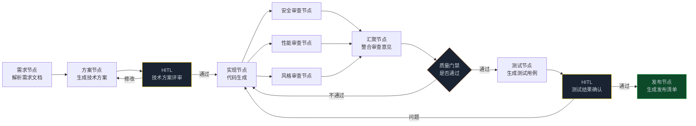

> **🎁 读完这篇你会得到什么**：一套把 Graph 工程落地到研发流程的完整方案——从需求分析到代码上线，哪些环节该用图、怎么设计节点、核心代码长什么样。

前五篇讲的都是"怎么搭 Graph 工程系统"。

这篇换个角度——**Graph 工程能帮研发团队解决什么实际问题**。

说实话，很多团队引入 AI 工具的方式是"哪里有 AI 就用哪里"，结果用了一堆互不相干的工具，效率没提多少，反而多了一堆要维护的东西。Graph 工程的价值，恰恰是把这些分散的 AI 能力串成一条流水线，让整个研发链路协同起来。

<!-- more -->

---

## 研发流程的痛点在哪里

先说清楚问题。一个典型的研发流程大概是这样的：

```
需求评审 → 技术方案 → 代码实现 → 代码审查 → 测试 → 发布
```

每个环节都有痛点：

- **需求评审**：需求文档质量参差不齐，开发拿到的需求经常有歧义，要来回确认
- **技术方案**：方案评审靠经验，容易漏掉边界情况和安全风险
- **代码实现**：重复性代码多，但 AI 生成的代码质量不稳定
- **代码审查**：Review 是瓶颈，高级工程师时间有限，低优先级 PR 积压
- **测试**：测试用例覆盖不全，边界情况容易漏
- **发布**：发布前检查靠人工，容易遗漏

这六个环节，哪些适合用 Graph 工程？

判断标准还是那个：**任务能不能拆成不同专长的子任务，需不需要独立验证**。

代码审查是个好例子——安全审查、性能审查、代码风格审查，这三件事需要不同的专注度，放在一个 Agent 里会互相干扰，拆成三个独立节点效果更好。

---

## 整体架构：研发流水线图

先把整张图的结构画出来：



这张图有两个 HITL 节点（黄色）：技术方案评审和测试结果确认。这两个地方是研发流程里最需要人工判断的节点——方案对不对、测试够不够，AI 给出建议，人来拍板。

---

## State 设计

```python
from typing import TypedDict, Annotated, Optional
import operator

class DevPipelineState(TypedDict):
    # ── 需求信息 ──────────────────────────────────
    requirement_doc: str          # 原始需求文档
    parsed_requirements: dict     # 解析后的结构化需求
    acceptance_criteria: list[str] # 验收标准

    # ── 技术方案 ──────────────────────────────────
    tech_spec: str                # 技术方案文档
    tech_risks: list[str]         # 技术风险点
    human_spec_feedback: Optional[str]  # 人工评审意见

    # ── 代码实现 ──────────────────────────────────
    code_files: dict              # 生成的代码文件 {文件名: 内容}
    implementation_notes: str     # 实现说明

    # ── 代码审查（并行，用 Reducer 追加） ──────────
    review_results: Annotated[list[dict], operator.add]

    # ── 质量评估 ──────────────────────────────────
    quality_gate_passed: bool
    quality_issues: list[str]
    revision_count: int

    # ── 测试 ──────────────────────────────────────
    test_cases: list[dict]
    test_results: Optional[dict]
    human_test_feedback: Optional[str]

    # ── 发布 ──────────────────────────────────────
    release_checklist: list[str]
    release_notes: str
    deploy_ready: bool
```

`review_results` 用 `operator.add` 追加——三个并行审查节点的结果都要保留，不能互相覆盖。

---

## 需求解析节点

需求文档质量参差不齐，这个节点的工作是把模糊的需求文档转化成结构化的需求条目和验收标准。

```python
from langchain_openai import ChatOpenAI

llm = ChatOpenAI(model="gpt-4o", temperature=0.2)

def parse_requirement_node(state: DevPipelineState) -> dict:
    """需求解析节点：把需求文档转化成结构化需求"""
    prompt = f"""
你是一个资深产品经理，擅长需求分析。

请分析以下需求文档，输出结构化需求：

【需求文档】
{state['requirement_doc']}

请输出：
1. 功能需求列表（每条需求要明确：谁、做什么、达到什么效果）
2. 非功能需求（性能、安全、兼容性等）
3. 验收标准（可测试的、明确的标准，至少5条）
4. 需求歧义点（哪些地方描述不清楚，需要确认）
5. 边界情况（容易被遗漏的边界场景）

输出格式为 JSON：
{{
  "functional_requirements": [...],
  "non_functional_requirements": [...],
  "acceptance_criteria": [...],
  "ambiguities": [...],
  "edge_cases": [...]
}}
"""
    result = llm.invoke(prompt)
    parsed = parse_json_safely(result.content)

    return {
        "parsed_requirements": parsed,
        "acceptance_criteria": parsed.get("acceptance_criteria", [])
    }
```

这个节点做了一件很重要的事：**把"需求歧义点"和"边界情况"显式地提取出来**。这两样东西在传统研发流程里经常被忽略，等到开发完了才发现理解有偏差，返工成本很高。

---

## 技术方案节点

```python
def generate_tech_spec_node(state: DevPipelineState) -> dict:
    """技术方案节点：基于需求生成技术方案"""
    requirements = state["parsed_requirements"]

    prompt = f"""
你是一个资深架构师。

基于以下需求，生成技术方案：

【功能需求】
{format_list(requirements.get('functional_requirements', []))}

【非功能需求】
{format_list(requirements.get('non_functional_requirements', []))}

【边界情况】
{format_list(requirements.get('edge_cases', []))}

{f"【上一版本的评审意见，请针对性修改】\\n{state['human_spec_feedback']}" if state.get('human_spec_feedback') else ""}

请输出技术方案，包含：
1. 整体架构设计（模块划分、数据流）
2. 核心数据模型（关键字段和关系）
3. API 接口设计（端点、参数、返回值）
4. 技术选型说明（为什么选这个技术）
5. 技术风险点（可能遇到的技术难题）
6. 实现步骤（按优先级排序）
"""
    result = llm.invoke(prompt)

    # 提取技术风险点
    risks = extract_tech_risks(result.content)

    return {
        "tech_spec": result.content,
        "tech_risks": risks
    }
```

注意 `human_spec_feedback` 的处理——如果人工评审给了修改意见，下一轮生成方案时会把意见带进去。这和第05篇研报系统里的 `improvement_notes` 是同样的模式。

---

## 代码实现节点

```python
def implement_node(state: DevPipelineState) -> dict:
    """代码实现节点：基于技术方案生成代码"""
    llm_coder = ChatOpenAI(model="gpt-4o", temperature=0.1)

    # 如果有审查意见（来自代码审查循环），带进去
    review_context = ""
    if state.get("quality_issues"):
        review_context = f"""
【上一版本的代码审查问题，必须修复】
{chr(10).join(state['quality_issues'])}
"""

    prompt = f"""
你是一个资深工程师。

基于以下技术方案，生成实现代码：

【技术方案】
{state['tech_spec'][:3000]}  # 截取前3000字，控制上下文

【验收标准】
{format_list(state['acceptance_criteria'])}

{review_context}

要求：
- 代码要完整可运行，不要省略关键逻辑
- 每个函数都要有清晰的注释
- 处理好边界情况和错误处理
- 遵循 SOLID 原则

输出格式：
```python
# 文件名：xxx.py
[代码内容]
```

```python
# 文件名：yyy.py
[代码内容]
```
"""
    result = llm_coder.invoke(prompt)

    # 解析生成的代码文件
    code_files = parse_code_files(result.content)

    return {
        "code_files": code_files,
        "implementation_notes": extract_implementation_notes(result.content),
        "revision_count": state.get("revision_count", 0) + 1
    }
```

---

## 三个并行代码审查节点

这是这张图里最有价值的设计——把代码审查拆成三个独立的专家节点，并行运行。

```python
def security_review_node(state: DevPipelineState) -> dict:
    """安全审查节点：专注安全漏洞"""
    llm_security = ChatOpenAI(model="gpt-4o", temperature=0)

    code_content = format_code_files(state["code_files"])

    prompt = f"""
你是一个专注安全的代码审查专家。

只关注安全问题，不评价代码风格或性能。

审查以下代码的安全性：

{code_content}

检查项：
- SQL 注入风险
- XSS 漏洞
- 身份验证和授权问题
- 敏感数据处理（密码、token、个人信息）
- 输入验证不足
- 不安全的依赖

输出格式（JSON）：
{{
  "review_type": "security",
  "issues": [
    {{
      "severity": "high/medium/low",
      "location": "文件名:行号",
      "description": "问题描述",
      "fix": "修复建议"
    }}
  ],
  "passed": true/false
}}
"""
    result = llm_security.invoke(prompt)
    review = parse_json_safely(result.content)
    review["review_type"] = "security"

    return {"review_results": [review]}

def performance_review_node(state: DevPipelineState) -> dict:
    """性能审查节点：专注性能问题"""
    llm_perf = ChatOpenAI(model="gpt-4o-mini", temperature=0)

    code_content = format_code_files(state["code_files"])

    prompt = f"""
你是一个专注性能优化的代码审查专家。

只关注性能问题，不评价安全或代码风格。

审查以下代码的性能：

{code_content}

检查项：
- N+1 查询问题
- 不必要的循环嵌套
- 缺少缓存的高频操作
- 内存泄漏风险
- 同步阻塞操作（应该用异步）
- 大数据量处理的效率

输出格式（JSON）：
{{
  "review_type": "performance",
  "issues": [...],
  "passed": true/false
}}
"""
    result = llm_perf.invoke(prompt)
    review = parse_json_safely(result.content)
    review["review_type"] = "performance"

    return {"review_results": [review]}

def style_review_node(state: DevPipelineState) -> dict:
    """代码风格审查节点：专注代码规范"""
    llm_style = ChatOpenAI(model="gpt-4o-mini", temperature=0)

    code_content = format_code_files(state["code_files"])

    prompt = f"""
你是一个代码规范审查专家。

只关注代码风格和可维护性，不评价安全或性能。

审查以下代码的规范性：

{code_content}

检查项：
- 命名规范（变量、函数、类名是否清晰）
- 函数长度（单个函数是否过长）
- 注释质量（是否有必要的注释）
- 重复代码（是否有可以抽取的公共逻辑）
- 错误处理（是否有适当的异常处理）
- 代码复杂度（是否有过于复杂的逻辑）

输出格式（JSON）：
{{
  "review_type": "style",
  "issues": [...],
  "passed": true/false
}}
"""
    result = llm_style.invoke(prompt)
    review = parse_json_safely(result.content)
    review["review_type"] = "style"

    return {"review_results": [review]}
```

三个节点各自只关注一个维度，Prompt 都很窄。这就是为什么要拆成三个节点——安全专家不应该分心去想代码风格，性能专家不应该分心去想安全漏洞。

---

## 质量门禁节点

```python
def quality_gate_node(state: DevPipelineState) -> dict:
    """质量门禁：汇总三个审查结果，决定是否通过"""
    reviews = state["review_results"]

    all_issues = []
    has_high_severity = False

    for review in reviews:
        for issue in review.get("issues", []):
            all_issues.append(f"[{review['review_type'].upper()}] {issue['severity'].upper()}: {issue['description']}")
            if issue.get("severity") == "high":
                has_high_severity = True

    # 质量门禁规则：
    # - 有任何 high 级别问题 → 不通过
    # - 总问题数超过 10 个 → 不通过
    # - 迭代次数超过 3 次 → 强制通过（避免死循环）
    passed = (
        not has_high_severity
        and len(all_issues) <= 10
    ) or state.get("revision_count", 0) >= 3

    return {
        "quality_gate_passed": passed,
        "quality_issues": all_issues if not passed else []
    }

def route_after_quality_gate(state: DevPipelineState) -> str:
    if state["quality_gate_passed"]:
        return "generate_tests"
    return "fix_issues"
```

质量门禁的规则是明确的代码逻辑，不是 LLM 决策。这是 Graph 工程的一个重要原则：**能用代码写清楚的路由逻辑，就不要让 LLM 来决定**。

---

## 测试用例生成节点

```python
def generate_tests_node(state: DevPipelineState) -> dict:
    """测试节点：基于验收标准和代码生成测试用例"""
    llm_tester = ChatOpenAI(model="gpt-4o", temperature=0.2)

    prompt = f"""
你是一个测试工程师，擅长编写全面的测试用例。

基于以下信息生成测试用例：

【验收标准】
{format_list(state['acceptance_criteria'])}

【代码实现】
{format_code_files(state['code_files'])[:2000]}

生成测试用例，覆盖：
1. 正常流程测试（Happy Path）
2. 边界值测试
3. 异常情况测试（错误输入、网络异常等）
4. 安全测试（基于审查发现的安全点）
5. 性能测试（关键接口的响应时间）

每个测试用例包含：
- 测试名称
- 前置条件
- 测试步骤
- 预期结果
- 测试代码（pytest 格式）

输出 JSON 格式的测试用例列表。
"""
    result = llm_tester.invoke(prompt)
    test_cases = parse_json_safely(result.content)

    return {"test_cases": test_cases if isinstance(test_cases, list) else []}
```

---

## 发布清单节点

```python
def generate_release_checklist_node(state: DevPipelineState) -> dict:
    """发布节点：生成发布清单和发布说明"""
    llm_release = ChatOpenAI(model="gpt-4o-mini", temperature=0.1)

    prompt = f"""
基于以下信息，生成发布清单和发布说明：

【需求摘要】
{format_list(state['acceptance_criteria'][:5])}

【技术风险点】
{format_list(state['tech_risks'])}

【代码审查问题（已修复）】
{format_list(state.get('quality_issues', [])[:5])}

生成：
1. 发布前检查清单（至少10条，包含：数据库迁移、配置变更、依赖更新、回滚方案）
2. 发布说明（面向用户的功能描述，100字以内）
3. 监控指标（上线后需要重点关注的指标）
4. 回滚方案（如果出问题怎么快速回滚）

输出 JSON 格式。
"""
    result = llm_release.invoke(prompt)
    release_info = parse_json_safely(result.content)

    return {
        "release_checklist": release_info.get("checklist", []),
        "release_notes": release_info.get("release_notes", ""),
        "deploy_ready": True
    }
```

---

## 把图组装起来

```python
from langgraph.graph import StateGraph, END
from langgraph.checkpoint.sqlite import SqliteSaver
from langfuse.callback import CallbackHandler

builder = StateGraph(DevPipelineState)

# 添加所有节点
builder.add_node("parse_req", parse_requirement_node)
builder.add_node("gen_spec", generate_tech_spec_node)
builder.add_node("implement", implement_node)
builder.add_node("security_review", security_review_node)
builder.add_node("performance_review", performance_review_node)
builder.add_node("style_review", style_review_node)
builder.add_node("quality_gate", quality_gate_node)
builder.add_node("gen_tests", generate_tests_node)
builder.add_node("gen_release", generate_release_checklist_node)

# ── 主流程 ──────────────────────────────────────
builder.set_entry_point("parse_req")
builder.add_edge("parse_req", "gen_spec")
builder.add_edge("gen_spec", END)  # 暂停，等 HITL

# ── 代码实现后，并行三个审查节点（Fan-out）──────
builder.add_edge("implement", "security_review")
builder.add_edge("implement", "performance_review")
builder.add_edge("implement", "style_review")

# ── 三个审查完成后汇聚（Fan-in）────────────────
builder.add_edge("security_review", "quality_gate")
builder.add_edge("performance_review", "quality_gate")
builder.add_edge("style_review", "quality_gate")

# ── 质量门禁后的条件路由 ─────────────────────────
builder.add_conditional_edges(
    "quality_gate",
    route_after_quality_gate,
    {
        "generate_tests": "gen_tests",
        "fix_issues": "implement"  # 打回重新实现
    }
)

builder.add_edge("gen_tests", END)  # 暂停，等 HITL
builder.add_edge("gen_release", END)

# ── 编译：两个 HITL 暂停点 ──────────────────────
checkpointer = SqliteSaver.from_conn_string("dev_pipeline.db")
app = builder.compile(
    checkpointer=checkpointer,
    interrupt_after=["gen_spec", "gen_tests"]
    # gen_spec 完成后暂停：等技术方案评审
    # gen_tests 完成后暂停：等测试结果确认
)
```

---

## 完整的使用流程

```python
from datetime import datetime

def run_dev_pipeline(requirement_doc: str, pr_id: str):
    """运行研发流水线"""
    config = {
        "configurable": {"thread_id": f"pr-{pr_id}"},
        "callbacks": [CallbackHandler(
            public_key=os.environ.get("LANGFUSE_PUBLIC_KEY", ""),
            secret_key=os.environ.get("LANGFUSE_SECRET_KEY", "")
        )]
    }

    print(f"🚀 开始处理需求，PR: {pr_id}")

    # ── 阶段一：需求解析 + 技术方案 ──────────────
    state = app.invoke(
        {
            "requirement_doc": requirement_doc,
            "review_results": [],
            "revision_count": 0
        },
        config=config
    )

    # 暂停在 gen_spec 之后，等技术方案评审
    print("\n📋 技术方案已生成，等待评审...")
    print(f"\n{state['tech_spec'][:500]}...")
    print(f"\n⚠️  技术风险点：")
    for risk in state.get("tech_risks", []):
        print(f"  - {risk}")

    decision = input("\n[a]批准方案 / [m]修改后批准 / [r]打回重写 > ").strip()

    if decision == "r":
        feedback = input("请输入修改意见：")
        app.update_state(config, {"human_spec_feedback": feedback})
        # 重新生成方案
        state = app.invoke(None, config=config)
        # 再次等待评审...（实际项目里应该循环处理）

    elif decision == "m":
        feedback = input("请输入修改意见（AI 会基于此修改）：")
        app.update_state(config, {"human_spec_feedback": feedback})

    # ── 阶段二：代码实现 + 审查 ──────────────────
    print("\n⚙️  开始代码实现和审查...")

    # 手动触发实现节点（从 gen_spec 之后继续）
    app.update_state(config, {}, as_node="gen_spec")
    state = app.invoke(None, config=config)

    # 暂停在 gen_tests 之后，等测试确认
    print(f"\n✅ 代码审查完成")
    print(f"质量门禁：{'通过' if state['quality_gate_passed'] else '未通过'}")

    if state.get("quality_issues"):
        print(f"\n⚠️  发现问题（已自动修复）：")
        for issue in state["quality_issues"][:5]:
            print(f"  - {issue}")

    print(f"\n🧪 测试用例已生成：{len(state.get('test_cases', []))} 个")

    test_decision = input("\n[a]确认测试通过 / [r]发现问题，打回修改 > ").strip()

    if test_decision == "r":
        feedback = input("请描述测试发现的问题：")
        app.update_state(config, {
            "human_test_feedback": feedback,
            "quality_issues": [feedback]  # 作为下一轮的修改意见
        })
        # 打回重新实现...

    # ── 阶段三：生成发布清单 ──────────────────────
    app.update_state(config, {}, as_node="gen_tests")
    final_state = app.invoke(None, config=config)

    print(f"\n🚀 发布清单已生成")
    print(f"\n📝 发布说明：{final_state.get('release_notes', '')}")
    print(f"\n✅ 发布前检查清单（{len(final_state.get('release_checklist', []))} 项）：")
    for item in final_state.get("release_checklist", [])[:5]:
        print(f"  □ {item}")

    return final_state
```

---

## 这套方案在实际团队里怎么用

说完代码，说说实际落地的方式。

**不是所有环节都要全上**。如果你的团队只有 3 个人，上线这整套流水线的维护成本可能比收益还高。建议按优先级分阶段引入：

**第一阶段（1-2周）**：只上代码审查图。

三个并行审查节点是最容易落地、收益最明显的部分。接入 GitHub Actions，每次 PR 自动触发，审查结果作为 PR Comment 输出。

```yaml
# .github/workflows/ai-review.yml
name: AI Code Review
on:
  pull_request:
    types: [opened, synchronize]

jobs:
  ai-review:
    runs-on: ubuntu-latest
    steps:
      - uses: actions/checkout@v3
      - name: Run AI Review
        run: python scripts/ai_review.py ${{ github.event.pull_request.number }}
        env:
          OPENAI_API_KEY: ${{ secrets.OPENAI_API_KEY }}
          GITHUB_TOKEN: ${{ secrets.GITHUB_TOKEN }}
```

**第二阶段（1个月后）**：加上需求解析节点。

需求文档进来，自动输出结构化需求和验收标准。这个节点的价值不是替代产品经理，而是帮产品经理发现需求里的歧义和遗漏。

**第三阶段（稳定后）**：加上测试生成节点。

基于验收标准自动生成测试用例，让测试工程师从"写测试"变成"审查测试"。

---

## 代码审查节点的实际效果

说一个真实的数据点。

一个 10 人研发团队，引入三节点并行代码审查之后：

| 指标 | 引入前 | 引入后 |
|------|--------|--------|
| PR 平均等待审查时间 | 4.2 小时 | 8 分钟（AI 初审）|
| 高级工程师 Review 时间 | 每天 2.5 小时 | 每天 45 分钟 |
| 安全问题漏到生产的比例 | 约 15% | 约 3% |
| 月 API 费用 | - | 约 ¥600 |

AI 初审不能替代人工审查，但它能过滤掉大量低级问题，让高级工程师只需要关注真正需要经验判断的地方。

---

## 几个容易踩的坑

**坑一：代码生成节点的上下文太长**

技术方案文档可能很长，全部塞进代码生成节点的 Prompt 会让上下文爆掉，而且效果也不好——LLM 在超长上下文里容易"失焦"。

解法：只传技术方案的核心部分（架构设计 + API 接口），详细的数据模型单独传。

**坑二：审查节点的 Prompt 不够窄**

如果安全审查节点的 Prompt 里写了"也顺便看看代码风格"，它就会开始分心，安全问题反而发现得少。

解法：每个审查节点的 Prompt 开头明确写"只关注 XX，不评价其他"。

**坑三：质量门禁规则太严**

如果把质量门禁设成"零问题才通过"，代码会在审查循环里跑很多轮，成本很高，而且 AI 生成的代码很难真正做到零问题。

解法：区分 high/medium/low 三个级别，只有 high 级别问题才阻断，medium 和 low 作为建议输出。

---

## 📝 小结

- **研发流程的 Graph 工程化**不是把所有环节都自动化，而是找到"需要不同专长、需要独立验证"的环节，用图来协调
- **三节点并行代码审查**是最容易落地的切入点：安全/性能/风格三个专家节点并行，Fan-in 汇聚结果，质量门禁决定是否通过
- **两个 HITL 节点**是关键：技术方案评审（方案对不对）和测试结果确认（测试够不够）——这两个地方必须有人拍板
- **质量门禁用代码逻辑，不用 LLM 决策**：能用 `if/else` 写清楚的路由，就不要让 LLM 来决定
- **分阶段落地**：先上代码审查（1-2周），再加需求解析（1个月），最后加测试生成——不要一步到位
- **成本参考**：10人团队月 API 费用约 600 元，换来高级工程师每天节省 1.75 小时的 Review 时间

---

## 🔮 下一篇预告

研发流程讲完了，下一篇换到业务流程。

客服、审批、内容生产——这三个场景是中小企业最高频的业务流程，也是 Graph 工程能产生最直接 ROI 的地方。

下一篇，我们看这三个场景怎么用 Graph 工程改造，以及改造之后的实际效果。

---

> 📚 **系列导航**
> - 第 00 篇：从 while 循环到组织架构图，Agent 进化的下一步
> - 第 01 篇：从「单兵独斗」到「军团作战」：为什么你的 Agent 越来越失控？
> - 第 02 篇：解剖 LangGraph 与 AutoGen：选框架之前，先搞懂这三个概念
> - 第 03 篇：State 是整张图的血液：搞懂状态流转，才算真的会用 LangGraph
> - 第 04 篇：让可控性拉满：人机协同（HITL）与断点调试在 Graph 工程中的落地
> - 第 05 篇：实战：从零搭一个企业级研报自动生成系统
> - **第 06 篇：Graph 工程在研发流程中的应用：从需求到上线的全链路实战** ⬅️ 你在这里
> - 第 07 篇：Graph 工程在业务流程中的应用：客服、审批、内容生产场景实战
> - 第 08 篇：中小企业落地 Graph 工程：从 0 到 1 的选型与成本控制
> - 第 09 篇：电商场景实战：用 Graph 工程搭客服+选品+营销协作系统
> - 第 10 篇：内容团队实战：用 Graph 工程把内容生产效率提升 3 倍
