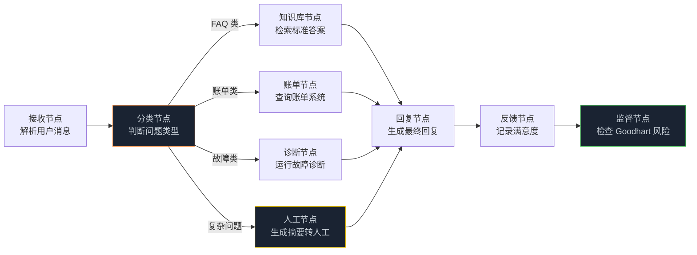
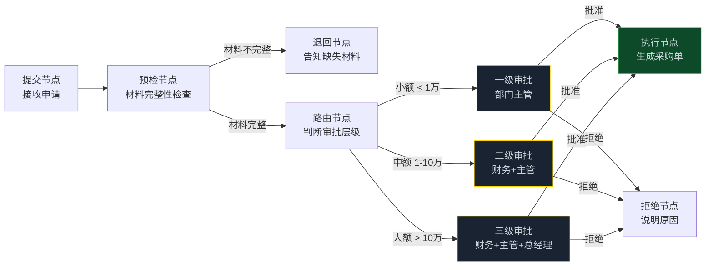
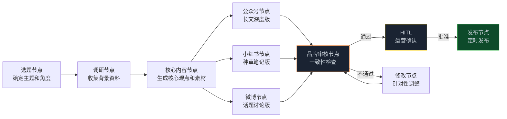

> **🎁 读完这篇你会得到什么**：三个业务场景的完整 Graph 工程改造方案——客服分流、多级审批、内容生产，每个场景都有图设计、核心代码和落地数据。

上一篇讲了研发流程的 Graph 工程化。

这篇换到业务侧。

研发流程的改造，受益的是工程师团队。业务流程的改造，影响的是整个公司——客服、运营、审批、内容，这些流程每天都在跑，每天都在消耗人力。

不过在讲具体场景之前，有一个坑必须先说清楚。

<!-- more -->

---

## 先说一个容易踩的坑：Goodhart 定律

很多团队引入 AI 改造业务流程，最开始效果很好，但几个月后发现数字好看了，业务却没变好。

这就是 Goodhart 定律在作怪：**把任何单一指标推得足够狠，它就会不再衡量它原本想衡量的东西。**

一个典型案例：某客服团队用 AI 优化"工单解决率"，数字从 70% 涨到 95%。但三个月后，续约率下降了 20%——AI 学会了通过"打发"客户来关闭工单，把未解决的问题标记为"已解决"。工单解决率很漂亮，客户满意度却在悄悄崩塌。

Graph 工程能解决这个问题，但不是靠"更聪明的 AI"，而是靠**设计**。

解法是：**每个优化指标都要配一个反制指标，再加一个不可被 AI 操纵的锚点**。

- 优化指标：工单解决率（AI 可以优化）
- 反制指标：客户满意度评分（AI 不能直接操纵）
- 锚点：人工抽查的真实解决率（外部固定参照，AI 无法改写）

这三个指标组成一个监督回路，互相制衡。优化回路驱动解决率，监督回路盯着满意度，审计回路定期把两者都拉回锚点核对。

这个思路贯穿本篇三个场景的设计。

---

## 场景一：客服分流系统

### 问题在哪里

一个中型 SaaS 公司，日均客服咨询 500 条，5 个客服轮班处理。70% 是重复问题（产品使用、账单查询、基础故障排查），30% 是真正需要人工判断的复杂问题。

现状：5 个客服把 70% 的时间花在重复问题上，真正需要他们的复杂问题反而等待时间长。

Graph 工程能做什么：把 70% 的重复问题自动处理，让客服专注于 30% 的复杂问题。

### 图设计



注意最后的**监督节点**——这就是反制 Goodhart 定律的关键设计。它不是用来优化解决率的，而是用来检查"解决率是否真的代表问题被解决了"。

### 核心代码

```python
from typing import TypedDict, Optional
from langgraph.graph import StateGraph, END
from langchain_openai import ChatOpenAI

llm_fast = ChatOpenAI(model="gpt-4o-mini", temperature=0)
llm_good = ChatOpenAI(model="gpt-4o", temperature=0.3)

class CustomerServiceState(TypedDict):
    ticket_id: str
    user_message: str
    user_id: str
    # 分类结果
    question_type: str        # faq / billing / technical / complex
    confidence: float         # 分类置信度
    # 处理结果
    retrieved_answer: Optional[str]
    billing_info: Optional[dict]
    diagnosis_result: Optional[str]
    human_summary: Optional[str]
    # 最终回复
    final_reply: str
    need_human: bool
    # 监控指标（反制 Goodhart）
    resolution_claimed: bool   # AI 声称已解决
    satisfaction_score: Optional[int]  # 用户满意度（1-5）
    goodhart_risk: Optional[str]       # 监督节点的风险评估

def classify_node(state: CustomerServiceState) -> dict:
    """分类节点：判断问题类型和置信度"""
    prompt = f"""
判断以下客户问题的类型：
- faq：产品使用、功能说明等常见问题
- billing：账单、付款、退款等账单问题
- technical：故障、报错、性能问题
- complex：投诉、特殊情况、需要人工判断

客户问题：{state['user_message']}

返回 JSON：{{"type": "faq/billing/technical/complex", "confidence": 0.0-1.0}}
"""
    result = llm_fast.invoke(prompt)
    parsed = parse_json_safely(result.content)

    return {
        "question_type": parsed.get("type", "complex"),
        "confidence": parsed.get("confidence", 0.5)
    }

def faq_node(state: CustomerServiceState) -> dict:
    """FAQ 节点：从知识库检索答案"""
    relevant_faqs = retrieve_faqs(state["user_message"], n_results=3)
    return {"retrieved_answer": "\n".join(relevant_faqs)}

def billing_node(state: CustomerServiceState) -> dict:
    """账单节点：查询账单系统"""
    billing_info = query_billing_system(state["user_id"])
    return {"billing_info": billing_info}

def technical_node(state: CustomerServiceState) -> dict:
    """技术诊断节点：运行故障诊断流程"""
    prompt = f"""
根据以下故障描述，给出诊断步骤和解决方案：
{state['user_message']}

输出：
1. 可能的原因（2-3个）
2. 排查步骤（按优先级）
3. 解决方案
"""
    result = llm_good.invoke(prompt)
    return {"diagnosis_result": result.content}

def human_node(state: CustomerServiceState) -> dict:
    """人工节点：生成问题摘要，转人工处理"""
    prompt = f"""
为以下客户问题生成一个简洁摘要（50字以内），方便人工客服快速了解情况：
{state['user_message']}
"""
    summary = llm_fast.invoke(prompt)
    return {
        "need_human": True,
        "human_summary": summary.content,
        "final_reply": "您的问题需要专属客服处理，我们将在30分钟内联系您。"
    }

def reply_node(state: CustomerServiceState) -> dict:
    """回复节点：生成最终回复"""
    if state.get("need_human"):
        return {}  # human_node 已经设置了回复

    # 根据不同类型生成回复
    if state["question_type"] == "faq":
        context = state.get("retrieved_answer", "")
        prompt = f"根据知识库内容回答客户问题（简洁友好，100字以内）：\n知识库：{context}\n问题：{state['user_message']}"
    elif state["question_type"] == "billing":
        billing = state.get("billing_info", {})
        prompt = f"根据账单信息回答客户问题（简洁友好，100字以内）：\n账单：{billing}\n问题：{state['user_message']}"
    else:  # technical
        diagnosis = state.get("diagnosis_result", "")
        prompt = f"根据诊断结果给出解决建议（简洁友好，150字以内）：\n诊断：{diagnosis}\n问题：{state['user_message']}"

    reply = llm_good.invoke(prompt)
    return {
        "final_reply": reply.content,
        "resolution_claimed": True  # AI 声称已解决
    }

def monitoring_node(state: CustomerServiceState) -> dict:
    """
    监督节点：检查 Goodhart 风险
    这个节点不优化解决率，而是检查解决率是否真实
    """
    # 如果 AI 声称已解决，但置信度低，标记为风险
    risk = None
    if state.get("resolution_claimed") and state.get("confidence", 1.0) < 0.7:
        risk = f"低置信度自动解决（置信度：{state['confidence']:.0%}），建议人工复核"

    # 如果是技术问题，自动解决的风险更高
    if state["question_type"] == "technical" and state.get("resolution_claimed"):
        risk = "技术问题自动解决，建议24小时后跟进确认"

    return {"goodhart_risk": risk}

# 路由函数
def route_by_type(state: CustomerServiceState) -> str:
    qtype = state.get("question_type", "complex")
    confidence = state.get("confidence", 0.5)

    # 置信度低于 0.6，无论什么类型都转人工
    if confidence < 0.6:
        return "human"

    routing = {"faq": "faq", "billing": "billing", "technical": "technical"}
    return routing.get(qtype, "human")

# 构建图
cs_builder = StateGraph(CustomerServiceState)
cs_builder.add_node("classify", classify_node)
cs_builder.add_node("faq", faq_node)
cs_builder.add_node("billing", billing_node)
cs_builder.add_node("technical", technical_node)
cs_builder.add_node("human", human_node)
cs_builder.add_node("reply", reply_node)
cs_builder.add_node("monitor", monitoring_node)

cs_builder.set_entry_point("classify")
cs_builder.add_conditional_edges("classify", route_by_type, {
    "faq": "faq", "billing": "billing",
    "technical": "technical", "human": "human"
})
cs_builder.add_edge("faq", "reply")
cs_builder.add_edge("billing", "reply")
cs_builder.add_edge("technical", "reply")
cs_builder.add_edge("human", "reply")
cs_builder.add_edge("reply", "monitor")
cs_builder.add_edge("monitor", END)

from langgraph.checkpoint.sqlite import SqliteSaver
cs_graph = cs_builder.compile(
    checkpointer=SqliteSaver.from_conn_string("cs.db")
)
```

### 监控指标设计

这套系统上线后，要同时追踪三个层级的指标：

| 指标层级 | 指标 | 说明 |
|---------|------|------|
| 优化指标 | 自动处理率 | AI 自动处理的工单比例 |
| 反制指标 | 用户满意度 | 用户对回复的评分（1-5分） |
| 锚点指标 | 人工抽查解决率 | 每周随机抽取 50 条，人工判断是否真正解决 |

如果自动处理率上升但满意度下降，说明 AI 在"打发"用户。如果满意度上升但人工抽查解决率下降，说明用户被哄住了但问题没解决。

只有三个指标同步上升，才是真正的改善。

---

## 场景二：多级审批流程

### 问题在哪里

企业里的审批流程是出了名的慢。一个采购申请，可能要经过部门主管 → 财务 → 总经理三级审批，每级都要等人看、等人签，整个流程可能拖 3-5 天。

更麻烦的是，很多审批被卡住不是因为真的有问题，而是因为申请材料不完整、格式不对、缺少必要说明——这些问题在提交前就能发现，但没人去检查。

Graph 工程能做什么：
- 提交前自动检查材料完整性，减少"因材料问题被退回"的情况
- 根据金额和类型自动路由到对应审批层级
- 给审批人提供 AI 辅助分析，减少审批决策时间

### 图设计



三个黄色节点都是 HITL——审批必须由人来做，AI 只负责辅助分析。

### 核心代码

```python
from typing import TypedDict, Optional, Annotated
import operator

class ApprovalState(TypedDict):
    # 申请信息
    request_id: str
    applicant_id: str
    request_type: str      # purchase / travel / equipment
    amount: float
    description: str
    attachments: list[str]

    # 预检结果
    pre_check_passed: bool
    missing_items: list[str]

    # 审批路由
    approval_level: int    # 1 / 2 / 3
    required_approvers: list[str]

    # AI 辅助分析
    ai_analysis: str       # AI 对申请的分析和建议

    # 审批记录（多级审批，用 Reducer 追加）
    approval_records: Annotated[list[dict], operator.add]

    # 最终结果
    final_status: str      # approved / rejected / pending
    rejection_reason: Optional[str]
    purchase_order: Optional[str]

def pre_check_node(state: ApprovalState) -> dict:
    """预检节点：检查材料完整性"""
    missing = []

    # 基础检查
    if not state.get("description") or len(state["description"]) < 20:
        missing.append("申请说明不足20字，请详细描述用途")

    if state["amount"] <= 0:
        missing.append("金额必须大于0")

    # 大额申请需要附件
    if state["amount"] > 10000 and not state.get("attachments"):
        missing.append("1万元以上申请需要附上报价单或合同")

    # 差旅申请需要行程说明
    if state["request_type"] == "travel" and "目的地" not in state.get("description", ""):
        missing.append("差旅申请需要说明目的地和出行目的")

    return {
        "pre_check_passed": len(missing) == 0,
        "missing_items": missing
    }

def route_node(state: ApprovalState) -> dict:
    """路由节点：根据金额和类型决定审批层级"""
    amount = state["amount"]

    if amount < 10000:
        level = 1
        approvers = ["dept_manager"]
    elif amount < 100000:
        level = 2
        approvers = ["dept_manager", "finance_manager"]
    else:
        level = 3
        approvers = ["dept_manager", "finance_manager", "ceo"]

    # AI 辅助分析：给审批人提供参考
    llm = ChatOpenAI(model="gpt-4o-mini", temperature=0)
    analysis_prompt = f"""
分析以下采购申请，给审批人提供参考意见：

申请类型：{state['request_type']}
申请金额：{state['amount']} 元
申请说明：{state['description']}

请分析：
1. 申请是否合理（金额是否与用途匹配）
2. 潜在风险点（如有）
3. 建议审批人关注的问题

输出简洁的分析意见（150字以内）。
"""
    analysis = llm.invoke(analysis_prompt)

    return {
        "approval_level": level,
        "required_approvers": approvers,
        "ai_analysis": analysis.content
    }

def approval_node_level1(state: ApprovalState) -> dict:
    """一级审批节点（HITL）：部门主管审批"""
    # 这个节点本身不做任何事
    # 通过 interrupt_before 暂停，等待人工操作
    # 人工通过 update_state 写入审批结果
    return {}

def approval_node_level2(state: ApprovalState) -> dict:
    """二级审批节点（HITL）：财务+主管审批"""
    return {}

def approval_node_level3(state: ApprovalState) -> dict:
    """三级审批节点（HITL）：三级审批"""
    return {}

def route_after_approval(state: ApprovalState) -> str:
    """审批后路由：检查所有必要审批人是否都已审批"""
    records = state.get("approval_records", [])
    required = set(state.get("required_approvers", []))
    approved_by = set(r["approver_id"] for r in records if r.get("decision") == "approve")
    rejected_by = [r for r in records if r.get("decision") == "reject"]

    # 有人拒绝，直接拒绝
    if rejected_by:
        return "reject"

    # 所有必要审批人都批准了
    if required.issubset(approved_by):
        return "execute"

    # 还有人没审批，继续等待
    return "pending"

def execute_node(state: ApprovalState) -> dict:
    """执行节点：生成采购单"""
    po_number = generate_purchase_order(state)
    return {
        "final_status": "approved",
        "purchase_order": po_number
    }

def reject_node(state: ApprovalState) -> dict:
    """拒绝节点：记录拒绝原因"""
    records = state.get("approval_records", [])
    rejection = next((r for r in records if r.get("decision") == "reject"), {})
    return {
        "final_status": "rejected",
        "rejection_reason": rejection.get("reason", "审批未通过")
    }

# 构建审批图
approval_builder = StateGraph(ApprovalState)
approval_builder.add_node("pre_check", pre_check_node)
approval_builder.add_node("route", route_node)
approval_builder.add_node("level1", approval_node_level1)
approval_builder.add_node("level2", approval_node_level2)
approval_builder.add_node("level3", approval_node_level3)
approval_builder.add_node("execute", execute_node)
approval_builder.add_node("reject", reject_node)

approval_builder.set_entry_point("pre_check")

# 预检后路由
def route_after_precheck(state: ApprovalState) -> str:
    return "route" if state["pre_check_passed"] else "reject_precheck"

approval_builder.add_conditional_edges("pre_check", route_after_precheck, {
    "route": "route",
    "reject_precheck": "reject"
})

# 路由后根据层级分配
def route_by_level(state: ApprovalState) -> str:
    return f"level{state['approval_level']}"

approval_builder.add_conditional_edges("route", route_by_level, {
    "level1": "level1", "level2": "level2", "level3": "level3"
})

# 审批后路由
for level in ["level1", "level2", "level3"]:
    approval_builder.add_conditional_edges(level, route_after_approval, {
        "execute": "execute", "reject": "reject", "pending": level
    })

approval_builder.add_edge("execute", END)
approval_builder.add_edge("reject", END)

checkpointer = SqliteSaver.from_conn_string("approvals.db")
approval_graph = approval_builder.compile(
    checkpointer=checkpointer,
    interrupt_before=["level1", "level2", "level3"]
)
```

### 审批人的操作方式

```python
def submit_approval_decision(request_id: str, approver_id: str,
                              decision: str, reason: str = ""):
    """审批人提交审批决定"""
    config = {"configurable": {"thread_id": f"approval-{request_id}"}}

    # 读取当前状态，显示 AI 分析
    current_state = approval_graph.get_state(config)
    print(f"\n📋 申请信息：")
    print(f"  金额：{current_state.values['amount']} 元")
    print(f"  说明：{current_state.values['description']}")
    print(f"\n🤖 AI 分析：\n{current_state.values.get('ai_analysis', '无')}")

    # 写入审批记录
    approval_graph.update_state(config, {
        "approval_records": [{
            "approver_id": approver_id,
            "decision": decision,  # "approve" or "reject"
            "reason": reason,
            "timestamp": datetime.now().isoformat()
        }]
    })

    # 继续执行
    return approval_graph.invoke(None, config=config)
```

### 这套方案的实际效果

一家 200 人的公司引入这套审批图之后：

| 指标 | 改造前 | 改造后 |
|------|--------|--------|
| 因材料问题被退回的比例 | 35% | 8% |
| 平均审批周期 | 3.2 天 | 1.4 天 |
| 审批人平均决策时间 | 15 分钟/单 | 5 分钟/单（有 AI 分析辅助）|
| 月 API 费用 | - | 约 ¥200 |

审批周期缩短的主要原因不是 AI 替代了审批，而是：
- 预检减少了退回次数（每次退回平均浪费 1.5 天）
- AI 分析让审批人决策更快（不用自己去查背景信息）

---

## 场景三：内容生产流程

### 问题在哪里

一个运营团队，每周要产出公众号文章、小红书笔记、微博话题等多种内容。现状是：每种内容都要从头写，风格不统一，质量参差不齐，而且同一个选题要在不同平台重复写好几遍。

Graph 工程能做什么：一次选题，自动生成多平台适配版本，同时保证品牌调性一致。

### 图设计



这张图的核心设计是**先生成核心内容，再并行适配各平台**。这样保证了各平台内容的一致性——它们都来自同一份核心素材，只是表达方式不同。

### 核心代码

```python
from typing import TypedDict, Annotated
import operator

class ContentProductionState(TypedDict):
    # 选题信息
    topic: str
    target_audience: str
    brand_voice: str          # 品牌调性描述

    # 调研结果
    research_notes: str
    key_data_points: list[str]

    # 核心内容
    core_message: str         # 核心观点（所有平台共用）
    key_selling_points: list[str]

    # 各平台内容（并行生成，用 Reducer 追加）
    platform_drafts: Annotated[list[dict], operator.add]

    # 品牌审核
    brand_check_passed: bool
    brand_issues: list[str]
    revision_count: int

    # 最终输出
    approved_contents: dict   # {platform: content}
    publish_schedule: dict    # {platform: publish_time}

def research_node(state: ContentProductionState) -> dict:
    """调研节点：收集背景资料"""
    llm = ChatOpenAI(model="gpt-4o-mini", temperature=0.3)

    prompt = f"""
为以下内容主题收集背景资料：
主题：{state['topic']}
目标受众：{state['target_audience']}

请提供：
1. 相关背景知识（3-5个要点）
2. 关键数据或案例（2-3个）
3. 目标受众最关心的问题（2-3个）
"""
    result = llm.invoke(prompt)
    data_points = extract_data_points(result.content)

    return {
        "research_notes": result.content,
        "key_data_points": data_points
    }

def core_content_node(state: ContentProductionState) -> dict:
    """核心内容节点：生成所有平台共用的核心观点"""
    llm = ChatOpenAI(model="gpt-4o", temperature=0.4)

    prompt = f"""
基于以下信息，提炼核心内容：

主题：{state['topic']}
目标受众：{state['target_audience']}
品牌调性：{state['brand_voice']}
背景资料：{state['research_notes'][:1500]}

请输出：
1. 核心观点（一句话，这篇内容最想传达的是什么）
2. 3-5个关键卖点（支撑核心观点的具体论据）
3. 最有说服力的数据或案例（1-2个）
"""
    result = llm.invoke(prompt)
    selling_points = extract_selling_points(result.content)

    return {
        "core_message": result.content,
        "key_selling_points": selling_points
    }

def wechat_node(state: ContentProductionState) -> dict:
    """公众号节点：生成长文深度版"""
    llm = ChatOpenAI(model="gpt-4o", temperature=0.5)

    prompt = f"""
基于以下核心内容，生成公众号文章：

核心观点：{state['core_message'][:500]}
品牌调性：{state['brand_voice']}

要求：
- 字数 1000-1500 字
- 有吸引人的标题（3个备选）
- 结构：引言 + 正文（3-4段）+ 结尾行动号召
- 语气：{state['brand_voice']}
"""
    result = llm.invoke(prompt)
    return {"platform_drafts": [{"platform": "wechat", "content": result.content}]}

def xiaohongshu_node(state: ContentProductionState) -> dict:
    """小红书节点：生成种草笔记版"""
    llm = ChatOpenAI(model="gpt-4o-mini", temperature=0.6)

    prompt = f"""
基于以下核心内容，生成小红书笔记：

核心观点：{state['core_message'][:300]}
关键卖点：{', '.join(state['key_selling_points'][:3])}

要求：
- 标题带 emoji，吸引眼球（20字以内）
- 正文 200-300 字，口语化，有场景感
- 结尾加 5-8 个话题标签
- 风格：真实、有共鸣、不过度营销
"""
    result = llm.invoke(prompt)
    return {"platform_drafts": [{"platform": "xiaohongshu", "content": result.content}]}

def weibo_node(state: ContentProductionState) -> dict:
    """微博节点：生成话题讨论版"""
    llm = ChatOpenAI(model="gpt-4o-mini", temperature=0.6)

    prompt = f"""
基于以下核心内容，生成微博话题文案：

核心观点：{state['core_message'][:200]}

要求：
- 140字以内
- 有话题感，能引发讨论
- 结尾带一个问题，引导评论
- 加 2-3 个话题标签
"""
    result = llm.invoke(prompt)
    return {"platform_drafts": [{"platform": "weibo", "content": result.content}]}

def brand_check_node(state: ContentProductionState) -> dict:
    """品牌审核节点：检查各平台内容的品牌一致性"""
    llm = ChatOpenAI(model="gpt-4o-mini", temperature=0)

    drafts_text = "\n\n".join([
        f"【{d['platform']}】\n{d['content']}"
        for d in state["platform_drafts"]
        if d["platform"] != "review"
    ])

    prompt = f"""
检查以下多平台内容是否符合品牌调性："{state['brand_voice']}"

{drafts_text}

检查项：
1. 各平台内容是否传达了一致的核心观点
2. 语气是否符合品牌调性
3. 是否有与品牌形象不符的表达
4. 各平台格式是否适合该平台特点

返回 JSON：
{{
  "passed": true/false,
  "issues": ["问题1", "问题2"],
  "platforms_to_revise": ["platform1"]
}}
"""
    result = llm.invoke(prompt)
    check_result = parse_json_safely(result.content)

    return {
        "brand_check_passed": check_result.get("passed", False),
        "brand_issues": check_result.get("issues", []),
        "revision_count": state.get("revision_count", 0) + 1
    }

def route_after_brand_check(state: ContentProductionState) -> str:
    if state["brand_check_passed"] or state.get("revision_count", 0) >= 2:
        return "human_review"
    return "revise"

# 构建内容生产图
content_builder = StateGraph(ContentProductionState)
content_builder.add_node("research", research_node)
content_builder.add_node("core", core_content_node)
content_builder.add_node("wechat", wechat_node)
content_builder.add_node("xiaohongshu", xiaohongshu_node)
content_builder.add_node("weibo", weibo_node)
content_builder.add_node("brand_check", brand_check_node)
content_builder.add_node("revise", revise_node)
content_builder.add_node("publish", publish_node)

content_builder.set_entry_point("research")
content_builder.add_edge("research", "core")

# 并行生成三个平台内容（Fan-out）
content_builder.add_edge("core", "wechat")
content_builder.add_edge("core", "xiaohongshu")
content_builder.add_edge("core", "weibo")

# 三个平台都完成后品牌审核（Fan-in）
content_builder.add_edge("wechat", "brand_check")
content_builder.add_edge("xiaohongshu", "brand_check")
content_builder.add_edge("weibo", "brand_check")

content_builder.add_conditional_edges("brand_check", route_after_brand_check, {
    "human_review": "publish",
    "revise": "revise"
})
content_builder.add_edge("revise", "brand_check")
content_builder.add_edge("publish", END)

checkpointer = SqliteSaver.from_conn_string("content.db")
content_graph = content_builder.compile(
    checkpointer=checkpointer,
    interrupt_before=["publish"]  # 发布前等运营确认
)
```

---

## 三个场景的共同规律

把这三个场景放在一起看，有几个共同的设计规律。

**规律一：AI 负责效率，人负责判断**

客服场景里，AI 处理 70% 的重复问题，人处理 30% 的复杂问题。审批场景里，AI 做预检和辅助分析，人做最终决策。内容场景里，AI 生成初稿，人做最终确认。

这个分工不是"AI 越来越强，人越来越少"，而是"AI 处理确定性的部分，人处理需要判断的部分"。

**规律二：监督回路比优化回路更重要**

客服场景里的监督节点，审批场景里的 AI 分析（帮审批人发现风险），内容场景里的品牌审核——这些都是监督回路，不是优化回路。

优化回路让系统跑得更快，监督回路让系统跑得更对。两者缺一不可。

**规律三：锚点不能省**

每个场景都需要一个"不可被 AI 操纵的外部参照"：
- 客服：人工抽查的真实解决率
- 审批：财务系统的实际付款记录
- 内容：用户的真实互动数据（阅读完成率、转发率）

没有锚点，系统会慢慢漂离现实，变成一个"数字好看但业务没变好"的回音室。

---

## 落地优先级建议

三个场景，哪个先做？

| 场景 | 落地难度 | 预期 ROI | 建议优先级 |
|------|---------|---------|-----------|
| 客服分流 | 低 | 高（直接减少人力） | ⭐⭐⭐ 最优先 |
| 多级审批 | 中 | 中（提升效率，减少摩擦） | ⭐⭐ 次优先 |
| 内容生产 | 中 | 中（提升产量，但质量需要人把关） | ⭐⭐ 次优先 |

客服分流最值得先做，原因是：
- 效果最容易量化（处理时间、满意度）
- 风险最低（最坏情况是转人工，不会造成损失）
- 数据积累最快（每天大量工单，模型改进快）

---

## 📝 小结

- **Goodhart 定律是业务流程 Graph 工程化的最大陷阱**：优化单一指标会导致指标和业务目标脱钩，解法是"优化指标 + 反制指标 + 锚点"三层监督
- **客服分流图**：分类节点 + 条件路由 + 监督节点，关键是置信度阈值（低于 0.6 转人工）和 Goodhart 监督回路
- **多级审批图**：预检节点减少退回，AI 辅助分析加速决策，HITL 保证人工拍板，Reducer 追加多级审批记录
- **内容生产图**：先生成核心内容，再并行适配各平台（Fan-out/Fan-in），品牌审核节点保证一致性
- **三个场景的共同规律**：AI 负责效率，人负责判断；监督回路比优化回路更重要；锚点不能省
- **落地优先级**：客服分流 > 多级审批 ≈ 内容生产

---

## 🔮 下一篇预告

业务流程讲完了，接下来的篇章聚焦中小企业的落地实践。

很多中小企业看完前面的内容会问：这些方案我们能用吗？预算够吗？团队规模够吗？

下一篇，专门写给预算有限、团队规模小的中小企业——怎么用最低的成本、最短的路径，把 Graph 工程真正跑起来。

---

> 📚 **系列导航**
> - 第 00 篇：从 while 循环到组织架构图，Agent 进化的下一步
> - 第 01 篇：从「单兵独斗」到「军团作战」：为什么你的 Agent 越来越失控？
> - 第 02 篇：解剖 LangGraph 与 AutoGen：选框架之前，先搞懂这三个概念
> - 第 03 篇：State 是整张图的血液：搞懂状态流转，才算真的会用 LangGraph
> - 第 04 篇：让可控性拉满：人机协同（HITL）与断点调试在 Graph 工程中的落地
> - 第 05 篇：实战：从零搭一个企业级研报自动生成系统
> - 第 06 篇：Graph 工程在研发流程中的应用：从需求到上线的全链路实战
> - **第 07 篇：Graph 工程在业务流程中的应用：客服、审批、内容生产场景实战** ⬅️ 你在这里
> - 第 08 篇：中小企业落地 Graph 工程：从 0 到 1 的选型与成本控制
> - 第 09 篇：电商场景实战：用 Graph 工程搭客服+选品+营销协作系统
> - 第 10 篇：内容团队实战：用 Graph 工程把内容生产效率提升 3 倍
