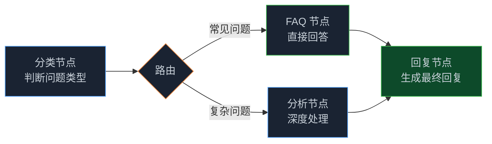
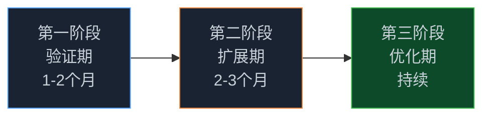

> **🎁 读完这篇你会得到什么**：一套专门为中小企业设计的 Graph 工程落地路径——怎么选场景、怎么控成本、怎么用开源工具快速跑起来，以及哪些坑是中小企业特别容易踩的。

前面几篇讲了 Graph 工程的概念、框架选型、状态管理、HITL、实战案例……

读完之后，很多中小企业的朋友会有一个感受：**这些东西看起来很厉害，但好像不是我们能玩的。**

这个感受我理解。前面几篇的例子，动不动就是"并行搜索 5 个信息源"、"企业级研报生成系统"、"全链路研发流水线"——听起来都是大厂才有的规模。

但实际上，Graph 工程的核心思想——把复杂任务拆成专注的节点、让状态在节点间流动——这件事和团队规模没关系。一个 5 人团队，完全可以用 Graph 工程解决真实的业务问题，而且成本可能比你想象的低得多。

<!-- more -->

---

## 先说一个真实的失败案例

有一家做 B2B 软件的公司，20 人团队，想用 AI 改造客服流程。他们找了一家咨询公司，对方给出了一套"企业级 AI 客服方案"：向量数据库 + 知识图谱 + 多 Agent 编排 + 实时监控仪表盘……

方案很漂亮，预算要 80 万。

他们没做。

半年后，他们自己用 LangGraph 搭了一个 4 节点的图：分类 → FAQ检索 → 回复生成 → 人工兜底。两个工程师花了三周，月 API 费用不到 500 元，处理了 70% 的重复客服问题。

这就是中小企业落地 Graph 工程的正确姿势：**不是把大厂方案缩小版，而是从自己的实际问题出发，搭一个够用的图。**

---

## 选场景：别什么都想做

Graph 工程落地失败，最常见的原因不是技术问题，是场景选错了。

很多中小企业一上来就想做"全流程自动化"——从获客到成交到售后，全部 AI 化。这个方向没错，但作为第一个 Graph 工程项目，太复杂了，很难跑通。

判断一个场景适不适合作为第一个项目，有一个很简单的方法：**把你们公司现在靠人工做的重复性工作列出来，按"重复频率 × 单次耗时"排序，取前三名。**

这三个场景，就是你的候选项目。

然后再过一遍这三个问题：

**输入输出清不清楚？** "给我一份竞品分析报告"——输入是竞品名称，输出是报告，边界清晰，容易验证效果。"帮我优化客户服务"——输入和输出都模糊，很难判断做得好不好。

**出错的代价能不能接受？** 第一个项目，Agent 肯定会出错。选一个出错了可以人工兜底、不会造成严重后果的场景。内容生产、数据整理、初步筛选——这些都行。财务审批、合同签署——先别碰。

**现在靠人工做，但重复性高吗？** 每天要回答同样的 100 个客户问题，每周要写同样格式的周报，每月要整理同样结构的数据报告——这类任务，Graph 工程能直接替代人工，ROI 清晰。

三个问题都满意，就是好场景。

---

## 工具选择：LangGraph 还是 Agent-Graph

选好场景之后，下一个问题是用什么工具。

对中小企业来说，主要有两个选择：

**LangGraph**：代码优先，灵活度高，适合有 Python 开发能力的团队。前面几篇的代码示例都是基于 LangGraph 的。

**Agent-Graph**：一个开源的多智能体系统，提供了可视化的工作流编辑器，不需要写太多代码就能搭起来一张图。

Agent-Graph 的核心功能包括：
- **可视化图谱编辑器**：拖拽式工作流设计，支持线性、并行、条件和嵌套图谱
- **子图嵌套**：把整个 Graph 作为单个节点使用，支持模块化复用
- **Handoffs（智能路由）**：节点动态选择下一个执行节点，支持条件分支和迭代循环
- **长期记忆**：跨会话存储用户偏好和 Agent 知识库
- **MCP 协议集成**：通过标准化协议连接外部工具和数据源

对于没有专职 AI 工程师的中小企业，Agent-Graph 的可视化界面能大幅降低上手门槛。

```bash
# Agent-Graph 快速部署
git clone https://github.com/keta1930/agent-graph.git
cd agent-graph
cp .env.example .env
# 填写 API Key 等配置
python agent_graph/scripts/generate_jwt_secret.py
docker compose --env-file .env -f docker/docker-compose.yml up -d
```

部署完成后，访问 `http://localhost:20050`，就能看到可视化的工作流编辑器。

不过要说清楚：Agent-Graph 适合快速验证想法，LangGraph 适合需要精细控制的生产环境。两者不是替代关系，而是不同阶段的工具。

---

## 最小可行图（MVG）：先跑通，再扩展

选好工具之后，很多人的第一反应是"把所有功能都做进去"。这是第二个常见错误。

Graph 工程有一个概念叫 **MVG（Minimum Viable Graph）**——最小可行图。就像 MVP（最小可行产品）一样，MVG 的目标是用最少的节点，跑通核心流程，验证这个方向是否可行。

MVG 的设计原则很简单：节点数量控制在 3-5 个，每个节点只做一件事，先不考虑异常处理和边缘情况。

以"客服自动回复"为例，MVG 长这样：



就这 4 个节点，先跑起来，看效果。效果好，再逐步加节点；效果不好，调整方向的成本也低。

用 LangGraph 实现这个 MVG，核心代码大概是这样：

```python
from langgraph.graph import StateGraph, END
from langchain_openai import ChatOpenAI
from typing import TypedDict, Optional

class CustomerServiceState(TypedDict):
    question: str
    question_type: str        # faq / complex
    retrieved_answer: Optional[str]
    analysis: Optional[str]
    final_reply: str

llm_fast = ChatOpenAI(model="gpt-4o-mini", temperature=0)
llm_good = ChatOpenAI(model="gpt-4o", temperature=0.3)

def classify_node(state: CustomerServiceState) -> dict:
    result = llm_fast.invoke(
        f"判断问题类型（只返回 faq 或 complex）：{state['question']}"
    )
    return {"question_type": result.content.strip()}

def faq_node(state: CustomerServiceState) -> dict:
    faqs = retrieve_faqs(state["question"])  # 从知识库检索
    return {"retrieved_answer": faqs}

def analysis_node(state: CustomerServiceState) -> dict:
    result = llm_good.invoke(f"深度分析并给出解决方案：{state['question']}")
    return {"analysis": result.content}

def reply_node(state: CustomerServiceState) -> dict:
    context = state.get("retrieved_answer") or state.get("analysis", "")
    result = llm_good.invoke(
        f"根据以下内容生成简洁回复（100字以内）：\n{context}\n问题：{state['question']}"
    )
    return {"final_reply": result.content}

def route_by_type(state: CustomerServiceState) -> str:
    return "faq" if state["question_type"] == "faq" else "analysis"

# 构建图
builder = StateGraph(CustomerServiceState)
builder.add_node("classify", classify_node)
builder.add_node("faq", faq_node)
builder.add_node("analysis", analysis_node)
builder.add_node("reply", reply_node)

builder.set_entry_point("classify")
builder.add_conditional_edges("classify", route_by_type, {
    "faq": "faq", "analysis": "analysis"
})
builder.add_edge("faq", "reply")
builder.add_edge("analysis", "reply")
builder.add_edge("reply", END)

app = builder.compile()
```

这个 MVG 跑起来之后，问自己三个问题：
- 输出质量比人工差多少？差距在可接受范围内吗？
- 每次运行的成本是多少？算下来比人工便宜吗？
- 出错率是多少？出错的时候人工兜底的成本可以接受吗？

三个问题都满意，再考虑扩展。

---

## 成本控制：中小企业最关心的问题

Graph 工程比单 Agent 循环贵，这是事实。但贵多少，取决于你怎么设计。

**分级用模型是最有效的成本控制手段。**

不是每个节点都需要最贵的模型。分类节点任务简单，用 `gpt-4o-mini`（约 $0.15/1M tokens）就够了。分析节点任务复杂，才需要 `gpt-4o`（约 $2.5/1M tokens）。一个简单的分级策略，能把 API 费用降低 60-70%。

```python
# 按节点职责分级
llm_classifier = ChatOpenAI(model="gpt-4o-mini", temperature=0)   # 分类、路由
llm_retriever = ChatOpenAI(model="gpt-4o-mini", temperature=0)    # 检索、格式化
llm_analyst = ChatOpenAI(model="gpt-4o", temperature=0.2)         # 分析、推理
llm_writer = ChatOpenAI(model="gpt-4o", temperature=0.4)          # 写作、生成
```

**缓存高频结果能省掉一大块费用。**

FAQ 类的问题，答案是固定的。没必要每次都调 API：

```python
import hashlib

_cache = {}

def cached_llm_call(prompt: str, llm) -> str:
    cache_key = hashlib.md5(prompt.encode()).hexdigest()
    if cache_key in _cache:
        return _cache[cache_key]
    result = llm.invoke(prompt)
    _cache[cache_key] = result.content
    return result.content
```

对于 FAQ 类节点，缓存命中率通常能达到 40-60%，直接省掉这部分 API 费用。

**控制上下文长度，别把整个 State 都塞进 Prompt。**

上下文越长，费用越高。每个节点只传它需要的数据：

```python
def reply_node(state: CustomerServiceState) -> dict:
    # ✅ 只传必要的信息
    prompt = f"""
问题类型：{state['question_type']}
客户问题：{state['question']}
参考内容：{state.get('retrieved_answer', '') or state.get('analysis', '')}

请生成简洁的回复（100字以内）：
"""
    # ❌ 不要这样：f"请根据以下所有信息生成回复：{state}"
    reply = llm_good.invoke(prompt)
    return {"final_reply": reply.content}
```

**一个实用的成本估算公式：**

```
月 API 费用 ≈ 日均请求数 × 平均每次请求 token 数 × token 单价 × 30
```

以客服场景为例：
- 日均 500 次客服请求
- 每次请求平均 2000 tokens（输入 + 输出）
- 使用 gpt-4o-mini，约 $0.15/1M tokens
- 月费用 ≈ 500 × 2000 × 0.00000015 × 30 ≈ **$4.5/月**

这个成本，对中小企业来说完全可以接受。

---

## 部署：从最简单的方式开始

不需要一上来就搭 Kubernetes 集群。对于中小企业，一个 FastAPI 服务就够了：

```python
from fastapi import FastAPI
from pydantic import BaseModel
from langgraph.checkpoint.sqlite import SqliteSaver

app = FastAPI()
checkpointer = SqliteSaver.from_conn_string("cs.db")
cs_graph = builder.compile(checkpointer=checkpointer)

class CustomerRequest(BaseModel):
    question: str
    customer_id: str

@app.post("/customer-service")
async def handle_customer_service(request: CustomerRequest):
    config = {"configurable": {"thread_id": f"cs-{request.customer_id}"}}
    result = cs_graph.invoke(
        {"question": request.question},
        config=config
    )
    return {"reply": result["final_reply"]}

@app.get("/health")
async def health():
    return {"status": "ok"}
```

部署到任何云服务器上，就能用了。等业务量上来了，再考虑扩容。

如果你用的是 Agent-Graph，部署更简单——Docker Compose 一键启动，自带可视化界面，不需要写部署代码。

---

## 分阶段推进：不要一步到位

中小企业落地 Graph 工程，最稳的方式是三阶段推进：



**验证期（1-2个月）**：选一个场景，搭 3-5 节点的最小图，人工并行跑，对比 AI 和人工的输出质量，统计实际 API 费用。这个阶段不做复杂的异常处理，不做性能优化，不做多场景扩展。验收标准：AI 输出质量达到人工的 70% 以上，成本低于人工的 50%。

**扩展期（2-3个月）**：把验证成功的图推向生产，加上 Checkpointing 支持断点续跑，加上基本的异常处理和人工兜底机制，同时开始第二个场景的 MVG。这个阶段不做大规模并发优化，不做复杂的长期记忆。

**优化期（持续）**：根据实际运行数据，分析哪些节点出错率高，针对性优化；根据实际 token 消耗，调整模型分级策略；逐步引入长期记忆，让系统越用越聪明。

---

## 三个必须避开的坑

说几个我见过的真实案例。

**坑一：把所有业务逻辑都塞进 Prompt**

一家电商公司，想用 Graph 工程做客服。他们把所有的退换货政策、促销规则、产品信息全部塞进一个节点的 Prompt，结果这个节点的 Prompt 有 5000 字，每次调用费用很高，而且效果还不好——模型在这么长的 Prompt 里找不到重点。

正确做法：把产品信息和政策文档存到向量数据库，节点里只做检索，Prompt 保持简洁。

**坑二：没有人工兜底机制**

一家 SaaS 公司，把 Graph 工程直接接到客户邮件回复上，没有人工审核环节。结果 Agent 给一个重要客户发了一封措辞不当的邮件，差点丢掉这个客户。

正确做法：至少在第一阶段，所有对外输出都要经过人工审核。等质量稳定了，再逐步放开。

**坑三：忽视监控**

很多中小企业搭完图就不管了，等出了问题才发现。

正确做法：从一开始就加上基本的监控——每次执行的耗时、费用、成功率。不需要复杂的监控系统，一个简单的日志文件就够：

```python
import logging
import time

logging.basicConfig(
    filename='graph_monitor.log',
    format='%(asctime)s - %(levelname)s - %(message)s'
)

def monitored_invoke(graph, input_data, config):
    """带监控的图执行"""
    start_time = time.time()
    thread_id = config.get('configurable', {}).get('thread_id', 'unknown')
    try:
        result = graph.invoke(input_data, config=config)
        elapsed = time.time() - start_time
        logging.info(f"SUCCESS | thread={thread_id} | elapsed={elapsed:.2f}s")
        return result
    except Exception as e:
        elapsed = time.time() - start_time
        logging.error(f"FAILED | thread={thread_id} | elapsed={elapsed:.2f}s | error={str(e)}")
        raise
```

---

## 一个完整的落地路线图

把上面的内容整理成一张路线图：

| 阶段 | 时间 | 核心任务 | 验收标准 |
|------|------|---------|---------|
| 场景选择 | 第1周 | 列出候选场景，按 ROI 排序 | 确定第一个落地场景 |
| 工具选型 | 第1周 | 评估 LangGraph vs Agent-Graph | 确定技术栈 |
| MVG 设计 | 第2周 | 设计 3-5 节点的最小图 | 图结构清晰，能画出来 |
| MVG 开发 | 第3-4周 | 实现 MVG，接入监控 | 能跑通，有基本输出 |
| 效果验证 | 第5-6周 | 人工对比，统计成本 | 质量 ≥ 70%，成本 ≤ 50% |
| 生产部署 | 第7-8周 | 加兜底机制，上线 | 稳定运行，有监控数据 |
| 扩展优化 | 持续 | 根据数据优化，扩展场景 | 质量持续提升，成本持续下降 |

---

## 📝 小结

- 中小企业落地 Graph 工程，最大的风险不是技术，是**场景选错**和**一步到位的冲动**
- 好的第一个场景：输入输出清晰、重复性高、出错代价可接受——用"重复频率 × 单次耗时"排序找候选
- 工具选型：有 Python 开发能力选 LangGraph（灵活可控），没有专职 AI 工程师选 Agent-Graph（可视化低门槛）
- MVG（最小可行图）原则：3-5 个节点，先跑通核心流程，再逐步扩展
- 成本控制三板斧：分级用模型（节省 60-70%）、缓存高频结果（节省 40-60%）、控制上下文长度
- 三阶段推进：验证期（跑通 MVG）→ 扩展期（推向生产）→ 优化期（持续改进）
- 三个必须避开的坑：业务逻辑全塞 Prompt、没有人工兜底、忽视监控

---

## 🔮 下一篇预告

落地路径清楚了，下一步是看具体场景怎么做。

下一篇，我们用电商/零售场景做一个完整的实战案例——从客服自动回复到选品推荐再到营销文案，用 Graph 工程把这三个场景串起来，看看一个中小型电商团队怎么用 Graph 工程把效率提上去。

---

> 📚 **系列导航**
> - 第 00 篇：从 while 循环到组织架构图，Agent 进化的下一步
> - 第 01 篇：从「单兵独斗」到「军团作战」：为什么你的 Agent 越来越失控？
> - 第 02 篇：解剖 LangGraph 与 AutoGen：选框架之前，先搞懂这三个概念
> - 第 03 篇：State 是整张图的血液：搞懂状态流转，才算真的会用 LangGraph
> - 第 04 篇：让可控性拉满：人机协同（HITL）与断点调试在 Graph 工程中的落地
> - 第 05 篇：实战：从零搭一个企业级研报自动生成系统
> - 第 06 篇：Graph 工程在研发流程中的应用：从需求到上线的全链路实战
> - 第 07 篇：Graph 工程在业务流程中的应用：客服、审批、内容生产场景实战
> - **第 08 篇：中小企业落地 Graph 工程：别被大厂方案吓跑** ⬅️ 你在这里
> - 第 09 篇：电商场景实战：用 Graph 工程搭客服+选品+营销协作系统
> - 第 10 篇：内容团队实战：用 Graph 工程把内容生产效率提升 3 倍
