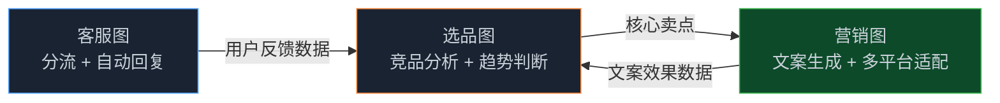
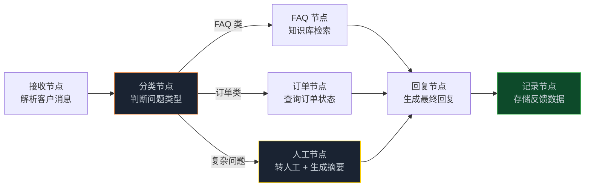
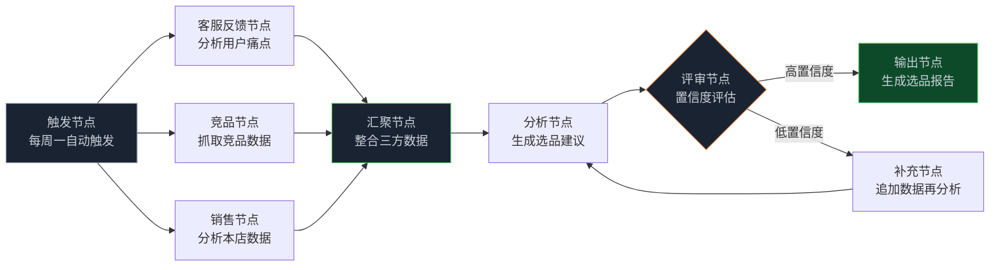
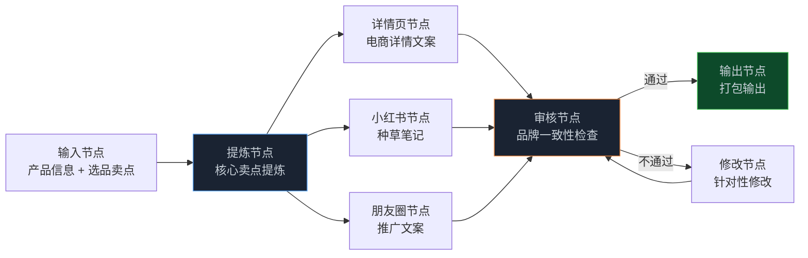

> **🎁 读完这篇你会得到什么**：一个完整的电商 Graph 工程实战案例，包含客服分流、选品分析、营销文案三个子系统的图设计和核心代码，以及从零搭建到上线的完整过程。

上一篇讲了中小企业落地 Graph 工程的通用路径。

这篇来一个具体的。

场景是一家中小型电商公司，卖家居用品，SKU 约 500 个，日均客服咨询 200-300 条，运营团队 5 人。他们遇到的问题很典型：客服回复慢、选品靠感觉、营销文案质量参差不齐。

这三个问题，用 Graph 工程怎么解？

<!-- more -->

---

## 现状：三个孤立的痛点

在改造之前，这家公司的情况是这样的：

**客服**：5 个运营轮流值班回复客服，平均响应时间 4 小时，高峰期更长。大量重复问题（退换货、物流查询、产品参数）占用了 70% 的时间，真正需要人工处理的复杂问题只有 30%。

**选品**：每周要分析竞品、看销售数据、判断哪些品类值得加大投入。这个工作靠运营的经验和感觉，没有系统化的分析流程，经常漏掉机会或者押错方向。

**营销文案**：每次上新品都要写详情页文案、小红书种草文、朋友圈推广文。5 个运营各写各的，风格不统一，质量差异大，而且很耗时间。

这三个问题，之前他们也试过用 ChatGPT，但都是单独用，没有形成系统。

---

## 改造思路：三张图，一套系统

Graph 工程的价值，不只是让单个任务做得更好，更重要的是**让不同任务之间能够协作**。

这家公司的三个痛点，其实有天然的关联：
- 客服收集到的用户反馈，是选品的重要输入
- 选品分析的结论，是营销文案的核心卖点
- 营销文案的效果，又会反馈到下一轮选品

所以改造方案不是三个独立的 AI 工具，而是**三张互相关联的图**：



---

## 第一张图：客服分流系统

客服图的核心逻辑很简单：先判断问题类型，能自动回复的直接回复，不能的转人工。

### 图结构设计



### State 定义

```python
from typing import TypedDict, Optional
from enum import Enum

class QuestionType(str, Enum):
    FAQ = "faq"           # 常见问题
    ORDER = "order"       # 订单相关
    COMPLEX = "complex"   # 复杂问题，需要人工

class CustomerServiceState(TypedDict):
    # 输入
    customer_id: str
    message: str
    order_id: Optional[str]
    # 中间状态
    question_type: Optional[QuestionType]
    retrieved_faq: Optional[str]
    order_info: Optional[dict]
    # 输出
    final_reply: Optional[str]
    need_human: bool
    human_summary: Optional[str]  # 转人工时的问题摘要
    # 数据收集
    feedback_tags: list[str]      # 用于后续选品分析
```

### 核心节点实现

```python
from langgraph.graph import StateGraph, END
from langchain_openai import ChatOpenAI

# 分级用模型：分类用便宜的，回复用好一点的
classifier_llm = ChatOpenAI(model="gpt-4o-mini", temperature=0)
reply_llm = ChatOpenAI(model="gpt-4o-mini", temperature=0.3)

def classify_node(state: CustomerServiceState) -> dict:
    """分类节点：判断问题类型"""
    prompt = f"""
判断以下客户问题的类型，只返回类型标签：
- faq：产品参数、使用方法、退换货政策等常见问题
- order：订单状态、物流查询、发货时间等订单相关
- complex：投诉、特殊情况、需要人工判断的问题

客户问题：{state['message']}

只返回：faq / order / complex
"""
    result = classifier_llm.invoke(prompt)
    question_type = result.content.strip().lower()

    # 同时提取反馈标签，用于选品分析
    tag_prompt = f"从以下客户问题中提取产品相关标签（如：质量、物流、价格、功能），返回逗号分隔的标签列表：{state['message']}"
    tags_result = classifier_llm.invoke(tag_prompt)
    tags = [t.strip() for t in tags_result.content.split(",")]

    return {
        "question_type": question_type,
        "feedback_tags": tags
    }

def faq_node(state: CustomerServiceState) -> dict:
    """FAQ 节点：从知识库检索答案"""
    # 从向量数据库检索相关 FAQ
    relevant_faqs = retrieve_faqs(state["message"], n_results=3)
    return {"retrieved_faq": "\n".join(relevant_faqs)}

def order_node(state: CustomerServiceState) -> dict:
    """订单节点：查询订单状态"""
    if not state.get("order_id"):
        # 从消息中提取订单号
        order_id = extract_order_id(state["message"])
    else:
        order_id = state["order_id"]

    if order_id:
        order_info = query_order_system(order_id)
    else:
        order_info = {"error": "未找到订单号"}

    return {"order_info": order_info}

def human_node(state: CustomerServiceState) -> dict:
    """人工节点：生成问题摘要，转人工处理"""
    summary_prompt = f"""
为以下客户问题生成一个简洁的摘要，方便人工客服快速了解情况（50字以内）：
{state['message']}
"""
    summary = classifier_llm.invoke(summary_prompt)
    return {
        "need_human": True,
        "human_summary": summary.content,
        "final_reply": "您的问题需要专属客服为您处理，我们将在30分钟内联系您，感谢您的耐心等待。"
    }

def reply_node(state: CustomerServiceState) -> dict:
    """回复节点：生成最终回复"""
    if state.get("need_human"):
        return {}  # 已经在 human_node 里设置了回复

    if state["question_type"] == "faq":
        context = state.get("retrieved_faq", "")
        prompt = f"根据以下知识库内容，回答客户问题（简洁友好，100字以内）：\n知识库：{context}\n问题：{state['message']}"
    else:  # order
        order_info = state.get("order_info", {})
        prompt = f"根据以下订单信息，回答客户问题（简洁友好，100字以内）：\n订单信息：{order_info}\n问题：{state['message']}"

    reply = reply_llm.invoke(prompt)
    return {"final_reply": reply.content}

def record_node(state: CustomerServiceState) -> dict:
    """记录节点：存储反馈数据，供选品分析使用"""
    save_feedback({
        "customer_id": state["customer_id"],
        "message": state["message"],
        "question_type": state["question_type"],
        "tags": state["feedback_tags"],
        "need_human": state.get("need_human", False)
    })
    return {}

# 路由函数
def route_by_type(state: CustomerServiceState) -> str:
    qtype = state.get("question_type", "complex")
    if qtype == "faq":
        return "faq"
    elif qtype == "order":
        return "order"
    else:
        return "human"

# 构建图
cs_builder = StateGraph(CustomerServiceState)
cs_builder.add_node("classify", classify_node)
cs_builder.add_node("faq", faq_node)
cs_builder.add_node("order", order_node)
cs_builder.add_node("human", human_node)
cs_builder.add_node("reply", reply_node)
cs_builder.add_node("record", record_node)

cs_builder.set_entry_point("classify")
cs_builder.add_conditional_edges("classify", route_by_type, {
    "faq": "faq", "order": "order", "human": "human"
})
cs_builder.add_edge("faq", "reply")
cs_builder.add_edge("order", "reply")
cs_builder.add_edge("human", "reply")
cs_builder.add_edge("reply", "record")
cs_builder.add_edge("record", END)

from langgraph.checkpoint.sqlite import SqliteSaver
cs_graph = cs_builder.compile(
    checkpointer=SqliteSaver.from_conn_string("cs.db")
)
```

### 上线效果

这张图上线后，70% 的客服问题实现了自动回复，平均响应时间从 4 小时降到 3 分钟。运营团队只需要处理剩下 30% 的复杂问题，工作量大幅减少。

更重要的是，`record_node` 每天积累的反馈数据，成了选品图的输入。

---

## 第二张图：选品分析系统

选品图的核心是把多个数据源的信息汇聚起来，给出有依据的选品建议。

### 图结构设计



### 核心代码

```python
from typing import TypedDict, Annotated
import operator

class SelectionState(TypedDict):
    week: str
    category: str
    # 并行节点的数据，用追加 Reducer
    data_sources: Annotated[list[dict], operator.add]
    # 分析结果
    analysis: str
    confidence: float  # 0-1，置信度
    selection_report: str
    iteration: int     # 防止无限循环

def customer_feedback_node(state: SelectionState) -> dict:
    """从客服反馈数据库提取本周用户痛点"""
    feedbacks = query_feedback_db(
        week=state["week"],
        category=state["category"]
    )
    # 统计高频标签
    tag_counts = count_tags(feedbacks)
    return {"data_sources": [{"type": "feedback", "data": tag_counts}]}

def competitor_node(state: SelectionState) -> dict:
    """抓取竞品数据"""
    competitor_data = scrape_competitor_products(
        category=state["category"],
        top_n=20
    )
    return {"data_sources": [{"type": "competitor", "data": competitor_data}]}

def sales_node(state: SelectionState) -> dict:
    """分析本店销售数据"""
    sales_data = query_sales_db(
        week=state["week"],
        category=state["category"]
    )
    return {"data_sources": [{"type": "sales", "data": sales_data}]}

def aggregate_node(state: SelectionState) -> dict:
    """汇聚节点：整合三方数据"""
    # 数据已经通过 Reducer 追加到 data_sources
    # 这里做格式化，方便后续分析
    summary = format_data_for_analysis(state["data_sources"])
    return {"data_sources": [{"type": "summary", "data": summary}]}

def analysis_node(state: SelectionState) -> dict:
    """分析节点：生成选品建议"""
    data_summary = next(
        (d["data"] for d in state["data_sources"] if d["type"] == "summary"),
        ""
    )
    prompt = f"""
基于以下数据，为{state['category']}品类生成选品建议：

{data_summary}

请分析：
1. 用户最关注的产品特性（来自客服反馈）
2. 竞品的热销方向
3. 本店的优势品类和待加强品类
4. 具体的选品建议（3-5条）

同时给出置信度评分（0-1），说明数据是否充分支撑建议。
"""
    analysis_llm = ChatOpenAI(model="gpt-4o", temperature=0.2)
    result = analysis_llm.invoke(prompt)

    # 解析置信度
    confidence = parse_confidence(result.content)
    return {
        "analysis": result.content,
        "confidence": confidence,
        "iteration": state.get("iteration", 0) + 1
    }

def route_after_review(state: SelectionState) -> str:
    if state["confidence"] >= 0.7 or state.get("iteration", 0) >= 2:
        return "output"
    return "supplement"

# 构建图（并行扇出）
sel_builder = StateGraph(SelectionState)
sel_builder.add_node("trigger", lambda s: s)  # 触发节点，直接透传
sel_builder.add_node("feedback", customer_feedback_node)
sel_builder.add_node("competitor", competitor_node)
sel_builder.add_node("sales", sales_node)
sel_builder.add_node("aggregate", aggregate_node)
sel_builder.add_node("analysis", analysis_node)
sel_builder.add_node("output", generate_report_node)
sel_builder.add_node("supplement", supplement_data_node)

sel_builder.set_entry_point("trigger")
# 扇出：同时触发三个数据节点
sel_builder.add_edge("trigger", "feedback")
sel_builder.add_edge("trigger", "competitor")
sel_builder.add_edge("trigger", "sales")
# 扇入：三个节点都完成后汇聚
sel_builder.add_edge("feedback", "aggregate")
sel_builder.add_edge("competitor", "aggregate")
sel_builder.add_edge("sales", "aggregate")
sel_builder.add_edge("aggregate", "analysis")
sel_builder.add_conditional_edges("analysis", route_after_review, {
    "output": "output", "supplement": "supplement"
})
sel_builder.add_edge("supplement", "analysis")
sel_builder.add_edge("output", END)

sel_graph = sel_builder.compile()
```

---

## 第三张图：营销文案系统

营销图的核心是把选品分析的结论，转化成不同平台的营销文案。

### 图结构设计



### 核心代码

```python
from typing import TypedDict, Annotated
import operator

class MarketingState(TypedDict):
    product_name: str
    product_info: str
    selection_insights: str  # 来自选品图的卖点
    core_selling_points: str
    # 并行生成的文案，用追加 Reducer
    drafts: Annotated[list[dict], operator.add]
    review_result: dict
    final_copies: dict
    revision_count: int

def extract_selling_points(state: MarketingState) -> dict:
    """提炼核心卖点"""
    prompt = f"""
产品：{state['product_name']}
产品信息：{state['product_info']}
选品分析洞察：{state['selection_insights']}

请提炼3-5个核心卖点，每个卖点一行，格式：【卖点名称】：具体描述
"""
    result = ChatOpenAI(model="gpt-4o-mini").invoke(prompt)
    return {"core_selling_points": result.content}

def detail_page_node(state: MarketingState) -> dict:
    """生成电商详情页文案"""
    prompt = f"""
产品：{state['product_name']}
核心卖点：{state['core_selling_points']}

生成电商详情页文案，包含：
- 主标题（20字以内，突出核心卖点）
- 副标题（30字以内，补充说明）
- 卖点列表（3-5条，每条15字以内）
- 产品描述（100字以内）
"""
    result = ChatOpenAI(model="gpt-4o-mini").invoke(prompt)
    return {"drafts": [{"platform": "detail_page", "content": result.content}]}

def xiaohongshu_node(state: MarketingState) -> dict:
    """生成小红书种草笔记"""
    prompt = f"""
产品：{state['product_name']}
核心卖点：{state['core_selling_points']}

生成小红书种草笔记：
- 标题（带emoji，吸引眼球，20字以内）
- 正文（200字以内，口语化，有场景感）
- 标签（5-8个相关话题标签）
"""
    result = ChatOpenAI(model="gpt-4o-mini").invoke(prompt)
    return {"drafts": [{"platform": "xiaohongshu", "content": result.content}]}

def wechat_node(state: MarketingState) -> dict:
    """生成朋友圈推广文案"""
    prompt = f"""
产品：{state['product_name']}
核心卖点：{state['core_selling_points']}

生成朋友圈推广文案（80字以内，有感染力，带行动号召）：
"""
    result = ChatOpenAI(model="gpt-4o-mini").invoke(prompt)
    return {"drafts": [{"platform": "wechat", "content": result.content}]}

def review_node(state: MarketingState) -> dict:
    """审核节点：检查品牌一致性"""
    all_drafts = "\n\n".join([
        f"【{d['platform']}】\n{d['content']}"
        for d in state["drafts"]
        if d["platform"] != "review"  # 排除审核结果本身
    ])

    prompt = f"""
检查以下营销文案是否符合品牌调性（专业、温暖、实用）：

{all_drafts}

评估每个平台的文案：
1. 是否突出了核心卖点
2. 语气是否符合平台特点
3. 是否有明显错误或不当表达

返回 JSON 格式：
{{
  "overall_pass": true/false,
  "issues": ["问题1", "问题2"],
  "platforms_to_revise": ["platform1", "platform2"]
}}
"""
    result = ChatOpenAI(model="gpt-4o-mini").invoke(prompt)
    review_result = parse_json_safely(result.content)
    return {
        "review_result": review_result,
        "revision_count": state.get("revision_count", 0) + 1
    }

def route_after_review(state: MarketingState) -> str:
    review = state.get("review_result", {})
    if review.get("overall_pass") or state.get("revision_count", 0) >= 2:
        return "output"
    return "revise"

# 构建图
mkt_builder = StateGraph(MarketingState)
mkt_builder.add_node("extract", extract_selling_points)
mkt_builder.add_node("detail", detail_page_node)
mkt_builder.add_node("xiaohongshu", xiaohongshu_node)
mkt_builder.add_node("wechat", wechat_node)
mkt_builder.add_node("review", review_node)
mkt_builder.add_node("output", package_output_node)
mkt_builder.add_node("revise", revise_node)

mkt_builder.set_entry_point("extract")
# 扇出：并行生成三个平台的文案
mkt_builder.add_edge("extract", "detail")
mkt_builder.add_edge("extract", "xiaohongshu")
mkt_builder.add_edge("extract", "wechat")
# 扇入：三个平台都完成后审核
mkt_builder.add_edge("detail", "review")
mkt_builder.add_edge("xiaohongshu", "review")
mkt_builder.add_edge("wechat", "review")
mkt_builder.add_conditional_edges("review", route_after_review, {
    "output": "output", "revise": "revise"
})
mkt_builder.add_edge("revise", "review")
mkt_builder.add_edge("output", END)

mkt_graph = mkt_builder.compile()
```

---

## 三张图的协作：数据流设计

三张图之间的数据流是这套系统的核心价值所在。

```python
# 每周自动触发选品分析
def weekly_selection_pipeline(category: str):
    week = get_current_week()

    # 1. 运行选品图
    sel_result = sel_graph.invoke({
        "week": week,
        "category": category,
        "data_sources": [],
        "iteration": 0
    })

    # 2. 把选品洞察传给营销图
    for product in sel_result["recommended_products"]:
        mkt_result = mkt_graph.invoke({
            "product_name": product["name"],
            "product_info": product["info"],
            "selection_insights": sel_result["selection_report"],  # 关键：传递选品洞察
            "drafts": [],
            "revision_count": 0
        })
        save_marketing_copies(product["id"], mkt_result["final_copies"])

# 客服图的反馈数据，每天汇总后存入数据库
# 选品图每周从数据库读取，形成闭环
```

---

## 上线数据

这套系统上线 2 个月后的数据：

| 指标 | 改造前 | 改造后 | 提升 |
|------|--------|--------|------|
| 客服平均响应时间 | 4 小时 | 3 分钟 | 98% ↓ |
| 客服人工处理比例 | 100% | 30% | 70% ↓ |
| 选品分析耗时 | 2 天/周 | 2 小时/周 | 94% ↓ |
| 营销文案生产时间 | 4 小时/款 | 20 分钟/款 | 92% ↓ |
| 月 API 费用 | - | 约 ¥800 | - |

月 API 费用 800 元，替代了大约 2 个人工客服的部分工作量。ROI 非常清晰。

---

## 📝 小结

- 电商场景的三个核心痛点（客服、选品、营销）可以用三张互相关联的图来解决
- 客服图的关键设计：分类节点 + 条件路由 + 人工兜底，同时收集反馈数据供选品使用
- 选品图的关键设计：并行扇出三个数据源 + Reducer 汇聚 + 置信度评估循环
- 营销图的关键设计：并行生成多平台文案 + 品牌一致性审核 + 自动修改循环
- 三张图的数据流：客服反馈 → 选品分析 → 营销文案，形成业务闭环
- 月 API 成本约 800 元，替代了大量重复性人工工作，ROI 清晰

---

## 🔮 下一篇预告

电商场景讲完了，下一篇换一个方向——内容团队。

内容团队的痛点和电商不一样：不是重复性工作太多，而是创意工作的质量不稳定、效率上不去。

下一篇，我们看一个内容团队怎么用 Graph 工程把内容生产效率提升 3 倍，同时保持质量稳定。

---

> 📚 **系列导航**
> - 第 00 篇：从 while 循环到组织架构图，Agent 进化的下一步
> - 第 01 篇：从「单兵独斗」到「军团作战」：为什么你的 Agent 越来越失控？
> - 第 02 篇：解剖 LangGraph 与 AutoGen：选框架之前，先搞懂这三个概念
> - 第 03 篇：State 是整张图的血液：搞懂状态流转，才算真的会用 LangGraph
> - 第 04 篇：让可控性拉满：人机协同（HITL）与断点调试在 Graph 工程中的落地
> - 第 05 篇：实战演练：从零构建企业级"研报自动协作生成"复杂图
> - 第 06 篇：Graph 工程在研发流程中的应用：从需求到上线的全链路实战
> - 第 07 篇：Graph 工程在业务流程中的应用：客服、审批、内容生产场景实战
> - 第 08 篇：中小企业落地 Graph 工程：从 0 到 1 的选型与成本控制
> - **第 09 篇：电商场景实战：用 Graph 工程搭客服+选品+营销协作系统** ⬅️ 你在这里
> - 第 10 篇：内容团队实战：用 Graph 工程把内容生产效率提升 3 倍
