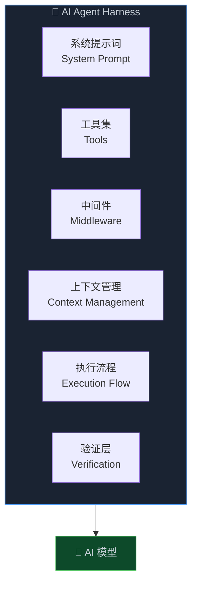

**你有没有想过，当 AI 真的能自己写代码、自己测试、自己修 Bug，工程师的价值在哪里？**

2025 年下半年，一件事悄悄发生了——OpenAI 内部有个三人团队，用 Codex 智能体在五个月内写出了一百万行代码，没有一行是人工敲的。LangChain 的团队用同样的方式，把他们的编程智能体在 Terminal Bench 2.0 上的得分从 52.8% 提升到了 66.5%，而且全程没有换模型，只改了"外壳"。

这个"外壳"，就是 **Harness**。

<!-- more -->

很多人第一次听到 Harness Engineering 这个词，可能会觉得陌生。但如果你用过 AI 写代码，你一定遇到过这些问题：

- AI 写了一半就停了，不知道该继续还是该结束
- AI 反复在同一个地方犯错，改了又改，越改越乱
- AI 给出的答案看起来对，但一运行就崩
- 任务稍微复杂一点，AI 就开始"发散"，偏离原来的目标

这些问题，不是模型不够聪明，而是**没有给模型搭好工作的脚手架**。

Harness Engineering，就是专门解决这个问题的工程方法论。

---

## 这个系列是写给谁的？

如果你是：

- **AI 应用开发者**，正在用 LangChain、LlamaIndex 或者直接调 API 构建 AI 应用
- **工程师**，想让 AI 在你的项目里真正"干活"，而不只是"聊天"
- **技术管理者**，想理解为什么有些团队用 AI 效率翻倍，有些团队却越用越乱

这个系列就是为你写的。

我们不会讲太多理论，重点是**实战**——从真实案例出发，把 LangChain、OpenAI、Anthropic 这些大厂踩过的坑和总结出来的方法，翻译成你能直接用的东西。

---

## Harness Engineering 到底是什么？

先说一个比喻。

你见过赛马吗？马本身很强，但光有马不够——你还需要马鞍、缰绳、马镫，还需要骑手知道怎么引导它。这套"让马跑得更好的装备和方法"，就是 Harness（马具）。

AI 模型就像那匹马——它有能力，但能力是"尖刺型"的，在某些地方极强，在某些地方又莫名其妙地失误。Harness Engineering 就是**围绕模型搭建一套系统，把模型的能力引导到你真正需要的方向上**。

具体来说，一个 Harness 包含这些东西：

- **系统提示词（System Prompt）**：告诉 AI 它是谁、该怎么工作、遇到问题怎么处理
- **工具集（Tools）**：给 AI 配备它能调用的能力，比如搜索、执行代码、读写文件
- **中间件（Middleware）**：在 AI 行动前后插入的钩子，用来监控、纠偏、注入信息
- **上下文管理（Context Management）**：控制 AI 在每个时刻能"看到"什么信息
- **执行流程（Execution Flow）**：设计 AI 完成任务的步骤和节奏
- **验证层（Verification）**：让 AI 在提交结果前自我检查

这六个维度，就是 Harness Engineering 的核心工作面。

---

## 为什么现在特别重要？

有个数据很能说明问题。

LangChain 团队在 Terminal Bench 2.0 上做了一组实验：同样的模型（GPT-5.2-Codex），只改 Harness 设计，得分从 52.8% 提升到 66.5%，提升了 13.7 个百分点。

Anthropic 的工程师用三智能体架构（规划者 + 生成者 + 评估者）构建了一个完整的 DAW（数字音频工作站），整个过程耗时 4 小时，花费 124 美元，但生成的应用真的能用——有完整的编曲界面、混音器、AI 辅助作曲。

OpenAI 内部团队用 Codex 在五个月内交付了一个有真实用户的产品，代码量超过一百万行，三个工程师，平均每人每天合并 3.5 个 PR。

这些不是实验室里的数字，是真实发生的事。而它们背后的共同点，就是**精心设计的 Harness**。

模型在变强，但模型的能力能不能真正发挥出来，越来越取决于 Harness 的质量。

---

## 系列文章目录

这个系列一共规划了 **6 篇文章**，从概念到实战，逐步深入：

### 第 0 篇（本篇）：系列介绍
当 AI 开始"自己干活"，工程师该做什么？——Harness Engineering 的背景和意义

### 第 1 篇：Harness 是什么？
从"马具"到"AI 脚手架"——深入理解 Harness 的六个核心组件，以及为什么它能让 AI 表现更好

### 第 2 篇：让 AI 学会"自我验证"
Build & Verify 模式——如何通过系统提示词和中间件，让 AI 从"写完就交"变成"写完自测"

### 第 3 篇：上下文工程，给 AI 一张地图
Context Engineering——如何管理 AI 的"视野"，避免它在复杂任务中迷失方向

### 第 4 篇：多智能体协作架构
从单打独斗到团队作战——规划者、生成者、评估者三角架构的设计与实践

### 第 5 篇：Harness 的持续迭代
用 Trace 分析驱动改进——如何像 LangChain 那样，用数据找到 AI 的失败模式并系统性修复

### 第 6 篇：未来展望
当模型越来越强，Harness 会消失吗？——AI Agent 的持续性与准确性的终极问题

---

## 参考资料

这个系列的核心参考来自三篇大厂实战文章：

- **LangChain**：《Improving Deep Agents with Harness Engineering》——用 Trace 分析驱动 Harness 迭代，13.7 分的提升背后的方法论
- **OpenAI**：《工程技术：在智能体优先的世界中利用 Codex》——五个月、一百万行代码、三人团队的真实经历
- **Anthropic**：《Harness design for long-running application development》——多智能体架构和长时间自主编程的设计实践

这三篇文章代表了目前业界在 Harness Engineering 上最前沿的实践，我们会在后续每篇文章里深入拆解其中的关键思路。

---

## 写在最后

有人说，AI 时代工程师会失业。

但 OpenAI 那个三人团队的经历告诉我们另一件事：工程师没有消失，只是工作的重心变了——从**写代码**，变成了**设计让 AI 能写好代码的环境**。

这个"环境"，就是 Harness。

会设计 Harness 的工程师，在 AI 时代反而更值钱。

下一篇，我们从头讲清楚 Harness 的六个核心组件，以及每个组件背后的设计逻辑。

---

> 系列文章持续更新，欢迎关注。
> 参考资料：LangChain Blog、OpenAI Blog、Anthropic Blog
