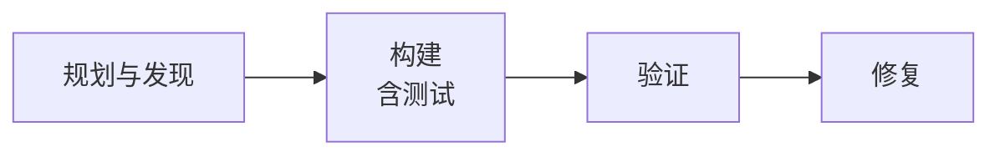
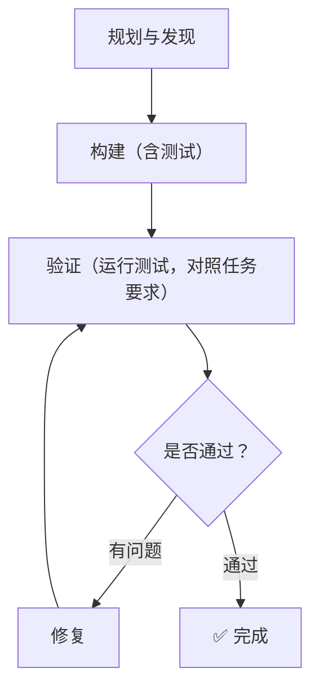
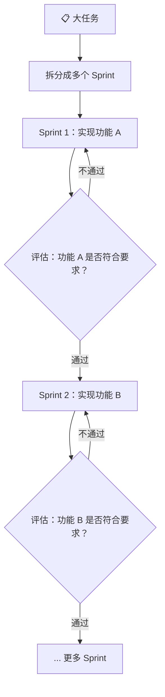
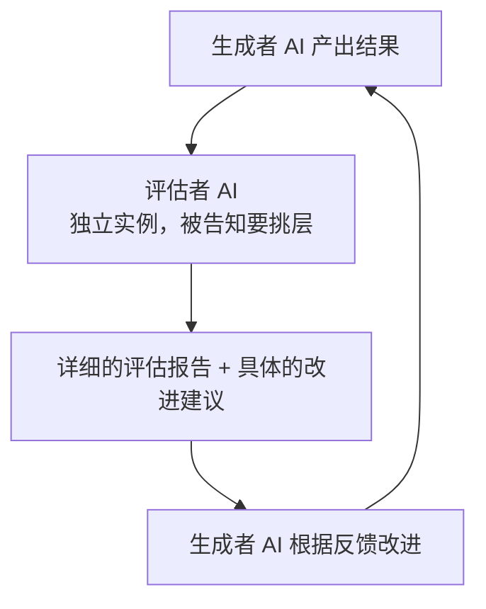
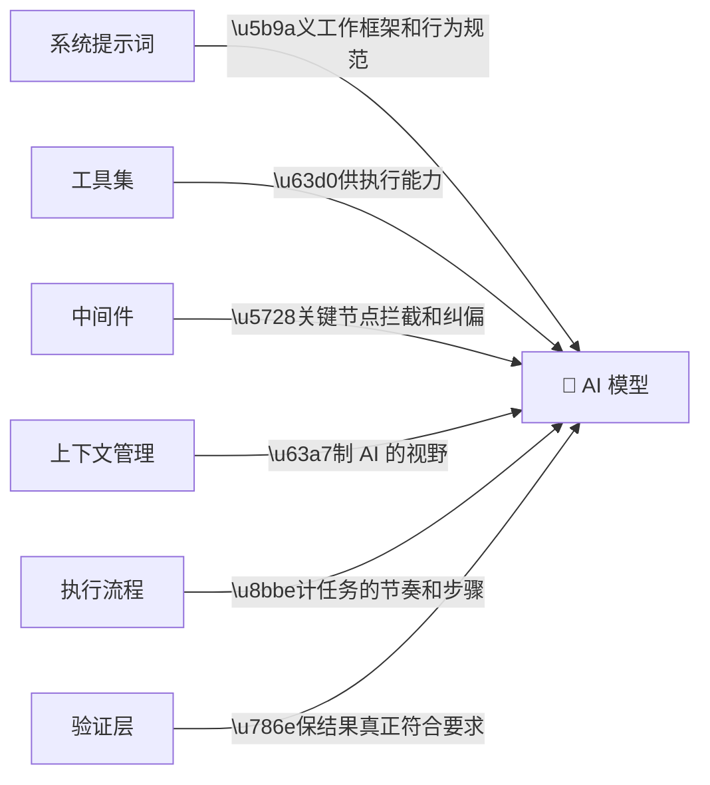

**同样的模型，为什么有人用得飞起，有人用得一塌糊涂？**

答案不在模型，在 Harness。

<!-- more -->

先说一个真实的数字。

LangChain 团队在 Terminal Bench 2.0 上做了一组实验：同样的模型（GPT-5.2-Codex），只改 Harness 设计，得分从 52.8% 提升到 66.5%，提升了 13.7 个百分点。他们没有换更贵的模型，没有增加算力，只是把"模型外面的那套东西"重新设计了一遍。

这套"模型外面的东西"，就是 Harness。

---

## 从"马具"说起

Harness 这个词，原意是马具——马鞍、缰绳、马镫这些东西的总称。

马本身很强，但光有马不够。没有马具，马的力量是随机的、难以控制的。有了马具，骑手才能把马的力量引导到正确的方向上。

AI 模型也一样。模型有能力，但这个能力是"尖刺型"的——在某些地方极强，在某些地方又莫名其妙地失误。Harness 的作用，就是**把模型的能力引导到你真正需要的方向上**，同时在它可能出错的地方设置保护。

LangChain 对 Harness 的定义很直接：

> "The goal of a harness is to mold the inherently spiky intelligence of a model for tasks we care about."
> Harness 的目标，是把模型天生不稳定的智能，塑造成我们需要的形态。

---

## 六个核心组件

一个完整的 Harness，通常包含六个维度的设计。我们逐一拆解。

### 1. 系统提示词（System Prompt）

系统提示词是 Harness 里最直接的部分，也是最容易被低估的部分。

很多人以为系统提示词就是"告诉 AI 你是谁"，但在 Harness Engineering 里，系统提示词承担的是更重要的角色：**给 AI 建立工作框架**。

LangChain 在实验中发现，AI 最常见的失败模式之一，是"写完代码，自己看了一眼觉得没问题，就停了"——没有测试，没有验证，直接交差。

他们的解决方案是在系统提示词里明确规定工作流程：

每个阶段都有具体的行为要求。比如"构建"阶段，要求 AI 不只是写代码，还要同时写测试，覆盖正常路径和边界情况。"验证"阶段，要求 AI 运行测试，读完整的输出，对比任务要求（而不是对比自己写的代码）。

这个改动听起来简单，但效果显著——AI 从"写完就交"变成了"写完自测"。

**设计要点**：
- 不要只写"你是一个 XX 助手"，要写清楚工作流程
- 明确每个阶段的行为要求，而不是只说"做好"
- 针对 AI 的常见失败模式，在提示词里提前设置防护

---

### 2. 工具集（Tools）

工具是 AI 能调用的能力。搜索、执行代码、读写文件、调用 API——这些都是工具。

工具的设计有两个关键问题：**给什么工具**，以及**工具的边界在哪里**。

给太少，AI 会因为缺乏能力而失败。给太多，AI 会在工具选择上浪费时间，甚至用错工具。

Anthropic 的工程师在构建长时间运行的编程智能体时，给了 AI 一个关键工具：**Playwright MCP**——让 AI 能直接操控浏览器，像真实用户一样点击、截图、验证 UI 行为。

这个工具的加入，让 AI 的验证能力从"看代码觉得对"变成了"真的跑起来点了一遍"。两者的差距，在实际测试中非常明显。

**设计要点**：
- 工具要和任务目标对齐，不是越多越好
- 工具的错误信息要对 AI 友好，方便 AI 理解并修复
- 考虑给 AI 提供"环境感知"工具，让它了解自己在什么环境里工作

---

### 3. 中间件（Middleware）

中间件是 Harness 里最有意思的部分，也是最容易被忽视的部分。

简单说，中间件就是**在 AI 行动前后插入的钩子（Hook）**。你可以在 AI 调用工具之前拦截，注入额外信息；也可以在 AI 准备结束任务之前拦截，强制它再做一次验证。

LangChain 在实验中用了两个关键中间件：

**PreCompletionChecklistMiddleware**：在 AI 准备退出之前拦截，提醒它对照任务要求做一次验证。这个中间件的灵感来自一个叫"Ralph Wiggum Loop"的概念——用钩子强制 AI 在退出前继续执行验证步骤。

**LoopDetectionMiddleware**：追踪 AI 对每个文件的编辑次数。如果同一个文件被改了 N 次以上，就注入提示"考虑重新审视你的方案"。这是为了打破 AI 的"死循环"——有时候 AI 会在同一个错误方案上反复修改，越改越乱，这个中间件能帮它跳出来。

**设计要点**：
- 中间件是针对 AI 已知失败模式的"定向修复"
- 不要滥用中间件，每个中间件都应该有明确的目标
- 随着模型能力提升，部分中间件可以逐步移除

---

### 4. 上下文管理（Context Management）

上下文是 AI 在每个时刻能"看到"的信息。管理好上下文，是让 AI 在复杂任务中保持方向感的关键。

OpenAI 的工程师总结了一个很重要的原则：

> "从 AI 的角度来看，它在运行时无法在上下文中访问的任何内容都是不存在的。"

这句话听起来简单，但影响深远。存在 Google Docs 里的设计文档、存在 Slack 消息里的架构决策、存在工程师脑子里的隐性知识——对 AI 来说，这些都不存在。

他们的解决方案是把所有重要信息都放进代码仓库，用结构化的方式组织，让 AI 能通过搜索和读取来获取。

但上下文管理还有另一个维度：**控制 AI 在每个时刻看到多少信息**。

Anthropic 的工程师发现，当上下文窗口快满的时候，AI 会出现"上下文焦虑"——开始草草收尾，不管任务有没有真正完成。他们的解决方案是"上下文重置"：在合适的时机清空上下文，用一个结构化的"交接文档"让新的 AI 实例接手工作。

**设计要点**：
- 把 AI 需要的信息放进它能访问的地方（代码仓库、文档、工具）
- 给 AI 一张"地图"，而不是一本"百科全书"——让它知道去哪里找信息
- 监控上下文使用量，在合适的时机做重置或压缩

---

### 5. 执行流程（Execution Flow）

执行流程是 AI 完成任务的节奏和步骤设计。

最简单的执行流程是"给任务，等结果"。但对于复杂任务，这种方式很容易失控——AI 可能在某个地方卡住，或者走偏了方向，你却不知道。

Anthropic 的工程师设计了一个"Sprint"模式：把大任务拆成小的 Sprint，每个 Sprint 完成后做一次评估，再决定下一步。这和软件开发里的敏捷迭代很像。

LangChain 则用了"推理三明治"（Reasoning Sandwich）：在规划阶段和验证阶段用高推理预算（xhigh），在实现阶段用中等推理预算（high）。这样既保证了规划和验证的质量，又避免了在实现阶段浪费太多时间在推理上。

**设计要点**：
- 复杂任务要分阶段，每个阶段有明确的输入和输出
- 在关键节点设置检查点，而不是等到最后才验证
- 根据任务阶段调整推理预算，不要一刀切

---

### 6. 验证层（Verification）

验证层是 Harness 里最容易被忽视，但往往最关键的部分。

AI 有一个天然的倾向：**对自己的第一个"看起来合理"的方案过于自信**。它会重新读自己写的代码，觉得没问题，然后停下来。但"看起来对"和"真的对"之间，往往有很大的距离。

解决这个问题有两种思路：

**自我验证**：通过系统提示词和中间件，强制 AI 在提交结果前运行测试、对照任务要求检查。LangChain 的实验证明，这个方法有效，但需要明确的指导——AI 不会自发地进入"构建-验证"循环。

**外部评估**：用一个独立的 AI 实例来评估另一个 AI 的工作。Anthropic 的工程师发现，让同一个 AI 评估自己的工作，它会倾向于给出正面评价。但如果换一个独立的 AI 来评估，并且明确告诉它"要挑剔"，评估质量会大幅提升。

**设计要点**：
- 不要依赖 AI 的自我感觉，要有可执行的验证步骤（运行测试、点击 UI）
- 独立的评估者比自我评估更可靠
- 评估标准要具体，"好不好"不够，要有可量化的指标

---

## 六个组件的关系

这六个组件不是孤立的，它们相互配合，共同构成一个完整的 Harness：

设计 Harness 的核心思路是：**先找到 AI 在你的任务上最常见的失败模式，然后针对每个失败模式，在对应的组件上做设计**。

这不是一次性的工作，而是一个持续迭代的过程。LangChain 的做法是用 Trace 分析来找失败模式，然后针对性地改 Harness，再跑实验，再分析——循环往复。

---

## 小结

Harness Engineering 的核心，是承认一件事：**模型不是完美的，但我们可以通过设计来弥补它的不足**。

六个组件，每个都有它的作用：
- 系统提示词建立框架
- 工具集提供能力
- 中间件纠偏保护
- 上下文管理控制视野
- 执行流程设计节奏
- 验证层确保质量

下一篇，我们重点讲"让 AI 学会自我验证"——这是 Harness Engineering 里最有价值、也最容易落地的一个实践。

---

> 上一篇：[系列介绍 —— 当 AI 开始"自己干活"，工程师该做什么？](/posts/ailearn/harness/00)
> 下一篇：让 AI 学会"自我验证"——Build & Verify 模式（即将发布）
