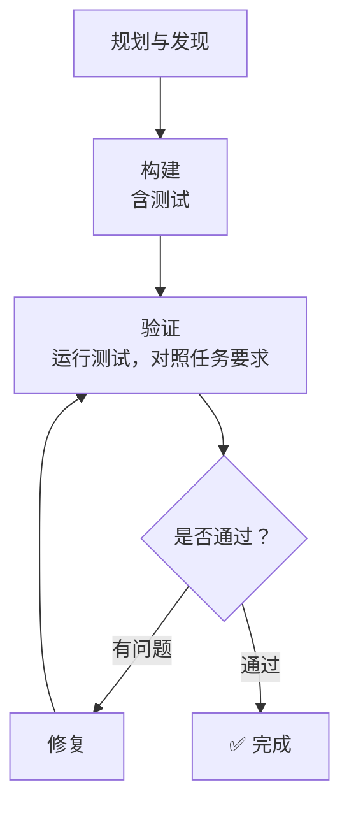
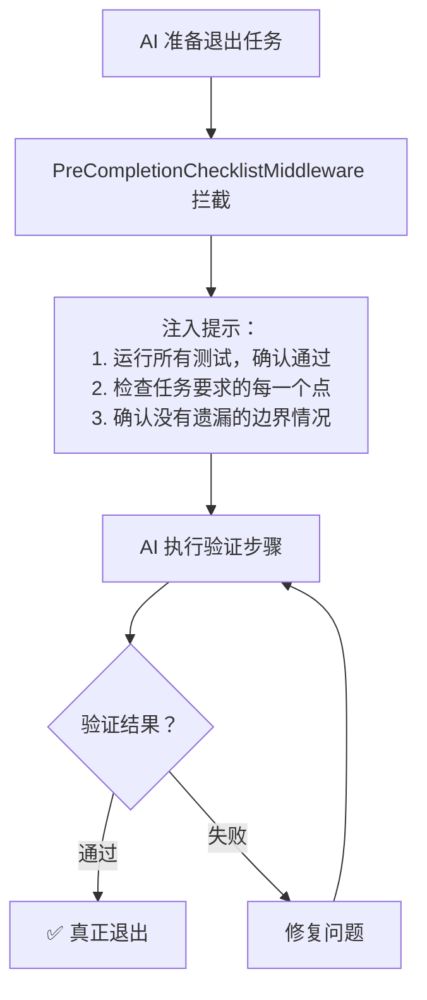

**AI 写完代码，自己看了一眼觉得没问题，就交差了。这是 AI Agent 最常见的失败模式之一。**

LangChain 在分析了大量 Agent 运行 Trace 之后，发现了一个规律：最常见的失败，不是 AI 不会写代码，而是 AI 写完代码之后，**没有去验证它是否真的能跑**。

<!-- more -->


这个问题听起来简单，但解决起来需要系统性的设计。这篇文章，我们就来讲 Harness Engineering 里最核心的一个实践：**Build & Verify 模式**。

---

## AI 为什么不愿意"自测"？

先说一个有意思的现象。

你让 AI 写一段代码，它写完之后，通常会说"这段代码应该可以正常运行"或者"逻辑看起来是对的"。但它不会主动去运行这段代码，不会去写测试，不会去验证边界情况。

为什么？

因为 AI 的训练方式让它倾向于**给出一个"看起来合理"的答案**，而不是"经过验证的正确答案"。在它的"世界观"里，写出代码就是完成任务，验证是可选项，不是必选项。

LangChain 的工程师把这个现象描述得很直白：

> "最常见的失败模式是：AI 写了一个方案，重新读了自己的代码，确认看起来没问题，然后停下来了。"

这不是模型的问题，这是**没有给模型建立正确的工作框架**。

---

## Build & Verify 模式

解决这个问题的方法，LangChain 称之为 Build & Verify 模式。核心思路是：**通过系统提示词和中间件，强制 AI 进入"构建-验证"循环**。

### 四个阶段

他们在系统提示词里明确规定了四个工作阶段：

**阶段一：规划与发现（Plan & Discover）**
- 读懂任务要求
- 扫描代码库，了解现有结构
- 制定初步方案，同时想好怎么验证

**阶段二：构建（Build）**
- 实现方案
- **同时写测试**——不只是写功能代码，要同时写测试用例
- 覆盖正常路径和边界情况

**阶段三：验证（Verify）**
- 运行测试
- 读完整的输出（不是只看有没有报错）
- **对照任务要求检查**，而不是对照自己写的代码

**阶段四：修复（Fix）**
- 分析错误
- 回到原始任务要求
- 修复问题，重新验证



这个流程看起来很像软件开发里的 TDD（测试驱动开发），但有一个关键区别：**这是给 AI 设计的工作流程，不是给人设计的**。

---

## 为什么"对照任务要求"而不是"对照代码"？

这个细节很重要，值得单独说一下。

AI 在验证自己的工作时，有一个天然的偏差：它倾向于**用自己写的代码来验证自己写的代码**。

比如，任务要求是"实现一个排序函数，要能处理空数组"。AI 写了代码，然后验证的时候，它会想"我的代码里有处理空数组的逻辑，所以应该没问题"——但它不会真的去运行一个空数组的测试用例。

这就是为什么 LangChain 在系统提示词里特别强调：**验证时要对照任务要求，而不是对照自己的代码**。

任务要求是外部的、客观的标准。代码是 AI 自己写的，用它来验证自己，等于是自己给自己打分，很容易出现"自我感觉良好"的问题。

---

## PreCompletionChecklistMiddleware：强制验证的"最后防线"

光靠系统提示词还不够。AI 有时候会"忘记"验证步骤，或者觉得"这个任务比较简单，不需要验证"。

LangChain 的解决方案是一个叫 **PreCompletionChecklistMiddleware** 的中间件。

这个中间件的工作原理很简单：**在 AI 准备结束任务之前拦截它，强制它做一次验证**。



这个设计的灵感来自一个叫"Ralph Wiggum Loop"的概念——用钩子强制 AI 在退出前继续执行，直到真正完成任务。

---

## 测试的重要性：不只是"有没有报错"

在 Build & Verify 模式里，测试不只是"运行一下看有没有报错"，而是**给 AI 提供一个可以持续改进的信号**。

LangChain 的工程师把这个说得很清楚：

> "测试是关键，因为它帮助验证整体正确性，同时给 AI 提供一个可以持续爬坡的信号。"

什么意思？

当 AI 有了测试，它就有了一个客观的"好不好"的标准。测试通过了，说明这个方向是对的；测试失败了，说明需要调整。AI 可以根据测试结果来"爬坡"——不断调整方案，直到所有测试都通过。

没有测试，AI 只能靠"感觉"来判断自己的方案好不好，这个"感觉"往往是不可靠的。

---

## 实际效果：LangChain 的数据

LangChain 在 Terminal Bench 2.0 上的实验数据很能说明问题。

在加入 Build & Verify 相关的系统提示词和中间件之前，AI 的得分是 52.8%。加入之后，得分提升到了 66.5%，提升了 13.7 个百分点。

这 13.7 个百分点，不是靠换更好的模型，不是靠增加算力，而是靠**让 AI 养成了"写完自测"的习惯**。

---

## 怎么在自己的项目里用？

如果你在用 LangChain、LlamaIndex 或者直接调 API 构建 AI Agent，可以参考以下步骤：

### 第一步：在系统提示词里明确工作流程

不要只写"你是一个编程助手"，要写清楚工作流程：

```
你是一个编程助手。在完成任务时，请遵循以下工作流程：

1. 规划：读懂任务要求，制定方案，想好如何验证
2. 构建：实现方案，同时编写测试用例（覆盖正常路径和边界情况）
3. 验证：运行测试，读完整输出，对照任务要求（不是对照代码）检查
4. 修复：如有问题，分析原因，修复，重新验证

在提交结果之前，必须完成验证步骤。
```

### 第二步：添加验证拦截中间件

在 AI 准备结束任务之前，注入验证提示：

```python
def pre_completion_hook(agent_state):
    """在 AI 结束任务前，强制执行验证步骤"""
    verification_prompt = """
    在结束任务之前，请完成以下验证：
    1. 运行所有测试，确认全部通过
    2. 逐条检查任务要求，确认每一项都已完成
    3. 检查边界情况（空输入、异常输入等）
    
    如果发现问题，请修复后再次验证。
    """
    return inject_message(agent_state, verification_prompt)
```

### 第三步：给 AI 提供可执行的验证工具

确保 AI 有能力真正运行测试，而不只是"看代码"：
- 代码执行工具（能运行 Python/JS 等代码）
- 测试运行工具（能运行 pytest、jest 等测试框架）
- 如果是 Web 应用，考虑给 AI 提供浏览器操控工具（如 Playwright）

---

## 一个常见的误区

很多人在实践 Build & Verify 模式时，会犯一个误区：**把验证做成了"形式主义"**。

AI 运行了测试，测试通过了，但测试本身写得很浅——只测了最简单的情况，没有测边界情况，没有测异常情况。这样的验证，只是给人一种"已经验证过了"的错觉。

解决这个问题，需要在系统提示词里明确要求测试的覆盖范围：

```
在编写测试时，必须覆盖：
- 正常情况（Happy Path）
- 边界情况（空输入、最大值、最小值等）
- 异常情况（无效输入、网络错误等）
- 任务要求中明确提到的所有场景
```

---

## 小结

Build & Verify 模式的核心，是把"验证"从可选项变成必选项。

三个关键点：
1. **系统提示词建立框架**：明确规定四个工作阶段，让 AI 知道验证是工作流程的一部分
2. **中间件强制执行**：在 AI 准备退出时拦截，确保验证真的发生了
3. **测试作为信号**：不只是"有没有报错"，而是给 AI 提供持续改进的方向

这个模式的价值，不只是提高了 AI 的准确率，更重要的是**让 AI 的工作变得可预期**——你知道它会验证，你知道它会修复，你知道它不会"写完就交"。

下一篇，我们讲上下文工程——如何管理 AI 的"视野"，让它在复杂任务中不迷失方向。

---

> 上一篇：[Harness 是什么？六个核心组件拆解](/posts/ailearn/harness/01)
> 下一篇：上下文工程，给 AI 一张地图（即将发布）
