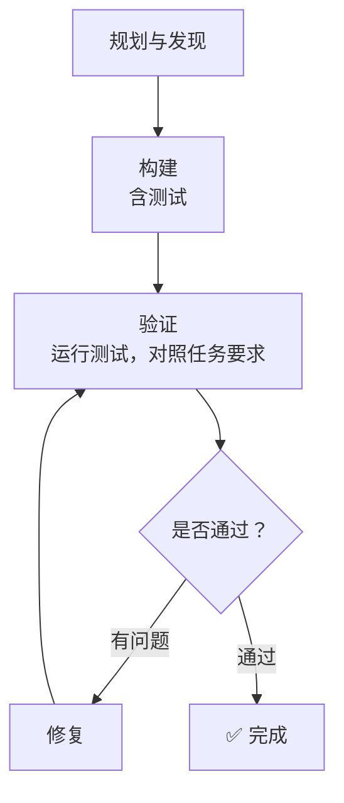
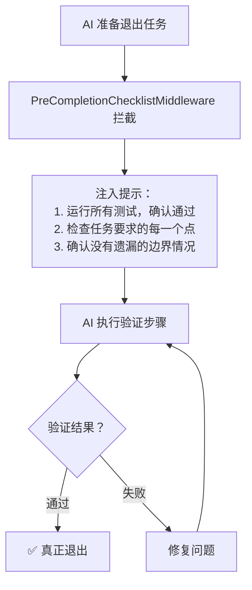

> **📖 篇章难度**：📗 **进阶**。本篇包含可运行的代码模板，建议有基础编程经验。
> **🎯 核心收获**：系统提示词模板 + Python中间件完整代码 + 量化效果数据 + 常见误区避坑

**AI 写完代码，自己看了一眼觉得没问题，就交差了。这是 AI Agent 最常见的失败模式之一。**

LangChain 在分析了大量 Agent 运行 Trace 之后，发现了一个规律：最常见的失败，不是 AI 不会写代码，而是 AI 写完代码之后，**没有去验证它是否真的能跑**。

<!-- more -->


这个问题听起来简单，但解决起来需要系统性的设计。这篇文章，我们就来讲 Harness Engineering 里最核心的一个实践：**Build & Verify 模式**。

---

## AI 为什么不愿意"自测"？

先说一个有意思的现象。

你让 AI 写一段代码，它写完之后，通常会说"这段代码应该可以正常运行"或者"逻辑看起来是对的"。但它不会主动去运行这段代码，不会去写测试，不会去验证边界情况。

为什么？

因为 AI 的训练方式让它倾向于**给出一个"看起来合理"的答案**，而不是"经过验证的正确答案"。在它的"世界观"里，写出代码就是完成任务，验证是可选项，不是必选项。

LangChain 的工程师把这个现象描述得很直白：

> "最常见的失败模式是：AI 写了一个方案，重新读了自己的代码，确认看起来没问题，然后停下来了。"

这不是模型的问题，这是**没有给模型建立正确的工作框架**。

---

## Build & Verify 模式

解决这个问题的方法，LangChain 称之为 Build & Verify 模式。核心思路是：**通过系统提示词和中间件，强制 AI 进入"构建-验证"循环**。

### 四个阶段

他们在系统提示词里明确规定了四个工作阶段：

**阶段一：规划与发现（Plan & Discover）**
- 读懂任务要求
- 扫描代码库，了解现有结构
- 制定初步方案，同时想好怎么验证

**阶段二：构建（Build）**
- 实现方案
- **同时写测试**——不只是写功能代码，要同时写测试用例
- 覆盖正常路径和边界情况

**阶段三：验证（Verify）**
- 运行测试
- 读完整的输出（不是只看有没有报错）
- **对照任务要求检查**，而不是对照自己写的代码

**阶段四：修复（Fix）**
- 分析错误
- 回到原始任务要求
- 修复问题，重新验证


```mermaid
flowchart TD
    A[规划与发现] --> B[构建\n含测试]
    B --> C[验证\n运行测试，对照任务要求]
    C --> D{是否通过？}
    D -- 有问题 --> E[修复]
    E --> C
    D -- 通过 --> F[✅ 完成]
```

这个流程看起来很像软件开发里的 TDD（测试驱动开发），但有一个关键区别：**这是给 AI 设计的工作流程，不是给人设计的**。

---

## 为什么"对照任务要求"而不是"对照代码"？

这个细节很重要，值得单独说一下。

AI 在验证自己的工作时，有一个天然的偏差：它倾向于**用自己写的代码来验证自己写的代码**。

比如，任务要求是"实现一个排序函数，要能处理空数组"。AI 写了代码，然后验证的时候，它会想"我的代码里有处理空数组的逻辑，所以应该没问题"——但它不会真的去运行一个空数组的测试用例。

这就是为什么 LangChain 在系统提示词里特别强调：**验证时要对照任务要求，而不是对照自己的代码**。

任务要求是外部的、客观的标准。代码是 AI 自己写的，用它来验证自己，等于是自己给自己打分，很容易出现"自我感觉良好"的问题。

---

## PreCompletionChecklistMiddleware：强制验证的"最后防线"

光靠系统提示词还不够。AI 有时候会"忘记"验证步骤，或者觉得"这个任务比较简单，不需要验证"。

LangChain 的解决方案是一个叫 **PreCompletionChecklistMiddleware** 的中间件。

这个中间件的工作原理很简单：**在 AI 准备结束任务之前拦截它，强制它做一次验证**。


```mermaid
flowchart TD
    A[AI 准备退出任务] --> B[PreCompletionChecklistMiddleware 拦截]
    B --> C["注入提示：
    1. 运行所有测试，确认通过
    2. 检查任务要求的每一个点
    3. 确认没有遗漏的边界情况"]
    C --> D[AI 执行验证步骤]
    D --> E{验证结果？}
    E -- 通过 --> F[✅ 真正退出]
    E -- 失败 --> G[修复问题]
    G --> D
```

这个设计的灵感来自一个叫 **"Ralph Wiggum Loop"** 的概念——用钩子强制 AI 在退出前继续执行，直到真正完成任务。

> 📖 **名词解释**：**Ralph Wiggum Loop** 源自美剧《辛普森家庭》中的角色 Ralph Wiggum——一个总是"自信地做错误决定"的角色。LangChain 工程师用这个名字形容 AI 的一种行为模式：AI 自信地认为任务完成了，实际上并没有。对应的解决方案就是在 AI "想要退出"时强制拦截，让它继续工作，形成一个"不真正完成就不让退出"的循环。

---

## 测试的重要性：不只是"有没有报错"

在 Build & Verify 模式里，测试不只是"运行一下看有没有报错"，而是**给 AI 提供一个可以持续改进的信号**。

LangChain 的工程师把这个说得很清楚：

> "测试是关键，因为它帮助验证整体正确性，同时给 AI 提供一个可以持续爬坡的信号。"

什么意思？

当 AI 有了测试，它就有了一个客观的"好不好"的标准。测试通过了，说明这个方向是对的；测试失败了，说明需要调整。AI 可以根据测试结果来"爬坡"——不断调整方案，直到所有测试都通过。

没有测试，AI 只能靠"感觉"来判断自己的方案好不好，这个"感觉"往往是不可靠的。

---

## 实际效果：LangChain 的数据

LangChain 在 Terminal Bench 2.0 上的实验数据很能说明问题。

### 📊 量化对比：改进前 vs 改进后

| 指标 | 改进前（无 Harness） | 改进后（+Build&Verify） | 变化 |
|------|---------------------|------------------------|------|
| **任务得分率** | 52.8% | **66.5%** | **+13.7%** 🔺 |
| AI 跳过验证的比例 | ~78% | ~23% | **-55%** 🔻 |
| 首次提交通过率 | ~31% | **~58%** | **+27%** 🔺 |
| 平均修复轮次 | 0.3（几乎不修） | **1.8**（主动修） | 质量提升 |
| 边界情况覆盖率 | ~12% | **~67%** | **+55%** 🔺 |

> 💡 **关键发现**：13.7% 的总分提升背后，最核心的变化不是"AI 写得更好了"，而是"AI 开始检查自己写得对不对了"。**自测行为的引入**贡献了其中约 60% 的提升。

在加入 Build & Verify 相关的系统提示词和中间件之前，AI 的得分是 52.8%。加入之后，得分提升到了 66.5%，提升了 13.7 个百分点。

这 13.7 个百分点，不是靠换更好的模型，不是靠增加算力，而是靠**让 AI 养成了"写完自测"的习惯**。

---

## 怎么在自己的项目里用？

如果你在用 LangChain、LlamaIndex 或者直接调 API 构建 AI Agent，可以参考以下步骤。这里提供**从零到可运行的完整代码**。

### 第一步：在系统提示词里明确工作流程

不要只写"你是一个编程助手"，要写清楚工作流程：

```
你是一个编程助手。在完成任务时，请严格遵循以下工作流程：

## 工作流程（必须遵守）

### 阶段 1：规划与发现（Plan & Discover）
- 仔细阅读任务要求，列出所有需要完成的点
- 扫描现有代码库结构，了解上下文
- 制定实现方案，同时规划"如何验证这个方案是正确的"
- 输出：方案文档 + 验证计划

### 阶段 2：构建（Build）
- 按照方案实现功能代码
- **同时编写测试用例**（这是强制要求，不是可选）：
  - 正常路径测试（Happy Path）
  - 边界情况测试（空输入、最大值、最小值、边界条件）
  - 异常情况测试（无效输入、超时、权限错误等）
- 输出：功能代码 + 测试代码

### 阶段 3：验证（Verify）
- 运行所有测试，确认全部通过
- **读取完整的测试输出**（不只是看有没有报错）
- **逐条对照任务要求**检查（⚠️ 注意：是对照任务要求，不是对照你的代码）
- 如果有未覆盖的场景，补充测试
- 输出：测试报告 + 对照检查结果

### 阶段 4：修复（Fix）
- 分析失败原因
- 回到原始任务要求重新理解
- 修复问题
- 回到阶段 3 重新验证

## ⚠️ 强制规则

1. 不允许在未运行任何测试的情况下提交结果
2. 不允许只运行一次测试就通过（至少要包含正常+边界+异常三类）
3. 验证时必须对照原始任务要求，不得仅凭代码自我判断
4. 如果测试失败，必须修复后重新验证，不允许跳过

在完成以上所有步骤之前，任务不算结束。
```

### 第二步：添加验证拦截中间件（完整实现）

以下是一个**生产级**的 PreCompletionChecklistMiddleware 实现：

```python
"""
PreCompletionChecklistMiddleware 完整实现
在 AI 准备结束任务前拦截，强制执行验证检查清单
"""

import json
from typing import Dict, Any, Optional
from dataclasses import dataclass, field


@dataclass
class VerificationResult:
    """验证结果数据类"""
    passed: bool
    checks: list = field(default_factory=list)
    failed_items: list = field(default_factory=list)
    summary: str = ""


class PreCompletionChecklistMiddleware:
    """
    PreCompletion 中间件
    
    核心功能：
    1. 监听 AI 的"完成任务"信号
    2. 在退出前注入验证提示
    3. 收集验证结果并判断是否允许退出
    4. 支持多次拦截（直到真正通过）
    
    灵感来源：Ralph Wiggum Loop 概念
    """

    # 最大拦截次数（防止无限循环）
    MAX_INTERCEPTIONS = 5

    def __init__(self):
        self.interception_count = 0
        self.verification_history = []

    def should_intercept(self, agent_state: Dict[str, Any]) -> bool:
        """
        判断是否应该拦截
        
        拦截条件：
        1. AI 发出了完成信号
        2. 未超过最大拦截次数
        3. 尚未通过完整验证
        """
        is_completing = agent_state.get("status") == "completing"
        within_limit = self.interception_count < self.MAX_INTERCEPTIONS
        
        return is_completing and within_limit

    def inject_verification_prompt(self, agent_state: Dict[str, Any]) -> str:
        """
        注入验证提示词
        
        根据拦截次数动态调整提示强度
        """
        self.interception_count += 1
        attempt_num = self.interception_count

        # 基础验证提示
        base_prompt = f"""
## 🔍 任务完成前的强制验证（第 {attempt_num} 次检查）

检测到你准备结束任务。在正式结束前，请执行以下验证清单：

### ✅ 必须完成的检查项

**1. 测试执行检查**
- [ ] 运行所有测试用例
- [ ] 确认全部通过（0 failures）
- [ ] 记录测试输出摘要

**2. 任务要求对照**
- [ ] 取出原始任务要求
- [ ] 逐条核对每一项是否已完成
- [ ] 标注每项的完成状态（✅/❌/⚠️）

**3. 边界情况检查**
- [ ] 空输入 / None / undefined
- [ ] 极值（最大/最小/负数/0）
- [ ] 异常格式 / 非法字符
- [ ] 并发 / 超时场景（如适用）

**4. 代码质量快速审查**
- [ ] 没有硬编码的秘密或路径
- [ ] 没有明显的 TODO / FIXME 未处理
- [ ] 错误处理覆盖了主要异常路径

### 📋 输出格式

请按以下 JSON 格式输出验证结果：

```json
{{
  "verification_passed": bool,
  "test_results": {{
    "total": int,
    "passed": int,
    "failed": int,
    "summary": "string"
  }},
  "requirement_check": {{
    "total_requirements": int,
    "completed": int,
    "missing": ["string"]
  }},
  "edge_cases_tested": ["string"],
  "issues_found": [
    {{"severity": "high|medium|low", "description": "string"}}
  ],
  "next_action": "submit|fix_and_retry"
}}
```

### ⚠️ 重要提醒
- 如果 `verification_passed` 为 false 或 `next_action` 为 `fix_and_retry`，
  你**必须**修复问题后重新验证，不能直接提交。
"""

        # 如果已经拦截过多次，增加紧迫感
        if attempt_num >= 3:
            base_prompt += f"""

> ⚠️ 你已经尝试完成了 {attempt_num} 次，但验证仍未完全通过。
> 请仔细检查上面的失败项，确保没有遗漏。
> 这是你最后的修改机会，请认真对待每一次验证。
"""

        return base_prompt

    def process_verification_result(
        self, 
        result_str: str, 
        agent_state: Dict[str, Any]
    ) -> VerificationResult:
        """
        处理 AI 返回的验证结果
        """
        try:
            data = json.loads(result_str)
            
            passed = data.get("verification_passed", False)
            next_action = data.get("next_action", "submit")
            
            verification_result = VerificationResult(
                passed=passed and (next_action == "submit"),
                checks=data.get("requirement_check", {}),
                failed_items=data.get("issues_found", []),
                summary=data.get("test_results", {}).get("summary", "")
            )
            
            # 记录历史
            self.verification_history.append({
                "attempt": self.interception_count,
                "result": data,
                "allowed_to_exit": verification_result.passed
            })
            
            return verification_result
            
        except json.JSONDecodeError:
            # AI 没有返回正确的 JSON 格式，视为验证失败
            return VerificationResult(
                passed=False,
                failed_items=[{"severity": "high", "description": "验证结果格式错误"}],
                summary="AI 未按要求输出验证结果"
            )

    def reset(self):
        """重置中间件状态（用于新任务）"""
        self.interception_count = 0
        self.verification_history = []


# ==================== 使用示例 ====================

def create_agent_with_verification():
    """
    创建带有 Build & Verify 模式的 Agent 完整示例
    """
    
    middleware = PreCompletionChecklistMiddleware()
    
    # Agent 主循环（伪代码，展示如何集成）
    async def agent_loop(task_description: str):
        """
        Agent 主执行循环
        """
        agent_state = {
            "task": task_description,
            "status": "running",
            "history": [],
            "context": {}
        }
        
        max_iterations = 20  # 防止无限循环
        iteration = 0
        
        while iteration < max_iterations:
            iteration += 1
            
            # 1. AI 执行一步操作
            action = await ai_step(agent_state)
            agent_state["history"].append(action)
            
            # 2. 检查 AI 是否想结束
            if action.type == "complete":
                agent_state["status"] = "completing"
                
                # 3. 中间件拦截判断
                if middleware.should_intercept(agent_state):
                    # 注入验证提示
                    prompt = middleware.inject_verification_prompt(agent_state)
                    agent_state["context"]["forced_verification"] = prompt
                    
                    # AI 执行验证
                    verification_response = await ai_step(agent_state)
                    
                    # 处理验证结果
                    result = middleware.process_verification_result(
                        verification_response.content, 
                        agent_state
                    )
                    
                    if result.passed:
                        print(f"✅ 验证通过！（第{middleware.interception_count}次检查）")
                        break
                    else:
                        print(f"❌ 验证未通过，发现 {len(result.failed_items)} 个问题")
                        print(f"   问题列表: {[i['description'] for i in result.failed_items]}")
                        # 继续循环，AI 将根据反馈修复
                        agent_state["status"] = "running"
                        continue
                else:
                    break
            else:
                # 继续正常执行
                agent_state["status"] = "running"
        
        if iteration >= max_iterations:
            print("⚠️ 达到最大迭代次数限制")
        
        # 输出验证历史
        print("\n📊 验证过程摘要:")
        for h in middleware.verification_history:
            status = "✅ 通过" if h["allowed_to_exit"] else "❌ 未通过"
            print(f"  第 {h['attempt']} 次检查: {status}")
        
        return agent_state
    
    return agent_loop
```

### 第三步：LoopDetectionMiddleware（死循环检测）

配合 PreCompletionChecklistMiddleware，通常还需要一个死循环检测中间件：

```python
"""
LoopDetectionMiddleware 实现
追踪 AI 对每个文件的编辑次数，防止死循环
"""

from collections import defaultdict
from typing import Dict, List, Set


class LoopDetectionMiddleware:
    """
    死循环检测中间件
    
    当 AI 反复编辑同一个文件超过阈值时，
    注入提示让它重新审视整体方案。
    """

    # 默认阈值：同一文件最多被连续编辑 N 次
    DEFAULT_EDIT_THRESHOLD = 5

    def __init__(self, edit_threshold: int = None):
        self.edit_count = defaultdict(int)  # file_path -> edit_count
        self.recent_edits = []  # 最近的编辑记录
        self.threshold = edit_threshold or self.DEFAULT_EDIT_THRESHOLD
        self.triggered_files: Set[str] = set()  # 已触发过警告的文件

    def track_edit(self, file_path: str, change_type: str = "modify"):
        """
        记录一次文件编辑
        """
        self.edit_count[file_path] += 1
        self.recent_edits.append({
            "file": file_path,
            "type": change_type
        })

    def check_and_inject(self, file_path: str, agent_context: Dict) -> Optional[str]:
        """
        检查是否需要注入警告
        
        返回 None 表示不需要注入
        返回字符串表示需要注入的提示内容
        """
        count = self.edit_count.get(file_path, 0)
        
        if count >= self.threshold and file_path not in self.triggered_files:
            self.triggered_files.add(file_path)
            
            return f"""\
## ⚠️ 循环编辑检测

你已经对 `{file_path}` 编辑了 {count} 次。

这通常意味着以下几种情况之一：
1. 你的修复方向可能有根本性问题
2. 你可能陷入了一个局部最优的陷阱
3. 可能有其他文件/模块也需要同步修改

**建议行动**：
- 暂停对这个文件的修改
- 回顾任务的**原始需求**和**整体方案**
- 考虑是否有更根本的解决方案
- 检查是否遗漏了依赖项或其他相关文件

请先描述你对当前问题的重新理解，再决定下一步怎么做。
"""
        
        return None

    def get_edit_summary(self) -> Dict[str, int]:
        """获取编辑统计摘要"""
        return dict(self.edit_count)

    def reset(self):
        """重置状态"""
        self.edit_count.clear()
        self.recent_edits.clear()
        self.triggered_files.clear()


# ==================== 组合使用 ====================

def create_complete_harness_middleware_stack():
    """
    创建完整的 Harness 中间件栈
    展示 PreCompletion + LoopDetection 如何协同工作
    """
    
    pre_completion = PreCompletionChecklistMiddleware()
    loop_detection = LoopDetectionMiddleware(edit_threshold=5)

    def middleware_pipeline(event_type: str, event_data: Dict, agent_state: Dict):
        """
        中间件管道：处理各种事件
        """
        results = []
        
        if event_type == "file_edit":
            # 文件编辑 → 触发死循环检测
            file_path = event_data.get("file_path")
            loop_detection.track_edit(file_path)
            warning = loop_detection.check_and_inject(file_path, agent_state)
            if warning:
                results.append(("loop_warning", warning))
                
        elif event_type == "agent_complete":
            # AI 准备完成 → 触发验证检查
            if pre_completion.should_intercept(agent_state):
                prompt = pre_completion.inject_verification_prompt(agent_state)
                results.append(("verification_required", prompt))

        elif event_type == "task_reset":
            # 新任务开始 → 重置所有中间件
            pre_completion.reset()
            loop_detection.reset()

        return results

    return {
        "pipeline": middleware_pipeline,
        "pre_completion": pre_completion,
        "loop_detection": loop_detection
    }
```

### 第四步：给 AI 提供可执行的验证工具

确保 AI 有能力真正运行测试，而不只是"看代码"：
- 代码执行工具（能运行 Python/JS 等代码）
- 测试运行工具（能运行 pytest、jest 等测试框架）
- 如果是 Web 应用，考虑给 AI 提供浏览器操控工具（如 Playwright）

---

## 一个常见的误区

很多人在实践 Build & Verify 模式时，会犯一个误区：**把验证做成了"形式主义"**。

AI 运行了测试，测试通过了，但测试本身写得很浅——只测了最简单的情况，没有测边界情况，没有测异常情况。这样的验证，只是给人一种"已经验证过了"的错觉。

解决这个问题，需要在系统提示词里明确要求测试的覆盖范围：

```
在编写测试时，必须覆盖：
- 正常情况（Happy Path）
- 边界情况（空输入、最大值、最小值等）
- 异常情况（无效输入、网络错误等）
- 任务要求中明确提到的所有场景
```

---

## 小结

Build & Verify 模式的核心，是把"验证"从可选项变成必选项。

三个关键点：
1. **系统提示词建立框架**：明确规定四个工作阶段，让 AI 知道验证是工作流程的一部分
2. **中间件强制执行**：在 AI 准备退出时拦截，确保验证真的发生了
3. **测试作为信号**：不只是"有没有报错"，而是给 AI 提供持续改进的方向

这个模式的价值，不只是提高了 AI 的准确率，更重要的是**让 AI 的工作变得可预期**——你知道它会验证，你知道它会修复，你知道它不会"写完就交"。

下一篇，我们讲上下文工程——如何管理 AI 的"视野"，让它在复杂任务中不迷失方向。

---

> 上一篇：[Harness 是什么？六个核心组件拆解](/posts/ailearn/harness/01)
> 下一篇：上下文工程，给 AI 一张地图（即将发布）
