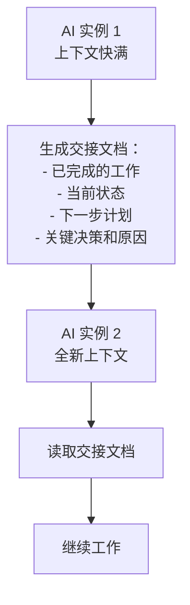
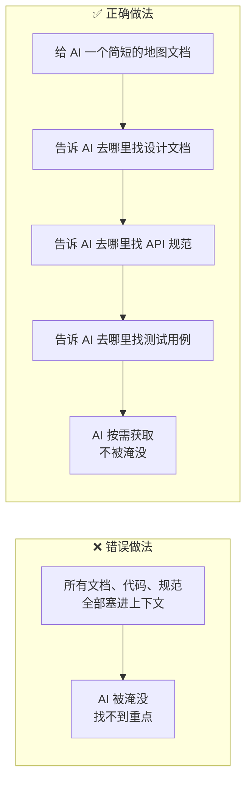

**AI 看不到的东西，对它来说就不存在。**

这句话听起来像废话，但它背后藏着一个很多人忽视的问题：你以为 AI 知道的事情，它其实不知道。

<!-- more -->


OpenAI 的工程师在构建百万行代码项目时，总结了一个核心教训：

> "从 AI 的角度来看，它在运行时无法在上下文中访问的任何内容都是不存在的。存储在 Google Docs、聊天记录或人们头脑中的知识，对系统来说都无法访问。"

这不只是一个技术问题，这是一个**信息架构问题**。

---

## 上下文是什么？

在 AI Agent 的语境里，上下文（Context）是 AI 在执行任务时能"看到"的所有信息。

这包括：
- 当前的对话历史
- 系统提示词
- 工具调用的结果
- 注入的文档、代码、数据
- 任务要求

上下文有一个硬性限制：**上下文窗口（Context Window）**。每个模型都有一个最大上下文长度，超过这个长度，早期的信息就会被截断或压缩。

这个限制带来了两个核心问题：
1. **信息不足**：AI 需要的信息没有放进上下文，它就不知道
2. **信息过载**：上下文里塞了太多信息，AI 找不到关键内容，或者出现"上下文焦虑"

上下文工程（Context Engineering）就是解决这两个问题的方法论。

---

## 问题一：信息不足

### AI 不知道它不知道什么

这是上下文管理里最难处理的问题。

当 AI 缺少某个关键信息时，它不会说"我不知道这个"，它会**基于已有信息做出推断**，然后给出一个"看起来合理"的答案。这个答案可能是错的，但 AI 不知道它是错的。

举个例子：你让 AI 修改一个 API 接口，但没有告诉它这个接口有一个特殊的鉴权逻辑。AI 会修改接口，但可能会破坏鉴权——因为它不知道这个鉴权逻辑的存在。

### OpenAI 的解决方案：把代码仓库变成"记录系统"

OpenAI 的工程师的做法是：**把所有重要信息都放进代码仓库，用结构化的方式组织**。

他们的仓库结构大概是这样的：

```
AGENTS.md          ← 简短的"地图"，指向其他文档
ARCHITECTURE.md    ← 架构概览
docs/
├── design-docs/   ← 设计文档
├── exec-plans/    ← 执行计划（含进度和决策日志）
├── product-specs/ ← 产品规格
├── references/    ← 外部参考资料
├── DESIGN.md
├── FRONTEND.md
└── QUALITY_SCORE.md
```

关键点是：**AGENTS.md 不是百科全书，而是目录**。

他们尝试过把所有信息都塞进一个大的 AGENTS.md，结果失败了：
- 上下文是稀缺资源，一个巨大的指令文件会挤掉任务和代码
- 过多的指导反而无效——当一切都"重要"时，一切都不重要
- 文件会腐烂——随着时间推移，规则过时了，但 AI 无法判断哪些还有效

所以他们改成了"渐进式披露"：AGENTS.md 只有约 100 行，主要作用是告诉 AI "去哪里找更详细的信息"。

### LangChain 的解决方案：LocalContextMiddleware

LangChain 的做法更直接：在 AI 开始任务时，**自动注入环境信息**。

他们用了一个叫 `LocalContextMiddleware` 的中间件，在 AI 启动时运行，自动：
- 扫描当前目录和父/子目录结构
- 找到可用的工具（Python 安装路径、可执行文件等）
- 把这些信息注入到 AI 的上下文里

这样 AI 一开始就知道自己在什么环境里工作，不需要自己去"探索"——而探索本身是容易出错的。

---

## 问题二：信息过载与"上下文焦虑"

### 上下文焦虑是什么？

Anthropic 的工程师发现了一个有趣的现象：当上下文窗口快满的时候，AI 会开始**草草收尾**。

它不会说"我的上下文快满了，我需要停下来"，而是会开始加速完成任务，跳过一些步骤，给出不完整的结果。就好像一个人在截止日期前几分钟，开始慌乱地把东西塞进包里，不管有没有装完。

这就是"上下文焦虑"（Context Anxiety）。

### 解决方案一：上下文重置

Anthropic 的解决方案是**上下文重置**：在合适的时机，清空上下文，用一个结构化的"交接文档"让新的 AI 实例接手工作。



这和"压缩"（Compaction）不同。压缩是把早期对话总结后继续，同一个 AI 实例继续工作。重置是完全清空，新实例接手。

Anthropic 发现，对于 Claude Sonnet 4.5，压缩不够——上下文焦虑依然存在。重置才能真正解决问题。

### 解决方案二：给 AI 一张地图，而不是一本书

这是上下文管理里最重要的设计原则之一。

很多人在设计 Harness 时，会把所有可能用到的信息都塞进上下文，希望 AI 能"全知全能"。但这样做的结果往往是：AI 被信息淹没，找不到关键内容，或者在不重要的信息上浪费注意力。

更好的做法是：**给 AI 一张地图，告诉它去哪里找信息，而不是把所有信息都直接给它**。



---

## 时间预算：一个容易忽视的上下文

除了信息内容，还有一种"上下文"经常被忽视：**时间**。

LangChain 在实验中发现，AI 对时间没有概念。如果任务有时间限制，AI 不知道自己已经用了多少时间，也不知道还剩多少时间。

他们的解决方案是**注入时间预算警告**：在 AI 运行到一定时间后，自动注入提示"你已经用了 X 分钟，还剩 Y 分钟，请考虑优先完成核心功能"。

这个设计听起来简单，但效果明显——AI 开始有意识地管理自己的时间，在时间快到时主动转向验证和收尾，而不是继续开发新功能。

---

## 上下文工程的三个原则

总结一下，上下文工程有三个核心原则：

### 原则一：可见即存在，不可见即不存在

AI 只能基于它能看到的信息工作。所有重要信息都要放进它能访问的地方——代码仓库、文档、工具返回值。

存在 Slack 里的讨论、存在 Google Docs 里的设计、存在工程师脑子里的隐性知识——对 AI 来说，这些都不存在。

### 原则二：地图优于百科全书

不要试图把所有信息都塞进上下文。给 AI 一个简短的"地图"，告诉它去哪里找信息，让它按需获取。

这样既节省了上下文空间，又让 AI 能找到真正需要的信息。

### 原则三：监控上下文健康状态

上下文不是静态的，它会随着任务进行而变化。需要监控：
- 上下文使用量（避免接近上限）
- 关键信息是否还在上下文里（避免被截断）
- AI 是否出现上下文焦虑的迹象（草草收尾、跳过步骤）

---

## 实践建议

如果你在构建 AI Agent，以下是一些可以直接用的建议：

**1. 建立结构化的知识库**
把 AI 需要的信息放进代码仓库，用清晰的目录结构组织。不要依赖外部文档或口头传递。

**2. 写一个简短的"地图"文档**
类似 OpenAI 的 AGENTS.md，100 行以内，主要作用是告诉 AI 去哪里找更详细的信息。

**3. 在任务开始时注入环境信息**
用中间件自动注入目录结构、可用工具、关键约束等信息，让 AI 一开始就了解自己的工作环境。

**4. 设置上下文监控**
监控上下文使用量，在接近上限时触发重置或压缩。

**5. 注入时间预算**
如果任务有时间限制，定期注入时间提醒，让 AI 有意识地管理时间。

---

## 小结

上下文工程的核心，是解决"AI 看不到的东西不存在"这个根本问题。

三个关键点：
1. **把信息放进 AI 能看到的地方**——代码仓库、文档、工具
2. **给地图，不给百科全书**——让 AI 按需获取，不被淹没
3. **监控上下文健康状态**——避免信息过载和上下文焦虑

下一篇，我们讲多智能体协作架构——当一个 AI 不够用，怎么让多个 AI 协同工作。

---

> 上一篇：[让 AI 学会"自我验证"——Build & Verify 模式](/posts/ailearn/harness/02)
> 下一篇：多智能体协作架构（即将发布）
