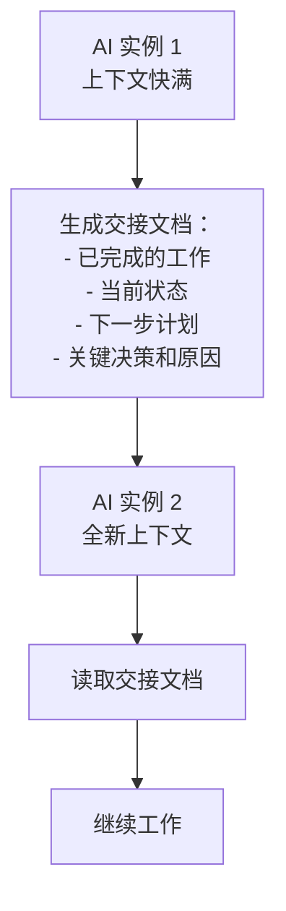
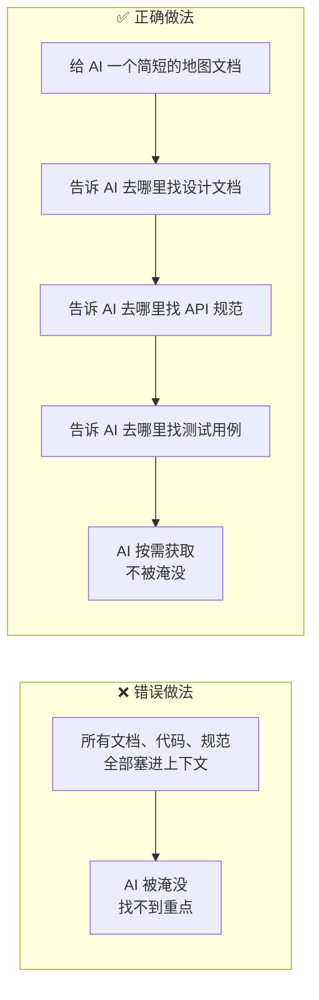

> **📖 篇章难度**：📗 **进阶**。涉及信息架构设计思维和代码实现。
> **🎯 核心收获**：AGENTS.md 可用模板 + LocalContextMiddleware 完整实现 + 交接文档模板 + 三大原则速查

**AI 看不到的东西，对它来说就不存在。**

这句话听起来像废话，但它背后藏着一个很多人忽视的问题：你以为 AI 知道的事情，它其实不知道。

<!-- more -->


OpenAI 的工程师在构建百万行代码项目时，总结了一个核心教训：

> "从 AI 的角度来看，它在运行时无法在上下文中访问的任何内容都是不存在的。存储在 Google Docs、聊天记录或人们头脑中的知识，对系统来说都无法访问。"

这不只是一个技术问题，这是一个**信息架构问题**。

---

## 上下文是什么？

在 AI Agent 的语境里，上下文（Context）是 AI 在执行任务时能"看到"的所有信息。

这包括：
- 当前的对话历史
- 系统提示词
- 工具调用的结果
- 注入的文档、代码、数据
- 任务要求

上下文有一个硬性限制：**上下文窗口（Context Window）**。每个模型都有一个最大上下文长度，超过这个长度，早期的信息就会被截断或压缩。

这个限制带来了两个核心问题：
1. **信息不足**：AI 需要的信息没有放进上下文，它就不知道
2. **信息过载**：上下文里塞了太多信息，AI 找不到关键内容，或者出现"上下文焦虑"

上下文工程（Context Engineering）就是解决这两个问题的方法论。

---

## 问题一：信息不足

### AI 不知道它不知道什么

这是上下文管理里最难处理的问题。

当 AI 缺少某个关键信息时，它不会说"我不知道这个"，它会**基于已有信息做出推断**，然后给出一个"看起来合理"的答案。这个答案可能是错的，但 AI 不知道它是错的。

举个例子：你让 AI 修改一个 API 接口，但没有告诉它这个接口有一个特殊的鉴权逻辑。AI 会修改接口，但可能会破坏鉴权——因为它不知道这个鉴权逻辑的存在。

### OpenAI 的解决方案：把代码仓库变成"记录系统"

OpenAI 的工程师的做法是：**把所有重要信息都放进代码仓库，用结构化的方式组织**。

他们的仓库结构大概是这样的：

```
AGENTS.md          ← 简短的"地图"，指向其他文档
ARCHITECTURE.md    ← 架构概览
docs/
├── design-docs/   ← 设计文档
├── exec-plans/    ← 执行计划（含进度和决策日志）
├── product-specs/ ← 产品规格
├── references/    ← 外部参考资料
├── DESIGN.md
├── FRONTEND.md
└── QUALITY_SCORE.md
```

关键点是：**AGENTS.md 不是百科全书，而是目录**。

他们尝试过把所有信息都塞进一个大的 AGENTS.md，结果失败了：
- 上下文是稀缺资源，一个巨大的指令文件会挤掉任务和代码
- 过多的指导反而无效——当一切都"重要"时，一切都不重要
- 文件会腐烂——随着时间推移，规则过时了，但 AI 无法判断哪些还有效

所以他们改成了"渐进式披露"：AGENTS.md 只有约 100 行，主要作用是告诉 AI "去哪里找更详细的信息"。

### LangChain 的解决方案：LocalContextMiddleware（完整实现）

LangChain 的做法更直接：在 AI 开始任务时，**自动注入环境信息**。

他们用了一个叫 `LocalContextMiddleware` 的中间件，在 AI 启动时运行，自动：
- 扫描当前目录和父/子目录结构
- 找到可用的工具（Python 安装路径、可执行文件等）
- 把这些信息注入到 AI 的上下文里

这样 AI 一开始就知道自己在什么环境里工作，不需要自己去"探索"——而探索本身是容易出错的。

以下是 **LocalContextMiddleware 的完整实现**：

```python
"""
LocalContextMiddleware 完整实现
在 AI 开始任务时自动扫描并注入环境上下文信息
"""

import os
import subprocess
import json
from pathlib import Path
from typing import Dict, List, Optional, Any
from dataclasses import dataclass, field


@dataclass
class ContextInfo:
    """上下文信息数据类"""
    project_root: str
    directory_structure: str
    available_tools: List[Dict[str, str]]
    python_info: Dict[str, str]
    git_info: Dict[str, str]
    key_files: List[str]
    estimated_context_size: int = 0


class LocalContextMiddleware:
    """
    LocalContext 中间件
    
    在 AI 启动时自动收集和注入以下信息：
    1. 项目目录结构（2-3层深度）
    2. 可用工具/命令列表
    3. Python 环境信息
    4. Git 状态信息
    5. 关键配置文件索引
    
    设计原则：
    - 信息要精炼，控制在 ~2000 token 以内
    - 只提供"地图"，不提供"内容"
    - 让 AI 知道"去哪找"，而不是塞给它所有东西
    """

    # 扫描深度限制
    SCAN_DEPTH = 3

    # 忽略的目录
    IGNORE_DIRS = {
        'node_modules', '__pycache__', '.git', 'venv', '.venv',
        'dist', 'build', '.next', '.cache', 'coverage', '.tox'
    }

    # 关键文件模式（AI 可能需要了解的）
    KEY_FILE_PATTERNS = [
        '*.md',          # 文档
        '*.yaml', '*.yml',  # 配置
        '*.toml',        # Python 配置
        'Dockerfile*',
        '.env.example',
        'Makefile',
        '*.json',        # package.json 等
        'requirements*.txt',
        'pyproject.toml',
    ]

    def __init__(self, working_dir: str = None):
        self.working_dir = Path(working_dir or os.getcwd()).resolve()
        self._context_cache: Optional[ContextInfo] = None

    def collect(self) -> ContextInfo:
        """
        收集所有本地上下文信息
        """
        if self._context_cache:
            return self._context_cache

        context = ContextInfo(
            project_root=str(self.working_dir),
            directory_structure=self._scan_directory(),
            available_tools=self._detect_tools(),
            python_info=self._get_python_info(),
            git_info=self._get_git_info(),
            key_files=self._find_key_files()
        )

        # 估算 token 消耗
        context.estimated_context_size = self._estimate_tokens(context)

        self._context_cache = context
        return context

    def _scan_directory(self) -> str:
        """
        扫描目录结构，返回树形字符串表示
        只扫描到指定深度，忽略无关目录
        """
        lines = [f"📁 {self.working_dir.name}/"]

        def scan(path: Path, prefix: str = "", depth: int = 0):
            if depth >= self.SCAN_DEPTH:
                return

            try:
                entries = sorted(
                    [e for e in path.iterdir() if not e.name.startswith('.')],
                    key=lambda e: (not e.is_dir(), e.name.lower())
                )
            except PermissionError:
                return

            for i, entry in enumerate(entries):
                if entry.is_dir() and entry.name in self.IGNORE_DIRS:
                    continue

                is_last = (i == len(entries) - 1)
                connector = "└── " if is_last else "├── "
                extension = "│   " if not is_last else "    "

                if entry.is_dir():
                    lines.append(f"{prefix}{connector}📂 {entry.name}/")
                    scan(entry, prefix + extension, depth + 1)
                else:
                    # 显示文件大小（如果是代码文件）
                    size_str = ""
                    if entry.suffix in ('.py', '.js', '.ts', '.tsx', '.jsx'):
                        size_kb = entry.stat().st_size / 1024
                        size_str = f" ({size_kb:.0f}KB)"
                    lines.append(f"{prefix}{connector}📄 {entry.name}{size_str}")

        scan(self.working_dir)
        return '\n'.join(lines)

    def _detect_tools(self) -> List[Dict[str, str]]:
        """
        检测当前环境中可用的工具/命令
        """
        tools_to_check = [
            ('python', 'python3 --version'),
            ('node', 'node --version'),
            ('npm', 'npm --version'),
            ('pip', 'pip --version'),
            ('docker', 'docker --version'),
            ('git', 'git --version'),
            ('make', 'make --version'),
            ('pytest', 'pytest --version'),
            ('jest', 'jest --version'),
        ]

        available = []
        for name, cmd in tools_to_check:
            try:
                result = subprocess.run(
                    cmd.split(),
                    capture_output=True,
                    text=True,
                    timeout=5
                )
                if result.returncode == 0:
                    version = result.stdout.strip().split('\n')[0]
                    available.append({
                        "name": name,
                        "version": version,
                        "command": cmd.split()[0]
                    })
            except (FileNotFoundError, subprocess.TimeoutExpired):
                continue

        return available

    def _get_python_info(self) -> Dict[str, str]:
        """获取 Python 环境信息"""
        info = {}
        
        try:
            # Python 版本
            result = subprocess.run(
                ['python3', '--version'],
                capture_output=True, text=True, timeout=5
            )
            info['version'] = result.stdout.strip()

            # 已安装的关键包
            result = subprocess.run(
                ['pip3', 'list', '--format=json'],
                capture_output=True, text=True, timeout=10
            )
            if result.returncode == 0:
                packages = json.loads(result.stdout)
                # 只列出重要包（过滤掉内置包和版本号）
                important_pkgs = [
                    p['name'] for p in packages
                    if p['name'] in {
                        'langchain', 'openai', 'anthropic', 'llama-index',
                        'fastapi', 'flask', 'django', 'pytest', 'pandas',
                        'numpy', 'torch', 'transformers', 'requests'
                    }
                ]
                info['key_packages'] = important_pkgs

        except (FileNotFoundError, subprocess.TimeoutException, json.JSONDecodeError):
            info['error'] = '无法获取 Python 信息'

        return info

    def _get_git_info(self) -> Dict[str, str]:
        """获取 Git 仓库信息"""
        info = {}

        try:
            # 分支名
            result = subprocess.run(
                ['git', 'branch', '--show-current'],
                cwd=self.working_dir,
                capture_output=True, text=True, timeout=5
            )
            if result.returncode == 0:
                info['branch'] = result.stdout.strip()

            # 最近提交
            result = subprocess.run(
                ['git', 'log', '-1', '--pretty=%h %s (%an, %ar)'],
                cwd=self.working_dir,
                capture_output=True, text=True, timeout=5
            )
            if result.returncode == 0:
                info['last_commit'] = result.stdout.strip()

            # 是否有未提交更改
            result = subprocess.run(
                ['git', 'status', '--porcelain'],
                cwd=self.working_dir,
                capture_output=True, text=True, timeout=5
            )
            if result.returncode == 0:
                changes = result.stdout.strip().split('\n')
                changes = [c for c in changes if c]  # 过滤空行
                info['dirty_files'] = len(changes)

        except (FileNotFoundError, subprocess.TimeoutException):
            info['error'] = '不是 Git 仓库或 Git 不可用'

        return info

    def _find_key_files(self) -> List[str]:
        """查找关键文件"""
        key_files = []

        for pattern in self.KEY_FILE_PATTERNS:
            matches = list(self.working_dir.rglob(pattern))
            # 排除 node_modules 等目录
            matches = [
                m for m in matches 
                if not any(ignored in m.parts for ignored in self.IGNORE_DIRS)
            ]
            # 只取前几个避免过多
            for m in matches[:5]:
                rel_path = m.relative_to(self.working_dir)
                key_files.append(str(rel_path))

        return sorted(key_files)[:20]  # 最多返回20个

    def _estimate_tokens(self, ctx: ContextInfo) -> int:
        """估算上下文信息的 token 数量（粗略估算）"""
        total_text = (
            ctx.directory_structure +
            str(ctx.available_tools) +
            str(ctx.python_info) +
            str(ctx.git_info) +
            str(ctx.key_files)
        )
        # 粗略估算：约 4 字符 / token（中英文混合）
        return len(total_text) // 4

    def format_for_injection(self, ctx: ContextInfo = None) -> str:
        """
        将上下文信息格式化为可注入到系统提示词中的文本
        
        输出格式经过优化：
        - 结构化、易读
        - 控制在合理长度内
        - 提供指引而非堆砌信息
        """
        ctx = ctx or self.collect()

        sections = []

        # === 项目概览 ===
        sections.append("## 📍 工作环境")
        sections.append(f"- **项目根目录**: `{ctx.project_root}`")
        sections.append(f"- **Git 分支**: {ctx.git_info.get('branch', 'N/A')}")
        sections.append(f"- **最近提交**: {ctx.git_info.get('last_commit', 'N/A')}")
        if ctx.git_info.get('dirty_files', 0) > 0:
            sections.append(f"- ⚠️ 有 {ctx.git_info['dirty_files']} 个文件有未提交更改")

        # === 目录结构 ===
        sections.append("\n## 📂 目录结构（前3层）")
        sections.append("```")
        sections.append(ctx.directory_structure)
        sections.append("```")

        # === 可用工具 ===
        if ctx.available_tools:
            sections.append("\n## 🔧 可用工具/命令")
            for tool in ctx.available_tools:
                sections.append(f"- **{tool['name']}**: {tool['version']}")

        # === Python 环境 ===
        if ctx.python_info and 'error' not in ctx.python_info:
            sections.append("\n## 🐍 Python 环境")
            sections.append(f"- **版本**: {ctx.python_info.get('version', 'N/A')}")
            if ctx.python_info.get('key_packages'):
                pkgs = ', '.join(ctx.python_info['key_packages'])
                sections.append(f"- **关键依赖**: {pkgs}")

        # === 关键文件索引 ===
        if ctx.key_files:
            sections.append("\n## 📋 关键文件索引")
            sections.append("> 以下文件可能包含你需要的重要信息：")
            for f in ctx.key_files[:15]:
                sections.append(f"- `{f}`")

        # === 使用指南 ===
        sections.append("""

---
> 💡 **如何使用以上信息**：
> 1. 先看**目录结构**了解项目布局
> 2. 如果需要了解某个模块，先查看对应目录下的文件
> 3. 配置文件（*.yaml, *.toml）通常包含环境和构建信息
> 4. 如需了解更多细节，使用 `read_file` 或 `search` 工具读取具体文件
""")

        result = '\n'.join(sections)
        
        # 长度警告
        if ctx.estimated_context_size > 3000:
            result += f"\n\n⚠️ 上下文信息较大（~{ctx.estimated_context_size} tokens），如遇空间不足可省略目录结构部分。"

        return result

    def reset(self):
        """清除缓存"""
        self._context_cache = None


# ==================== 使用示例 ====================

def setup_local_context_middleware(agent_config: dict):
    """
    将 LocalContextMiddleware 集成到 Agent 配置中的示例
    """
    
    middleware = LocalContextMiddleware(
        working_dir=agent_config.get('working_dir')
    )

    # 方式1：作为启动钩子
    def on_agent_start(agent_state: dict):
        """Agent 启动时自动注入本地上下文"""
        context = middleware.collect()
        context_text = middleware.format_for_injection(context)
        
        agent_state['local_context'] = context_text
        agent_state['context_info'] = {
            'project_root': context.project_root,
            'available_tools': [t['name'] for t in context.available_tools],
            'key_files': context.key_files
        }
        
        print(f"[LocalContext] 已注入上下文 (~{context.estimated_context_size} tokens)")
        print(f"[LocalContext] 项目: {context.project_root}")
        print(f"[LocalContext] 可用工具: {[t['name'] for t in context.available_tools]}")

    return {
        'middleware': middleware,
        'hooks': {
            'on_start': on_agent_start
        }
    }
```

---

## 问题二：信息过载与"上下文焦虑"

### 上下文焦虑是什么？

Anthropic 的工程师发现了一个有趣的现象：当上下文窗口快满的时候，AI 会开始**草草收尾**。

它不会说"我的上下文快满了，我需要停下来"，而是会开始加速完成任务，跳过一些步骤，给出不完整的结果。就好像一个人在截止日期前几分钟，开始慌乱地把东西塞进包里，不管有没有装完。

这就是"上下文焦虑"（Context Anxiety）。

### 解决方案一：上下文重置

Anthropic 的解决方案是**上下文重置**：在合适的时机，清空上下文，用一个结构化的"交接文档"让新的 AI 实例接手工作。


```mermaid
flowchart TD
    A["AI 实例 1\n上下文快满"] --> B["生成交接文档：
    - 已完成的工作
    - 当前状态
    - 下一步计划
    - 关键决策和原因"]
    B --> C["AI 实例 2\n全新上下文"]
    C --> D[读取交接文档]
    D --> E[继续工作]
```

这和"压缩"（Compaction）不同。压缩是把早期对话总结后继续，同一个 AI 实例继续工作。重置是完全清空，新实例接手。

Anthropic 发现，对于 Claude Sonnet 4.5，压缩不够——上下文焦虑依然存在。重置才能真正解决问题。

### 解决方案二：给 AI 一张地图，而不是一本书

这是上下文管理里最重要的设计原则之一。

很多人在设计 Harness 时，会把所有可能用到的信息都塞进上下文，希望 AI 能"全知全能"。但这样做的结果往往是：AI 被信息淹没，找不到关键内容，或者在不重要的信息上浪费注意力。

更好的做法是：**给 AI 一张地图，告诉它去哪里找信息，而不是把所有信息都直接给它**。


```mermaid
flowchart LR
    subgraph bad["❌ 错误做法"]
        A[所有文档、代码、规范\n全部塞进上下文] --> B[AI 被淹没\n找不到重点]
    end
    subgraph good["✅ 正确做法"]
        C["给 AI 一个简短的地图文档"] --> D["告诉 AI 去哪里找设计文档"]
        D --> E["告诉 AI 去哪里找 API 规范"]
        E --> F["告诉 AI 去哪里找测试用例"]
        F --> G[AI 按需获取\n不被淹没]
    end
```

---

## 时间预算：一个容易忽视的上下文

除了信息内容，还有一种"上下文"经常被忽视：**时间**。

LangChain 在实验中发现，AI 对时间没有概念。如果任务有时间限制，AI 不知道自己已经用了多少时间，也不知道还剩多少时间。

他们的解决方案是**注入时间预算警告**：在 AI 运行到一定时间后，自动注入提示"你已经用了 X 分钟，还剩 Y 分钟，请考虑优先完成核心功能"。

这个设计听起来简单，但效果明显——AI 开始有意识地管理自己的时间，在时间快到时主动转向验证和收尾，而不是继续开发新功能。

---

## 上下文工程的三个原则

总结一下，上下文工程有三个核心原则：

### 原则一：可见即存在，不可见即不存在

AI 只能基于它能看到的信息工作。所有重要信息都要放进它能访问的地方——代码仓库、文档、工具返回值。

存在 Slack 里的讨论、存在 Google Docs 里的设计、存在工程师脑子里的隐性知识——对 AI 来说，这些都不存在。

### 原则二：地图优于百科全书

不要试图把所有信息都塞进上下文。给 AI 一个简短的"地图"，告诉它去哪里找信息，让它按需获取。

这样既节省了上下文空间，又让 AI 能找到真正需要的信息。

### 原则三：监控上下文健康状态

上下文不是静态的，它会随着任务进行而变化。需要监控：
- 上下文使用量（避免接近上限）
- 关键信息是否还在上下文里（避免被截断）
- AI 是否出现上下文焦虑的迹象（草草收尾、跳过步骤）

---

## 实践建议

如果你在构建 AI Agent，以下是一些可以直接用的建议：

**1. 建立结构化的知识库**
把 AI 需要的信息放进代码仓库，用清晰的目录结构组织。不要依赖外部文档或口头传递。

**2. 写一个简短的"地图"文档**
类似 OpenAI 的 AGENTS.md，100 行以内，主要作用是告诉 AI 去哪里找更详细的信息。

> 📋 **下面是一个开箱即用的 AGENTS.md 完整模板**：

```markdown
# AGENTS.md — 项目导航地图

> 本文件是 AI Agent 的"项目地图"，不是百科全书。
> 它的作用是告诉你去哪里找信息，而不是塞给你所有信息。
> 预计阅读时间：2 分钟。

---

## 📌 一句话概述

[你的项目名称] 是一个 [一句话描述项目做什么]。

技术栈：[主要语言/框架]，部署在 [环境]。

## 🎯 当前开发阶段

- **当前 Sprint**：[Sprint 名称/编号]（截止日期：YYYY-MM-DD）
- **进行中的工作**：[简要描述正在开发的功能]
- **下一步计划**：[接下来要做的事]

## 📂 关键位置速查

### 代码结构
```
src/
├── core/          ← 核心业务逻辑（最先看这里）
│   ├── models/    ← 数据模型定义
│   └── services/  ← 业务服务层
├── api/           ← API 路由和控制器
├── utils/         ← 工具函数
└── tests/         ← 测试代码
```

### 文档索引
| 你想了解... | 去这里 |
|------------|--------|
| 整体架构设计 | `docs/architecture/ARCHITECTURE.md` |
| API 接口规范 | `docs/api/API_SPEC.md` |
| 数据模型设计 | `docs/design/DATA_MODELS.md` |
| 当前的执行计划 | `docs/plans/CURRENT_SPRINT.md` |
| 编码规范 | `docs/standards/CODING_STANDARDS.md` |
| 部署指南 | `docs/ops/DEPLOYMENT.md` |
| 产品需求规格 | `docs/product/PRD.md` |

### 配置文件
| 文件 | 用途 |
|------|------|
| `.env.example` | 环境变量模板（复制为 .env 使用） |
| `pyproject.toml` | Python 项目配置和依赖 |
| `config/settings.py` | 运行时配置（分 dev/stage/prod） |

## ⚠️ 重要约束和规则

### 必须遵守
1. [规则一：例如 - 所有API必须有认证中间件]
2. [规则二：例如 - 数据库变更必须写迁移脚本]
3. [规则三：例如 - 测试覆盖率不得低于 80%]

### 绝对不能做的事
1. ❌ [禁止操作一：例如 - 不要直接修改生产数据库]
2. ❌ [禁止操作二：例如 - 不要在代码中硬编码密钥]
3. ❌ [禁止操作三：例如 - 不要跳过测试直接提交]

## 🔧 开发工具链

### 常用命令
```bash
# 安装依赖
pip install -e ".[dev]"

# 运行测试
pytest tests/ -v --cov=src

# 代码格式化
ruff format src/ tests/
ruff check src/ tests/

# 启动本地开发服务器
python -m src.api.main

# 数据库迁移
alembic upgrade head
```

### Git 工作流
- 主分支：`main`
- 功能分支：`feature/描述`
- 提交格式：`type(scope): description`
- 需要 PR review 才能合并到 main

## 💡 AI 特定提示

当你在这个项目中工作时：
1. **先读后改**：修改任何文件前，先读相关文档了解上下文
2. **小步提交**：每个逻辑单元完成后就提交，不要攒一大堆改动
3. **测试先行**：写代码前先想好怎么测
4. **遇到不确定的事**：查看 `docs/` 目录下的相关文档，或者询问

## 📊 项目质量指标

| 指标 | 当前值 | 目标值 |
|------|--------|--------|
| 测试覆盖率 | XX% | ≥80% |
| Lint 通过率 | XX% | 100% |
| 构建时间 | XXs | <60s |

---
*最后更新：YYYY-MM-DD by [更新人]*
*如果发现本文件有过时内容，请更新它。*
```

**3. 在任务开始时注入环境信息**
用中间件自动注入目录结构、可用工具、关键约束等信息，让 AI 一开始就了解自己的工作环境。（参见上文的 LocalContextMiddleware 完整实现）

**4. 设置上下文监控**
监控上下文使用量，在接近上限时触发重置或压缩。

**5. 注入时间预算**
如果任务有时间限制，定期注入时间提醒，让 AI 有意识地管理时间。

---

## 📋 附：上下文交接文档模板

当需要进行上下文重置时，使用以下交接文档模板让新 AI 实例接手：

```markdown
# 上下文交接文档

> 由 AI 实例 #N 生成于 YYYY-MM-DD HH:MM
> 供 AI 实例 #(N+1) 接续工作时参考

---

## ✅ 已完成的工作

### 功能实现
- [x] [已完成的功能1]（文件：path/to/file1.py）
- [x] [已完成的功能2]（文件：path/to/file2.py）
- [ ] [进行中的功能3]（完成度：70%）

### 已修复的问题
- Fixed: [问题描述] → 解决方案摘要

## 📍 当前状态

### 正在进行的工作
**任务**：[当前任务的描述]
**所在文件**：`path/to/current_file.py`
**进度**：[百分比]
**下一步具体动作**：[精确描述接下来该干什么]

### 当前代码状态摘要
```
[关键代码片段的当前状态 — 不需要全部代码，
只需要让新实例能理解当前进展的关键部分]
```

## 📝 关键决策记录

| 决策 | 为什么这么做 | 替代方案及排除原因 |
|------|-------------|-------------------|
| [决策1] | [原因] | [排除了XX因为...] |
| [决策2] | [原因] | [排除了XX因为...] |

## ⚠️ 注意事项 / 已知的坑

1. [注意事项1：例如 - auth middleware 的顺序很重要]
2. [注意事项2：例如 - 数据库表 X 和 Y 有外键关联]

## 🔗 相关文件索引

| 文件 | 用途 | 最后修改时间 |
|------|------|-------------|
| `path/to/file1.py` | [用途] | HH:MM |
| `path/to/file2.py` | [用途] | HH:MM |
| `docs/xxx.md` | [用途] | - |

## 📅 下一步计划（按优先级排序）

1. **P0 - 必须**：[最紧急的下一步]
2. **P1 - 应该**：[紧接着要做的]
3. **P2 - 可以**：[有余力时做的]
4. **后续**：[更长期的计划项]

---
*请接手的 AI 实例先通读此文档，确认理解后再继续工作。*
*如有疑问优先查阅上述相关文件。*
```

---

## 小结

上下文工程的核心，是解决"AI 看不到的东西不存在"这个根本问题。

三个关键点：
1. **把信息放进 AI 能看到的地方**——代码仓库、文档、工具
2. **给地图，不给百科全书**——让 AI 按需获取，不被淹没
3. **监控上下文健康状态**——避免信息过载和上下文焦虑

下一篇，我们讲多智能体协作架构——当一个 AI 不够用，怎么让多个 AI 协同工作。

---

> 上一篇：[让 AI 学会"自我验证"——Build & Verify 模式](/posts/ailearn/harness/02)
> 下一篇：多智能体协作架构（即将发布）
