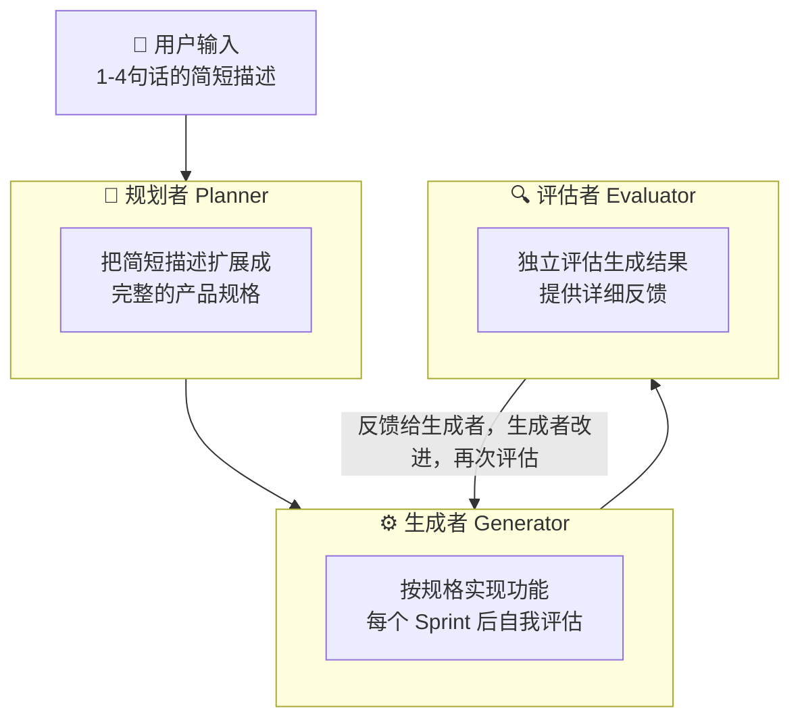

**一个 AI 做不好的事，三个 AI 分工合作，往往能做得很好。**

这不是玄学，这是 Anthropic 工程师在实践中验证过的结论。

<!-- more -->


Anthropic 的工程师 Prithvi Rajasekaran 在构建长时间运行的编程智能体时，遇到了一个根本性的问题：**让同一个 AI 既做事又评价自己做的事，效果很差**。

他的原话是：

> "当被要求评估自己产出的工作时，AI 倾向于自信地称赞这些工作——即使在人类观察者看来，质量明显很平庸。"

这个问题，用一个独立的评估者来解决，效果出奇地好。

---

## 为什么单个 AI 的自我评估不可靠？

先理解这个问题的本质。

AI 在生成内容时，会形成一种"内部一致性"——它的输出和它的"预期"是对齐的。当它评估自己的输出时，它用的是同一套"预期"，所以很容易得出"没问题"的结论。

这就像让一个作者校对自己的文章——他知道自己想表达什么，所以很容易"看到"他想看到的，而不是文章实际写的。

更麻烦的是，这个问题在主观性强的任务上（比如设计、写作）尤其严重，因为没有客观的对错标准，AI 更容易给自己打高分。

---

## 三智能体架构

Anthropic 的解决方案是一个三智能体架构：**规划者（Planner）+ 生成者（Generator）+ 评估者（Evaluator）**。


每个角色有明确的职责，相互独立，相互制衡。

---

## 规划者：把模糊变成清晰

规划者的作用，是把用户的简短描述扩展成一个完整的产品规格。

为什么需要这一步？

因为用户的输入往往是模糊的。"做一个 DAW（数字音频工作站）"——这句话里包含了多少功能？多少细节？多少边界情况？

如果直接把这句话给生成者，生成者会做出一个"最小可行版本"——功能有限，细节粗糙。

规划者的工作是：
- 把简短描述扩展成完整的功能列表
- 定义每个功能的具体要求
- 规划实现顺序（哪些功能先做，哪些后做）
- **主动寻找机会加入 AI 功能**（这是 Anthropic 特别强调的一点）

Anthropic 的工程师发现，规划者生成的规格，往往比用户原始描述丰富得多。一句"做一个 DAW"，规划者会扩展成一个包含 16 个功能、分 10 个 Sprint 的完整规格。

**关键设计原则**：规划者要关注"做什么"，而不是"怎么做"。如果规划者试图规定具体的技术实现细节，一旦规划出错，错误会级联到整个实现过程。

---

## 生成者：专注实现，不做评判

生成者的工作是按照规格实现功能。

在 Anthropic 的架构里，生成者采用"Sprint"模式工作：
- 每次只实现一个 Sprint 的功能
- 实现完成后，自我评估（但这个自我评估只是初步检查）
- 把结果交给评估者做独立评估
- 根据评估者的反馈改进

生成者和评估者之间有一个重要的机制：**Sprint 合约（Sprint Contract）**。

在每个 Sprint 开始之前，生成者和评估者会先协商：
- 这个 Sprint 要实现什么功能
- 什么叫"完成"（具体的验收标准）
- 评估者会测试哪些场景

这个合约的作用是：**在开始写代码之前，就对"完成"的定义达成共识**。这样评估者在评估时，有明确的标准可以对照，而不是凭感觉打分。

---

## 评估者：独立、挑剔、具体

评估者是这个架构里最关键的角色，也是最难设计的角色。

Anthropic 的工程师发现，开箱即用的 AI 是一个很差的 QA 工程师：

> "在早期运行中，我看到它识别出了合理的问题，然后说服自己这些问题其实不是大问题，然后批准了工作。它也倾向于表面测试，而不是探测边界情况，所以更微妙的 Bug 经常溜过去。"

让评估者真正有效，需要做几件事：

**1. 给评估者明确的评估标准**

不能只说"评估这个应用好不好"，要给出具体的评估维度：

```
评估维度（以前端设计为例）：
1. 设计质量：整体是否有一致的视觉语言？
2. 原创性：是否有定制化的设计决策，还是模板堆砌？
3. 工艺：排版、间距、颜色对比是否专业？
4. 功能性：用户能否理解界面，完成核心任务？
```

**2. 给评估者真实的交互能力**

Anthropic 给评估者配备了 Playwright MCP——让评估者能直接操控浏览器，像真实用户一样点击、截图、验证 UI 行为。

这个工具的加入，让评估从"看代码觉得对"变成了"真的跑起来点了一遍"。

**3. 告诉评估者要挑剔**

这是一个反直觉的设计：你需要明确告诉评估者"要挑剔"，否则它会倾向于给出正面评价。

Anthropic 的工程师用了少样本示例（Few-shot Examples）来校准评估者的判断——给它看一些"这样的问题应该被标记为失败"的例子，让它的评估标准和人类的预期对齐。

---

## 实际效果：一个 DAW 的故事

Anthropic 用这个架构构建了一个完整的 DAW（数字音频工作站），用时约 4 小时，花费 124 美元。

评估者在第一轮反馈里发现了这些问题：

> "这是一个功能强大的应用，有出色的设计保真度、扎实的 AI 智能体和良好的后端。主要失败点是功能完整性——虽然应用看起来令人印象深刻，AI 集成也运行良好，但几个核心 DAW 功能只是展示性的，没有交互深度：片段无法在时间轴上拖动/移动，没有乐器 UI 面板（合成器旋钮、鼓垫），也没有可视化效果编辑器（EQ 曲线、压缩器仪表）。这些不是边缘情况——它们是使 DAW 可用的核心交互。"

这种具体的、可操作的反馈，让生成者能够精准地修复问题，而不是在模糊的"改进一下"里打转。

对比之下，没有评估者的单智能体版本，核心功能（游戏实际上无法运行）根本没有被发现。

---

## 这个架构的适用范围

三智能体架构不是万能的。Anthropic 的工程师也指出：

> "评估者不是一个固定的是/否决策。当任务超出当前模型单独能可靠完成的范围时，它才值得付出成本。"

随着模型能力提升，有些任务不再需要评估者——生成者自己就能做好。但对于复杂任务、主观性强的任务、或者对质量要求很高的任务，独立评估者依然有很大价值。

---

## 怎么在自己的项目里用？

如果你想在自己的项目里实现类似的架构，以下是关键步骤：

**第一步：定义每个角色的职责边界**
- 规划者：只做规划，不做实现
- 生成者：只做实现，不做最终评估
- 评估者：只做评估，不做实现

**第二步：设计评估标准**
把"好不好"转化成具体的、可量化的标准。每个标准都要有明确的通过/失败条件。

**第三步：给评估者真实的验证能力**
不要让评估者只看代码，要让它能真正运行和测试。

**第四步：校准评估者**
用少样本示例告诉评估者什么叫"挑剔"，避免它给出过于宽松的评价。

**第五步：设计角色间的通信机制**
Anthropic 用文件来传递信息：一个角色写文件，另一个角色读文件。这种方式简单可靠，避免了复杂的消息传递机制。

---

## 小结

三智能体架构的核心价值，是**用分工来解决单个 AI 的局限性**。

- 规划者解决"做什么"的问题
- 生成者解决"怎么做"的问题
- 评估者解决"做得好不好"的问题

每个角色专注自己的职责，相互制衡，整体效果远超单个 AI 单打独斗。

下一篇，我们讲 Harness 的持续迭代——如何用 Trace 分析找到 AI 的失败模式，系统性地改进 Harness。

---

> 上一篇：[上下文工程：给 AI 一张地图](/posts/ailearn/harness/03)
> 下一篇：用 Trace 分析驱动 Harness 持续迭代（即将发布）
