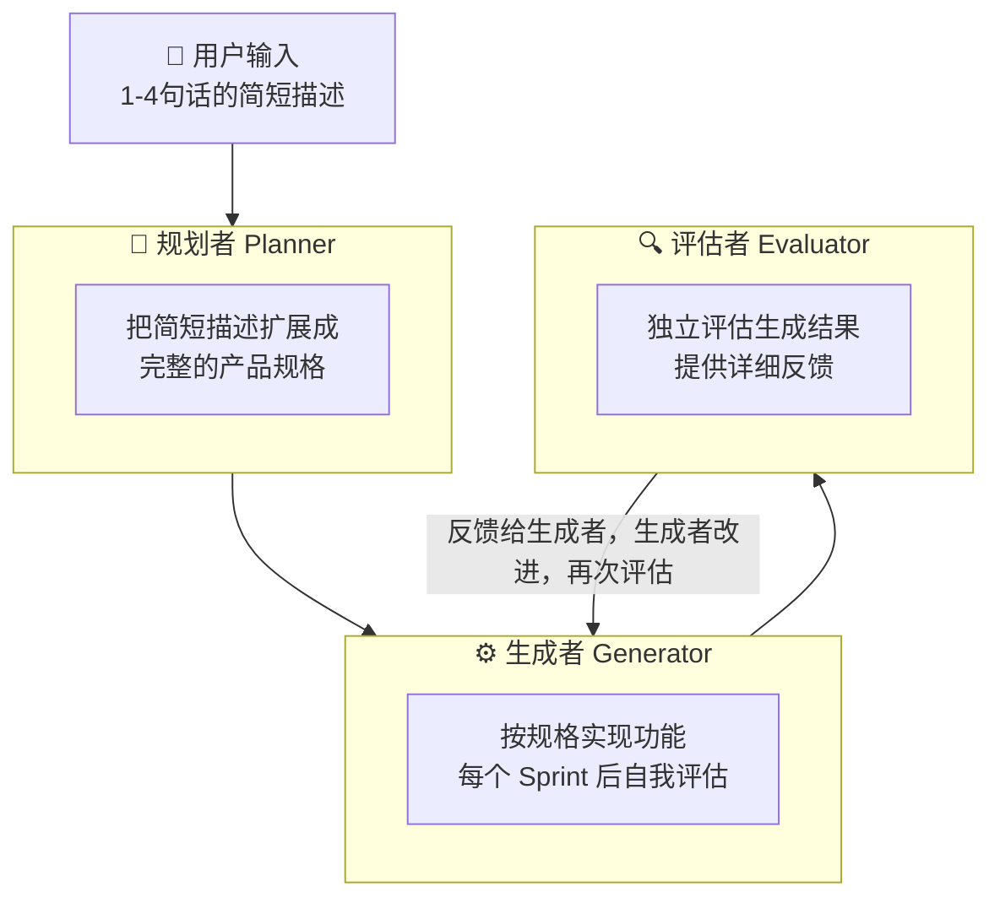

> **📖 篇章难度**：📙 **高级**。涉及架构设计决策和多 Agent 编排，建议有分布式系统或复杂项目经验。
> **🎯 核心收获**：成本决策框架 + Sprint 合约模板 + 角色通信协议 + 适用场景判断标准

**一个 AI 做不好的事，三个 AI 分工合作，往往能做得很好。**

这不是玄学，这是 Anthropic 工程师在实践中验证过的结论。

<!-- more -->


Anthropic 的工程师 Prithvi Rajasekaran 在构建长时间运行的编程智能体时，遇到了一个根本性的问题：**让同一个 AI 既做事又评价自己做的事，效果很差**。

他的原话是：

> "当被要求评估自己产出的工作时，AI 倾向于自信地称赞这些工作——即使在人类观察者看来，质量明显很平庸。"

这个问题，用一个独立的评估者来解决，效果出奇地好。

---

## 为什么单个 AI 的自我评估不可靠？

先理解这个问题的本质。

AI 在生成内容时，会形成一种"内部一致性"——它的输出和它的"预期"是对齐的。当它评估自己的输出时，它用的是同一套"预期"，所以很容易得出"没问题"的结论。

这就像让一个作者校对自己的文章——他知道自己想表达什么，所以很容易"看到"他想看到的，而不是文章实际写的。

更麻烦的是，这个问题在主观性强的任务上（比如设计、写作）尤其严重，因为没有客观的对错标准，AI 更容易给自己打高分。

---

## 三智能体架构

Anthropic 的解决方案是一个三智能体架构：**规划者（Planner）+ 生成者（Generator）+ 评估者（Evaluator）**。


```mermaid
flowchart TD
    U["👤 用户输入\n1-4句话的简短描述"] --> P
    subgraph P["📝 规划者 Planner"]
        P1["把简短描述扩展成\n完整的产品规格"]
    end
    P --> G
    subgraph G["⚙️ 生成者 Generator"]
        G1["按规格实现功能\n每个 Sprint 后自我评估"]
    end
    G --> E
    subgraph E["🔍 评估者 Evaluator"]
        E1["独立评估生成结果\n提供详细反馈"]
    end
    E --> |反馈给生成者，生成者改进，再次评估| G
```
每个角色有明确的职责，相互独立，相互制衡。

---

## 规划者：把模糊变成清晰

规划者的作用，是把用户的简短描述扩展成一个完整的产品规格。

为什么需要这一步？

因为用户的输入往往是模糊的。"做一个 DAW（数字音频工作站）"——这句话里包含了多少功能？多少细节？多少边界情况？

如果直接把这句话给生成者，生成者会做出一个"最小可行版本"——功能有限，细节粗糙。

规划者的工作是：
- 把简短描述扩展成完整的功能列表
- 定义每个功能的具体要求
- 规划实现顺序（哪些功能先做，哪些后做）
- **主动寻找机会加入 AI 功能**（这是 Anthropic 特别强调的一点）

Anthropic 的工程师发现，规划者生成的规格，往往比用户原始描述丰富得多。一句"做一个 DAW"，规划者会扩展成一个包含 16 个功能、分 10 个 Sprint 的完整规格。

**关键设计原则**：规划者要关注"做什么"，而不是"怎么做"。如果规划者试图规定具体的技术实现细节，一旦规划出错，错误会级联到整个实现过程。

---

## 生成者：专注实现，不做评判

生成者的工作是按照规格实现功能。

在 Anthropic 的架构里，生成者采用"Sprint"模式工作：
- 每次只实现一个 Sprint 的功能
- 实现完成后，自我评估（但这个自我评估只是初步检查）
- 把结果交给评估者做独立评估
- 根据评估者的反馈改进

生成者和评估者之间有一个重要的机制：**Sprint 合约（Sprint Contract）**。

在每个 Sprint 开始之前，生成者和评估者会先协商：
- 这个 Sprint 要实现什么功能
- 什么叫"完成"（具体的验收标准）
- 评估者会测试哪些场景

这个合约的作用是：**在开始写代码之前，就对"完成"的定义达成共识**。这样评估者在评估时，有明确的标准可以对照，而不是凭感觉打分。

---

## 评估者：独立、挑剔、具体

评估者是这个架构里最关键的角色，也是最难设计的角色。

Anthropic 的工程师发现，开箱即用的 AI 是一个很差的 QA 工程师：

> "在早期运行中，我看到它识别出了合理的问题，然后说服自己这些问题其实不是大问题，然后批准了工作。它也倾向于表面测试，而不是探测边界情况，所以更微妙的 Bug 经常溜过去。"

让评估者真正有效，需要做几件事：

**1. 给评估者明确的评估标准**

不能只说"评估这个应用好不好"，要给出具体的评估维度：

```
评估维度（以前端设计为例）：
1. 设计质量：整体是否有一致的视觉语言？
2. 原创性：是否有定制化的设计决策，还是模板堆砌？
3. 工艺：排版、间距、颜色对比是否专业？
4. 功能性：用户能否理解界面，完成核心任务？
```

**2. 给评估者真实的交互能力**

Anthropic 给评估者配备了 Playwright MCP——让评估者能直接操控浏览器，像真实用户一样点击、截图、验证 UI 行为。

这个工具的加入，让评估从"看代码觉得对"变成了"真的跑起来点了一遍"。

**3. 告诉评估者要挑剔**

这是一个反直觉的设计：你需要明确告诉评估者"要挑剔"，否则它会倾向于给出正面评价。

Anthropic 的工程师用了少样本示例（Few-shot Examples）来校准评估者的判断——给它看一些"这样的问题应该被标记为失败"的例子，让它的评估标准和人类的预期对齐。

---

## 实际效果：一个 DAW 的故事

Anthropic 用这个架构构建了一个完整的 DAW（数字音频工作站），用时约 4 小时，花费 124 美元。

整个过程中，三个角色各司其职，缺一不可。

---

### 规划者做了什么？

用户的原始输入只有一句话：**"做一个 DAW（数字音频工作站）"**。

规划者拿到这句话后，没有直接开始写代码，而是做了一件关键的事：**把这句话扩展成一份完整的产品规格**。

具体来说，规划者：

1. **拆解功能列表**：把"DAW"这个模糊概念拆成了 16 个具体功能——时间轴、音轨管理、音频片段编辑、混音器、效果器、MIDI 支持、AI 辅助作曲……每个功能都有明确的描述。

2. **规划实现顺序**：把 16 个功能分成 10 个 Sprint，按照依赖关系排序——先做时间轴基础（Sprint 1），再做音轨管理（Sprint 2），最后做 AI 功能（Sprint 8-10）。

3. **主动加入 AI 功能**：这是规划者最有价值的地方。用户没有说"加 AI 功能"，但规划者主动在规格里加入了 AI 辅助作曲、智能节拍检测、自动混音建议——这正是 Anthropic 特别强调的"规划者要寻找机会加入 AI 功能"。

4. **只定义"做什么"，不规定"怎么做"**：规划者的规格里写的是"支持音频片段在时间轴上拖拽移动"，而不是"用 React DnD 库实现拖拽"。技术选型留给生成者决定，避免规划错误级联到实现。

> 规划者的输出：一份包含 16 个功能、10 个 Sprint、每个 Sprint 有明确验收标准的产品规格文档。

---

### 生成者做了什么？

生成者拿到规格后，按 Sprint 逐步实现。以 **Sprint 1（时间轴基础功能）** 为例：

**第一步：签 Sprint 合约**

在开始写代码之前，生成者先和评估者协商了一份合约：
- 这个 Sprint 要实现什么：时间轴渲染、片段放置、片段选中、片段拖拽
- 什么叫"完成"：片段可以被点击选中并高亮；片段可以水平拖拽并更新位置；时间轴显示时间刻度
- 评估者会测哪些场景：空时间轴渲染、添加单个片段、拖拽到边界外……

**第二步：实现功能**

生成者按照合约实现了 `Timeline.tsx`、`TimelineClip.tsx`、`useTimelineState.ts` 等文件，并写了对应的单元测试。

**第三步：自我评估（初步检查）**

实现完成后，生成者做了一次初步检查——运行测试、检查语法、确认基本功能可用。但这个自我评估只是"初步过滤"，不是最终验收。

**第四步：根据评估者反馈迭代**

评估者发现了问题（见下文），生成者根据具体反馈精准修复，而不是重写整个模块。整个 Sprint 1 经过了 2 轮迭代才通过评估。

> 生成者的工作方式：小步快跑，每个 Sprint 聚焦一个功能，合约先行，反馈驱动迭代。

---

### 评估者做了什么？

评估者是整个架构里最关键的角色。它不只是"看代码觉得没问题"，而是**真正像用户一样操作了这个应用**。

Anthropic 给评估者配备了 **Playwright MCP**，让它能直接控制浏览器。评估者的工作流程是：

1. **打开浏览器，访问应用**
2. **按照 Sprint 合约里的测试场景逐一操作**：点击片段、拖拽片段、切换音轨……
3. **截图记录每个操作的结果**
4. **对照验收标准，判断通过还是失败**

在第一轮评估里，评估者发现了这些问题：

> "这是一个功能强大的应用，有出色的设计保真度、扎实的 AI 智能体和良好的后端。主要失败点是功能完整性——虽然应用看起来令人印象深刻，AI 集成也运行良好，但几个核心 DAW 功能只是展示性的，没有交互深度：**片段无法在时间轴上拖动/移动，没有乐器 UI 面板（合成器旋钮、鼓垫），也没有可视化效果编辑器（EQ 曲线、压缩器仪表）。这些不是边缘情况——它们是使 DAW 可用的核心交互。**"

注意这段反馈的质量：
- **不是模糊的"体验不好"**，而是具体指出了哪三个功能有问题
- **不是"代码有 bug"**，而是"交互是展示性的，没有实际深度"
- **给出了判断依据**："这些不是边缘情况，而是核心交互"

这种具体的、可操作的反馈，让生成者能够精准地修复问题，而不是在模糊的"改进一下"里打转。

---

### 三者协作的完整流程

```
用户："做一个 DAW"
        ↓
规划者：扩展成 16 个功能 + 10 个 Sprint 的完整规格
        ↓
Sprint 1 开始
        ↓
生成者 + 评估者：签 Sprint 合约（对齐验收标准）
        ↓
生成者：实现时间轴基础功能
        ↓
评估者：用 Playwright 实际操作，发现"片段无法拖拽"
        ↓
生成者：精准修复拖拽逻辑
        ↓
评估者：重新验证，通过 ✅
        ↓
Sprint 2 开始……（重复上述循环）
        ↓
10 个 Sprint 全部完成
        ↓
完整 DAW，用时 4 小时，花费 124 美元
```

没有评估者的单智能体版本，核心功能（游戏实际上无法运行）根本没有被发现——因为 AI 自己评估自己，天然倾向于给出"没问题"的结论。

## 适用范围

三智能体架构不是万能的。Anthropic 的工程师也指出：

> "评估者不是一个固定的是/否决策。当任务超出当前模型单独能可靠完成的范围时，它才值得付出成本。"

### 📊 成本分析决策框架

引入多智能体意味着**API 调用成本成倍增加**。你需要一个清晰的决策框架来判断**什么时候值得用、什么时候不值得用**。

#### 单 Agent vs 多 Agent 成本对比

| 维度 | 单 Agent | 三智能体 (Planner+Generator+Evaluator) |
|------|----------|---------------------------------------|
| **API 调用次数** | 1x | **3~8x**（含多轮反馈迭代） |
| **Token 消耗** | 基准 | **4~10x** |
| **执行时间** | 基准 | **2~5x** |
| **质量（复杂任务）** | 中等 | **高** |
| **质量（简单任务）** | 够用 | 略好（但性价比低） |

#### 💰 具体数字参考（以 GPT-5.2-Codex 为例）

| 任务类型 | 单Agent成本 | 多Agent成本 | 质量差异 | 值不值？ |
|----------|------------|------------|---------|---------|
| 写一个函数 | ~$0.05 | ~$0.40 | 几乎无差异 | ❌ 不值 |
| 完成一个 API 接口 | ~$0.20 | ~$1.50 | +15% 质量 | ⚠️ 看需求 |
| 构建完整功能模块 | ~$2.00 | ~$12.00 | **+40% 质量** | ✅ 值得 |
| 从0到1构建应用 | ~$30.00 | ~$124.00 | **+80% 可用性** | ✅✅ 非常值得 |
| 长期维护/重构 | ~$5.00 | ~$25.00 | **少60%回归Bug** | ✅ 值得 |

> **经验法则**：如果任务的**预期产出价值 > 10倍的多 Agent 额外成本**，就值得用。

#### 🎯 适用场景判断标准

```
                    ┌─────────────────────────┐
                    │   任务是否满足以下条件？    │
                    └──────────┬──────────────┘
                               │
              ┌────────────────┼────────────────┐
              ▼                ▼                ▼
        ⚠️ 可能不需要       ✅ 强烈推荐        ❌ 不需要
     单 Agent 就够         用多智能体
              │                │                │
    • 任务 < 30分钟      • 任务 > 2小时      • 任务 < 10分钟
    • 输出可自动验证      • 主观性强           • 有明确对错标准
    • 试错成本低          • 试错成本高         • 简单CRUD操作
    • 不需要创意/设计      • 需要"品味"判断    • 一次性脚本
                         • 质量要求高
                         • 多人协作场景
```

#### 🔄 简化变体：何时只用两个角色？

如果你不想上全套三智能体，可以考虑以下简化方案：

| 变体 | 配置 | 适用场景 | 成本系数 |
|------|------|----------|----------|
| **P+G**（规划+生成） | Planner → Generator | 规划很重要但验证可以自动化 | 2x |
| **G+E**（生成+评估） | Generator ↔ Evaluator | 用户已给清晰需求，主要缺质量把关 | 2.5x |
| **P→G→E**（完整） | 全部三个 | 复杂从0到1构建 | 4~8x |
| **G only**（单Agent） | 只有一个 | 简单明确任务 | 1x |


---

## 项目实战

如果你想在自己的项目里实现类似的架构，以下是关键步骤：

**第一步：定义每个角色的职责边界**
- 规划者：只做规划，不做实现
- 生成者：只做实现，不做最终评估
- 评估者：只做评估，不做实现

**第二步：设计评估标准**
把"好不好"转化成具体的、可量化的标准。每个标准都要有明确的通过/失败条件。

**第三步：给评估者真实的验证能力**
不要让评估者只看代码，要让它能真正运行和测试。

**第四步：校准评估者**
用少样本示例告诉评估者什么叫"挑剔"，避免它给出过于宽松的评价。

**第五步：设计角色间的通信机制**

Anthropic 用文件来传递信息：一个角色写文件，另一个角色读文件。这种方式简单可靠，避免了复杂的消息传递机制。

> 📋 **以下是完整的通信协议和 Sprint 合约模板**：

### 角色间通信协议

```python
"""
多智能体通信协议完整实现

通信方式：基于文件的异步消息传递
数据格式：结构化 JSON 文件
"""

import json
import os
import time
from pathlib import Path
from dataclasses import dataclass, asdict
from typing import Optional, List, Dict, Any
from enum import Enum


# ==================== 数据模型 ====================

class AgentRole(Enum):
    PLANNER = "planner"
    GENERATOR = "generator"
    EVALUATOR = "evaluator"


class MessagePriority(Enum):
    NORMAL = "normal"
    URGENT = "urgent"
    INFO = "info"


@dataclass
class AgentMessage:
    """Agent 间通信的消息格式"""
    msg_id: str                    # 唯一消息ID
    from_role: AgentRole           # 发送方角色
    to_role: AgentRole             # 接收方角色
    message_type: str              # 消息类型
    content: Dict[str, Any]        # 消息内容（结构化）
    priority: MessagePriority      # 优先级
    timestamp: float               # 时间戳
    references: List[str] = None   # 引用的文件路径列表
    metadata: Dict = None          # 额外元数据


@dataclass
class SprintContract:
    """Sprint 合约——在开始工作前达成共识"""
    sprint_id: int                          # Sprint 编号
    feature_name: str                       # 功能名称
    description: str                        # 功能描述
    acceptance_criteria: List[Dict]          # 验收标准列表
    test_scenarios: List[Dict]              # 测试场景列表
    files_to_modify: List[str]              # 预计修改的文件
    dependencies: List[str]                 # 依赖项
    constraints: List[str]                  # 约束条件
    estimated_complexity: str               # 复杂度估算 (low/medium/high)
    
    # 签署信息
    planned_by: str = ""                    # 规划者签名
    agreed_by_generator: str = ""           # 生成者同意签名
    agreed_by_evaluator: str = ""           # 评估者同意签名
    
    # 执行结果（完成后填写）
    status: str = "pending"                 # pending/in_review/approved/rejected
    result_summary: str = ""                # 结果摘要
    evaluation_report: Dict = None          # 评估报告
    iteration_count: int = 0                # 迭代次数


@dataclass 
class EvaluationReport:
    """评估报告格式"""
    evaluator_id: str
    sprint_id: int
    overall_verdict: str                    # approved / needs_work / rejected
    
    scores: Dict[str, int]                  # 各维度评分 (1-5)
    issues: List[Dict]                      # 发现的问题列表
    suggestions: List[str]                  # 改进建议
    tested_scenarios: List[Dict]            # 已测试的场景及结果
    confidence: float                       # 评估置信度 (0.0-1.0)


# ==================== 通信层 ====================

class AgentMessageBus:
    """
    基于文件系统的 Agent 消息总线
    
    设计原则：
    - 每个角色有自己的输入/输出目录
    - 消息以 JSON 文件形式传递
    - 支持异步读写（一个写完另一个再读）
    - 所有消息持久化，支持回溯调试
    """

    def __init__(self, workspace_root: str):
        self.workspace = Path(workspace_root)
        
        # 创建目录结构
        self.dirs = {
            'inbox': self.workspace / '_agent_comm' / 'inbox',
            'outbox': self.workspace / '_agent_comm' / 'outbox',
            'shared': self.workspace / '_agent_comm' / 'shared',
            'contracts': self.workspace / '_agent_comm' / 'contracts',
            'reports': self.workspace / '_agent_comm' / 'reports',
        }
        
        for d in self.dirs.values():
            d.mkdir(parents=True, exist_ok=True)

    def send(self, message: AgentMessage) -> str:
        """发送消息到目标角色的 inbox"""
        # 构造目标路径
        target_inbox = self.dirs['inbox'] / message.to_role.value
        
        # 写入文件
        filename = f"{message.msg_id}.json"
        filepath = target_inbox / filename
        
        with open(filepath, 'w', encoding='utf-8') as f:
            json.dump(asdict(message), f, ensure_ascii=False, indent=2)
        
        return str(filepath)

    def receive(self, role: AgentRole, message_type: str = None) -> List[AgentMessage]:
        """接收发给某个角色的所有未读消息"""
        inbox = self.dirs['inbox'] / role.value
        messages = []
        
        if not inbox.exists():
            return messages
        
        for filepath in sorted(inbox.glob('*.json')):
            with open(filepath, 'r', encoding='utf-8') as f:
                data = json.load(f)
            
            # 可选过滤
            if message_type and data.get('message_type') != message_type:
                continue
            
            msg = AgentMessage(**data)
            messages.append(msg)
            
            # 标记为已读（移到已读目录）
            read_dir = inbox / '_read'
            read_dir.mkdir(exist_ok=True)
            filepath.rename(read_dir / filepath.name)
        
        return messages

    def save_contract(self, contract: SprintContract) -> str:
        """保存 Sprint 合约"""
        filepath = self.dirs['contracts'] / f"sprint_{contract.sprint_id:03d}_contract.json"
        with open(filepath, 'w', encoding='utf-8') as f:
            json.dump(asdict(contract), f, ensure_ascii=False, indent=2)
        return str(filepath)

    def save_evaluation(self, report: EvaluationReport) -> str:
        """保存评估报告"""
        filepath = (
            self.dirs['reports'] / 
            f"eval_sprint_{report.sprint_id:03d}_{report.evaluator_id}.json"
        )
        with open(filepath, 'w', encoding='utf-8') as f:
            json.dump(asdict(report), f, ensure_ascii=False, indent=2)
        return str(filepath)


# ==================== Sprint 合约模板 ====================

def create_sprint_contract_template(
    sprint_id: int,
    feature_name: str,
    description: str,
    planner_output: Dict,
) -> SprintContract:
    """
    根据规划者的输出创建 Sprint 合约模板
    
    这是 Planner 和 Generator/Evaluator 之间
    达成共识的核心文档
    """
    
    contract = SprintContract(
        sprint_id=sprint_id,
        feature_name=feature_name,
        description=description,
        
        # === 从规划输出中提取 ===
        acceptance_criteria=planner_output.get('acceptance_criteria', []),
        test_scenarios=planner_output.get('test_scenarios', []),
        files_to_modify=planner_output.get('target_files', []),
        dependencies=planner_output.get('dependencies', []),
        constraints=planner_output.get('constraints', [
            "代码必须通过现有 lint 规则",
            "新代码需要有对应的测试",
            "不能破坏现有功能",
            "遵循项目的编码规范",
        ]),
        estimated_complexity=planner_output.get('complexity', 'medium'),
    )
    
    return contract


# 示例：DAW 项目的 Sprint 合约
EXAMPLE_CONTRACT = {
    "sprint_id": 1,
    "feature_name": "时间轴基础功能",
    "description": "实现 DAW 的核心时间轴组件，支持音频片段的放置、选择、拖拽",
    "acceptance_criteria": [
        {
            "id": "AC-1",
            "criteria": "用户可以在时间轴上看到音频片段的可视化表示",
            "verification": "视觉确认 + Playwright 截图对比",
            "priority": "must"
        },
        {
            "id": "AC-2", 
            "criteria": "片段可以被鼠标选中并高亮显示",
            "verification": "Playwright 自动化测试：点击片段 → 验证高亮状态",
            "priority": "must"
        },
        {
            "id": "AC-3",
            "criteria": "片段可以在时间轴上水平拖拽移动位置",
            "verification": "Playwright：拖拽片段 → 验证新位置的像素坐标",
            "priority": "must"
        },
        {
            "id": "AC-4",
            "criteria": "时间轴显示时间刻度标尺（小节/拍）",
            "verification": "视觉确认刻度文本正确渲染",
            "priority": "should"
        },
    ],
    "test_scenarios": [
        {"name": "空时间轴渲染", "type": "visual", "steps": ["打开页面", "确认时间轴区域存在"]},
        {"name": "添加单个片段", "type": "interaction", "steps": ["调用API添加片段", "验证UI更新"]},
        {"name": "选中并高亮", "type": "interaction", "steps": ["点击片段", "验证高亮样式"]},
        {"name": "拖拽移动", "type": "interaction", "steps": ["拖拽片段", "验证坐标变化"]},
        {"name": "边界情况：超出时间轴范围", "type": "edge_case", "steps": ["拖拽到边界外", "验证行为"]},
        {"name": "性能：50个片段同时显示", "type": "performance", "steps": ["添加50个片段", "测量帧率>30fps"]},
    ],
    "files_to_modify": [
        "src/components/Timeline/Timeline.tsx",
        "src/components/Timeline/TimelineClip.tsx",
        "src/hooks/useTimelineState.ts",
        "__tests__/Timeline.test.tsx",
    ],
    "estimated_complexity": "high"
}


# ==================== 评估者校准 Few-shot 示例 ====================

EVALUATOR_CALIBRATION_EXAMPLES = """
## 评估者校准：Few-shot 示例

以下是一些"你应该标记为失败"的例子。
仔细阅读它们，理解什么样的质量问题是不可接受的。

---

### 示例 1：表面可用但缺少深度交互 ❌ 应该标记为失败

**场景**：一个音乐播放器应用
**表面表现**：
- UI 看起来很专业，有播放按钮、进度条、音量控制
- 颜色搭配和谐，排版整齐
- 点击播放按钮后确实发出声音

**隐藏问题**：
- 进度条不能拖拽（只是装饰性的）
- 音量滑块不响应操作
- 播放列表只能显示，无法切换歌曲
- 切换页面后播放状态丢失

**你的评估应该是**：
> FAIL — 虽然界面令人印象深刻且基本播放功能正常，
> 但多个核心交互（进度跳转、音量调节、列表切换）仅是展示性的，
> 没有实际的交互深度。这些不是边缘情况——它们是使播放器可用的核心交互。

---

### 示例 2：功能完整但 UI 有明显缺陷 ⚠️ 应该标记为需要改进

**场景**：一个表单提交页面
**好的方面**：
- 表单验证逻辑正确
- 提交后数据正确保存到数据库
- 错误提示准确

**问题**：
- 提交按钮在移动端太小（<44px 触摸目标）
- 错误信息颜色对比度不足（WCAG AA 不达标）
- Loading 状态没有禁用重复提交

**你的评估应该是**：
> NEEDS_WORK — 后端逻辑和数据处理正确，
> 但前端 UX 存在三个可访问性/易用性问题：
> [列出具体问题]。这些问题不影响核心功能但会影响用户体验质量。

---

### 示例 3：看起来粗糙但功能完全正确 ✅ 可以标记为通过（带建议）

**场景**：一个后台数据导出工具
**外观**：
- UI 很朴素，没有花哨的设计
- 排版不够精致
- 缺少动画过渡效果

**功能方面**：
- 支持所有必需的筛选条件组合
- 导出的数据100%准确
- 大数据量导出有进度显示
- 错误处理完善（网络超时、权限不足等）

**你的评估应该是**：
> APPROVED（with suggestions）— 所有验收标准均已满足，
> 核心功能完整可靠。以下为可选的改进建议（非阻塞）：
> [列出 UI 打磨建议]。这些不影响功能发布，可在后续迭代优化。
"""
```
---

## 小结

三智能体架构的核心价值，是**用分工来解决单个 AI 的局限性**。

- 规划者解决"做什么"的问题
- 生成者解决"怎么做"的问题
- 评估者解决"做得好不好"的问题

每个角色专注自己的职责，相互制衡，整体效果远超单个 AI 单打独斗。

下一篇，我们讲 Harness 的持续迭代——如何用 Trace 分析找到 AI 的失败模式，系统性地改进 Harness。

---

> 上一篇：[上下文工程：给 AI 一张地图](/posts/ailearn/harness/03)
> 下一篇：用 Trace 分析驱动 Harness 持续迭代（即将发布）
