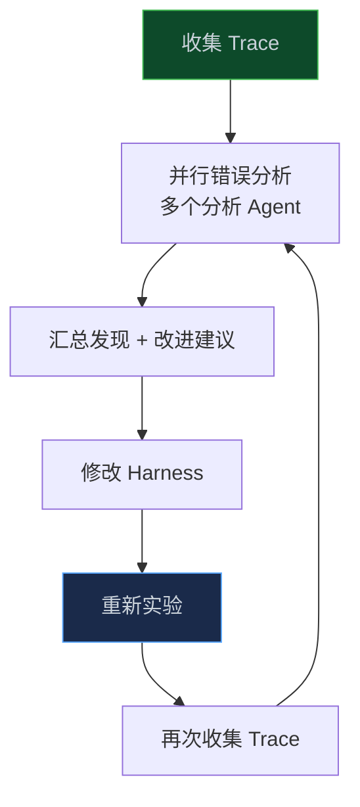
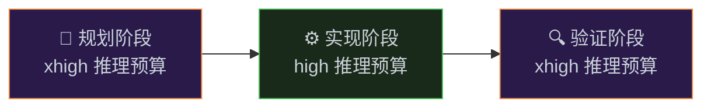

**你怎么知道 AI 在哪里出了问题？**

靠感觉不够，靠猜测更不够。LangChain 的答案是：**看 Trace**。

<!-- more -->

Trace（追踪记录）是 AI Agent 运行过程中每一步的完整记录——它做了什么决策，调用了什么工具，得到了什么结果，花了多少时间，用了多少 Token。

LangChain 把 Trace 分析做成了一个系统性的改进方法，他们称之为"Trace Analyzer Skill"。这个方法帮助他们把编程智能体的得分从 52.8% 提升到了 66.5%，而且全程没有换模型。

---

## 为什么 Trace 分析这么重要？

先说一个根本性的问题：**AI 是黑盒**。

你给 AI 一个任务，它给你一个结果。中间发生了什么，你不知道。它为什么做了这个决策，不知道。它在哪里走偏了，不知道。

这让改进 Harness 变得非常困难——你不知道问题在哪里，就不知道该改什么。

Trace 解决了这个问题。它把 AI 的"思考过程"变成了可观察的数据。

LangChain 的工程师说：

> "模型今天在很大程度上是黑盒，它们的内部机制很难解释。但我们可以在文本空间里看到它们的输入和输出，然后用这些信息来驱动我们的改进循环。"

---

## Trace Analyzer Skill：系统化的改进方法

LangChain 把 Trace 分析做成了一个可重复的流程：

**第一步：收集 Trace**
从 LangSmith（LangChain 的追踪平台）获取实验运行的 Trace 数据。每个 Trace 包含：
- 每一步的输入和输出
- 工具调用记录
- 延迟、Token 消耗、成本
- 任务是否成功

**第二步：并行错误分析**
启动多个并行的错误分析 Agent，每个 Agent 分析一批 Trace，找出失败模式。然后主 Agent 汇总所有分析结果，提炼出共同的问题和改进建议。

**第三步：针对性改进**
根据分析结果，对 Harness 做针对性的修改。

**第四步：重新实验**
用修改后的 Harness 重新跑实验，对比结果。

这个流程和机器学习里的"Boosting"很像——每次迭代都专注于修复上一次的错误。

---

## 实际发现了什么问题？

LangChain 通过 Trace 分析，发现了以下几类主要失败模式：

### 失败模式一：推理错误

AI 在分析问题时做出了错误的推断，导致走向了错误的方向。

这类问题通常需要改进系统提示词，给 AI 更好的问题分析框架。

### 失败模式二：不遵循任务指令

AI 没有按照任务要求来做，而是按照自己的"理解"来做。

这类问题通常是因为任务要求不够清晰，或者 AI 的上下文里缺少关键信息。

### 失败模式三：缺少测试和验证

AI 写完代码就停了，没有测试，没有验证。

这就是我们在第二篇文章里讲的问题，解决方案是 Build & Verify 模式。

### 失败模式四：超时

任务太复杂，AI 在时间限制内没有完成。

解决方案是时间预算注入（在上下文工程那篇文章里提到过）和推理预算优化。

### 失败模式五："死循环"

AI 在同一个错误方案上反复修改，越改越乱，无法跳出来。

解决方案是 LoopDetectionMiddleware——追踪对同一文件的编辑次数，超过阈值后注入"考虑重新审视方案"的提示。

---

## 推理预算优化：一个容易忽视的维度

Trace 分析还帮助 LangChain 发现了一个意想不到的问题：**推理预算的分配**。

GPT-5.2-Codex 有四个推理模式：low、medium、high、xhigh。更高的推理模式意味着更好的思考质量，但也意味着更多的时间和 Token 消耗。

直觉上，你可能会想"全程用 xhigh，效果最好"。但 Trace 数据显示，这样做反而得分更低——因为 xhigh 模式太慢，导致任务超时。

LangChain 的解决方案是"推理三明治"（Reasoning Sandwich）：

这个设计的逻辑是：规划和验证是最需要"想清楚"的阶段，值得花更多推理预算。实现阶段相对机械，用中等推理预算就够了。

---

## 避免过拟合：改进 Harness 的陷阱

Trace 分析驱动的改进有一个潜在的陷阱：**过拟合**。

如果你只针对某几个失败的任务来改 Harness，可能会让 Harness 在这几个任务上表现更好，但在其他任务上表现更差。

LangChain 的工程师特别提到了这个问题：

> "针对某个任务过拟合的改动对泛化不利，可能导致其他任务出现回归。"

避免过拟合的方法：
- 分析足够多的 Trace，找到**普遍性**的失败模式，而不是个别案例
- 每次改动后，在完整的测试集上跑实验，而不只是在失败的任务上
- 人类参与审查改进建议，判断是否有过拟合的风险

---

## 建立自己的 Trace 分析系统

如果你在构建 AI Agent，以下是建立 Trace 分析系统的基本步骤：

**第一步：选择追踪工具**
- LangSmith（LangChain 生态）
- Langfuse（开源，支持多种框架）
- 自建（把每次 Agent 运行的输入输出记录到数据库）

**第二步：定义关键指标**
- 任务成功率
- 平均完成时间
- Token 消耗
- 工具调用次数
- 失败类型分布

**第三步：建立分析流程**
定期（比如每周）分析 Trace，找出失败模式，提炼改进建议。

**第四步：建立实验框架**
每次改动 Harness 后，用标准测试集评估效果，对比改动前后的指标。

**第五步：记录改动历史**
把每次 Harness 改动和对应的效果记录下来，形成知识积累。

---

## Trace 分析的更大价值

Trace 分析不只是用来改进 Harness，它还有更大的价值：

**发现工具问题**：有时候 AI 走偏，不是因为推理错误，而是因为工具返回了错误的信息，或者工具的错误信息不够清晰。Trace 能帮你发现这类问题。

**理解模型行为**：通过大量 Trace，你能逐渐理解模型在什么情况下表现好，在什么情况下容易出错。这些知识对设计 Harness 非常有价值。

**优化成本**：Trace 里有详细的 Token 消耗数据，你可以找到哪些步骤消耗了大量 Token 但贡献不大，然后优化。

---

## 小结

Trace 分析是 Harness Engineering 里的"反馈回路"——没有它，你在黑暗中改进；有了它，你能看到问题在哪里，针对性地修复。

三个关键点：
1. **系统化收集 Trace**——不只是记录成功/失败，要记录完整的过程
2. **找普遍性失败模式**——不要针对个别案例过拟合
3. **建立实验框架**——每次改动都要有数据支撑，而不是靠感觉

下一篇，也是这个系列的最后一篇，我们来讨论一个更大的问题：随着模型越来越强，Harness 会消失吗？AI Agent 的持续性和准确性的终极问题。

---

> 上一篇：[多智能体协作：规划者、生成者、评估者](/posts/ailearn/harness/04)
> 下一篇：未来展望——当模型越来越强，Harness 会消失吗？（即将发布）
