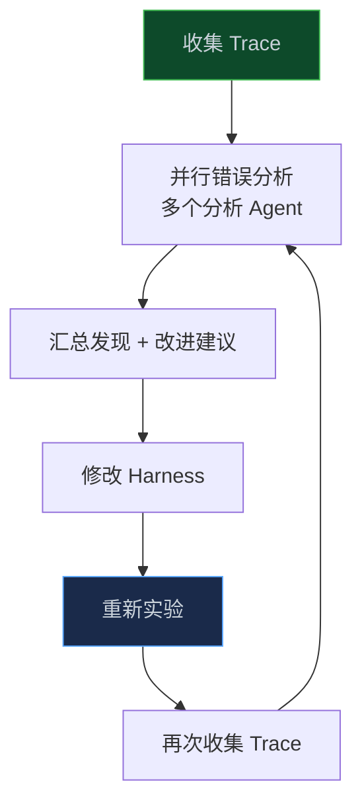
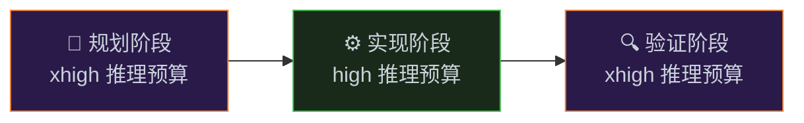

> **📖 篇章难度**：📙 **高级**。涉及数据分析思维和系统设计。
> **🎯 核心收获**：工具选型对比表 + Trace Analyzer Skill 完整代码 + 失败模式速查 + 实验框架模板

**你怎么知道 AI 在哪里出了问题？**

靠感觉不够，靠猜测更不够。LangChain 的答案是：**看 Trace**。

<!-- more -->


Trace（追踪记录）是 AI Agent 运行过程中每一步的完整记录——它做了什么决策，调用了什么工具，得到了什么结果，花了多少时间，用了多少 Token。

LangChain 把 Trace 分析做成了一个系统性的改进方法，他们称之为"Trace Analyzer Skill"。这个方法帮助他们把编程智能体的得分从 52.8% 提升到了 66.5%，而且全程没有换模型。

---

## 为什么 Trace 分析这么重要？

先说一个根本性的问题：**AI 是黑盒**。

你给 AI 一个任务，它给你一个结果。中间发生了什么，你不知道。它为什么做了这个决策，不知道。它在哪里走偏了，不知道。

这让改进 Harness 变得非常困难——你不知道问题在哪里，就不知道该改什么。

Trace 解决了这个问题。它把 AI 的"思考过程"变成了可观察的数据。

LangChain 的工程师说：

> "模型今天在很大程度上是黑盒，它们的内部机制很难解释。但我们可以在文本空间里看到它们的输入和输出，然后用这些信息来驱动我们的改进循环。"

---

## Trace Analyzer Skill：系统化的改进方法

LangChain 把 Trace 分析做成了一个可重复的流程：

**第一步：收集 Trace**
从 LangSmith（LangChain 的追踪平台）获取实验运行的 Trace 数据。每个 Trace 包含：
- 每一步的输入和输出
- 工具调用记录
- 延迟、Token 消耗、成本
- 任务是否成功

**第二步：并行错误分析**
启动多个并行的错误分析 Agent，每个 Agent 分析一批 Trace，找出失败模式。然后主 Agent 汇总所有分析结果，提炼出共同的问题和改进建议。

**第三步：针对性改进**
根据分析结果，对 Harness 做针对性的修改。

**第四步：重新实验**
用修改后的 Harness 重新跑实验，对比结果。


```mermaid
flowchart TD
    A[收集 Trace] --> B[并行错误分析\n多个分析 Agent]
    B --> C[汇总发现 + 改进建议]
    C --> D[修改 Harness]
    D --> E[重新实验]
    E --> F[再次收集 Trace]
    F --> B
    style A fill:#0d4a2a,stroke:#3fb950,color:#c9d1d9
    style E fill:#1a2a4a,stroke:#58a6ff,color:#c9d1d9
```

这个流程和机器学习里的"Boosting"很像——每次迭代都专注于修复上一次的错误。

---

## 实际发现了什么问题？

LangChain 通过 Trace 分析，发现了以下几类主要失败模式：

### 失败模式一：推理错误

AI 在分析问题时做出了错误的推断，导致走向了错误的方向。

这类问题通常需要改进系统提示词，给 AI 更好的问题分析框架。

### 失败模式二：不遵循任务指令

AI 没有按照任务要求来做，而是按照自己的"理解"来做。

这类问题通常是因为任务要求不够清晰，或者 AI 的上下文里缺少关键信息。

### 失败模式三：缺少测试和验证

AI 写完代码就停了，没有测试，没有验证。

这就是我们在第二篇文章里讲的问题，解决方案是 Build & Verify 模式。

### 失败模式四：超时

任务太复杂，AI 在时间限制内没有完成。

解决方案是时间预算注入（在上下文工程那篇文章里提到过）和推理预算优化。

### 失败模式五："死循环"

AI 在同一个错误方案上反复修改，越改越乱，无法跳出来。

解决方案是 LoopDetectionMiddleware——追踪对同一文件的编辑次数，超过阈值后注入"考虑重新审视方案"的提示。

---

## 推理预算优化：一个容易忽视的维度

Trace 分析还帮助 LangChain 发现了一个意想不到的问题：**推理预算的分配**。

GPT-5.2-Codex 有四个推理模式：low、medium、high、xhigh。更高的推理模式意味着更好的思考质量，但也意味着更多的时间和 Token 消耗。

直觉上，你可能会想"全程用 xhigh，效果最好"。但 Trace 数据显示，这样做反而得分更低——因为 xhigh 模式太慢，导致任务超时。

LangChain 的解决方案是"推理三明治"（Reasoning Sandwich）：


```mermaid
flowchart LR
    A["🧠 规划阶段\nxhigh 推理预算"] --> B["⚙️ 实现阶段\nhigh 推理预算"]
    B --> C["🔍 验证阶段\nxhigh 推理预算"]
    style A fill:#2a1a4a,stroke:#f0883e,color:#c9d1d9
    style B fill:#1a2a1a,stroke:#3fb950,color:#c9d1d9
    style C fill:#2a1a4a,stroke:#f0883e,color:#c9d1d9
```

这个设计的逻辑是：规划和验证是最需要"想清楚"的阶段，值得花更多推理预算。实现阶段相对机械，用中等推理预算就够了。

---

## 避免过拟合：改进 Harness 的陷阱

Trace 分析驱动的改进有一个潜在的陷阱：**过拟合**。

如果你只针对某几个失败的任务来改 Harness，可能会让 Harness 在这几个任务上表现更好，但在其他任务上表现更差。

LangChain 的工程师特别提到了这个问题：

> "针对某个任务过拟合的改动对泛化不利，可能导致其他任务出现回归。"

避免过拟合的方法：
- 分析足够多的 Trace，找到**普遍性**的失败模式，而不是个别案例
- 每次改动后，在完整的测试集上跑实验，而不只是在失败的任务上
- 人类参与审查改进建议，判断是否有过拟合的风险

---

## 建立自己的 Trace 分析系统

如果你在构建 AI Agent，以下是建立 Trace 分析系统的基本步骤：

### 第一步：选择追踪工具（详细对比）

| 维度 | **LangSmith** | **Langfuse** | **自建方案** |
|------|--------------|-------------|------------|
| **生态绑定** | 强绑定 LangChain | 框架无关 | 完全自由 |
| **部署方式** | 云端 SaaS / 私有化 | 开源可自托管 | 完全自建 |
| **成本** | 按量付费（有免费额度） | 开源免费（服务器自付） | 仅服务器成本 |
| **上手难度** | ⭐ 极低（LangChain 一行接入） | ⭐⭐ 中等 | ⭐⭐⭐⭐ 高 |
| **UI 体验** | 专业完善（商业产品） | 功能齐全（开源中最好） | 需要自己开发 |
| **定制能力** | 受限于平台功能 | 高（可改源码） | 完全可控 |
| **数据主权** | 数据在 LangChain 服务器 | 数据在你自己手里 | 完全本地 |
| **适合场景** | 快速验证/原型阶段 | 生产环境长期使用 | 有特殊合规要求 |

#### 选型建议：

```
你的情况是什么？
│
├─ 刚开始探索 Trace？ → 用 LangSmith（免费额度够试）
├─ 要上生产环境？     → 用 Langfuse（开源 + 自托管）
├─ 有合规/安全要求？  → 自建或 Langfuse 私有化部署
└─ 只用非 LangChain 框架？→ Langfuse 或自建
```

### 第二步：定义关键指标
- 任务成功率
- 平均完成时间
- Token 消耗
- 工具调用次数
- 失败类型分布

### 第三步：建立分析流程
定期（比如每周）分析 Trace，找出失败模式，提炼改进建议。

### 第四步：建立实验框架
每次改动 Harness 后，用标准测试集评估效果，对比改动前后的指标。

### 第五步：记录改动历史
把每次 Harness 改动和对应的效果记录下来，形成知识积累。

---

## 🔧 Trace Analyzer Skill 完整实现

以下是一个**生产级**的 Trace Analyzer Skill 实现，你可以直接适配使用：

```python
"""
Trace Analyzer Skill 完整实现

功能：
1. 收集和解析 Agent 运行的 Trace 数据
2. 并行启动多个分析子 Agent 进行错误模式识别
3. 汇总分析结果并生成结构化报告
4. 提供 Harness 改进建议
5. 自动检测过拟合风险

设计原则：
- 可扩展的分析器插件架构
- 结构化的输入输出格式
- 内置常见失败模式库
"""

import json
import os
import time
from datetime import datetime
from pathlib import Path
from typing import Dict, List, Any, Optional, Callable
from dataclasses import dataclass, field
from abc import ABC, abstractmethod
from concurrent.futures import ThreadPoolExecutor, as_completed


# ==================== 数据模型 ====================

@dataclass
class TraceStep:
    """单个执行步骤"""
    step_id: str
    step_type: str                    # "llm_call" | "tool_call" | "middleware" | "decision"
    input_summary: str                # 输入摘要（截断后）
    output_summary: str               # 输出摘要（截断后）
    duration_ms: int                  # 耗时（毫秒）
    token_count: Dict[str, int] = None # {"input": N, "output": N}
    error: Optional[str] = None       # 错误信息
    metadata: Dict = field(default_factory=dict)


@dataclass 
class TraceRecord:
    """完整的 Trace 记录"""
    trace_id: str
    task_description: str
    task_success: bool
    total_duration_ms: int
    total_tokens: int
    total_cost_usd: float
    steps: List[TraceStep]
    model_info: Dict = field(default_factory=dict)
    harness_config: Dict = field(default_factory=dict)
    timestamp: float = field(default_factory=time.time)


@dataclass
class FailurePattern:
    """识别到的失败模式"""
    pattern_id: str                   # 模式ID
    pattern_name: str                 # 模式名称
    category: str                     # 类别 (reasoning/compliance/verification/timeout/loop)
    description: str                  # 描述
    severity: str                     # critical / high / medium / low
    affected_traces: List[str]        # 影响的 Trace ID
    frequency: float                  # 出现频率 (0.0 - 1.0)
    suggested_fix: str                # 建议修复方案
    related_harness_component: str    # 相关的 Harness 组件
    evidence_snippets: List[str]      # 证据片段


@dataclass
class AnalysisReport:
    """分析报告"""
    analysis_id: str
    analyzed_trace_count: int
    time_range: tuple
    summary: Dict[str, Any]          # 总体统计
    failure_patterns: List[FailurePattern]  # 发现的失败模式
    improvement_suggestions: List[Dict]     # 改进建议
    regression_risk: List[Dict]            # 过拟合风险警告
    cost_analysis: Dict                      # 成本分析
    generated_at: str


# ==================== 失败模式库 ====================

BUILTIN_FAILURE_PATTERNS = {
    "reasoning_error": {
        "name": "推理错误",
        "category": "reasoning",
        "description": "AI 在分析问题时做出了错误的推断，导致方向性错误",
        "detection_heuristics": [
            "早期步骤出现与任务目标不符的决策",
            "后续步骤持续基于错误前提进行",
            "最终输出与初始需求偏差大"
        ],
        "suggested_fix": "改进系统提示词中的问题分析框架；增加规划阶段的约束检查",
        "harness_component": "系统提示词"
    },
    "non_compliance": {
        "name": "不遵循指令",
        "category": "compliance", 
        "description": "AI 没有按照任务要求执行，而是按自己的理解来做",
        "detection_heuristics": [
            "任务要求中的关键点未被覆盖",
            "AI 自行添加了不需要的功能",
            "跳过了明确要求的步骤"
        ],
        "suggested_fix": "强化系统提示词的任务遵循指令；增加 PreCompletionChecklistMiddleware",
        "harness_component": "系统提示词 + 中间件"
    },
    "missing_verification": {
        "name": "缺少验证",
        "category": "verification",
        "description": "AI 写完代码就停止，没有运行测试或验证结果",
        "detection_heuristics": [
            "最后一步是代码输出而非测试执行",
            "没有工具调用类型的 test_run",
            "总步骤数 < 预期最小值"
        ],
        "suggested_fix": "实施 Build & Verify 模式；添加 PreCompletionChecklistMiddleware",
        "harness_component": "中间件 + 验证层 + 系统提示词"
    },
    "timeout": {
        "name": "超时",
        "category": "timeout",
        "description": "任务复杂度过高，AI 在时间限制内未完成",
        "detection_heuristics": [
            "trace 以 timeout/error 结束",
            "最后几步明显加速（上下文焦虑）",
            "总耗时超过阈值"
        ],
        "suggested_fix": "注入时间预算警告；拆分为更小的 Sprint；优化推理预算分配",
        "harness_component": "中间件 + 执行流程 + 上下文管理"
    },
    "infinite_loop": {
        "name": "死循环",
        "category": "loop",
        "description": "AI 在同一问题上反复修改，无法跳出",
        "detection_heuristics": [
            "同一文件被编辑 > N 次",
            "相邻步骤高度相似（编辑相似内容）",
            "无进展的迭代次数 > 阈值"
        ],
        "suggested_fix": "实施 LoopDetectionMiddleware；设置最大迭代限制",
        "harness_component": "中间件"
    }
}


# ==================== 分析器接口 ====================

class BaseTraceAnalyzer(ABC):
    """Trace 分析器的基类"""
    
    @abstractmethod
    def analyze(self, traces: List[TraceRecord]) -> List[FailurePattern]:
        """分析 traces，返回发现的失败模式"""
        pass
    
    @property
    @abstractmethod  
    def name(self) -> str:
        """分析器名称"""
        pass


class HeuristicAnalyzer(BaseTraceAnalyzer):
    """基于启发式规则的分析器"""
    
    def __init__(self, patterns: Dict = None):
        self.patterns = patterns or BUILTIN_FAILURE_PATTERNS
    
    @property
    def name(self) -> str:
        return "heuristic_analyzer"
    
    def analyze(self, traces: List[TraceRecord]) -> List[FailurePattern]:
        patterns_found = []
        
        for pattern_key, pattern_def in self.patterns.items():
            affected = []
            
            for trace in traces:
                if self._matches_pattern(trace, pattern_def):
                    affected.append(trace.trace_id)
            
            if affected:
                frequency = len(affected) / len(traces)
                
                patterns_found.append(FailurePattern(
                    pattern_id=pattern_key,
                    pattern_name=pattern_def['name'],
                    category=pattern_def['category'],
                    description=pattern_def['description'],
                    severity=self._calculate_severity(frequency),
                    affected_traces=affected,
                    frequency=frequency,
                    suggested_fix=pattern_def['suggested_fix'],
                    related_harness_component=pattern_def['harness_component'],
                    evidence_snippets=self._extract_evidence(affected[:3], traces)  # 最多3条证据
                ))
        
        # 按频率排序
        patterns_found.sort(key=lambda p: p.frequency, reverse=True)
        return patterns_found
    
    def _matches_pattern(self, trace: TraceRecord, pattern_def: Dict) -> bool:
        """检查一条 trace 是否匹配某个失败模式的启发式规则"""
        heuristics = pattern_def.get('detection_heuristics', [])
        
        # 这里实现具体的匹配逻辑
        # 简化版：根据类别做基础检测
        
        if pattern_def['category'] == 'verification':
            # 缺少验证：检查是否有测试相关工具调用
            has_test_step = any(
                'test' in s.step_type.lower() or 'verify' in s.step_type.lower()
                for s in trace.steps
            )
            return not has_test_step and not trace.task_success
        
        elif pattern_def['category'] == 'loop':
            # 死循环：检查是否有重复编辑同一文件
            edit_files = []
            for s in trace.steps:
                if s.metadata.get('file_edited'):
                    edit_files.append(s.metadata['file_edited'])
            
            # 简单统计：如果某个文件出现 > 5 次
            from collections import Counter
            counts = Counter(edit_files)
            return any(c > 5 for c in counts.values())
        
        elif pattern_def['category'] == 'timeout':
            # 超时：检查是否以错误结束且耗时较长
            return (
                not trace.task_success and 
                trace.total_duration_ms > 300000  # 5分钟
            )
        
        # 其他模式需要更复杂的检测逻辑...
        return False
    
    def _calculate_severity(self, frequency: float) -> str:
        """根据频率计算严重程度"""
        if frequency >= 0.4:
            return "critical"
        elif frequency >= 0.2:
            return "high"
        elif frequency >= 0.1:
            return "medium"
        else:
            return "low"
    
    def _extract_evidence(self, trace_ids: List[str], all_traces: List[TraceRecord]) -> List[str]:
        """提取证据片段"""
        snippets = []
        for tid in trace_ids:
            trace = next((t for t in all_traces if t.trace_id == tid), None)
            if trace and trace.steps:
                last_step = trace.steps[-1]
                snippets.append(
                    f"Trace {tid}: 最后一步 '{last_step.step_type}' — "
                    f"{last_step.output_summary[:100]}..."
                )
        return snippets


class LLMAnalyzer(BaseTraceAnalyzer):
    """
    基于 LLM 的智能分析器
    
    使用 LLM 对 Trace 进行语义级别的分析，
    能发现启发式规则难以捕捉的模式。
    
    注意：这是一个框架示例，实际调用 LLM 的部分
    需要根据你使用的 API 进行适配。
    """
    
    def __init__(self, llm_client=None):
        self.client = llm_client
    
    @property
    def name(self) -> str:
        return "llm_analyzer"
    
    def analyze(self, traces: List[TraceRecord]) -> List[FailurePattern]:
        """
        使用 LLM 分析失败的 traces
        """
        # 只分析失败的 traces
        failed_traces = [t for t in traces if not t.task_success]
        
        if not failed_traces:
            return []
        
        # 将 trace 数据序列化为 LLM 友好的格式
        prompt = self._build_analysis_prompt(failed_traces)
        
        # 调用 LLM（伪代码——替换为实际的 API 调用）
        # response = self.client.complete(prompt)
        # result = json.loads(response.content)
        
        # 模拟返回（实际使用时替换为真实的 LLM 调用）
        result = self._mock_llm_analysis(failed_traces)
        
        return result
    
    def _build_analysis_prompt(self, traces: List[TraceRecord]) -> str:
        """构建分析 prompt"""
        traces_data = []
        for t in traces[:10]:  # 最多分析10个样本
            steps_summary = "\n".join([
                f"  [{s.step_type}] {s.input_summary[:80]} → {s.output_summary[:80]}"
                for s in t.steps[:15]  # 每个trace最多15步
            ])
            traces_data.append(
                f"### Trace {t.trace_id} (成功={t.task_success}, "
                f"耗时={t.total_duration_ms//1000}s)\n{steps_summary}"
            )
        
        return f"""你是一个专业的 AI Agent Trace 分析专家。
请分析以下失败的 Agent 运行记录，找出共同的失败模式。

{"\n\n".join(traces_data)}

请以 JSON 格式返回你的发现：
{{
  "patterns": [
    {{
      "name": "模式名称",
      "category": "reasoning/compliance/verification/timeout/loop/other",
      "description": "描述这个模式",
      "severity": "critical/high/medium/low",
      "frequency": 出现比例,
      "suggested_fix": "建议如何修复",
      "harness_component": "相关的Harness组件"
    }}
  ]
}}
"""
    
    def _mock_llm_analysis(self, traces: List[TraceRecord]) -> List[FailurePattern]:
        """模拟 LLM 返回（实际使用时删除此方法）"""
        # 实际项目中这里应该是真实 LLM API 调用的结果
        return []


# ==================== 主分析引擎 ====================

class TraceAnalysisEngine:
    """
    Trace 分析主引擎
    
    协调多个分析器并行工作，
    汇总结果并生成完整报告。
    """

    def __init__(self, analyzers: List[BaseTraceAnalyzer] = None):
        self.analyzers = analyzers or [
            HeuristicAnalyzer(),
            LLMAnalyzer(),  # 如果没有 LLM client 可以移除
        ]
        self.analysis_history: List[AnalysisReport] = []

    def run_analysis(
        self,
        traces: List[TraceRecord],
        max_workers: int = 4
    ) -> AnalysisReport:
        """
        执行完整的分析流程
        """
        print(f"[TraceAnalyzer] 开始分析 {len(traces)} 条 Trace...")
        start_time = time.time()
        
        all_patterns = []
        
        # 并行运行所有分析器
        with ThreadPoolExecutor(max_workers=max_workers) as executor:
            futures = {
                executor.submit(analyzer.analyze, traces): analyzer.name
                for analyzer in self.analyzers
            }
            
            for future in as_completed(futures):
                analyzer_name = futures[future]
                try:
                    patterns = future.result()
                    print(f"[TraceAnalyzer] {analyzer_name} 完成，发现 {len(patterns)} 个模式")
                    all_patterns.extend(patterns)
                except Exception as e:
                    print(f"[TraceAnalyzer] {analyzer_name} 出错: {e}")
        
        # 去重合并（不同分析器可能发现相同模式）
        merged_patterns = self._deduplicate_patterns(all_patterns)
        
        # 生成改进建议
        suggestions = self._generate_suggestions(merged_patterns)
        
        # 过拟合风险检测
        regression_risks = self._detect_regression_risks(merged_patterns)
        
        # 成本分析
        cost_analysis = self._analyze_costs(traces)
        
        report = AnalysisReport(
            analysis_id=f"analysis_{int(time.time())}",
            analyzed_trace_count=len(traces),
            time_range=(
                datetime.fromtimestamp(min(t.timestamp for t in traces)).isoformat(),
                datetime.fromtimestamp(max(t.timestamp for t in traces)).isoformat()
            ),
            summary={
                "total_traces": len(traces),
                "success_rate": sum(1 for t in traces if t.task_success) / len(traces),
                "avg_duration_ms": sum(t.total_duration_ms for t in traces) / len(traces),
                "avg_cost_usd": sum(t.total_cost_usd for t in traces) / len(traces),
                "patterns_found": len(merged_patterns),
            },
            failure_patterns=merged_patterns,
            improvement_suggestions=suggestions,
            regression_risk=regression_risks,
            cost_analysis=cost_analysis,
            generated_at=datetime.now().isoformat()
        )
        
        self.analysis_history.append(report)
        
        elapsed = time.time() - start_time
        print(f"[TraceAnalyzer] 分析完成，耗时 {elapsed:.1f}s")
        
        return report

    def _deduplicate_patterns(self, patterns: List[FailurePattern], threshold: float = 0.7) -> List[FailurePattern]:
        """去重相似的失败模式"""
        # 简单去重：相同 category + 相似 affected_traces 重叠率高的视为重复
        unique = []
        seen_categories = {}
        
        for p in patterns:
            if p.category not in seen_categories:
                seen_categories[p.category] = p
                unique.append(p)
            else:
                existing = seen_categories[p.category]
                # 合并证据
                existing.affected_traces = list(set(
                    existing.affected_traces + p.affected_traces
                ))
                existing.frequency = len(existing.affected_traces) / len(existing.affected_traces)  # 重新计算
                existing.evidence_snippets.extend(p.evidence_snippets)
        
        return unique

    def _generate_suggestions(self, patterns: List[FailurePattern]) -> List[Dict]:
        """根据失败模式生成改进建议"""
        suggestions = []
        
        # 按 harness 组件分组
        by_component = {}
        for p in patterns:
            comp = p.related_harness_component
            if comp not in by_component:
                by_component[comp] = []
            by_component[comp].append(p)
        
        for component, comp_patterns in by_component.items():
            # 取该组件中最严重的模式作为主要建议
            most_severe = max(comp_patterns, key=lambda p: 
                {'critical': 4, 'high': 3, 'medium': 2, 'low': 1}.get(p.severity, 0))
            
            suggestions.append({
                "component": component,
                "priority": most_severe.severity,
                "problem": f"{most_severe.pattern_name} ({most_severe.frequency:.0%} 出现率)",
                "action": most_severe.suggested_fix,
                "affected_patterns": [p.pattern_id for p in comp_patterns],
                "estimated_effort": self._estimate_effort(most_severe)
            })
        
        # 按优先级排序
        priority_order = {'critical': 0, 'high': 1, 'medium': 2, 'low': 3}
        suggestions.sort(key=lambda s: priority_order.get(s['priority'], 99))
        
        return suggestions

    def _detect_regression_risks(self, patterns: List[FailurePattern]) -> List[Dict]:
        """检测过拟合风险"""
        risks = []
        
        for p in patterns:
            # 如果某个模式只出现在很少的 trace 上，可能是过拟合
            if len(p.affected_traces) <= 2 and p.severity != 'critical':
                risks.append({
                    "level": "warning",
                    "pattern": p.pattern_name,
                    "reason": f"该模式仅影响 {len(p.affected_traces)} 条 trace，"
                           "针对性修复可能造成过拟合",
                    "recommendation": "建议收集更多数据确认这是否是普遍性问题"
                })
        
        # 与历史对比：如果新模式突然出现
        if len(self.analysis_history) >= 2:
            prev_report = self.analysis_history[-2]
            prev_pattern_names = {p.pattern_id for p in prev_report.failure_patterns}
            new_patterns = [p for p in patterns if p.pattern_id not in prev_pattern_names]
            
            for np_ in new_patterns[:3]:
                risks.append({
                    "level": "info",
                    "pattern": np_.pattern_name,
                    "reason": "新出现的失败模式（上次分析未发现）",
                    "recommendation": "观察是否会在后续分析中持续出现"
                })
        
        return risks

    def _analyze_costs(self, traces: List[TraceRecord]) -> Dict:
        """成本分析"""
        successful = [t for t in traces if t.task_success]
        failed = [t for t in traces if not t.task_success]
        
        return {
            "total_spent": sum(t.total_cost_usd for t in traces),
            "avg_per_trace": sum(t.total_cost_usd for t in traces) / len(traces) if traces else 0,
            "avg_successful": sum(t.total_cost_usd for t in successful) / len(successful) if successful else 0,
            "avg_failed": sum(t.total_cost_usd for t in failed) / len(failed) if failed else 0,
            "wasted_on_failures": sum(t.total_cost_usd for t in failed),
            "optimization_candidates": self._find_cost_optimization_candidates(traces)
        }

    def _find_cost_optimization_candidates(self, traces: List[TraceRecord]) -> List[Dict]:
        """找出可以优化的高成本步骤"""
        candidates = []
        
        for trace in traces:
            # 找出消耗 token 特别多的步骤
            expensive_steps = [
                s for s in trace.steps
                if s.token_count and s.token_count.get('total', 0) > 5000
            ]
            
            for step in expensive_steps:
                candidates.append({
                    "trace_id": trace.trace_id,
                    "step_type": step.step_type,
                    "tokens_used": step.token_count.get('total', 0),
                    "suggestion": f"考虑压缩 {step.step_type} 步骤的输入/输出"
                })
        
        # 按token排序取前5
        candidates.sort(key=lambda c: c['tokens_used'], reverse=True)
        return candidates[:5]

    def _estimate_effort(self, pattern: FailurePattern) -> str:
        """估算修复工作量"""
        effort_map = {
            "系统提示词": "低（修改文本即可）",
            "中间件": "中等（需要编写代码）",
            "验证层": "中等（需要编写代码+测试）",
            "工具集": "较高（可能需要集成新工具）",
            "上下文管理": "中等（重构文档结构）",
            "执行流程": "中等（调整编排逻辑）"
        }
        return effort_map.get(pattern.related_harness_component, "未知")

    def export_report(self, report: AnalysisReport, format: str = "json") -> str:
        """导出分析报告"""
        output_path = Path(f"./trace_reports/{report.analysis_id}.{format}")
        output_path.parent.mkdir(exist_ok=True)
        
        if format == "json":
            with open(output_path, 'w', encoding='utf-8') as f:
                # 转换dataclass为dict
                import dataclasses
                json.dump(dataclasses.asdict(report), f, ensure_ascii=False, indent=2, default=str)
        
        return str(output_path)


# ==================== 实验管理框架 ====================

class ExperimentTracker:
    """
    实验跟踪器
    
    记录每次 Harness 改动的效果，
    形成可追溯的改进历史。
    """
    
    def __init__(self, storage_path: str = "./experiments"):
        self.storage = Path(storage_path)
        self.storage.mkdir(exist_ok=True)
        self.history_file = self.storage / "history.jsonl"
    
    def record_experiment(
        self,
        experiment_id: str,
        harness_changes: Dict,
        baseline_metrics: Dict,
        experiment_metrics: Dict,
        notes: str = ""
    ) -> Dict:
        """记录一次实验"""
        
        # 计算变化
        deltas = {}
        for key in baseline_metrics:
            if key in experiment_metrics:
                old_val = baseline_metrics[key]
                new_val = experiment_metrics[key]
                if isinstance(old_val, (int, float)) and isinstance(new_val, (int, float)):
                    delta = new_val - old_val
                    pct = (delta / old_val * 100) if old_val != 0 else 0
                    deltas[key] = {
                        "before": old_val,
                        "after": new_val,
                        "delta": round(delta, 4),
                        "delta_pct": round(pct, 2)
                    }
        
        record = {
            "experiment_id": experiment_id,
            "timestamp": datetime.now().isoformat(),
            "harness_changes": harness_changes,
            "baseline": baseline_metrics,
            "experiment": experiment_metrics,
            "deltas": deltas,
            "verdict": self._make_verdict(deltas),
            "notes": notes
        }
        
        with open(self.history_file, 'a', encoding='utf-8') as f:
            f.write(json.dumps(record, ensure_ascii=False) + '\n')
        
        return record
    
    def _make_verdict(self, deltas: Dict) -> str:
        """判断实验结论"""
        success_delta = deltas.get("success_rate", {})
        if success_delta and success_delta.get('delta_pct', 0) > 5:
            return "🟢 有效改进"
        elif success_delta and success_delta.get('delta_pct', 0) < -3:
            return "🔴 回退（效果变差）"
        else:
            return "🟡 效果不明显"
    
    def get_history(self, limit: int = 20) -> List[Dict]:
        """获取实验历史"""
        records = []
        if not self.history_file.exists():
            return records
        
        with open(self.history_file, 'r', encoding='utf-8') as f:
            for line in f:
                line = line.strip()
                if line:
                    records.append(json.loads(line))
        
        return records[-limit:]
```

---

## Trace 分析的更大价值

Trace 分析不只是用来改进 Harness，它还有更大的价值：

**发现工具问题**：有时候 AI 走偏，不是因为推理错误，而是因为工具返回了错误的信息，或者工具的错误信息不够清晰。Trace 能帮你发现这类问题。

**理解模型行为**：通过大量 Trace，你能逐渐理解模型在什么情况下表现好，在什么情况下容易出错。这些知识对设计 Harness 非常有价值。

**优化成本**：Trace 里有详细的 Token 消耗数据，你可以找到哪些步骤消耗了大量 Token 但贡献不大，然后优化。

---

## 小结

Trace 分析是 Harness Engineering 里的"反馈回路"——没有它，你在黑暗中改进；有了它，你能看到问题在哪里，针对性地修复。

三个关键点：
1. **系统化收集 Trace**——不只是记录成功/失败，要记录完整的过程
2. **找普遍性失败模式**——不要针对个别案例过拟合
3. **建立实验框架**——每次改动都要有数据支撑，而不是靠感觉

下一篇，也是这个系列的最后一篇，我们来讨论一个更大的问题：随着模型越来越强，Harness 会消失吗？AI Agent 的持续性和准确性的终极问题。

---

> 上一篇：[多智能体协作：规划者、生成者、评估者](/posts/ailearn/harness/04)
> 下一篇：未来展望——当模型越来越强，Harness 会消失吗？（即将发布）
