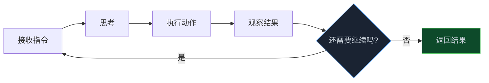
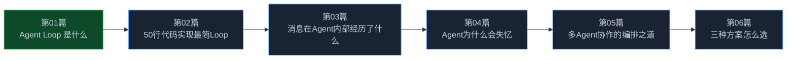

> **📖 系列难度说明**：本篇为**入门导读**，适合所有对 AI Agent 感兴趣的读者。无需前置知识。
> **🎁 核心收获**：读完本篇你将能够理解 Agent Loop 的本质，并知道三种主流实现方案分别适合什么场景。

你让 AI 帮你重构一段代码，它改了第一处就停了。你再催它，它从头开始分析。你又催，它又改了一处，又停了。

为什么有的 Agent 能一口气完成复杂任务，有的只能"一问一答"？

差别不在模型，在于 Loop。

<!-- more -->

---

## Agent Loop 是什么

先说个类比。

Agent Loop 就像是 Agent 的"心跳"。没有它，Agent 再聪明也只能动一下——你推一把，它走一步。有了它，Agent 才能自己持续跑下去。

具体来说，Agent Loop 是一个循环结构，每一轮做四件事：

1. **接收指令**：拿到用户输入或上一轮的结果
2. **思考**：调用 LLM，决定下一步做什么
3. **执行动作**：调用工具（读文件、跑命令、搜索代码……）
4. **观察结果**：把工具返回的结果塞回上下文，判断任务完成没有

没完成？回到第一步，继续。完成了？输出结果，退出循环。

听起来跟普通的 `while True` 差不多？

有一个关键区别：**每一轮都有"判断是否结束"的智能决策**。

传统的 while 循环，退出条件是写死的——`i < 10` 就退出，或者 `result == true` 就退出。但 Agent Loop 不一样，它的退出条件是 LLM 自己判断的："任务做完了吗？还需要调用工具吗？"

这就是 Agent Loop 和普通循环的本质区别：**退出条件本身是智能的**。

---

## 三种主流 Loop 设计流派

Agent Loop 不是只有一种写法。我在研究目前主流的 Agent 框架时，发现大致可以分成三种流派。

### 流派一：确定性循环

代表：Google ADK 的 LoopAgent。

这种流派的核心思路是——**执行顺序我来定，Agent 只管干活**。

你提前把子 Agent 按顺序排好，比如"先写作 → 再评审 → 再修改"，循环就照这个顺序跑。跑几轮？你设一个 `max_iterations`。什么时候停？某个子 Agent 觉得活干完了，发一个终止信号。

好处是可预测、好调试，流程清清楚楚。坏处是不够灵活，遇到突发情况没法临时调整。

适合什么场景？步骤固定的任务，比如"生成文档 → 评审 → 修改"这种迭代精化的流程。

> 💡 **来源**：[Loop workflow - Google ADK](https://adk.dev/agents/workflow-agents/loop-agents/) — LoopAgent 在循环中按固定顺序执行子 Agent，直到达到迭代上限或子 Agent 发出终止信号

### 流派二：SDK 级 Agent Loop

代表：Claude Code Agent SDK、OpenAI Agents SDK。

这种流派是现在最主流的写法。核心思路是——**给 LLM 一堆工具，让它自己决定下一步干什么**。

每一轮，LLM 看到当前上下文，自己判断："我是该读文件？该改代码？该跑测试？还是活干完了该回复用户了？"

好处是通用、灵活，什么任务都能往里塞。坏处是不好预测，调试起来也复杂——你不知道它下一轮会干什么。

Claude Code 的 Agent Loop 就是典型代表。你给它一个任务"修复 auth 模块的测试失败"，它会自己决定：先跑测试看看哪里挂了 → 读文件找原因 → 改代码 → 再跑测试验证。整个过程你不用管，它自己跑。

> 💡 **来源**：[How the agent loop works - Claude Code Docs](https://code.claude.com/docs/en/agent-sdk/agent-loop) — Claude 评估提示词、调用工具、接收结果，循环执行直到任务完成

### 流派三：多 Agent 编排循环

代表：Saik0s/agent-loop。

当一个 Agent 搞不定复杂任务时，就得上这种流派。核心思路是——**一个编排者带一队专家**。

Orchestrator（编排者）负责理解你的意图，把任务拆分给合适的专家 Agent。每个专家有自己的 system prompt、自己的工具集、自己的对话历史。专家干完活，结果汇报给 Orchestrator，由它决定下一步怎么走。

举个例子，你要"把项目从 JavaScript 迁移到 TypeScript"。Orchestrator 会把任务拆成几块：让架构师设计迁移方案，让开发者改代码，让测试员跑测试，让审查员检查类型。每个专家干自己擅长的事，互不干扰。

好处是分工明确、专业能力强。坏处是复杂度高，调试一场噩梦，而且 Agent 之间容易信息丢失。

> 💡 **来源**：[Saik0s/agent-loop - GitHub](https://github.com/Saik0s/agent-loop) — 由 Orchestrator 管理的专家 Agent 团队，处理从规划到部署的各类任务

### 三种流派怎么选？

一张表说清楚：

| 维度 | 确定性循环 | SDK Agent Loop | 多 Agent 编排 |
|------|-----------|---------------|-------------|
| 复杂度 | 低 | 中 | 高 |
| 灵活性 | 低 | 高 | 高 |
| 可预测性 | 高 | 中 | 低 |
| 调试难度 | 简单 | 中等 | 困难 |
| 适用场景 | 固定流程 | 通用任务 | 复杂协作 |
| 代表实现 | Google ADK | Claude/OpenAI | Saik0s/agent-loop |

不用纠结选哪种——这个系列最后一篇会给你一张决策地图。现在先有个印象就行。

---

## 这个系列会教你什么

先放一张路线图：

每篇解决一个核心问题：

| 篇号 | 核心问题 | 你能获得什么 |
|------|---------|------------|
| 01 | Agent Loop 到底是什么 | 理解本质 + 三种流派概览 |
| 02 | 怎么从零实现一个 | 50 行能跑的代码 + 终止策略设计 |
| 03 | 成熟 Agent Loop 内部怎么运转 | 消息生命周期 + Hooks 机制 |
| 04 | Agent 跑着跑着就忘了怎么办 | 上下文管理三板斧 + 会话恢复 |
| 05 | 一个 Agent 搞不定怎么办 | Orchestrator + Expert 架构 + 踩坑指南 |
| 06 | 我的场景该用哪种 | 选型决策树 + 设计清单 |

### 你适合从哪篇开始读？

| 你的情况 | 建议读法 |
|---------|---------|
| 刚接触 Agent，想了解全貌 | 从第 01 篇顺序读 |
| 想快速上手写一个 | 第 01、02 篇 |
| 已经在用，遇到上下文/失忆问题 | 直接看第 04 篇 |
| 搞多 Agent 协作 | 第 05 篇 |
| 要做技术选型决策 | 直接看第 06 篇 |

---

## 📝 小结

- Agent Loop 是 Agent 持续运行的核心引擎，没有它 Agent 只能"一问一答"
- 它和普通循环的区别：每一轮的退出判断是智能的，由 LLM 自己决定
- 三种主流流派：确定性循环（固定流程）、SDK Agent Loop（通用灵活）、多 Agent 编排（复杂协作）
- 这个系列从 50 行代码开始，一步步讲到生产级 Agent Loop 的设计决策

---

## 🔮 下一篇预告

说了这么多，Agent Loop 到底怎么写？

下一篇，我们从最简单的开始——用 50 行代码跑通一个能用的 Agent Loop。别被那些框架吓到，核心逻辑其实特别简单。

---

> 📚 **系列导航**
> - **第 01 篇：Agent Loop：被你忽视的 AI 应用核心引擎** ⬅️ 你在这里
> - 第 02 篇：50 行代码实现一个能跑的 Agent Loop
> - 第 03 篇：一条消息在 Agent 内部经历了什么？
> - 第 04 篇：你的 Agent 为什么跑着跑着就"失忆"了？
> - 第 05 篇：当一个 Agent 不够用：多 Agent 协作的编排之道
> - 第 06 篇：Agent Loop 选型指南：三种方案怎么选？
