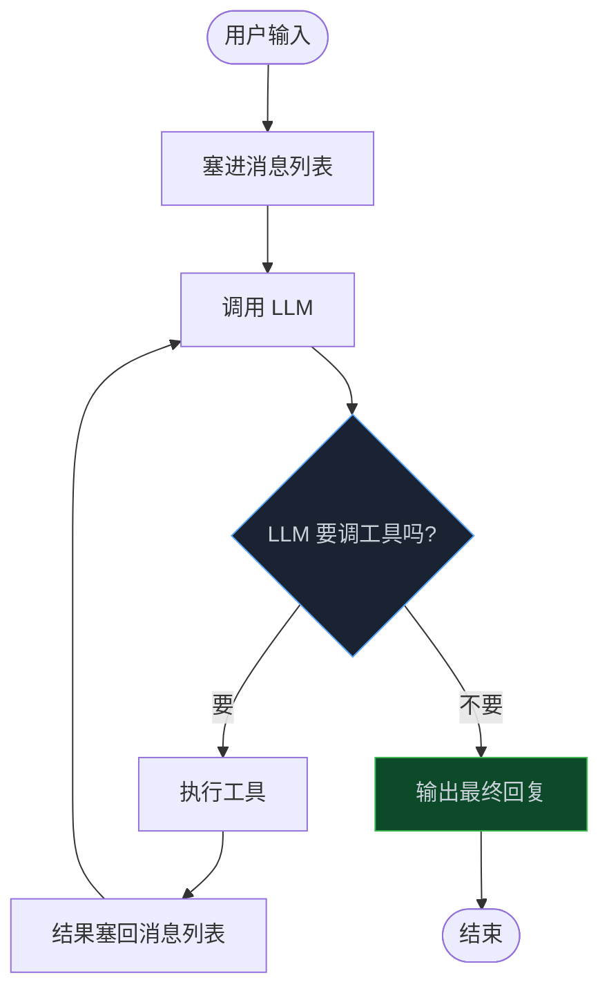
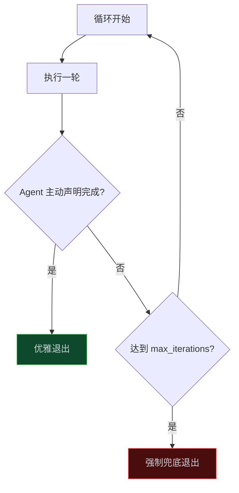
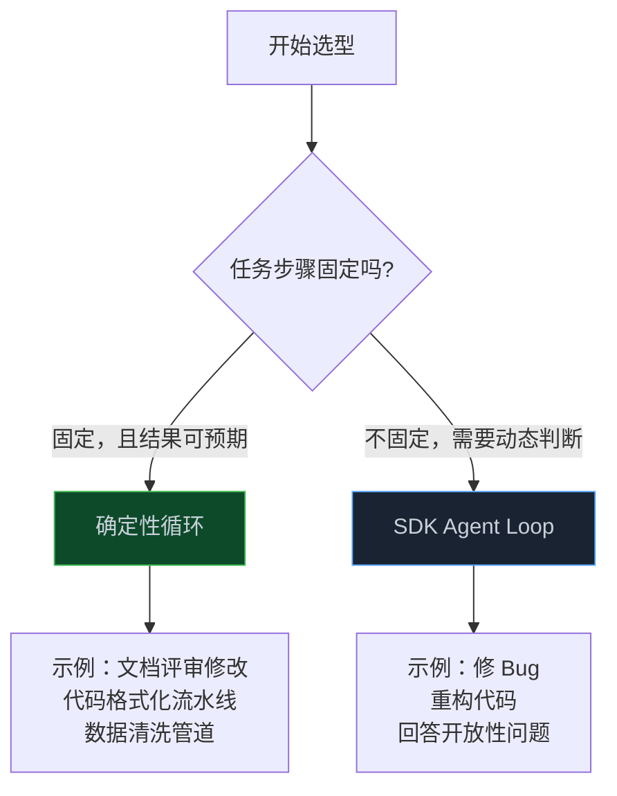

> **📖 系列难度说明**：本篇为**入门实战**，适合想动手写代码的开发者。需要一点 Python 基础。
> **🎁 核心收获**：读完本篇你将能够自己跑通一个带工具调用的 Agent Loop，并理解终止策略的设计逻辑。

别被那些框架吓到。

LangChain、AutoGen、CrewAI……这些框架确实强大，但它们解决的核心问题其实特别简单——让 Agent 持续跑下去。

Agent Loop 的核心逻辑，50 行代码就能写清楚。这篇结束后，你手上会有一个真正能跑的 Agent Loop。

<!-- more -->

---

## 最简 Loop 的骨架

先别管代码，我们用嘴巴讲一遍思路。

一个 Agent Loop 要做的事情，拆开就四步：

1. 拿到用户输入，塞进消息列表
2. 把消息列表发给 LLM
3. LLM 回复了？看它要不要调工具
   - 要调：执行工具，把结果塞回消息列表，回到第 2 步
   - 不调：说明活干完了，输出结果，结束

就这么简单。画成图就是这样：



看明白了吗？关键就在那个判断——**LLM 要不要调工具**。要调就继续循环，不调就结束。这就是上一篇说的"智能退出条件"。

好，思路清楚了，上代码。

我用 Python 写，用了 OpenAI SDK 的格式（Claude SDK、Gemini SDK 的结构几乎一样）。不关心语法细节的话，看注释就行：

```python
import json
from openai import OpenAI

client = OpenAI()

# 工具注册表：名字 → 函数
tools = {}

def register_tool(name, func, description, schema):
    """注册一个工具"""
    tools[name] = {"func": func, "schema": {
        "type": "function",
        "function": {"name": name, "description": description, "parameters": schema}
    }}

def run_agent(user_input, system_prompt="你是一个有用的助手。", max_iterations=10):
    messages = [
        {"role": "system", "content": system_prompt},
        {"role": "user", "content": user_input},
    ]

    for i in range(max_iterations):
        # 第 1 步：调用 LLM
        response = client.chat.completions.create(
            model="gpt-4o",
            messages=messages,
            tools=[t["schema"] for t in tools.values()] if tools else None,
        )
        msg = response.choices[0].message
        messages.append(msg)

        # 第 2 步：判断要不要调工具
        if not msg.tool_calls:
            return msg.content  # 不调工具，活干完了

        # 第 3 步：执行工具
        for tool_call in msg.tool_calls:
            name = tool_call.function.name
            args = json.loads(tool_call.function.arguments)

            if name not in tools:
                result = f"错误：未知工具 {name}"
            else:
                try:
                    result = tools[name]["func"](**args)
                except Exception as e:
                    result = f"工具执行失败：{e}"

            # 第 4 步：结果塞回消息列表
            messages.append({
                "role": "tool",
                "tool_call_id": tool_call.id,
                "content": str(result),
            })

    return "达到最大迭代次数，循环终止。"
```

数一数，核心逻辑不到 50 行。

逐行讲一下关键部分：

- **`tools` 字典**：工具注册表，key 是工具名，value 是函数和 schema
- **`messages` 列表**：对话历史，每一轮都在往里加消息
- **`for i in range(max_iterations)`**：这就是 Loop 的外壳，`max_iterations` 是兜底
- **`msg.tool_calls`**：LLLM 返回的工具调用请求，空的话说明它觉得活干完了
- **`messages.append({...role: "tool"...})`**：工具结果要以 `tool` 角色塞回去，LLM 才能看懂

整个数据流就是：用户输入 → 消息列表 → LLM → 工具调用 → 结果回填 → 再次 LLM → ……直到 LLM 不再要求调工具。

---

## 终止策略：让循环知道何时该停

上面代码里有个 `max_iterations=10`，你可能想问：这玩意是干嘛的？

这就要聊到终止策略了。

### 两种终止方式

Google ADK 的 LoopAgent 给了一个很清晰的设计范式——循环的终止有两种方式：

**方式一：最大迭代次数（硬限制）**

就是上面代码里的 `max_iterations`。不管 Agent 在干什么，跑到这个次数就强制停。

这是兜底机制。为什么需要兜底？因为 LLM 有时候会陷入死循环——反复调用同一个工具，或者一直说"我再检查一下"就是不肯结束。没有硬限制，你的 Agent 可能跑到天荒地老，顺便把你的 API 额度烧光。

**方式二：Agent 主动声明完成**

LLM 自己判断"活干完了"，不再请求调用工具，循环自然结束。

这是尊重 Agent 的判断。很多时候任务确实做完了，比如用户问"这个目录下有哪些文件"，Agent 调一次 `list_files` 工具，拿到结果，回复用户，结束。没必要跑满 10 次。

> 💡 **来源**：[Loop workflow - Google ADK](https://adk.dev/agents/workflow-agents/loop-agents/) — LoopAgent 本身不会自行决定何时停止，你必须实现终止机制：最大迭代次数 + 子 Agent 发出终止信号

### 为什么两个都要

只用硬限制？Agent 可能明明干完了，还被强行多跑几轮，浪费时间浪费钱。

只用主动声明？遇到死循环就完蛋了，Agent 卡在里面出不来。

所以两个都要。一个负责正常情况下的优雅退出，一个负责异常情况下的安全兜底。



Google ADK 里有个更优雅的做法——`escalate` 信号。子 Agent 觉得活干完了，调用一个 `exit_loop` 工具，把 `tool_context.actions.escalate` 设为 `True`，循环就终止了。这比"不调工具就退出"更显式，适合需要明确终止语义的场景。

```python
# Google ADK 的终止方式（示意）
def exit_loop(tool_context):
    """评审通过时调用，表示迭代结束"""
    tool_context.actions.escalate = True
    tool_context.actions.skip_summarization = True
    return {}
```

### 代码实现

回到我们的最简 Loop。两种终止方式都有了：

```python
# 方式一：硬限制（for 循环的 range）
for i in range(max_iterations):
    ...
    # 方式二：主动声明完成（不调工具就 return）
    if not msg.tool_calls:
        return msg.content
    ...

# 硬限制触发
return "达到最大迭代次数，循环终止。"
```

够用了。生产环境你可能还想加预算限制（花了多少钱就停），但核心思路就是这两条。

---

## 确定性 vs 自主性：一个关键设计抉择

现在你的 Loop 能跑了。但有一个设计抉择绕不开——**谁来决定下一步做什么？**

### Google ADK 的选择：确定性

Google ADK 的 LoopAgent 走的是确定性路线。你提前把子 Agent 按顺序排好，循环就照这个顺序跑，一步都不差。

拿 ADK 文档里的"迭代文档修改"举例：

```python
LoopAgent(
    sub_agents=[CriticAgent, RefinerAgent],
    max_iterations=5
)
```

这个 Loop 干的事是固定的——**评审 → 修改 → 评审 → 修改 → ……**。CriticAgent 先审一遍，指出问题；RefinerAgent 根据意见改；改完再评审，直到 CriticAgent 觉得没问题了，调用 `exit_loop` 退出。

整个过程像流水线——每个工位干固定的活，产品顺着流水线往前走。

> 💡 **来源**：[Loop workflow - Google ADK](https://adk.dev/agents/workflow-agents/loop-agents/) — LoopAgent 对象的执行不受 AI 模型控制，子 Agent 的执行顺序是确定性的

### 如果让 LLM 自己决定呢？

另一种做法是——不给固定顺序，让 LLM 自己看情况决定下一步干什么。

这就是我们上面写的那种 Loop。LLM 拿到任务，自己判断"我该读文件？该改代码？该跑测试？"。每一轮的决策都是动态的。

### 什么时候用哪种？



简单说：

- **步骤固定** → 确定性循环。比如"生成 → 评审 → 修改"这种迭代精化流程，步骤是死的，用 ADK 的 LoopAgent 最省心
- **步骤不固定** → 自主性 Loop。比如"帮我修这个 Bug"，Agent 得自己探索：先看报错、再读代码、再改、再测，每一步都看上一步结果决定

没有谁好谁坏，看场景。有时候一个项目里两种都用——主流程用自主性 Loop，某些固定步骤用确定性循环嵌进去。

---

## 给你的 Loop 加上工具

现在 Loop 能跑了，终止策略也有了。但它还啥也不会干——因为没有工具。

Agent 没有工具，就像程序员没有键盘，只能用嘴说。

我们给它加两个工具：`search_files`（搜索文件名）和 `read_file`（读取文件内容）。

```python
import os

def search_files(pattern, directory="."):
    """搜索匹配的文件名"""
    results = []
    for root, dirs, files in os.walk(directory):
        for f in files:
            if pattern.lower() in f.lower():
                results.append(os.path.join(root, f))
    return "\n".join(results) if results else "没找到匹配的文件"

def read_file(path):
    """读取文件内容"""
    if not os.path.exists(path):
        return f"文件不存在：{path}"
    with open(path, "r") as f:
        return f.read()[:2000]  # 限制长度，避免吃太多 token

# 注册工具
register_tool(
    "search_files",
    search_files,
    "搜索文件名包含指定关键词的文件",
    {"type": "object", "properties": {
        "pattern": {"type": "string", "description": "文件名关键词"},
        "directory": {"type": "string", "description": "搜索目录，默认当前目录"}
    }, "required": ["pattern"]}
)

register_tool(
    "read_file",
    read_file,
    "读取指定文件的内容",
    {"type": "object", "properties": {
        "path": {"type": "string", "description": "文件路径"}
    }, "required": ["path"]}
)
```

注意几个细节：

1. **工具描述要写清楚**：LLM 靠描述决定用哪个工具，描述含糊它就会选错
2. **参数 schema 要准确**：`required` 字段告诉 LLM 哪些参数必须给
3. **错误处理在工具内部做**：文件不存在、读取出错，都返回字符串说明，别抛异常（异常会打断整个 Loop）
4. **限制输出长度**：`read_file` 里截了 2000 字符，不然读个大文件直接把上下文撑爆

### 跑一下看看

```python
result = run_agent(
    "帮我找一下项目里有哪些测试文件，随便挑一个读读看内容",
    system_prompt="你是一个代码助手。可以搜索文件和读取文件内容。",
    max_iterations=10
)
print(result)
```

运行后，Agent 会自己决定：

1. 调 `search_files`，搜 "test"
2. 拿到文件列表，挑一个
3. 调 `read_file`，读内容
4. 给你总结一下

整个过程你不用管，它自己跑。这就是 Agent Loop 的魔力——**你只管提需求，Agent 自己决定怎么做**。

---

## 📝 小结

回顾一下，我们实现了什么：

- **最简 Loop 骨架**：50 行代码，`while` + LLM 调用 + 工具分发 + 终止判断
- **双重终止策略**：`max_iterations` 兜底 + Agent 主动声明完成
- **确定性 vs 自主性**：步骤固定用确定性循环，步骤动态用自主性 Loop
- **工具注册机制**：函数 + 描述 + schema，三件套搞定

不过，这个简单版本有些地方不够用：

- 工具执行没有并行能力——Agent 想同时读 5 个文件？得排队
- 没有上下文管理——对话太长就会爆 Token
- 没有可观测性——Agent 到底在想什么、干了什么，只能靠 print 调试
- 没有 Hooks——你想在工具执行前加个审批？做不到
- **结果判断不完整**——我们的 Loop 只返回了文本，但生产级 SDK 的 `ResultMessage` 有五种状态：`success`（正常完成）、`error_max_turns`（轮次用完）、`error_max_budget_usd`（预算超限）、`error_during_execution`（执行出错）、`error_max_structured_output_retries`（结构化输出重试超限）。只有 `success` 时才有实际结果，其他四种都是被强制终止的——如果不区分，你拿到一个空字符串还以为任务完成了

这些问题，成熟的生产级 Agent Loop 是怎么解决的？

---

## 🔮 下一篇预告

你每次给 Claude/ChatGPT 发一条消息，从按下回车到看到回复，背后其实经历了十几个步骤。

为什么有时 Agent 会连续调用好几个工具才回复你？为什么有时会突然"顿一下"？

下一篇，我们进入 Agent 的"心脏"看看——一条消息在 Agent 内部到底经历了什么。

---

> 📚 **系列导航**
> - 第 01 篇：Agent Loop：被你忽视的 AI 应用核心引擎
> - **第 02 篇：50 行代码实现一个能跑的 Agent Loop** ⬅️ 你在这里
> - 第 03 篇：一条消息在 Agent 内部经历了什么？
> - 第 04 篇：你的 Agent 为什么跑着跑着就"失忆"了？
> - 第 05 篇：当一个 Agent 不够用：多 Agent 协作的编排之道
> - 第 06 篇：Agent Loop 选型指南：三种方案怎么选？
