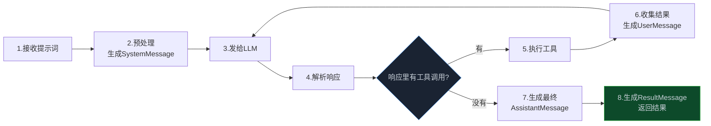
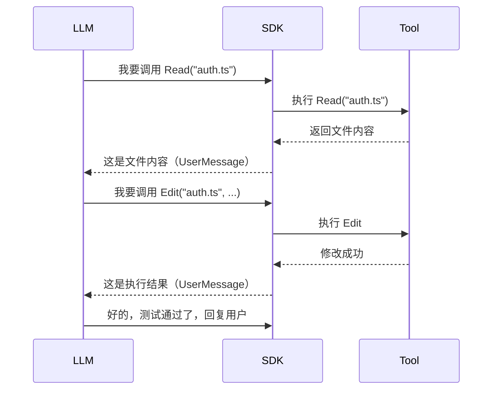

> **📖 系列难度说明**：本篇为**进阶**，适合已经跑通过简单 Agent Loop、想理解成熟框架内部机制的开发者。
> **🎁 核心收获**：读完本篇你将理解 SDK 级 Agent Loop 的消息处理流程，以及 Hooks 机制如何让你不侵入核心逻辑就能控制一切。

你每次给 Claude/ChatGPT 发一条消息，从按下回车到看到回复，背后其实经历了十几个步骤。

为什么有时 Agent 会连续调用好几个工具才回复你？为什么有时会突然"顿一下"再继续？

上一篇我们写了 50 行的最简 Loop。但真正生产级的 Agent Loop——比如 Claude Code 的 Agent SDK——内部要复杂得多。这篇带你进入 Agent 的"心脏"看看。

<!-- more -->

---

## 消息的完整生命周期

先看一张全景图。

Claude Code 的 Agent SDK 文档里描述了一个完整的循环周期，我把它画出来：



用快递物流来类比，一条消息的旅程是这样的：

**揽收**（接收提示词）：你的输入进来了，SDK 先打一条 `SystemMessage`，装上会话元数据——就像快递面单，记录这个包裹属于哪个会话。

**分拣**（预处理 + 发给 LLM）：系统提示词、工具定义、对话历史，全部打包发给 LLM。这一步就像把包裹送到分拣中心，贴好所有标签。

**运输**（LLM 思考）：LLM 在想该怎么回应。这一步最耗时间，你能感受到的那个"顿一下"，基本都在这里。

**派送**（解析响应 + 执行工具）：LLM 回复了，SDK 看它要不要调工具。要调的话，就像包裹到了中转站，要换一辆车继续送——执行工具，拿到结果，再发回 LLM。

**签收**（返回结果）：LLM 终于不再要求调工具了，输出最终文本。SDK 生成一条 `ResultMessage`，附带费用、Token 用量、会话 ID。包裹送达。

> 💡 **来源**：[How the agent loop works - Claude Code Docs](https://code.claude.com/docs/en/agent-sdk/agent-loop) — 每个 Agent 会话都遵循相同的周期：接收提示词 → 评估并响应 → 执行工具 → 重复 → 返回结果

### 关键区分：text response 还是 tool_use

整个生命周期里，最关键的判断是第 5 步——**响应里有没有工具调用？**

这个判断决定了循环是继续还是结束：

- **有工具调用（tool_use）**：Agent 觉得还需要干活，循环继续
- **没有工具调用（纯文本响应）**：Agent 觉得活干完了，循环结束

举个例子。你给 Agent 一个任务："修复 auth.ts 里的测试失败"，整个会话可能是这样的：

| 轮次 | LLM 做了什么 | 工具调用 | 循环状态 |
|------|------------|---------|---------|
| 1 | 跑测试看看哪里挂了 | `Bash("npm test")` | 继续 |
| 2 | 读文件找原因 | `Read("auth.ts")`、`Read("auth.test.ts")` | 继续 |
| 3 | 改代码再跑测试 | `Edit("auth.ts")`、`Bash("npm test")` | 继续 |
| 4 | 测试全过，回复用户 | 无（纯文本） | 结束 |

四个轮次，前三个有工具调用所以循环继续，最后一个纯文本响应，循环结束。

这就是为什么"有时连续调工具"——任务没做完，Agent 一直跑。也解释了"有时顿一下"——每一轮都要等 LLM 思考，轮次越多，等待越长。

---

## 工具执行的那些事

消息流转搞清楚了，我们 zoom in 看看工具执行这个环节。这里面有几个有意思的设计。

### Tool Use 和 Tool Result 的交替模式

工具调用不是一步完成的，而是**一问一答**的模式：



注意一个细节——工具结果是以 `UserMessage` 的形式发回给 LLM 的。在 Claude 的消息体系里，`AssistantMessage` 代表 LLM 的输出（包括工具调用请求），`UserMessage` 代表喂给 LLM 的输入（包括工具执行结果）。

这个交替模式很重要。LLM 每拿到一个工具结果，都会重新评估："根据这个结果，我下一步该干什么？"这就是 Agent 能够根据执行结果动态调整策略的基础。

### 并行工具调用：一次做多件事

上一篇我们的简单 Loop 是串行的——一个工具一个工具执行。但生产级 Agent Loop 支持并行。

Claude Code 的做法很聪明：它根据工具类型决定能不能并行。

- **只读工具**（`Read`、`Glob`、`Grep`）：可以并发跑，因为它们不修改状态
- **写操作工具**（`Edit`、`Write`、`Bash`）：必须顺序跑，避免冲突

想想也合理——同时读 5 个文件没问题，但同时改同一个文件就乱套了。

```python
# 伪代码：并行执行只读工具
def execute_tool_calls(tool_calls):
    readonly = [tc for tc in tool_calls if is_readonly(tc)]
    writeops = [tc for tc in tool_calls if not is_readonly(tc)]

    # 只读工具并发执行
    results = parallel_map(execute, readonly)

    # 写操作顺序执行
    for tc in writeops:
        results.append(execute(tc))

    return results
```

这个设计让 Agent 更快——读 5 个文件，串行要 5 倍时间，并行只要 1 倍。

### 错误处理：工具执行失败了怎么办

工具执行不可能每次都成功。文件可能不存在，命令可能报错，网络可能超时。

生产级 Agent Loop 的做法是——**不要抛异常，把错误信息当工具结果返回给 LLM**。

为什么？因为 LLM 能看懂错误信息，会自己想办法。比如它调 `Bash("npm test")` 失败了，看到报错"找不到 jest 命令"，它可能会接着调 `Bash("npm install")` 把依赖装上，再重试。

```python
# 错误处理的正确姿势
def execute_tool_safely(tool_call):
    try:
        return tools[tool_call.name](**tool_call.args)
    except Exception as e:
        # 别抛异常，返回错误信息让 LLM 自己处理
        return f"工具执行失败：{type(e).__name__}: {str(e)}"
```

上一篇我们写的简单 Loop 其实已经用了这个模式，只是没有展开讲。这里补上原理。

---

## Hooks：在 Loop 的关键节点插入你的逻辑

到目前为止，我们的 Loop 是个黑盒——消息进去，结果出来，中间发生什么你管不了。

但生产环境你经常需要干预。比如：

- Agent 要删文件之前，先问你一声
- 每次工具调用都记个日志
- 花费超过 10 美元就报警
- 敏感操作要审计

这些需求如果直接改 Loop 的核心代码，会把代码搞得一团糟。Hooks 就是为了解决这个问题。

### 什么是 Hooks

Hooks 是在循环特定节点触发的回调。你在关键位置"钩住"，插入自己的逻辑，但不用动核心代码。

Claude Code 的 Agent SDK 提供了几个常用 Hook 点：

| Hook | 触发时机 | 常见用途 |
|------|----------|----------|
| `UserPromptSubmit` | 发送提示词时 | 向提示词注入额外上下文 |
| `PreToolUse` | 工具执行前 | 验证输入，阻止危险命令 |
| `PostToolUse` | 工具返回后 | 审计输出，触发副作用 |
| `Stop` | Agent 完成时 | 验证结果，保存会话状态 |
| `SubagentStart` / `SubagentStop` | 子 Agent 启动/完成时 | 追踪并行任务结果 |
| `PreCompact` | 上下文压缩前 | 归档完整记录、把关键信息存到外部防止被压缩丢失 |

> 💡 **来源**：[How the agent loop works - Claude Code Docs](https://code.claude.com/docs/en/agent-sdk/agent-loop) — Hooks 是在循环特定节点触发的回调，在你的应用进程中运行，不消耗上下文

其中 `PreCompact` 值得单独说一下。它在上下文压缩**发生之前**触发，给你一个机会把完整的对话历史存到外部——因为压缩之后，那些被摘要掉的细节就永远消失了。

```python
# 伪代码：PreCompact Hook 的典型用法
def pre_compact_hook(hook_data):
    """
    hook_data 包含：
    - trigger: "manual"（手动触发）或 "auto"（自动触发）
    - messages: 当前完整的消息列表
    - session_id: 当前会话 ID
    """
    session_id = hook_data.get("session_id")
    messages = hook_data.get("messages", [])

    # 把完整历史存到文件，压缩后还能回溯
    archive_path = f".agent_archives/{session_id}_{timestamp()}.json"
    with open(archive_path, "w") as f:
        json.dump({"messages": messages}, f, ensure_ascii=False)

    # 提取关键信息（已修改的文件列表等），后续注入系统提示词
    modified_files = extract_modified_files(messages)
    save_to_state(session_id, "modified_files", modified_files)

agent.register_hook("PreCompact", pre_compact_hook)
```

`PreCompact` 和第04篇要讲的上下文压缩是配套的——压缩前存档，压缩后把关键信息重新注入，这样 Agent 就不会因为压缩而

有个细节值得注意——**Hooks 在你的应用进程里运行，不在 Agent 的上下文窗口内**。这意味着 Hook 逻辑不占 Token，也不影响 Agent 的思考。你可以写很复杂的审计逻辑，不用担心吃掉上下文。

### 一个实用示例：工具调用的自动审批

假设你搭了个代码 Agent，让它自动改代码。但你不想它随便跑 `Bash` 命令——万一把数据库删了呢？

用 `PreToolUse` Hook 可以实现自动审批：

```python
# 伪代码：用 Hook 实现工具审批
DANGEROUS_COMMANDS = ["rm -rf", "drop table", "format"]

def pre_tool_use_hook(tool_name, tool_input):
    """工具执行前触发"""
    # 记录审计日志
    log(f"Agent 要调用 {tool_name}，参数：{tool_input}")

    # 检查危险命令
    if tool_name == "Bash":
        cmd = tool_input.get("command", "")
        for dangerous in DANGEROUS_COMMANDS:
            if dangerous in cmd.lower():
                # 拒绝执行，返回拒绝原因给 LLM
                return {
                    "allow": False,
                    "reason": f"检测到危险命令：{dangerous}，已拦截"
                }

    # 放行
    return {"allow": True}

# 注册 Hook
agent.register_hook("PreToolUse", pre_tool_use_hook)
```

Hook 返回 `allow: False` 会短路循环——工具不执行，LLM 收到拒绝消息，通常会换个方法试试。

这就是 Hooks 的威力——**不侵入核心逻辑，却能控制一切**。你可以在不修改 Loop 代码的情况下，加上审批、审计、限流、安全检查……各种各样的横切逻辑。

---

## 与上一篇简单 Loop 的对比

现在我们看过两端的实现了——50 行的最简版本，和 SDK 级别的生产实现。差距在哪？

| 能力 | 我们的 50 行版本 | SDK 级别实现 |
|------|----------------|-------------|
| 基本循环 | ✅ 有 | ✅ 有 |
| 终止策略 | ✅ max_iterations + 主动退出 | ✅ + 预算限制、轮次限制 |
| 工具执行 | ✅ 串行，基础错误处理 | ✅ 并行执行、权限控制 |
| 消息类型 | ❌ 只有 user/assistant | ✅ System/Assistant/User/Stream/Result |
| Hooks | ❌ 没有 | ✅ 多个 Hook 点 |
| 上下文管理 | ❌ 没有 | ✅ 自动压缩、提示词缓存 |
| 会话恢复 | ❌ 没有 | ✅ session_id 续传 |
| 可观测性 | ❌ 只有 print | ✅ 完整事件流 |

差距不小。但别急着觉得 50 行版本没用——**大部分场景下，简单版本就够了**。

### 什么时候 50 行够用

- 个人脚本、内部工具
- 任务轮次少（< 10 轮）
- 不需要并行工具
- 不需要审计和安全控制
- 一次性任务，跑完就扔

### 什么时候需要升级

- 生产环境给别人用
- 任务复杂、轮次多（可能几十轮）
- 需要安全控制（不能让 Agent 乱删文件）
- 需要可观测性（要知道 Agent 在干什么）
- 需要会话恢复（用户关了浏览器回来还能接着跑）
- 需要控制成本（预算限制）

有个简单的判断标准：**如果 Loop 出了问题你睡不着觉，就该升级了**。

---

## 📝 小结

- 消息在 Agent 内部的生命周期：接收 → 预处理 → 发给 LLM → 解析响应 → 执行工具 → 收集结果 → 再循环 → 返回结果
- 关键分叉点：响应里有工具调用就继续循环，没有就结束
- 工具执行是"一问一答"模式，只读工具可以并行，写操作必须串行
- 错误处理的核心原则：别抛异常，把错误信息返回给 LLM 让它自己处理
- Hooks 让你不侵入核心逻辑就能加审批、审计、限流等横切逻辑
- 50 行版本和 SDK 版本的差距主要在：消息类型、Hooks、上下文管理、会话恢复、可观测性

---

## 🔮 下一篇预告

Agent 跑了十几轮，消息列表越来越长。

突然有一天，你让它重构一个大项目，做到第 10 步它忘了前面做过什么，开始重复操作。

为什么？因为 Token 窗口塞不下了。

下一篇，我们聊聊 Agent 的"记忆"问题——你的 Agent 为什么跑着跑着就"失忆"了？

---

> 📚 **系列导航**
> - 第 01 篇：Agent Loop：被你忽视的 AI 应用核心引擎
> - 第 02 篇：50 行代码实现一个能跑的 Agent Loop
> - **第 03 篇：一条消息在 Agent 内部经历了什么？** ⬅️ 你在这里
> - 第 04 篇：你的 Agent 为什么跑着跑着就"失忆"了？
> - 第 05 篇：当一个 Agent 不够用：多 Agent 协作的编排之道
> - 第 06 篇：Agent Loop 选型指南：三种方案怎么选？
