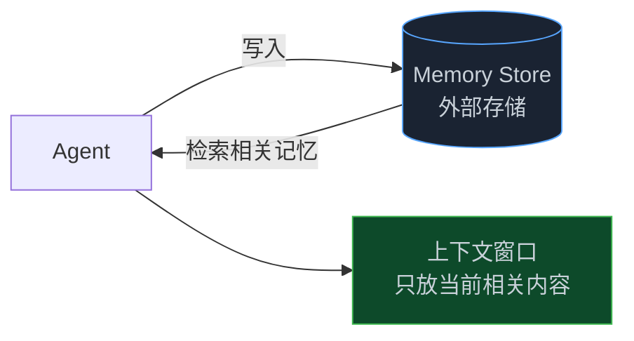
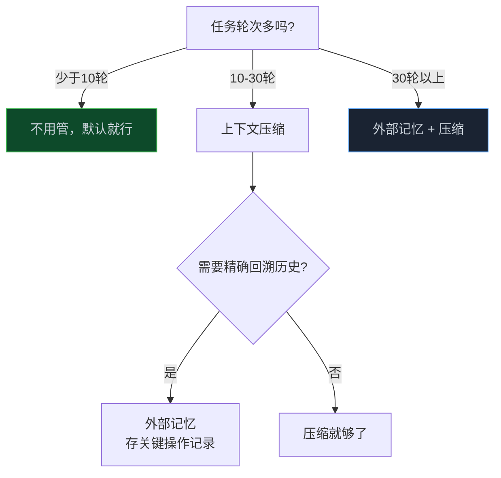

> **📖 系列难度说明**：本篇为**进阶**，适合已经跑通过 Agent Loop、遇到过"失忆"问题的开发者。
> **🎁 核心收获**：读完本篇你将理解 Agent 失忆的根本原因，以及三种上下文管理策略的适用场景和工程权衡。

你让 Agent 重构一个大项目，它跑得挺好，到第 12 步突然开始重复第 3 步做过的事。

你问它"你刚才改了哪些文件"，它说"我还没有修改任何文件"。

明明改了一堆，它说没改。

这不是 Bug，这是 Token 窗口的物理限制在作怪。

<!-- more -->

---

## 先搞清楚：Token 窗口是什么

LLM 不是人，它没有持久记忆。每次调用，它能"看到"的只有你塞进去的那一段文本——这段文本就是**上下文窗口（Context Window）**，以 Token 计量。

Token 大概是什么概念？中文一个字约等于 1.5 个 Token，英文一个单词约等于 1.3 个 Token。GPT-4o 的上下文窗口是 128K Token，Claude 3.5 Sonnet 是 200K Token，换算成中文大概是 8 万到 13 万字。

听起来很多？

Agent 跑起来之后，消息列表会以你想不到的速度膨胀：

- 系统提示词：500 Token 起步
- 工具定义（10 个工具）：2000 Token
- 每轮对话（用户 + 助手 + 工具结果）：500～2000 Token
- 读一个中等大小的文件：1000～5000 Token

跑 20 轮，轻轻松松 5 万 Token。遇到读大文件、跑测试输出很长的情况，10 轮就能把窗口塞满。

窗口满了会怎样？

**轻则降质，重则报错。**

降质是指：LLM 对窗口末尾的内容注意力会下降（这是 Transformer 架构的特性，不是 Bug），早期的对话细节开始被"遗忘"。报错是指：超出窗口上限，API 直接返回错误，Loop 崩掉。

---

## 失忆的三种表现

在实际工程里，上下文溢出不会突然报错，它是慢慢"腐烂"的。

**表现一：重复操作**

Agent 在第 5 步读过 `auth.ts`，到第 15 步又去读了一遍。不是它想读，是它忘了自己读过。早期的工具调用记录已经被挤出窗口，它以为自己还没做过这件事。

**表现二：忘记前置条件**

你在开头告诉它"这个项目用 Python 3.11，不要用 3.10 的语法"。跑了 30 轮之后，它开始用 3.10 的语法写代码。因为那条指令已经在窗口里消失了。

**表现三：自相矛盾**

它在第 8 步说"我已经修改了 `config.py`"，到第 20 步说"我还没有修改任何配置文件"。两句话都是它说的，但它已经不记得第 8 步说过什么了。

这三种表现有个共同特征——**Agent 不知道自己失忆了**。它不会说"我忘了"，它会自信地给你一个错误的答案。这才是最危险的地方。

---

## 三板斧：上下文管理的主流解法

面对这个问题，工程上有三种主流解法，各有取舍。

### 解法一：滑动窗口截断

最简单粗暴的做法——消息列表超过阈值，就把最早的几条扔掉。

```python
def trim_messages(messages, max_tokens=100000):
    """滑动窗口：超出限制就截掉最早的消息"""
    # 系统消息永远保留
    system_msgs = [m for m in messages if m["role"] == "system"]
    other_msgs = [m for m in messages if m["role"] != "system"]

    # 从最新的消息往前数，直到 token 数量在限制内
    kept = []
    total_tokens = sum(estimate_tokens(m) for m in system_msgs)

    for msg in reversed(other_msgs):
        msg_tokens = estimate_tokens(msg)
        if total_tokens + msg_tokens > max_tokens:
            break
        kept.insert(0, msg)
        total_tokens += msg_tokens

    return system_msgs + kept
```

这个方法实现简单，但有个致命问题——**工具调用必须成对出现**。

Claude 和 GPT 的消息格式要求：`tool_use`（工具调用请求）和 `tool_result`（工具执行结果）必须配对，缺了任何一个 API 会报错。简单截断很容易把一对拆散，导致 Loop 崩掉。

所以实际工程里，截断要做得更小心：

```python
def trim_messages_safe(messages, max_tokens=100000):
    """安全截断：保证 tool_use 和 tool_result 成对"""
    system_msgs = [m for m in messages if m["role"] == "system"]
    other_msgs = [m for m in messages if m["role"] != "system"]

    # 找到第一个"完整轮次"的起点（不截断进行中的工具调用）
    # 一个完整轮次：user → assistant(可能含 tool_use) → tool_result(s) → assistant
    safe_start = find_safe_truncation_point(other_msgs)
    trimmed = other_msgs[safe_start:]

    return system_msgs + trimmed
```

**适用场景**：任务轮次少、对话历史不重要的场景。比如"帮我查一下这个文件里有没有 TODO"，前几轮的探索过程不重要，只要最新的结果。

**不适用场景**：需要记住早期决策的长任务。比如"按照我们第 2 步讨论的架构方案来实现"，如果第 2 步被截掉了，Agent 就不知道那个架构方案是什么了。

### 解法二：上下文压缩（Summarization）

比截断聪明一点的做法——不是扔掉，而是**压缩**。

把早期的对话历史喂给 LLM，让它总结成一段摘要，用摘要替换原始消息。这样既释放了 Token 空间，又保留了关键信息。

```python
def compress_context(messages, keep_recent=10):
    """
    压缩上下文：把早期消息总结成摘要
    keep_recent: 保留最近 N 条消息不压缩
    """
    if len(messages) <= keep_recent + 1:  # +1 是 system message
        return messages

    system_msg = messages[0]
    to_compress = messages[1:-keep_recent]   # 早期消息
    recent_msgs = messages[-keep_recent:]    # 最近消息，原样保留

    # 让 LLM 总结早期消息
    summary_prompt = f"""
请将以下对话历史总结成简洁的摘要，保留：
1. 已完成的关键操作（读了哪些文件、改了什么）
2. 重要的决策和约束（用什么技术栈、有什么限制）
3. 当前任务的进展状态

对话历史：
{format_messages(to_compress)}
"""
    summary = call_llm(summary_prompt)

    # 用摘要替换早期消息
    summary_msg = {
        "role": "user",
        "content": f"[对话历史摘要]\n{summary}"
    }

    return [system_msg, summary_msg] + recent_msgs
```

这就是 Claude Code 的 `/compact` 命令背后的逻辑。

> 💡 **来源**：[How the agent loop works - Claude Code Docs](https://code.claude.com/docs/en/agent-sdk/agent-loop) — 当上下文接近限制时，SDK 会自动触发压缩，将对话历史总结为摘要，释放 Token 空间

Claude Code 的压缩比截断聪明的地方在于——它不是随机压缩，而是**有选择地保留**。文件内容、工具调用结果这些"原始数据"会被压缩，但"已完成的操作列表"、"当前任务状态"这些"元信息"会被优先保留。

压缩有个代价：**摘要会丢失细节**。

LLM 总结的时候，它觉得不重要的细节会被省略。但有时候那个"不重要的细节"恰好是后续步骤的关键依赖。这就是为什么有时候压缩之后 Agent 的行为会变得奇怪——它在基于一个不完整的历史做决策。

**适用场景**：长任务、需要保留历史决策的场景。比如大型代码重构，前期的架构决策必须被记住。

**不适用场景**：需要精确回溯历史操作的场景。比如"把你刚才改的所有文件都还原"，如果历史被压缩了，它可能记不住改了哪些文件。

### 压缩后"失忆"的根本解法：CLAUDE.md

压缩会丢失细节，但有一类信息是不会被压缩掉的——**CLAUDE.md 里的内容**。

> 💡 **来源**：[How the agent loop works - Claude Code Agent SDK](https://code.claude.com/docs/en/agent-sdk/agent-loop) — 持久性规则应放在 CLAUDE.md 中，而不是放在初始提示词中，因为 CLAUDE.md 内容会在每次请求时重新注入

这是一个很多人不知道的机制：CLAUDE.md 不是一次性注入的，而是**每次请求都重新注入**。

这意味着什么？你在系统提示词里写的"这个项目用 Python 3.11"，跑了 30 轮之后可能被压缩掉了，Agent 开始用 3.10 的语法。但如果你把这条规则放在 CLAUDE.md 里，它每次请求都会重新出现在上下文里，永远不会被压缩掉。

```
项目根目录/
├── CLAUDE.md          ← 持久性规则放这里
├── src/
└── ...
```

CLAUDE.md 里可以放什么：

```markdown
# 项目规范（每次请求都会重新注入，不会被压缩）

## 技术栈约束
- Python 3.11（不要使用 3.10 及以下的语法）
- 使用 pytest，不要用 unittest

## 禁止事项
- 不要修改 config/production.yaml
- 不要删除任何测试文件

## 压缩摘要指令
在生成摘要时，必须保留：
1. 已完成的文件修改列表
2. 当前任务的进展状态
```

注意最后那个"压缩摘要指令"——压缩器在生成摘要时会读取 CLAUDE.md，所以你可以在里面告诉它"压缩时必须保留哪些信息"。这是解决"压缩后失忆"问题最直接的手段。

**判断标准**：什么东西该放 CLAUDE.md，什么该放系统提示词？

- 跨任务都需要遵守的规则 → CLAUDE.md（项目规范、禁止事项、技术栈约束）
- 只针对当次任务的指令 → 系统提示词（"这次任务的目标是..."）

### 解法三：外部记忆（Memory Store）

前两种方法都是在上下文窗口内做文章。第三种方法换了个思路——**把需要记住的东西存到窗口外面**。

这就是外部记忆（Memory Store）的核心思想。



外部记忆有几种常见形式：

**键值存储**：最简单，适合存结构化的状态信息。

```python
# 伪代码：Agent 把关键决策写入外部存储
memory_store = {}

def save_memory(key, value):
    """Agent 主动保存重要信息"""
    memory_store[key] = {
        "value": value,
        "timestamp": time.time()
    }

def recall_memory(key):
    """从外部存储检索信息"""
    return memory_store.get(key, {}).get("value")

# 注册为工具，让 Agent 自己决定什么时候存、什么时候取
register_tool("save_memory", save_memory, "保存重要信息供后续使用", ...)
register_tool("recall_memory", recall_memory, "检索之前保存的信息", ...)
```

**向量数据库**：适合存大量非结构化信息，支持语义检索。

```python
# 伪代码：用向量数据库做语义记忆
import chromadb

client = chromadb.Client()
collection = client.create_collection("agent_memory")

def store_memory(content, metadata=None):
    """存入向量数据库"""
    collection.add(
        documents=[content],
        metadatas=[metadata or {}],
        ids=[str(uuid.uuid4())]
    )

def retrieve_relevant_memory(query, n_results=3):
    """语义检索相关记忆"""
    results = collection.query(
        query_texts=[query],
        n_results=n_results
    )
    return results["documents"][0]
```

**文件系统**：最朴素，但有时候最可靠。

```python
# 伪代码：把任务进度写到文件
def save_progress(task_id, progress):
    with open(f".agent_progress/{task_id}.json", "w") as f:
        json.dump(progress, f, ensure_ascii=False, indent=2)

def load_progress(task_id):
    path = f".agent_progress/{task_id}.json"
    if os.path.exists(path):
        with open(path) as f:
            return json.load(f)
    return None
```

外部记忆的关键问题是——**Agent 要知道什么时候存、存什么、什么时候取**。

这听起来简单，实际上很难。你得在 system prompt 里告诉 Agent"遇到重要决策就存一下"，但 Agent 对"重要"的判断不一定和你一致。有时候它会存一堆没用的东西，有时候它会忘记存真正重要的东西。

**适用场景**：超长任务（几十轮以上）、需要跨会话记忆的场景。比如"帮我持续维护这个项目，每次我来都能接着上次的进度"。

**不适用场景**：简单短任务。引入外部记忆会增加复杂度，短任务根本用不上。

---

## 三种方案的取舍

说了这么多，实际工程里怎么选？



有个更直接的判断标准：

| 场景 | 推荐方案 | 原因 |
|------|---------|------|
| 简单问答、短任务 | 不处理 | 根本不会溢出 |
| 中等复杂任务（10-30 轮） | 上下文压缩 | 平衡效果和复杂度 |
| 大型重构、长期任务 | 外部记忆 + 压缩 | 必须记住历史决策 |
| 需要跨会话记忆 | 外部记忆 + 会话恢复 | 窗口压缩跨不了会话 |

一个容易踩的坑：**不要过早优化**。

很多人一开始就把三种方案全上，结果代码复杂度爆炸，调试起来一场噩梦。实际上大部分场景，Agent 跑 10 轮以内，根本不会遇到上下文溢出。先跑起来，遇到问题再加。

---

## 会话恢复：从断点继续

上下文管理解决的是"单次会话内"的失忆问题。但还有另一种失忆——**用户关了浏览器，回来之后 Agent 从头开始**。

这就需要会话恢复（Session Resume）。

Claude Code 的 Agent SDK 用 `session_id` 来解决这个问题：

```python
# 伪代码：会话恢复
import anthropic

client = anthropic.Anthropic()

def start_or_resume_session(task, session_id=None):
    """
    session_id 为 None：开新会话
    session_id 有值：恢复已有会话
    """
    result = client.beta.messages.create(
        model="claude-opus-4-5",
        max_tokens=8096,
        system="你是一个代码助手。",
        messages=[{"role": "user", "content": task}],
        # 传入 session_id 就能恢复上次的上下文
        metadata={"session_id": session_id} if session_id else None,
    )

    # 保存 session_id，下次用
    new_session_id = result.metadata.get("session_id")
    save_session_id(new_session_id)

    return result, new_session_id
```

> 💡 **来源**：[How the agent loop works - Claude Code Docs](https://code.claude.com/docs/en/agent-sdk/agent-loop) — 每个 Agent 会话都有唯一的 session_id，可用于恢复之前的会话状态

会话恢复背后的机制是——SDK 把压缩后的上下文存在服务端，下次用同一个 `session_id` 请求时，服务端把历史上下文重新注入进来。

这里有个细节值得注意：**恢复的是压缩后的上下文，不是完整历史**。所以会话恢复和上下文压缩是配套的，不是独立的。

实际工程里，会话恢复还需要解决一个问题——**任务状态的持久化**。

光有对话历史不够，你还需要知道"任务做到哪一步了"。比如 Agent 在重构一个项目，改了 20 个文件，突然断了。恢复会话之后，它需要知道哪些文件已经改了、哪些还没改。

这就需要把任务状态也持久化：

```python
# 伪代码：任务状态持久化
import json
import os

class TaskState:
    def __init__(self, task_id):
        self.task_id = task_id
        self.state_file = f".agent_state/{task_id}.json"
        self.state = self._load()

    def _load(self):
        if os.path.exists(self.state_file):
            with open(self.state_file) as f:
                return json.load(f)
        return {
            "completed_steps": [],
            "modified_files": [],
            "pending_steps": [],
            "session_id": None
        }

    def save(self):
        os.makedirs(".agent_state", exist_ok=True)
        with open(self.state_file, "w") as f:
            json.dump(self.state, f, ensure_ascii=False, indent=2)

    def mark_step_done(self, step):
        self.state["completed_steps"].append(step)
        self.save()

    def add_modified_file(self, filepath):
        if filepath not in self.state["modified_files"]:
            self.state["modified_files"].append(filepath)
            self.save()
```

把 `TaskState` 注册成工具，让 Agent 在每次完成一个步骤时主动调用 `mark_step_done`，在每次修改文件时调用 `add_modified_file`。这样即使会话中断，恢复之后也能知道做到哪里了。

---

## 一个真实的踩坑案例

说个我自己遇到的情况，比较典型。

让 Agent 做一个大型代码迁移任务：把一个 Express.js 项目迁移到 Fastify。项目有 40 多个路由文件，估计要跑 50 轮以上。

没有任何上下文管理，直接跑。

前 15 轮很顺，Agent 按计划改文件。到第 18 轮，它开始重复改已经改过的文件。到第 22 轮，它说"我还没有开始迁移任何路由"——明明已经改了 12 个了。

加了上下文压缩之后，情况好多了，但还是有问题——压缩的时候，它把"哪些文件已经迁移"这个关键信息给压没了，导致后来又重复迁移了几个文件。

最后的解法是：**压缩 + 外部记忆双管齐下**。

用外部记忆（一个简单的 JSON 文件）记录"已迁移文件列表"，每次压缩之前先把这个列表存下来。压缩之后，把列表重新注入到系统提示词里。

```python
# 关键：把任务进度注入到系统提示词
def build_system_prompt(task_state):
    base_prompt = "你是一个代码迁移助手，负责将 Express.js 项目迁移到 Fastify。"

    if task_state.state["modified_files"]:
        files_list = "\n".join(f"- {f}" for f in task_state.state["modified_files"])
        base_prompt += f"\n\n【已完成迁移的文件】\n{files_list}\n\n请不要重复迁移这些文件。"

    return base_prompt
```

这个方案跑下来，50 轮没有出现重复操作。

---

## 📝 小结

- Agent 失忆的根本原因：Token 窗口有物理上限，消息列表会随轮次膨胀，早期内容被挤出窗口
- 失忆的三种表现：重复操作、忘记前置条件、自相矛盾——而且 Agent 不知道自己失忆了
- 三种解法的取舍：
  - **截断**：简单粗暴，适合短任务，注意 tool_use/tool_result 必须成对
  - **压缩**：保留关键信息，适合中长任务，但摘要会丢失细节
  - **外部记忆**：最彻底，适合超长任务和跨会话场景，但引入额外复杂度
- 压缩后失忆的根本解法：把持久性规则放 CLAUDE.md 而不是系统提示词——CLAUDE.md 每次请求都会重新注入，不会被压缩掉
- 会话恢复需要两件事：`session_id` 续传 + 任务状态持久化
- 工程建议：先跑起来，遇到问题再加上下文管理，不要过早优化

---

## 🔮 下一篇预告

一个 Agent 搞不定的时候，你会想到多 Agent 协作。

但多 Agent 不是"多几个 Agent 就行了"，它有自己的架构问题：谁来分配任务？Agent 之间怎么传递信息？一个 Agent 失败了整个任务怎么办？

下一篇，我们聊聊多 Agent 协作的编排之道——Orchestrator + Expert 架构，以及那些让人头疼的踩坑经历。

---

> 📚 **系列导航**
> - 第 01 篇：Agent Loop：被你忽视的 AI 应用核心引擎
> - 第 02 篇：50 行代码实现一个能跑的 Agent Loop
> - 第 03 篇：一条消息在 Agent 内部经历了什么？
> - **第 04 篇：你的 Agent 为什么跑着跑着就"失忆"了？** ⬅️ 你在这里
> - 第 05 篇：当一个 Agent 不够用：多 Agent 协作的编排之道
> - 第 06 篇：Agent Loop 选型指南：三种方案怎么选？
