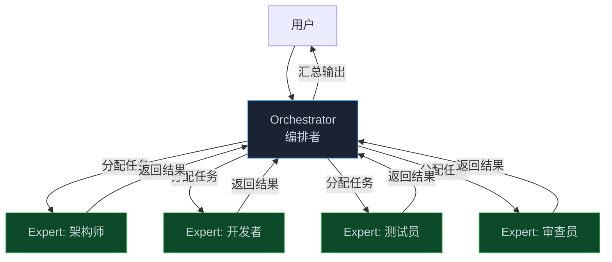
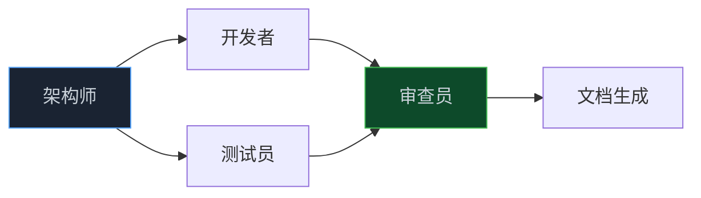

> **📖 系列难度说明**：本篇为**进阶**，适合已经跑通过单 Agent Loop、想处理更复杂任务的开发者。
> **🎁 核心收获**：读完本篇你将理解多 Agent 架构的设计逻辑，以及什么时候该上多 Agent、什么时候一个就够。

你让 Agent 把一个老项目从 JavaScript 迁移到 TypeScript。

它开始干了。读文件、改代码、跑测试……跑了 30 轮，改了一半，上下文快满了。你让它继续，它开始忘事。你加了上下文压缩，它把之前的架构决策压没了，后面改的代码和前面对不上。

加大 Token 窗口？治标不治本。下次遇到更大的项目还是一样。

这时候你会想：要不上多个 Agent？

但多 Agent 不是"多几个 Agent 就行了"。它有自己的架构问题，而且坑比单 Agent 多得多。

<!-- more -->

---

## 为什么一个 Agent 不够用

在聊怎么做之前，先搞清楚为什么要做。

多 Agent 不是银弹，它解决的是特定问题。大概有三种情况，一个 Agent 真的搞不定：

**情况一：任务太长，上下文装不下**

上一篇讲过，Token 窗口有物理上限。有些任务天然就很长——迁移一个大项目、审查整个代码库、生成完整的技术文档。这类任务不是"跑久一点"就能解决的，它需要把任务拆开，让不同的 Agent 各自处理一段。

**情况二：任务需要不同的专业能力**

一个 Agent 的 system prompt 决定了它的"人设"。你不可能在一个 system prompt 里同时把它调教成"严格的代码审查员"和"宽松的创意写手"——这两种角色的行为模式是冲突的。

多 Agent 的好处是每个 Agent 可以有自己的专属 system prompt，专注做一件事。架构师 Agent 只管设计，不管实现细节；测试 Agent 只管找 Bug，不管代码风格。

**情况三：任务可以并行**

单 Agent 是串行的——一件事做完再做下一件。但有些任务天然可以并行：同时审查 5 个模块、同时生成 3 个方案、同时跑多个测试套件。

多 Agent 可以让这些任务同时跑，时间缩短到 1/N。

---

## Orchestrator + Expert：最主流的架构

多 Agent 的架构有很多种，但最经过实战检验的是 **Orchestrator + Expert** 模式。

思路很简单：一个 Orchestrator（编排者）负责理解任务、拆分任务、分配任务；多个 Expert（专家）各自负责一个专业领域，接到任务就干，干完汇报结果。



Saik0s/agent-loop 就是这个架构的典型实现。它的设计思路是：

> 💡 **来源**：[Saik0s/agent-loop - GitHub](https://github.com/Saik0s/agent-loop) — 由 Orchestrator 管理的专家 Agent 团队，每个专家有自己的 system prompt、工具集和对话历史，处理从规划到部署的各类任务

每个 Expert 是一个独立的 Agent，有自己的：
- **system prompt**：定义它的角色和行为边界
- **工具集**：只给它需要的工具（架构师不需要跑测试的工具）
- **对话历史**：独立的上下文，不和其他 Agent 共享

Orchestrator 本身也是一个 Agent，但它的工具集比较特殊——它的"工具"是调用其他 Agent。

### Orchestrator 的职责

Orchestrator 不是万能的，它只做三件事：

**拆任务**：把用户的大任务分解成子任务。"把项目迁移到 TypeScript"可能被拆成：分析现有代码结构 → 制定迁移方案 → 逐模块迁移 → 测试验证 → 生成迁移报告。

**派任务**：判断每个子任务该交给哪个 Expert。读代码、分析结构 → 架构师；写代码 → 开发者；跑测试 → 测试员；检查代码质量 → 审查员。

**汇结果**：收集各 Expert 的输出，判断任务是否完成，决定下一步。如果测试员说"有 3 个测试失败"，Orchestrator 要决定是让开发者去修，还是直接报告给用户。

Orchestrator 不应该自己去读文件、改代码。它是"项目经理"，不是"程序员"。

### Expert 的职责

Expert 的职责更简单——**接到任务，干完，汇报**。

它不需要知道整个任务的全貌，只需要知道自己这一块该怎么做。这就是为什么每个 Expert 可以有更专注的 system prompt——它的视野本来就是局部的。

```python
# 伪代码：Expert Agent 的基本结构
class ExpertAgent:
    def __init__(self, name, system_prompt, tools):
        self.name = name
        self.system_prompt = system_prompt
        self.tools = tools
        self.messages = []  # 独立的对话历史

    def execute(self, task: str) -> str:
        """接收任务，执行，返回结果"""
        # 每次执行都是独立的上下文
        self.messages = [
            {"role": "system", "content": self.system_prompt},
            {"role": "user", "content": task}
        ]

        # 跑 Agent Loop 直到完成
        return run_agent_loop(self.messages, self.tools)
```

注意一个细节——每次执行都重置 `messages`。这是有意为之的：Expert 不需要记住上次干了什么，它只需要专注当前任务。上下文的连续性由 Orchestrator 来维护。

---

## Agent 间通信：三种模式

多 Agent 架构里，最容易被忽视的问题是——**Agent 之间怎么传递信息**？

这不是小问题。信息传递的方式决定了整个系统的可靠性和可调试性。

### 模式一：直接调用（同步）

最简单的方式。Orchestrator 直接调用 Expert，等它返回结果，再继续。

```python
# 伪代码：直接调用模式
class Orchestrator:
    def __init__(self):
        self.experts = {
            "architect": ExpertAgent("架构师", ARCHITECT_PROMPT, ARCHITECT_TOOLS),
            "developer": ExpertAgent("开发者", DEVELOPER_PROMPT, DEVELOPER_TOOLS),
            "tester": ExpertAgent("测试员", TESTER_PROMPT, TESTER_TOOLS),
        }

    def run(self, task: str) -> str:
        # Orchestrator 自己也是一个 Agent，工具是调用 Expert
        tools = {
            "call_architect": lambda t: self.experts["architect"].execute(t),
            "call_developer": lambda t: self.experts["developer"].execute(t),
            "call_tester": lambda t: self.experts["tester"].execute(t),
        }
        return run_agent_loop(task, tools)
```

好处：简单、好调试，执行顺序清晰。

坏处：串行的。Orchestrator 调 Expert A，等 A 完成，再调 Expert B。如果 A 和 B 可以并行，这里就浪费了时间。

**适用场景**：任务有依赖关系，必须按顺序执行。比如"先分析再实现"，分析没完成就没法实现。

### 模式二：并行调用（异步）

Orchestrator 同时启动多个 Expert，等所有人都完成再汇总。

```python
import asyncio

class OrchestratorAsync:
    async def run_parallel(self, tasks: dict) -> dict:
        """
        tasks: {"expert_name": "task_description", ...}
        同时启动所有 Expert，等全部完成
        """
        coroutines = {
            name: self.experts[name].execute_async(task)
            for name, task in tasks.items()
        }

        results = await asyncio.gather(*coroutines.values())
        return dict(zip(coroutines.keys(), results))

    async def run(self, task: str) -> str:
        # 第一步：让架构师分析（必须先完成）
        analysis = await self.experts["architect"].execute_async(task)

        # 第二步：开发者和测试员可以并行（开发者写代码，测试员写测试用例）
        results = await self.run_parallel({
            "developer": f"根据以下分析实现代码：{analysis}",
            "tester": f"根据以下分析编写测试用例：{analysis}",
        })

        # 第三步：审查员审查（需要等前两步完成）
        review = await self.experts["reviewer"].execute_async(
            f"审查以下代码和测试：\n代码：{results['developer']}\n测试：{results['tester']}"
        )

        return review
```

好处：并行任务同时跑，时间大幅缩短。

坏处：调试复杂，多个 Agent 同时跑，出了问题不好定位。而且需要处理异步编程，代码复杂度上升。

**适用场景**：任务之间没有依赖关系，可以同时进行。

### 模式三：共享状态（黑板模式）

前两种模式，Agent 之间的通信是"点对点"的——Orchestrator 直接把信息传给 Expert。

第三种模式换了个思路——**所有 Agent 共享一个"黑板"，谁需要什么信息就去黑板上取，谁完成了什么就写到黑板上**。

```python
# 伪代码：黑板模式
class Blackboard:
    """共享状态存储"""
    def __init__(self):
        self._data = {}

    def write(self, key: str, value, author: str):
        self._data[key] = {
            "value": value,
            "author": author,
            "timestamp": time.time()
        }

    def read(self, key: str):
        return self._data.get(key, {}).get("value")

    def list_keys(self) -> list:
        return list(self._data.keys())

# 每个 Agent 都能读写黑板
blackboard = Blackboard()

# 架构师完成分析后写入黑板
blackboard.write("architecture_analysis", analysis_result, "architect")

# 开发者从黑板读取分析结果
analysis = blackboard.read("architecture_analysis")
```

好处：解耦。Agent 之间不需要直接通信，只需要约定好黑板上的 key。新增一个 Agent 不需要修改其他 Agent 的代码。

坏处：黑板可能变成"垃圾场"——每个 Agent 都往上写，最后谁也不知道哪些信息是有效的、哪些是过时的。

**适用场景**：Agent 数量多、依赖关系复杂的场景。比如 10 个 Agent 互相依赖，用点对点通信会乱成一锅粥，黑板模式更清晰。

---

## 踩坑实录：多 Agent 的那些坑

说完架构，说说坑。多 Agent 的坑比单 Agent 多，而且更难调试。

### 坑一：信息在传递中丢失

这是最常见的坑。

Orchestrator 把任务描述传给 Expert，Expert 完成后把结果传回来。听起来没问题，但实际上每次传递都会丢失信息。

举个例子。用户说"按照我们之前讨论的架构方案，实现用户认证模块"。Orchestrator 把这个任务传给开发者 Expert，但"之前讨论的架构方案"在 Orchestrator 的上下文里，不在开发者 Expert 的上下文里。开发者 Expert 不知道那个方案是什么，只能瞎猜。

解法：**Orchestrator 在传递任务时，必须把相关上下文一起传过去**。

```python
# 错误做法：只传任务描述
developer.execute("实现用户认证模块")

# 正确做法：把相关上下文一起传
context = blackboard.read("architecture_decision")
developer.execute(f"""
任务：实现用户认证模块

相关架构决策：
{context}

请基于以上架构决策进行实现。
""")
```

这听起来简单，但实际上很难做好——你得判断哪些上下文是相关的，哪些是不必要的噪音。传太少，Expert 信息不足；传太多，Expert 的上下文被无关信息占满。

### 坑二：循环依赖

Orchestrator 让 Expert A 完成任务，A 说"我需要 B 的结果才能继续"。Orchestrator 去问 B，B 说"我需要 A 的结果才能继续"。

死锁了。

这在设计阶段很难发现，因为每个 Expert 的需求看起来都合理。只有真正跑起来才会发现循环。

解法：**在设计阶段画出 Agent 的依赖图，确保没有环**。



这张图是有向无环图（DAG），没有循环依赖。如果你的依赖图里出现了环，就需要重新设计任务拆分方式。

### 坑三：子 Agent 失控

你让 Orchestrator 完成一个任务，它调了开发者 Expert，开发者 Expert 觉得需要更多信息，自己又调了一个搜索 Agent，搜索 Agent 又调了……

层级越来越深，你完全不知道系统在干什么。

更糟糕的是，某个深层的 Agent 出了错，错误信息经过层层传递，到 Orchestrator 这里已经面目全非，根本不知道哪里出了问题。

解法：**限制调用深度，超过 N 层就强制终止**。

```python
class AgentCallStack:
    """追踪 Agent 调用深度"""
    def __init__(self, max_depth=3):
        self.stack = []
        self.max_depth = max_depth

    def push(self, agent_name: str):
        if len(self.stack) >= self.max_depth:
            raise RuntimeError(
                f"Agent 调用深度超过限制 ({self.max_depth})。"
                f"当前调用链：{' → '.join(self.stack)} → {agent_name}"
            )
        self.stack.append(agent_name)

    def pop(self):
        self.stack.pop()

    def __enter__(self):
        return self

    def __exit__(self, *args):
        self.pop()

# 使用
call_stack = AgentCallStack(max_depth=3)

def call_expert(expert_name, task):
    with call_stack:
        call_stack.push(expert_name)
        return experts[expert_name].execute(task)
```

### 坑四：结果不一致

开发者 Expert 写了一套代码，测试员 Expert 写了一套测试，两者对同一个函数的理解不一样——开发者觉得 `getUserById` 返回 `null`，测试员觉得它抛异常。

这不是 Bug，是两个 Agent 的上下文不同导致的理解偏差。

解法：**建立共享的"契约文档"**，在任务开始前让架构师 Agent 生成接口定义，所有 Expert 都基于这份定义工作。

```python
# 第一步：架构师生成接口契约
contract = architect.execute("""
为用户认证模块生成接口定义，包括：
1. 函数签名
2. 参数类型
3. 返回值类型
4. 异常情况
输出格式：TypeScript 接口定义
""")

# 把契约写入黑板
blackboard.write("api_contract", contract, "architect")

# 后续所有 Expert 都基于契约工作
developer.execute(f"基于以下接口定义实现代码：\n{contract}")
tester.execute(f"基于以下接口定义编写测试：\n{contract}")
```

---

## 一个完整的例子：代码审查系统

说了这么多理论，来看一个完整的例子。

假设你要搭一个代码审查系统：用户提交代码，系统自动审查，给出改进建议。

用单 Agent 做？可以，但有问题——同一个 Agent 既要看代码风格，又要看安全漏洞，又要看性能问题，它的注意力会分散，每个方面都看得不够深。

用多 Agent 做：

```python
# 三个专家，各司其职
STYLE_REVIEWER_PROMPT = """
你是一个代码风格审查专家。
你的职责：检查代码是否符合规范，包括命名、格式、注释。
你不关心：安全问题、性能问题、业务逻辑。
输出格式：列出具体的风格问题，每条附上行号和改进建议。
"""

SECURITY_REVIEWER_PROMPT = """
你是一个安全审查专家。
你的职责：检查代码中的安全漏洞，包括 SQL 注入、XSS、权限控制。
你不关心：代码风格、性能优化。
输出格式：列出安全风险，每条附上风险等级（高/中/低）和修复建议。
"""

PERFORMANCE_REVIEWER_PROMPT = """
你是一个性能优化专家。
你的职责：检查代码中的性能问题，包括不必要的循环、重复查询、内存泄漏。
你不关心：代码风格、安全问题。
输出格式：列出性能问题，每条附上预估影响和优化方案。
"""

# Orchestrator 并行调用三个审查员
async def review_code(code: str) -> str:
    results = await asyncio.gather(
        style_reviewer.execute_async(f"审查以下代码的风格：\n{code}"),
        security_reviewer.execute_async(f"审查以下代码的安全性：\n{code}"),
        performance_reviewer.execute_async(f"审查以下代码的性能：\n{code}"),
    )

    style_issues, security_issues, perf_issues = results

    # 汇总报告
    return synthesizer.execute(f"""
请将以下三份审查报告整合成一份完整的代码审查报告：

【风格审查】
{style_issues}

【安全审查】
{security_issues}

【性能审查】
{perf_issues}

要求：按优先级排序，高优先级问题放前面。
""")
```

这个设计的好处：
- 三个审查员并行跑，时间是单 Agent 的 1/3
- 每个审查员专注自己的领域，不会被其他问题分散注意力
- 最后由 Synthesizer 汇总，避免三份报告格式不统一

---

## 什么时候该上多 Agent

多 Agent 不是越多越好。它引入了额外的复杂度——更多的 API 调用、更难调试、更多的信息传递开销。

用一个简单的判断标准：

| 情况 | 建议 |
|------|------|
| 任务 < 20 轮，单 Agent 能搞定 | 别上多 Agent，复杂度不值得 |
| 任务需要不同的专业视角 | 考虑多 Agent，每个 Agent 专注一个角度 |
| 任务有明显的并行机会 | 上多 Agent，时间收益明显 |
| 任务太长，上下文装不下 | 先试试上下文压缩，真的不够再上多 Agent |
| 任务依赖关系复杂 | 谨慎，先画依赖图，确认没有循环 |

有个更直接的问题可以帮你判断：**如果你把这个任务交给一个人类团队，你会怎么分工？**

如果答案是"一个人就能搞定"，那单 Agent 就够了。如果答案是"需要架构师、开发者、测试员各一个"，那多 Agent 是合理的。

多 Agent 本质上是在模拟人类团队协作。人类团队怎么分工，多 Agent 就怎么设计。

---

## 📝 小结

- 一个 Agent 不够用的三种情况：任务太长、需要不同专业能力、任务可以并行
- Orchestrator + Expert 是最主流的多 Agent 架构：Orchestrator 拆任务派任务，Expert 专注执行
- Agent 间通信三种模式：直接调用（简单有序）、并行调用（高效但复杂）、黑板模式（解耦但容易乱）
- 四个常见坑：信息传递丢失、循环依赖、子 Agent 失控、结果不一致
- 判断是否需要多 Agent：先问"一个人类能搞定吗"，能搞定就别上多 Agent

---

## 🔮 下一篇预告

现在你知道了三种 Agent Loop 方案：确定性循环、SDK Agent Loop、多 Agent 编排。

但面对一个具体项目，你该选哪个？

下一篇是这个系列的收尾——一张选型决策树，帮你在 5 分钟内决定用哪种方案，以及一份设计清单，让你少踩坑。

---

> 📚 **系列导航**
> - 第 01 篇：Agent Loop：被你忽视的 AI 应用核心引擎
> - 第 02 篇：50 行代码实现一个能跑的 Agent Loop
> - 第 03 篇：一条消息在 Agent 内部经历了什么？
> - 第 04 篇：你的 Agent 为什么跑着跑着就"失忆"了？
> - **第 05 篇：当一个 Agent 不够用：多 Agent 协作的编排之道** ⬅️ 你在这里
> - 第 06 篇：Agent Loop 选型指南：三种方案怎么选？
