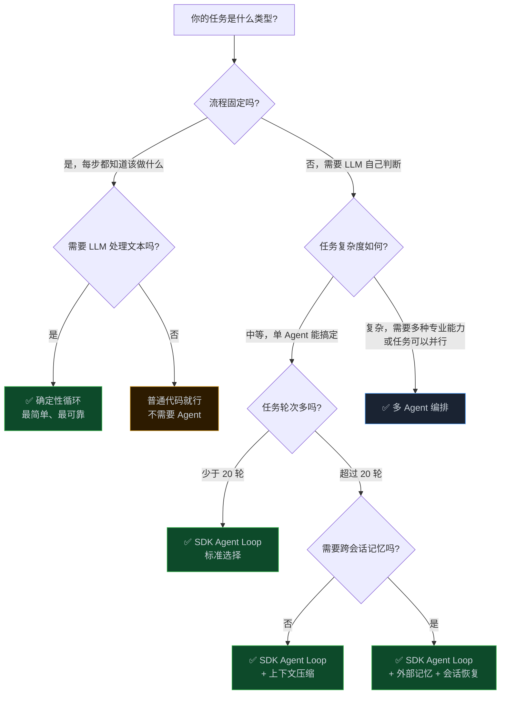

> **📖 系列难度说明**：本篇为**综合**，适合读完前五篇、准备动手做项目的开发者。
> **🎁 核心收获**：一张选型决策树 + 五个真实场景示范 + 一份上线前设计清单，帮你在 5 分钟内决定用哪种方案。

读完前五篇，你大概知道了三件事：

Agent Loop 是什么、怎么实现、会遇到哪些坑。

但知道归知道，真正要动手做一个项目的时候，还是会卡在同一个问题上——

**我到底该用哪种方案？**

这篇就是来解决这个问题的。

<!-- more -->

---

## 先把三种方案摆出来

前五篇讲了三种方案，这里快速过一遍各自的核心特征，不展开，只说关键点。

### 方案一：确定性循环（Deterministic Loop）

你写死了每一步该做什么。LLM 只负责处理单步的文本任务，不做决策。

```python
# 伪代码：确定性循环
def run(input):
    step1_result = llm_call("提取关键词", input)
    step2_result = llm_call("生成摘要", step1_result)
    step3_result = llm_call("翻译成英文", step2_result)
    return step3_result
```

**关键特征**：流程固定、结果可预期、调试容易、不会"跑偏"。

**代价**：灵活性为零。遇到意外情况，它不会绕路，只会卡死。

### 方案二：SDK Agent Loop

用现成的 SDK（LangChain、Claude Agent SDK、OpenAI Assistants API 等），让 LLM 自己决定调用哪些工具、调用几次、什么时候停。

```python
# 伪代码：SDK Agent Loop
agent = create_agent(
    model="claude-opus-4-5",
    tools=[search_tool, read_file_tool, write_file_tool],
    system_prompt="你是一个代码助手..."
)
result = agent.run("帮我重构这个函数")
# LLM 自己决定：先读文件 → 分析 → 写新代码 → 验证
```

**关键特征**：LLM 自主决策、能处理意外情况、工具调用灵活。

**代价**：结果不确定、调试难、Token 消耗大、可能跑偏。

### 方案三：多 Agent 编排

多个专业 Agent 协作，由 Orchestrator 统一调度。

**关键特征**：任务可以并行、每个 Agent 专注一个领域、能处理超长任务。

**代价**：架构复杂、调试更难、信息传递有损耗、成本更高。

---

## 选型决策树

说完三种方案，直接上决策树。



这棵树的核心逻辑只有两个问题：

**问题一：流程固定吗？**

如果你能在写代码之前就把每一步写出来，那就用确定性循环。不需要 LLM 做决策，只需要 LLM 处理文本。

**问题二：任务有多复杂？**

如果流程不固定，就要 LLM 自主决策。这时候看任务复杂度——单 Agent 能搞定就用 SDK Agent Loop，搞不定才上多 Agent。

多 Agent 是最后的选择，不是第一选择。

---

## 五个真实场景的选型示范

光看决策树还是抽象，来看五个具体场景。

### 场景一：自动生成周报

**需求**：每周一自动拉取 Jira 数据，生成一份周报发到飞书。

**分析**：流程完全固定——拉数据 → 格式化 → 让 LLM 写成人话 → 发送。每步都知道该做什么，LLM 只负责把结构化数据转成自然语言。

**选型：确定性循环。**

```python
def generate_weekly_report():
    # 步骤固定，不需要 LLM 做决策
    jira_data = fetch_jira_issues(last_week())
    formatted = format_issues(jira_data)
    report = llm_call("把以下 Jira 数据写成周报", formatted)
    send_to_feishu(report)
```

用 SDK Agent Loop？大材小用，而且引入了不确定性——LLM 可能决定"再查一下上周的数据对比一下"，然后跑偏了。

### 场景二：代码 Bug 修复助手

**需求**：用户描述一个 Bug，Agent 自动定位、修复、验证。

**分析**：流程不固定。不同的 Bug 需要不同的排查路径——有的需要读多个文件，有的需要跑测试，有的需要查文档。LLM 需要自己判断下一步做什么。任务轮次中等，一般 10-20 轮能搞定。

**选型：SDK Agent Loop。**

工具集：`read_file`、`write_file`、`run_tests`、`search_code`。

让 LLM 自己决定读哪些文件、改什么、怎么验证。

### 场景三：大型代码库迁移

**需求**：把一个 50 个模块的 Python 2 项目迁移到 Python 3。

**分析**：流程不固定（不同模块的迁移方式不同），任务超长（50 个模块，轻松 100 轮以上），而且各模块之间有依赖关系。

单 Agent 搞不定——上下文会溢出，而且串行处理 50 个模块太慢。

**选型：多 Agent 编排 + 上下文管理。**

```
Orchestrator
├── 分析 Agent：分析每个模块的依赖关系，生成迁移顺序
├── 迁移 Agent（可并行）：负责实际代码改写
├── 测试 Agent：验证迁移后的代码
└── 报告 Agent：汇总迁移结果
```

迁移 Agent 可以并行跑——没有依赖关系的模块同时处理，时间缩短到 1/N。

### 场景四：智能客服问答

**需求**：用户提问，Agent 从知识库检索相关内容，生成回答。

**分析**：流程基本固定——检索 → 生成。但"检索"这一步可能需要多轮（第一次检索结果不够好，需要换关键词再检索）。

这里有个判断：如果检索策略固定（比如永远用向量检索），用确定性循环就够了。如果需要 LLM 自己判断"这次检索结果不够好，换个角度再查"，才需要 SDK Agent Loop。

**选型：看检索策略是否固定。**

- 固定策略 → 确定性循环（更可靠、更快）
- 动态策略 → SDK Agent Loop（更灵活，但成本更高）

大部分客服场景，确定性循环就够了。

### 场景五：自动化数据分析报告

**需求**：给定一份 CSV 数据，自动分析、生成图表、写出分析报告。

**分析**：流程不完全固定——不同的数据集需要不同的分析角度，LLM 需要先看数据再决定分析什么。但任务轮次不多，一般 10 轮以内。

**选型：SDK Agent Loop。**

工具集：`read_csv`、`run_python`（执行数据分析代码）、`generate_chart`、`write_report`。

让 LLM 先读数据，自己决定做哪些分析，然后生成图表和报告。

---

## 上线前的设计清单

选好方案之后，上线前还有一堆细节要确认。这份清单是我踩过坑之后总结的，按方案分类。

### 确定性循环上线前

**✅ 错误处理**
- [ ] 每个 LLM 调用都有重试逻辑（网络抖动、API 限流）
- [ ] 每个步骤的输出都有格式校验（LLM 输出不稳定，可能不符合预期格式）
- [ ] 整体流程有超时保护（某步卡住不会让整个流程挂着）

**✅ 成本控制**
- [ ] 每个 LLM 调用的 Token 消耗是否在预期范围内
- [ ] 是否有不必要的大文本传入（比如把整个文件塞进去，其实只需要部分内容）

**✅ 可观测性**
- [ ] 每步的输入输出是否有日志
- [ ] 是否能快速定位"哪一步出了问题"

### SDK Agent Loop 上线前

**✅ 工具设计**
- [ ] 每个工具的描述是否足够清晰（LLM 靠描述决定用哪个工具）
- [ ] 工具的返回值是否简洁（返回太多内容会占用上下文）
- [ ] 危险操作（删除文件、发送邮件）是否有二次确认机制

**✅ 终止条件**
- [ ] 是否设置了最大轮次限制（防止无限循环）
- [ ] LLM 是否知道什么时候该停（system prompt 里有没有说清楚）

**✅ 上下文管理**
- [ ] 预估任务轮次，是否需要上下文压缩
- [ ] 工具返回的内容是否会撑爆上下文（比如读了一个 10 万字的文件）

**✅ 异常处理**
- [ ] 工具调用失败时，LLM 会怎么处理（是重试还是放弃）
- [ ] 是否有人工介入机制（任务跑偏时能叫停）

**✅ 成本预估**
- [ ] 单次任务的预估 Token 消耗
- [ ] 是否设置了 Token 预算上限

### 多 Agent 编排上线前

**✅ 架构设计**
- [ ] 画出 Agent 依赖图，确认没有循环依赖
- [ ] 每个 Expert 的职责边界是否清晰（不要有职责重叠）
- [ ] Orchestrator 的任务拆分逻辑是否合理

**✅ 信息传递**
- [ ] Orchestrator 传给 Expert 的上下文是否足够（不要让 Expert 猜）
- [ ] Expert 返回给 Orchestrator 的结果格式是否统一
- [ ] 是否有共享的"契约文档"（接口定义、数据格式）

**✅ 容错机制**
- [ ] 某个 Expert 失败时，整体任务怎么处理（重试/跳过/报错）
- [ ] 是否限制了 Agent 调用深度（防止子 Agent 失控）
- [ ] 并行任务中某个失败，其他任务怎么处理

**✅ 成本控制**
- [ ] 多 Agent 的总 Token 消耗是否在预算内（多 Agent 成本是单 Agent 的 N 倍）
- [ ] 是否有不必要的 Agent（能合并的合并，减少通信开销）

---

## 一个容易犯的错误：过度设计

说完选型，说一个反面教材。

我见过不少人，一上来就搭多 Agent 架构——Orchestrator、五个 Expert、黑板模式、向量数据库记忆……

结果呢？

代码写了两周，调试又花了一周，最后发现任务其实 20 轮以内就能搞定，一个 SDK Agent Loop 加几个工具就够了。

多 Agent 架构的复杂度是指数级的。每增加一个 Agent，调试难度就翻一倍。信息传递的损耗、循环依赖的风险、子 Agent 失控的可能——这些问题在单 Agent 里根本不存在。

**工程上有个原则叫 YAGNI（You Aren't Gonna Need It）——你不会需要它的。**

先用最简单的方案跑起来。跑起来之后遇到了具体问题，再针对性地升级。

- 跑 10 轮就够了？确定性循环。
- 需要 LLM 自主决策？SDK Agent Loop。
- 单 Agent 真的搞不定了？再上多 Agent。

这个顺序不要颠倒。

---

## 系列总结：Agent Loop 的本质是什么

写到这里，这个系列差不多收尾了。

回头看六篇文章，其实在说一件事——

**Agent Loop 是一个让 LLM 能够"行动"的框架。**

LLM 本身只会生成文本。Agent Loop 给了它工具，让它能读文件、写代码、查数据库；给了它循环，让它能一步一步完成复杂任务；给了它记忆，让它能记住做过什么、决定过什么。

但 LLM 终究不是人。它没有持久记忆，它的"判断"受上下文影响，它会在 Token 窗口满了之后"失忆"，它在多 Agent 协作时会因为信息传递不完整而做出错误决策。

这些不是 Bug，是 LLM 的本质特性。

工程师的工作，是在这些限制之内，设计出能可靠运行的系统。

选对方案是第一步。但更重要的是——**先跑起来，再迭代**。

没有哪个 Agent 系统是一次设计就完美的。你会遇到上下文溢出、工具调用失败、LLM 跑偏、成本超预算……这些问题只有在真实运行中才会暴露。

遇到问题，回到这个系列找对应的章节，针对性地解决。

这才是这个系列真正的用法。

---

## 📝 系列完整导航

> 📚 **AI Agent Loop 工程实践系列**
>
> - **第 01 篇**：Agent Loop：被你忽视的 AI 应用核心引擎
>   — 什么是 Agent Loop，为什么它是 AI 应用的核心
>
> - **第 02 篇**：50 行代码实现一个能跑的 Agent Loop
>   — 从零手写一个最小可用的 Agent Loop
>
> - **第 03 篇**：一条消息在 Agent 内部经历了什么？
>   — 深入 Agent Loop 的内部机制：消息格式、工具调用、停止条件
>
> - **第 04 篇**：你的 Agent 为什么跑着跑着就"失忆"了？
>   — Token 窗口限制、上下文压缩、外部记忆、会话恢复
>
> - **第 05 篇**：当一个 Agent 不够用：多 Agent 协作的编排之道
>   — Orchestrator + Expert 架构、Agent 间通信、踩坑实录
>
> - **第 06 篇：选型指南：三种方案，5 分钟决策** ⬅️ 你在这里
>   — 决策树 + 五个真实场景 + 上线前设计清单
