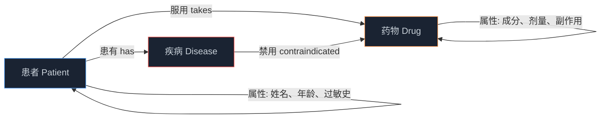
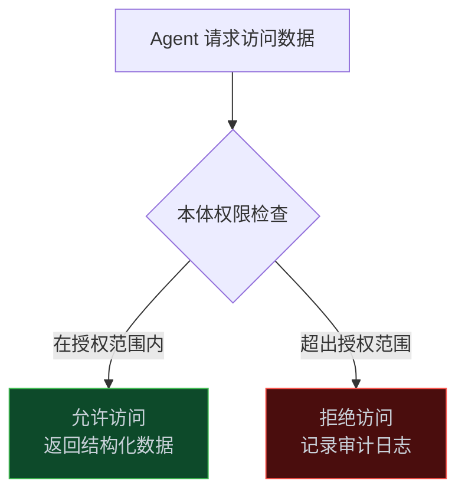

> **📖 系列难度说明**：本篇为**入门导读**，适合所有对 AI Agent 感兴趣的读者。不需要任何前置知识。
> **🎁 核心收获**：读完本篇你会明白 Ontology 到底是什么，以及为什么它是 Agent 从"能用"走向"好用"的关键。

你搭了一个 AI Agent，能回答问题，能调工具，演示效果不错。

然后你把它接进公司系统——它开始乱说话了。

"客户"这个词，CRM 里叫 `customer`，ERP 里叫 `client`，财务系统里叫 `account`。Agent 不知道这三个是同一个东西，于是它给你查了三份互相矛盾的数据，然后自信地给出了一个错误答案。

这不是模型的问题，是**语义的问题**。

解决这个问题的答案，叫 Ontology。

<!-- more -->

---

## Ontology 是什么

先说个反直觉的事：Ontology 这个词来自哲学，原意是研究"什么是存在"的学问。

但在 AI 工程里，它的意思完全不同——**Ontology 是对某个领域知识的结构化、机器可读的显式表述**。

说人话就是：把你业务里的概念、属性、关系，用机器能懂的方式写清楚。

举个例子。一家医院的 Ontology 可能长这样：

有了这个结构，AI 就能自动推理：这个患者对某成分过敏 → 这个药含有该成分 → 这个药对该患者禁用。

不需要你写规则，不需要你写 if-else，**推理从结构里自然流出来**。

---

## 和知识图谱有什么区别？

这是最常见的困惑。

知识图谱（Knowledge Graph）是 Ontology 的一种实现形式，但不是全部。

| 维度 | Ontology | 知识图谱 |
|------|---------|---------|
| 层次 | 概念层（定义"类"和"关系"） | 实例层（存储具体数据） |
| 内容 | 患者"这个概念有哪些属性 | 张三是患者，年龄 35，过敏青霉素 |
| 类比 | 数据库的 Schema | 数据库里的数据 |
| 关系 | Ontology 是知识图谱的骨架 | 知识图谱是 Ontology 的血肉 |

简单说：**Ontology 定义规则，知识图谱存储事实**。

在工程实践里，两者经常一起出现，但概念上要分清楚。

---

## 为什么 Agent 离不开 Ontology

### 问题一：数据歧义

前面说的"客户"问题，是最典型的场景。

大公司里，同一个业务概念往往散落在十几个系统里，每个系统叫法不同、字段不同、口径不同。Agent 没有统一的语义层，就像一个新员工第一天上班，没人告诉他公司的术语体系——他只能靠猜。

Ontology 就是那本"公司术语词典"，而且是机器能直接读懂的那种。

### 问题二：推理能力

LLM 本身有推理能力，但它的推理是基于训练数据的"统计直觉"，不是基于你业务规则的"确定性逻辑"。

你告诉 LLM"A 是 B 的父亲，B 是 C 的父亲"，它大概率能推出"A 是 C 的祖父"。但如果你的业务规则是"供应商 A 的零件用于产品 B，产品 B 用于客户 C 的订单"，LLM 不一定能在复杂的多跳关系里保持准确。

Ontology 把这些关系显式地写出来，Agent 就能做**确定性的多跳推理**，而不是靠运气。

### 问题三：权限和安全

这是企业级 Agent 最头疼的问题。

Agent 能访问什么数据？能执行什么操作？不同角色的用户，Agent 的行为边界在哪里？

Palantir 的做法是：**把权限绑定在 Ontology 上**。你不是给 Agent 一个 API Key，而是给它一个"本体绑定"——它只能访问本体中明确授权的对象和关系。越界了？直接拦截，不需要你在代码里写一堆 if 判断。

---

## 三个层次的理解

这个系列的读者背景不同，我试着用三个层次来解释 Ontology 的价值：

### 🟢 小白层次：Ontology 是 AI 的"业务说明书"

你雇了一个新员工，他很聪明，但不了解你的业务。你给他一本详细的业务说明书——里面写了公司有哪些部门、每个部门做什么、部门之间怎么协作、哪些事情需要审批。

这本说明书就是 Ontology。有了它，新员工（AI Agent）才能真正融入你的业务，而不是靠猜。

### 🔵 普通开发层次：Ontology 是 Agent 的类型系统

写代码时，你知道类型系统的价值——它让编译器帮你发现错误，让 IDE 给你自动补全，让代码更可维护。

Ontology 对 Agent 的作用类似。它定义了业务领域的"类型"：什么是客户、什么是订单、它们之间有什么关系、哪些操作是合法的。

有了这个类型系统，Agent 的行为就从"随机的"变成了"可预测的"。你能在 Ontology 层面做验证，而不是等 Agent 出了错再去 debug。

### 🔴 专家层次：Ontology 是神经符号 AI 的接口层

当前 LLM 的核心局限是：它的推理是统计性的，不是符号性的。它能"感觉"到答案，但无法保证推理链的正确性。

Ontology 提供了符号主义的那一半——显式的概念定义、确定性的关系约束、可验证的推理规则。把 LLM 的语言理解能力和 Ontology 的结构化推理能力结合，就是当前最前沿的**神经符号 AI（Neuro-Symbolic AI）**方向。

Palantir 的 AIP、Microsoft Fabric 的 IQ、OpenAI 的知识图谱 Agent——都在往这个方向走。

---

## 谁在用 Ontology？

不是学术界的玩具，是工业界的标配。

**Palantir Foundry**：把 Ontology 作为整个平台的核心。所有 Agent 的权限、工具调用、数据访问，都通过 Ontology 层统一管理。他们的客户包括美国国防部、英国 NHS、空客等。

**Microsoft Fabric IQ**：在企业数据湖上构建 Ontology 层，让用户用自然语言查询企业数据（NL2Ontology），AI 自动把问题翻译成结构化查询。

**OpenAI Cookbook**：官方实战教程里，专门有一篇讲如何用知识图谱构建时间感知 Agent——从非结构化文本提取实体关系，在图谱上做多跳推理。

**生物医学领域**：Gene Ontology（基因本体）是全球生物学研究的标准术语体系，规范了数万个基因功能的定义，让全球实验室的数据能够互通。

---

## 这个系列会讲什么

先放一张路线图：

每篇解决一个核心问题：

| 篇号 | 核心问题 | 你能获得什么 |
|------|---------|------------|
| 01 | Ontology 到底是什么 | 概念体系 + 三个层次的理解框架 |
| 02 | 怎么用知识图谱增强 Agent | 时间感知图谱 + 多跳推理实战代码 |
| 03 | Palantir 怎么做本体驱动 Agent | 数据/逻辑/行动/安全四要素架构 |
| 04 | 微软怎么做企业语义层 | NL2Ontology + 实体绑定工程实践 |
| 05 | 怎么从零构建一个 Ontology | OWL/RDF 建模 + SPARQL 查询 + Protégé 实战 |
| 06 | 工具链怎么用 | OSDK + Ontology MCP 实战 |
| 07 | UI 本体与神经符号 AI 是什么 | 计算机使用 + 符号主义与连接主义融合 |
| 08 | 生产级 Agent 怎么设计 | 规模化分水岭 + 选型决策树 |

### 你适合从哪篇开始读？

| 你的情况 | 建议读法 |
|---------|----------|
| 刚接触 Ontology，想了解全貌 | 从第 01 篇顺序读 |
| 想快速上手知识图谱 Agent | 第 01、02 篇 |
| 在做企业级 Agent，遇到数据歧义/权限问题 | 第 03、04 篇 |
| 要用 Palantir/Microsoft 平台 | 第 03、04、06 篇 |
| 想自己动手建一套 Ontology | 第 05 篇 |
| 要做技术选型或架构决策 | 直接看第 07 篇 |
---

## 一个值得记住的判断标准

什么时候需要引入 Ontology？

有一个简单的判断标准，来自 LinkedIn 上一篇被广泛引用的文章：

> **Ontology is optional — until your AI has to scale.**
> （本体是可选的——直到你的 AI 需要规模化。）

单个 Agent、单个数据源、单个业务场景？不需要 Ontology，一个好的 Prompt 加上精心设计的 RAG 就够了。

但一旦你的 Agent 需要：
- 跨多个数据源工作
- 涉及复杂的多步骤工具链
- 需要保证企业合规性
- 需要多个 Agent 协同

那 Ontology 就不是"可选的"了，而是**唯一能让系统不崩溃的选择**。

---

## 📝 小结

- Ontology 是对业务领域知识的结构化、机器可读的显式表述——不是哲学，是工程
- 它解决三个核心问题：数据歧义（统一语义）、推理能力（确定性多跳）、权限安全（结构化访问控制）
- 小白理解：AI 的业务说明书；开发者理解：Agent 的类型系统；专家理解：神经符号 AI 的接口层
- 规模化分水岭：单 Agent 单数据源不需要，跨系统跨数据源的企业级 Agent 必须有
- Palantir、Microsoft、OpenAI 都在往这个方向走，这不是趋势，是现实

---

## 🔮 下一篇预告

说了这么多概念，来点实的。

下一篇，我们从 OpenAI 官方的实战教程入手——用知识图谱构建一个时间感知 Agent。它能从非结构化文本里提取实体和关系，能处理"某个时间点上什么是真实的"这类问题，能在图谱上做多跳推理。

代码可以直接跑，不是玩具。

---

> 📚 **系列导航**
> - **第 01 篇：Ontology：被低估的 AI Agent 核心基础设施** ⬅️ 你在这里
> - 第 02 篇：时间感知 Agent 实战：用知识图谱让 AI 记住"什么时候什么是真的"
> - 第 03 篇：Palantir 模式：本体如何成为企业 AI 的决策中枢
> - 第 04 篇：Microsoft Fabric：企业语义层的工程实践
> - 第 05 篇：Ontology 动手构建：OWL/RDF/SPARQL 实战指南
> - 第 06 篇：Ontology 工具链：OSDK + MCP 实战指南
> - 第 07 篇：UI 本体与神经符号 AI：从计算机使用到前沿方向
> - 第 08 篇：从 Demo 到生产：规模化 Agent 的 Ontology 设计决策

---

> 📖 **本系列参考资料**
> - [Temporal Agents with Knowledge Graphs — OpenAI Cookbook](https://developers.openai.com/cookbook/examples/partners/temporal_agents_with_knowledge_graphs/temporal_agents)
> - [Building Effective AI Agents — Anthropic](https://www.anthropic.com/engineering/building-effective-agents)
> - [Connecting Agents to Decisions — Palantir Blog](https://blog.palantir.com/connecting-agents-to-decisions-277dee8ddb40)
> - [What Is Ontology — Microsoft Fabric IQ](https://learn.microsoft.com/en-us/fabric/iq/ontology/overview)
> - [Ontology is Optional Until Your AI Has To Scale — LinkedIn](https://www.linkedin.com/pulse/ontology-optional-until-your-ai-has-scale-bojan-ciric-lutve)
