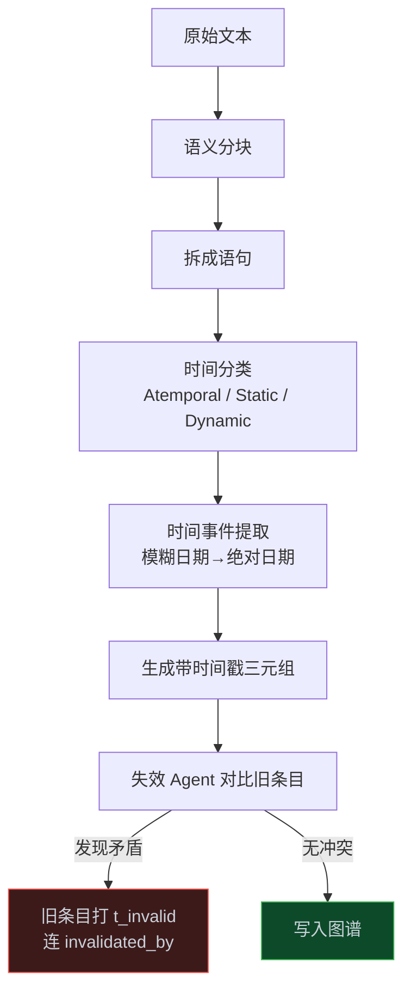
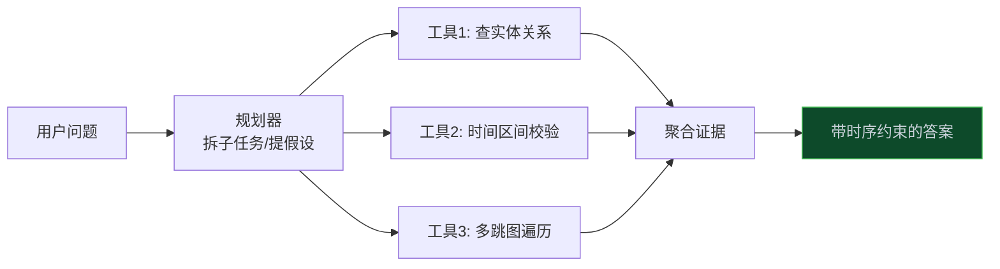

> **📖 系列难度说明**：本篇为**实战入门**，需要一点点 Python 基础。看不懂代码没关系，先把"为什么需要时间"这件事想明白，代码部分可以跳。
> **🎁 核心收获**：你会理解传统知识图谱最大的坑在哪，以及 OpenAI 是怎么用"带时间戳的三元组 + 失效 Agent"补上这个坑的。

上篇我们聊了 Ontology 是什么——它是业务的语义地基。

但地基要是建在流沙上，房子照样塌。

什么意思？你给 Agent 喂了一张知识图谱，图谱上写着"苏姿丰是 AMD 的 CEO"。三个月后她卸任了，图谱没更新。Agent 还是拿着旧数据给别人出报告，还特别自信。

这不是 Agent 笨，是人类忘了告诉它：**事实是会过期的。**

<!-- more -->

---

## 一个真实的翻车现场

金融圈有个经典问题："穆迪对 YY 银行的长期评级，从 2023 年 2 月以来怎么变的？"

传统知识图谱怎么答？它大概率把"穆迪给 YY 银行的评级是 A3"这条静态事实存进去了。你问它历史，它给你一条当前的，或者干脆答不上来——因为它根本没存"这条事实从哪天生效、哪天作废"。

后果很具体：

- 把历史评级和当前评级混为一谈，信用风险定价直接算错
- 问"ZZ 零售商发 FY-22 业绩指引时 CFO 是谁"，它归咎到错误的高管头上，内幕交易分析全歪了

汽车、制药、法律行业也一样。一辆 2023 年 3 月出厂的车，转向柱螺栓扭矩规格可能和 2024 年 5 月出厂的完全不同。召回的时候漏掉一批，就是安全事故。

**问题不在模型，在图谱本身不记时间。** 这正是 OpenAI 在 Cookbook 里那篇《Temporal Agents with Knowledge Graphs》想解决的事。

---

## 知识图谱复习：它到底长什么样

简单说，知识图谱就是一堆"三元组"堆出来的。

三元组结构：`[主体] - [谓词] - [客体]`。比如：

```
"伦敦" - "是首都" - "英国"
"苏姿丰" - "任职于" - "AMD"
```

把成千上万个这样的三元组连起来，就成了一张网。Agent 在这张网上爬来爬去，就能发现藏在连接里的信息。

本篇里的"时间感知"，就是在每个三元组上**多贴两个时间戳**：`t_created`（这条事实从哪天开始真）和 `t_expired`（哪天开始不真了）。就这么一个改动，整个图谱的用途全变了。

---

## 同一件事，三种深度的看法

想把这个机制说清楚，我准备了一层层往下的讲法。你可以停在你能消化的那层，但建议顺着读——底下那层，才是 OpenAI 这篇教程真正值钱的地方。

最朴素的比方：你有个本子记朋友的联系方式，传统做法是写上去就不动了，朋友换了手机号你还在拨旧的，打不通还纳闷。时间感知图谱相当于你每次更新都标一句"这条从 2024 年春节起生效"，旧号码旁边画个叉写"2023 年底作废"。下次你想知道"2023 年中他用的什么号"，翻本子就查得到，不会混。Agent 要的，其实就是这么一本"带时间叉号"的本子。

落到工程上，OpenAI 的做法是一根流水线，把原始文本变成带时间戳的三元组，核心分三段。第一段是**时间分类**：从文档里拆出来的每句话先打标签——永远不变的（比如"光速约 3×10⁸ m/s"）、从某天起生效且不再变的（"苏姿丰 2014 年 10 月 23 日成为 AMD CEO"）、以及会随时间的演变的（"苏姿丰是 AMD CEO"）。第二段是**时间事件提取**，专门处理"周二""三个月前"这类模糊说法，用文档自身的时间戳当参照，把模糊日期落成绝对日期（只知道月份就默认月初或月末）。第三段最要紧，叫**时间有效性检查**：每条三元组必须有 `t_created`，过期的还要有 `t_expired`，然后去跟图谱里已有的旧条目比对——发现矛盾就给旧条目打上 `t_invalid`，再用 `invalidated_by` 把新语句和它作废的旧语句连起来。干这事的就是"失效 Agent（Invalidation Agent）"。没有它，图谱只会越堆越乱，新旧事实互相打架。



再往深想一层，这其实是给 Ontology 补上了它一直缺的那个维度。Gruber 给 Ontology 的定义里，"显式表述"是核心，但绝大多数工程实现只显式了概念、属性、关系、公理，**把时间漏掉了**。时间感知图谱把时间当成一等公民：事实不再是 `subject-predicate-object`，而是 `subject-predicate-object-valid_during`，等于给公理加了一条"在 [t1, t2) 区间内成立"的约束。从符号主义的角度看，推理就从"布尔真假"升级成了"时间区间内的真假"，多跳推理时每一跳都要检查区间是否重叠——这才是真正的时序逻辑推理。

---

## 多跳推理：为什么单跳查不到的东西，它能查到

光有带时间戳的图谱还不够，得让 Agent 会在上面"走好几步"。

单跳查询是什么？"苏姿丰任职于哪家公司"——一步就到答案。

但真实问题往往是多跳的："AMD 在 2019 年 Q2 财报电话会上提到的收购目标，其 CEO 当时还在另一家公司的董事会吗？"

这个问题要走的路：

1. 从 AMD 找到 2019 Q2 财报提到的收购目标 X
2. 从 X 找到当时的 CEO 是谁
3. 查这位 CEO 在同一时间点是不是 Y 公司的董事
4. 把几段关系拼起来给结论

单跳查询只能回答第 1 步。多跳检索是让模型**沿着关系边一步步爬**，把分散在图谱拓扑里的证据聚合起来。

OpenAI 在教程里把"规划器（Planner）"分成两类，挺实用：

- **任务导向**：把问题拆成顺序子任务，路径明确，适合确定性报告
- **假设导向**：先抛出假设，再去证实或推翻，适合探索性研究

工具设计也在一个谱上：从"固定工具（输出稳定可预测）"到"自由形式工具（如代码执行，灵活但难控）"。选哪个，就是控制性和灵活性的权衡。



---

## 模型怎么选：别一上来就堆最贵的

OpenAI 在教程里给了一条很实在的路线：

| 阶段 | 模型                | 为什么                         |
| ---- | ------------------- | ------------------------------ |
| 原型 | GPT-4.1             | 指令遵循最强，先把三元组提取准 |
| 优化 | GPT-4.1-mini        | 质量够用，延迟和成本大幅下降   |
| 蒸馏 | 用 4.1 输出训小模型 | 超大规模场景压到极致成本       |

**实践心法**：先用最猛的模型把原型跑通、质量量出来，再一级级往下换便宜的，直到质量兜不住为止。别反过来——一上来就用 nano，错了你都不知道是数据问题还是模型问题。

---

## 从 Demo 到生产，三个坑

教程里这部分很干货，做过的都懂：

**1. 图谱会越长越肥**
给每条边算个相关性分数（时效性 × 可信度 × 查询频率），低分的自动归档或稀疏化。不然图一膨胀，检索就慢死。

**2. 摄取管道别串行**
"文档 → 分块 → 提取 → 解析"线性跑，吞吐量上不去。改成按阶段分队列、配独立工作池的异步架构，再加背压机制，才能稳。

**3. 输出验证不能省**
时间字段统一成 ISO-8601，实体类型锁进受控词表，再加一层轻量模型做健全性检查。结构化日志带上可追踪 ID，数据漂移了能提前报警。

---

## 跟上一篇怎么接上

上篇说 Ontology 是 Agent 的语义地基。本篇讲的，是这块地基怎么处理"时间"——这是真实业务里最容易塌的地方。

对了，这里有个认知岔路值得记一下：Anthropic 在《Building Effective AI Agents》里说，早期用**精细的上下文工程**就能顶一阵，不一定非要上正式本体；但要从 Demo 走到工业级，必须建立控制循环。OpenAI 这篇则是直接从本体/图谱入手。两条路不矛盾——Anthropic 说的是"轻量起步"，OpenAI 展示的是"规模化后图层的样子"。

---

## 📝 小结

- 传统知识图谱把事实当静止的，真实世界的事实会过期，不记时间就会给 Agent 喂毒数据
- 时间感知图谱每个三元组带 `t_created` / `t_expired`，靠"失效 Agent"打叉号、连 `invalidated_by` 来维护正确性
- 多跳推理让 Agent 沿关系边走多步，回答单跳查不到的复杂时序问题
- 模型选择：4.1 原型 → mini 优化 → 蒸馏小模型，别一上来就堆贵的
- 生产化三件事：图谱瘦身、摄取并行化、输出强验证

---

## 🔮 下一篇预告

图谱和 Agent 的事我们说清了。但企业里最头铁的玩家不是 OpenAI，是 Palantir——他们把 Ontology 玩成了整个平台的心脏。

下一篇，我们看 Palantir 怎么用"本体"把 Agent 和企业决策绑在一起，以及那个听起来很玄的"数字双胞胎"到底是怎么回事。

---

> 📚 **系列导航**
>
> - 第 01 篇：Ontology：被低估的 AI Agent 核心基础设施
> - **第 02 篇：时间感知知识图谱：让 Agent 记住"什么时候什么是真的"** ⬅️ 你在这里
> - 第 03 篇：Palantir 模式：本体如何成为企业 AI 的决策中枢
> - 第 04 篇：Microsoft Fabric：企业语义层的工程实践
> - 第 05 篇：Ontology 动手构建：OWL/RDF/SPARQL 实战指南
> - 第 06 篇：Ontology 工具链：OSDK + MCP 实战指南
> - 第 07 篇：UI 本体与神经符号 AI：从计算机使用到前沿方向
> - 第 08 篇：从 Demo 到生产：规模化 Agent 的 Ontology 设计决策
> - 第 09 篇：中小企业的本体落地场景：不建大平台，也能用上 Ontology
> - 第 10 篇：项目落地方案：中小企业用轻量栈搭本体
> - 第 11 篇：落地实战：一个最小可行本体的构建与避坑

---

> 📖 **本系列参考资料**
>
> - [Temporal Agents with Knowledge Graphs — OpenAI Cookbook](https://developers.openai.com/cookbook/examples/partners/temporal_agents_with_knowledge_graphs/temporal_agents)
> - [Building Effective AI Agents — Anthropic Engineering](https://www.anthropic.com/engineering/building-effective-agents)
> - [Zep — 时间知识图谱参考实现](https://github.com/getzep/zep)
> - [Graphiti — 知识图谱构建框架](https://github.com/getzep/graphiti)
