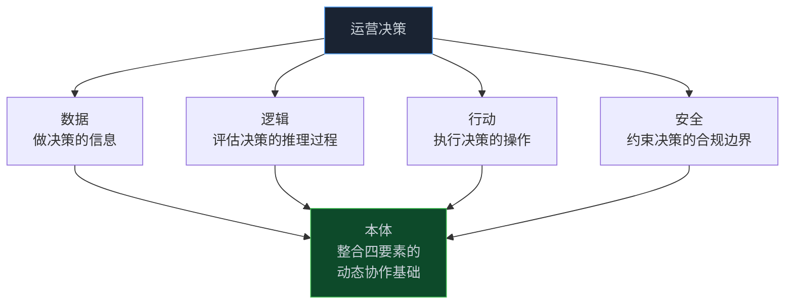
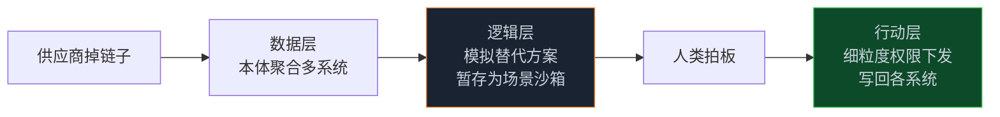

> **📖 系列难度说明**：本篇为**架构解析**，适合想搞懂企业级 Agent 怎么落地的开发者和技术决策者。不写代码，但会拆得很细。
> **🎁 核心收获**：你会明白 Palantir 那句"本体是决策的表示，不是数据的表示"到底什么意思，以及它凭什么敢把本体放到架构正中央。

上篇我们聊了时间。这篇聊一个更"重"的话题——企业。

个人玩 Agent，喂点笔记、连个 API，高兴就好。企业不一样。企业里一个 Agent 如果乱动数据，后果不是"回答错了"，是"把三个 ERP 系统的库存改错了，生产线停摆"。

所以企业级 Agent 的核心矛盾从来不是"聪不聪明"，是"可不可控"。

Palantir 给出的答案，是把 Ontology 放到整个架构的正中央。这事他们做了十几年，比"AI Agent"这个词火起来早得多。

<!-- more -->

---

## 一个反直觉的判断

先抛一个 Palantir 自己的说法，第一次看会觉得有点绕：

> 本体是一个旨在**表示企业决策**的系统，而**不仅仅是数据**。

注意"而不仅仅是数据"这几个字。大多数公司做数据平台，干的是"把数据集中起来、建个语义层、让 BI 能查"——这仍然是在表示数据。

Palantir 要表示的是**决策本身**：做这个决定时，你依据了哪些信息、走了哪些逻辑、执行了哪些动作、受哪些安全约束。

这差别大了。数据表示的是"世界长什么样"，决策表示的是"我们在世界上做了什么选择，以及为什么"。

说白了，传统数据架构记录的是"发生了什么"，Palantir 的本体还想记录"我们怎么决定发生的，以及下次怎么决定"。

---

## 三层往下沉，看懂 Palantir 在干什么

我尽量用一层比一层深的方式讲，你能停在任意一层，但往下多走一步，往往才是它和"普通数据平台"拉开差距的地方。

先说最直觉的画面：一家大公司应对供应链危机，过去采购在 Excel 里记供应商，仓库在另一套系统记库存，生产又在第三套里排计划，一出事三个人各看各的表，谁也说不清到底影响了多少订单。Palantir 把这些表全部连成一张"公司全景图"（本体），图上每个东西都标清楚——这是供应商、这是仓库、这是订单、它们之间谁连着谁。危机一来，指挥官在图上一点，哪些订单受影响、影响多大，立刻全亮出来；还能直接在图上跑模拟方案，选好了，一键把决定下发到各系统执行。这张全景图加模拟加执行，就是本体——它管的不是"数据长啥样"，而是"出事了怎么决策、怎么动手"。

工程上，Palantir 把任何一个运营决策拆成四样东西，本体就是装这四样东西的容器：

**数据层**解决的是"相关性"问题——不是数据少，是太多太散。ERP、MES、WMS、IoT 流、非结构化文档、地理空间数据，本体把它们并成企业的"全规模、全保真语义表示"，用对象、属性、链接来呈现，而不是压成一张"黄金表"。**逻辑层**装的是"怎么想的"：业务逻辑在 CRM/ERP 里，预测模型在数据科学环境里，优化算法在特定领域工具里，本体用"逻辑绑定"给它们一个一致接口，让不同环境的异构逻辑能拼进同一个工作流。**行动层**是运营和分析的分水岭——数据和逻辑都进本体了，下一步是把决策真正执行出去，本体里的"名词"是对象和链接，"动词"是行动，人和 Agent 的推理把名词动词拼成完整句子，安全写回各系统。**安全层**最狠，它混用标记、目的、角色三种策略，跨数据/逻辑/行动/应用做动态溯源，任何工具调用都依赖本体里底层对象的访问权限——Agent 想越界查别的组织的数据，直接拦掉，不用你在代码里写一堆 if。

再往深推一层，你会发现这其实是"数字双胞胎（Digital Twin）"真正落地的样子。工程界爱说数字双胞胎是物理世界的镜像，但大多数只镜像了"状态"（数据），没镜像"机理"（逻辑）和"能动性"（行动）。Palantir 的本体是少数把三者都编码进来的：它既反映企业当前状态（对象/属性/链接），又承载决定状态如何演变的逻辑，还能把决策执行回现实（行动层写回边缘设备、事务系统）。从架构哲学看，这是把"以数据为中心"升级成"以决策为中心"——决定权不再散落在各个业务系统，而是收拢到本体这一层，由人和 Agent 在统一语义面上协同。这也解释了它的安全模型为什么能同时罩住人类和 Agent：因为它们操作的是同一个本体原语。

---

## 一个能让你看懂的实战案例

Palantir 官方喜欢用供应链危机举例，我们顺着它走一遍。

**背景**：一家叫 Onyx 的医疗器械公司，主打外科口罩、注射器这些。某天，生产口罩的关键原材料供应商突然掉链子。

**第一步：态势感知（数据层）**。本体把供应商管理、仓库、生产指标、客户履约这几套系统的数据，揉成"外科口罩生产"这个业务对象。运营负责人点几下，就看到哪条口罩产线受原材料短缺影响、顺着链接爬过去，哪些客户订单也跟着悬了。不用跨系统对账，图上一目了然。

**第二步：方案探索（逻辑层）**。本体里连着一堆预测模型、分配模型、生产优化器。分析师跑几轮模拟，看不同替代材料方案的后果。关键在"实时连接"——换掉一种材料，可能顺带影响用同款材料的注射器、手套产线，模拟会把这些下游连锁反应一起算出来。

模拟结果不急着执行，而是暂存成"本体场景（Ontology Scenario）"——打包进本体的一个沙盒子集。团队在沙箱里随便试，试砸了也不影响真实系统。

这里有个叫 "Disruption Bot" 的 Agent。它靠本体提供的密集上下文，扫全公司数据源、翻以前类似危机的复盘报告、调材料重分配模型，最后抛出一个分析师没想到的新方案。方案后果暂存进场景后，交给人类分析师拍板。

**第三步：决策执行（行动层）**。方案定了，要推到各运营系统。本体对行动用和数椐、逻辑一样细的权限控制：仓库管理系统走 API 更新，三个 ERP 走原生连接器（各自遵守自己的保障规则），生产计划系统吃合并的平面文件异步导入。

整条链路里，Agent 不是在真系统上瞎试，是在本体上操作，每一步都被安全框架盯着。

---

## 为什么这件事很难抄

你可能会想：不就是"统一数据 + 接模型 + 控制权限"吗？我自己也能搭。

难在三个地方。

**第一，数据整合不是 ETL 那么简单**。把 ERP、IoT、文档、地理空间并成"对象-属性-链接"，要处理的是语义对齐，不是字段映射。同一个"订单"，在三个系统里含义都不同。

**第二，逻辑绑定要跨环境**。你的预测模型在 SageMaker，优化器在自有集群，业务规则在 ERP。本体得给这些异构东西一个统一接口，让它们能组合进一个工作流——这工程量是真的大。

**第三，行动写回的强一致**。决策不仅要"算出来"，还要"安全地落到真实系统"。本体对写回用和读一样的细粒度权限，还得保证跨系统一致性。这层做不好，前面再漂亮也是空中楼阁。

再说一个常被忽略的点：**决策溯源（Decision Lineage）**。本体自动记下"这个决定什么时候做的、基于哪版企业数据、通过哪个 App"。这东西对人类开发者和 Agent 都开放，是后续 AI 学习和 Agent 记忆（工作记忆、情节记忆、语义记忆、程序记忆）的基础。大多数平台根本没这一层。

---

## 跟前两篇怎么接上

上篇说知识图谱给 Agent 提供了"会过期的事实"和"多跳推理"。那篇讲的是**认知层**——Agent 怎么知道"什么时候什么是真的"。

这篇讲的是**控制层**——Agent 知道之后，怎么在企业的约束下**安全地做决定、动手执行**。

两者不矛盾，是递进。Palantir 的本体，本质上是把图里的"对象-关系"升级成了"对象-关系-逻辑-行动-安全"的完整决策表示。这也是为什么他们说本体"不仅仅是数据"。

---

## 📝 小结

- Palantir 的核心判断：本体表示的是**企业决策**，不只是数据；是"我们怎么决定、怎么动手"，不是"世界长啥样"
- 四要素架构：数据（相关性）、逻辑（推理）、行动（执行）、安全（约束），统一收拢到本体层
- 实战里最值得学的是"场景沙盒"——Agent 先在本体沙箱里试错，人类拍板后才写回真实系统
- 难抄在三点：语义对齐（非字段映射）、跨环境逻辑绑定、写回强一致 + 决策溯源
- 对照前两篇：知识图谱管"认知层"，Palantir 本体管"控制层"，两者是递进关系

---

## 🔮 下一篇预告

Palantir 的路子很"重"——得先有完整的本体平台。有没有轻一点的玩法？

微软在 Fabric 里也做了本体，思路完全不同：不让你先建平台，而是让你用自然语言直接问企业数据，背后自动翻译成结构化查询。下一篇看微软怎么用"语义层 + NL2Ontology"把这件事做轻。

---

> 📚 **系列导航**
> - 第 01 篇：Ontology：被低估的 AI Agent 核心基础设施
> - 第 02 篇：时间感知 Agent 实战：用知识图谱让 AI 记住"什么时候什么是真的"
> - **第 03 篇：Palantir 模式：本体如何成为企业 AI 的决策中枢** ⬅️ 你在这里
> - 第 04 篇：Microsoft Fabric：企业语义层的工程实践
> - 第 05 篇：Ontology 动手构建：OWL/RDF/SPARQL 实战指南
> - 第 06 篇：Ontology 工具链：OSDK + MCP 实战指南
> - 第 07 篇：UI 本体与神经符号 AI：从计算机使用到前沿方向
> - 第 08 篇：从 Demo 到生产：规模化 Agent 的 Ontology 设计决策

---

> 📖 **本系列参考资料**
> - [Connecting Agents to Decisions — Palantir Blog](https://blog.palantir.com/connecting-agents-to-decisions-277dee8ddb40)
> - [Ontology — Palantir Platform](https://www.palantir.com/platforms/ontology/)
> - [Build an Agent in Foundry — Palantir Docs](https://www.palantir.com/docs/foundry/agents/create-agent/)
