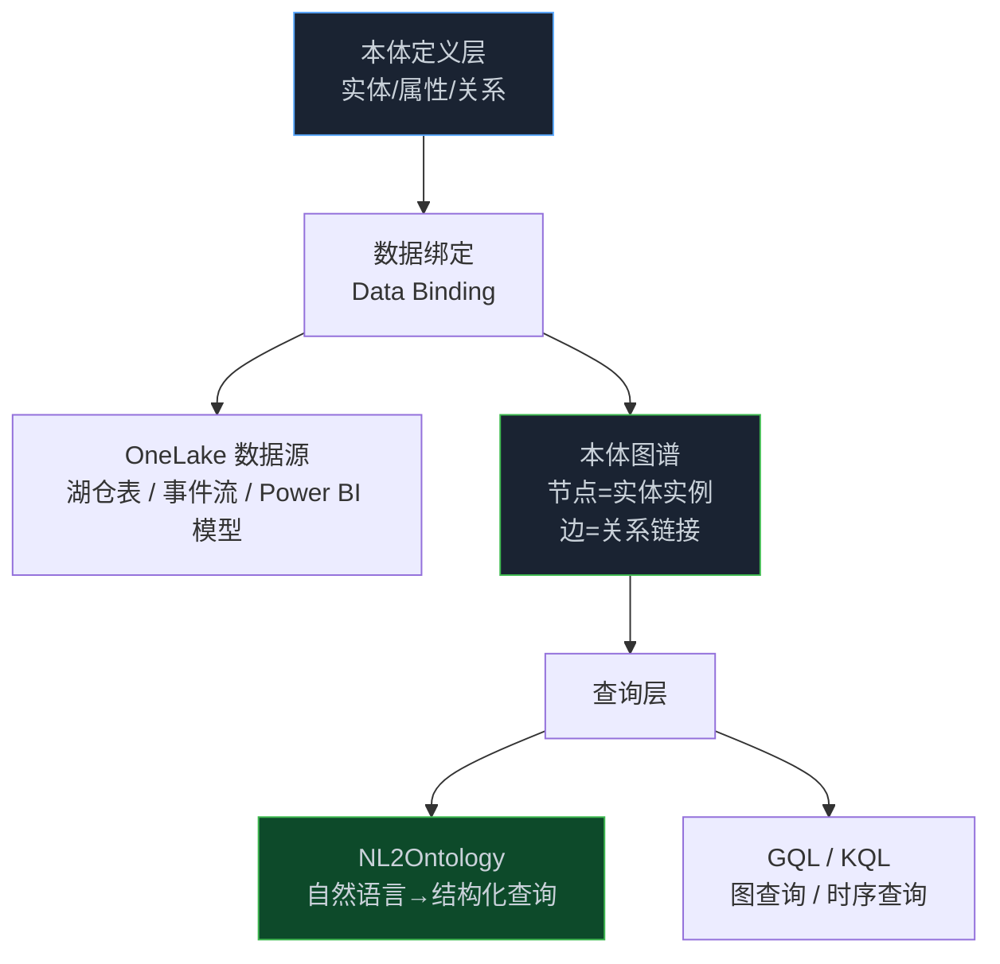

> **📖 系列难度说明**：本篇为**产品架构解析**，适合正在选型企业数据平台的开发者和技术决策者。和上篇 Palantir 对照着看，收获最大。
> **🎁 核心收获**：你会搞懂微软说的"语义层"到底是什么，NL2Ontology 怎么把一句人话变成查数据的 SQL/图查询，以及它和 Palantir 重在哪里不同。

上篇 Palantir 那套，坦白说，重。你得先有它的平台、先建本体、再绑数据、再调 Agent。不是谁都玩得起的。

微软在 Fabric 里也做了本体，但路子完全反过来——它不让你先建平台，而是先把你 OneLake 里散落的数据，用一层语义"罩"上去，然后让你直接用自然语言问问题。

这章我们看看，这条路"轻"在哪，又"薄"在哪。

<!-- more -->

---

## 微软给 Ontology 下的定义

微软自己的说法是：

> 本体（Ontology）是企业词汇表和语义层的数字化表示，统一了跨领域和 OneLake 数据源的含义。

拆开看这句话，有两个关键词。

"企业词汇表"——说白了就是把"客户""订单""产品"这些业务词，定义成全公司统一的标准。再也不用 CRM 叫 customer、ERP 叫 client、财务叫 account 了。

"统一跨 OneLake 数据源的含义"——OneLake 是微软的湖仓，里面可能躺着湖仓表、事件流、Power BI 语义模型。本体负责把这些不同来源的数据，讲成同一套业务语言。

对比一下上篇 Palantir 的说法（本体表示"决策"），微软这里更克制：它先把"语义"这件事做对，决策和行动是后话。

---

## 三种深度，把微软这层看明白

我一层层往下讲，你可以停在能消化的地方，但建议读完——因为越往后，越能看清它和 Palantir 那个"重"路子到底差在哪。

最直觉的比喻：你公司数据散在好多系统里，财务看 A 表，运营看 B 表，俩人对"销售额"的理解都不一样，开会能吵起来。微软这套本体相当于雇了个翻译官——它先定义好"销售额"在公司里唯一正确的意思，再把这个意思绑定到 A 表、B 表对应的字段上，以后不管谁问，翻译官都按同一标准去查、去答。而且这个翻译官听得懂人话，你直接问"上个月华东区销售额最高的产品是哪个"，它自己翻译成数据查询，不用你学 SQL。

工程上，微软把本体拆成四个能落地的概念，注意它没像 Palantir 那样强调"行动"，重心在"定义"和"查询"。**实体类型（Entity Type）**是现实概念的可复用逻辑模型，比如 Shipment、Product、Sensor，它把"shipment"这个词在所有团队里的含义锁死，消除跨数据源的列级冲突；**实体实例（Entity Instance）**是实体类型的具体出现，从数据绑定里填充出来，类似"一行标准化的业务数据"，它记着"谁创建的、什么时候是真的"，还能参与关系；**属性（Property）**是关于实体的命名事实，带数据类型，强制一致的类型、单位、命名，在概念层就能做质量检查；**关系（Relationship）**是实体之间有类型的有向链接，可以带属性（距离、置信度、effectiveAt）和基数规则（一个客户有多个订单），它让"不用写 JOIN 逻辑就能回答业务问题"成为可能。

光定义不够，还得把定义**绑到真实数据**上，这步叫数据绑定（Data Binding）：

数据绑定描述"哪个键对应哪个字段、列怎么映射到属性、跨源关系怎么连"，它还顺手做了模式演化规则、数据质量检查（非空、范围、唯一性）和溯源。绑定完，原始行和事件就变成了"受治理的业务对象"，再织成一张**本体图谱（Ontology Graph）**：节点是实体实例，边是断言的或派生的链接，每条边带元数据，支持可视化探索、图算法（路径、中心性、社区）和规则驱动推理。

再往深走，真正有意思的是图谱之上的查询层。微软把查询自动路由到最合适的系统：图相关的走 GQL，时序相关的走 KQL，你作为开发者不用关心数据躺在哪个系统。而 **NL2Ontology** 在这之上再封一层，把自然语言问题直接转成结构化查询，保证你的过滤器、连接、单位、有效性窗口都和本体里发布的定义对齐。从符号主义角度看，这是典型的"声明式语义层"——用户只表达对业务状态的疑问（意图），系统负责把它编译成对底层异构存储的执行计划。和 Palantir 的"命令式行动写回"不同，微软这版本体更偏"读"而非"写"，是分析型语义层，不是操作型决策层。

---

## 微软 vs Palantir：一张表看清

这俩经常被放在一起比，差异其实很鲜明：

| 维度       | Microsoft Fabric 本体             | Palantir Foundry 本体         |
| ---------- | --------------------------------- | ----------------------------- |
| 数据源     | OneLake（湖仓、事件流、Power BI） | 多源（ERP、CRM、IoT、文档等） |
| 查询方式   | NL2Ontology + GQL/KQL             | 对象查询 + 图遍历             |
| Agent 集成 | Fabric IQ Agent + 外部 Agent      | OSDK + Ontology MCP           |
| 行动执行   | 有限（主要是查询）                | 完整（事务写回、边缘同步）    |
| 安全模型   | 租户级权限                        | 细粒度对象级权限              |
| 成熟度     | Preview（预览）                   | GA（正式发布）                |

一句话总结：**微软把本体当成"让人和 Agent 读懂企业数据"的语义层，Palantir 把本体当成"让人和 Agent 操作企业"的决策层**。前者偏分析，后者偏执行。没有谁高谁低，看你要的是"看清楚"还是"动起来"。

---

## 一个具体例子

假设你在零售公司，想问："上海门店上个月卖得最好的三个 SKU 是什么，它们的供应商分别是谁？"

没有本体，你得：查交易表按门店过滤上海、按时间过滤上月、聚合 SKU、再 JOIN 供应商表。SQL 你得写半天，还得知道表名和字段名。

有了 NL2Ontology，你直接问那句话。系统背后做的事是：

1. 把"上海门店"映射到门店实体 + 地区属性过滤
2. 把"上个月"映射到时间窗口
3. 把"卖得最好"翻译成按销量聚合 + Top3
4. 把"供应商"翻译成 SKU 到供应商的关系遍历
5. 自动选 GQL 跑图查询，把结果按你业务语言返回来

你全程不知道数据在哪个表、用 GQL 还是 KQL，但答案对了，口径和公司定义一致。

---

## 跟前几篇怎么接上

上篇 Palantir 强调"行动"和"决策"，这章微软强调"语义"和"查询"。合起来看，你会发现一个完整的图景：

- 第 02 篇的知识图谱，管的是"事实怎么存、怎么推理"（认知）
- 第 03 篇的 Palantir，管的是"知道之后怎么在安全约束下动手"（控制）
- 这章的微软，管的是"人怎么用自然语言把数据问出来"（接口）

本体在这个图景里，从"底层数据结构"一路升到了"人机交互的语义界面"。这也是为什么微软说它是"语义层的数字化表示"——它本质上是给人和 Agent 之间，架了一层共同语言。

---

## 📝 小结

- 微软的本体更克制：先统一语义（词汇表 + 跨源含义），决策和行动是后话
- 四大概念：实体类型（锁定义）、实体实例（具体数据）、属性（命名事实）、关系（有类型链接）
- 数据绑定把定义连到 OneLake 真实数据，产出受治理的业务对象和本体图谱
- NL2Ontology 把自然语言编译成 GQL/KQL 查询，用户不关心底层存储
- 微软偏"分析型语义层"、Palantir 偏"操作型决策层"，前者让你看懂，后者让你动手

---

## 🔮 下一篇预告

看了 Palantir 的重、微软的轻，你大概会想：那我自己能不能从零搭一个本体？不依赖大平台、用开源标准那种。

能。下一篇我们动手，用 OWL/RDF 建模，用 SPARQL 查询，用 Protégé 画出来。不玩虚的。

---

> 📚 **系列导航**
>
> - 第 01 篇：Ontology：被低估的 AI Agent 核心基础设施
> - 第 02 篇：时间感知 Agent 实战：用知识图谱让 AI 记住"什么时候什么是真的"
> - 第 03 篇：Palantir 模式：本体如何成为企业 AI 的决策中枢
> - **第 04 篇：Microsoft Fabric：企业语义层的工程实践** ⬅️ 你在这里
> - 第 05 篇：Ontology 动手构建：OWL/RDF/SPARQL 实战指南
> - 第 06 篇：Ontology 工具链：OSDK + MCP 实战指南
> - 第 07 篇：UI 本体与神经符号 AI：从计算机使用到前沿方向
> - 第 08 篇：从 Demo 到生产：规模化 Agent 的 Ontology 设计决策
> - 第 09 篇：中小企业的本体落地场景：不建大平台，也能用上 Ontology
> - 第 10 篇：项目落地方案：中小企业用轻量栈搭本体
> - 第 11 篇：落地实战：一个最小可行本体的构建与避坑

---

> 📖 **本系列参考资料**
>
> - [What Is Ontology (Preview)? — Microsoft Fabric IQ](https://learn.microsoft.com/en-us/fabric/iq/ontology/overview)
> - [Microsoft Fabric IQ 文档](https://learn.microsoft.com/en-us/fabric/iq/)
> - [Gene Ontology — 生物医学本体标准](https://geneontology.org/)
