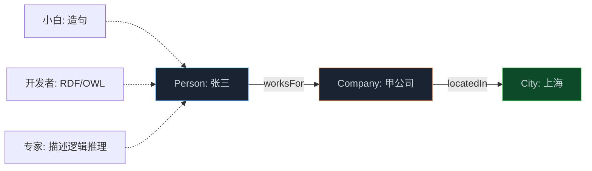

> **📖 系列难度说明**：本篇为**动手实战**，适合想亲手建一套本体的开发者。需要一点点 XML/图查询的直觉，跟着敲就行。
> **🎁 核心收获**：你会用 RDF 三元组描述业务、用 OWL 定义类和约束、用 SPARQL 查出多跳关系，并知道这些开源标准和前面 Palantir/微软的平台是什么关系。

前两篇看了 Palantir 的重、微软的轻。这章说点实在的——不依赖任何大平台，用开源标准自己搭一个本体。

为什么要会这个？因为平台再好，你总得知道它底下那层"本体"到底长啥样。不然平台给你个黑盒，你连怎么定义"客户"都搞不定，只能被平台牵着走。

其实这套东西的祖宗，比 AI 火起来早得多。

<!-- more -->

---

## 先讲个来龙去脉

现代本体工程不是凭空冒出来的，它从 AI 的"知识表示"一路长过来。早期 AI 玩过四种表示方法：

- **逻辑表示法**：谓词逻辑、命题逻辑
- **产生式**：规则 `IF 条件 THEN 行动`
- **语义网络**：节点是概念，有向边是关系——这个是现代知识图谱和本体的亲爹
- **框架表示法**：槽是属性，值是填充

你一眼就能看出来，语义网络那条线，直接演化成了今天的"实体-关系"模型。W3C 后来把这条路标准化成了 **RDF**（资源描述框架）和 **OWL**（Web 本体语言）。SPARQL 则是查它们的查询语言，相当于图世界的 SQL。

所以你学 OWL/RDF，不是在学某个公司的私货，是在学整个语义网的事实标准。

---

## 三种读者，三种读法

### 🟢 小白层次：用"主语-谓语-宾语"造句

本体最底层就是造句。比如：

```
"张三" - "任职于" - "甲公司"
"甲公司" - "位于" - "上海"
```

每句都是"谁，怎么样，谁/什么"。这种句子叫三元组，堆积起来就是知识图谱。

你不用懂技术也能玩：拿张纸，左边写实体（人、公司、城市），中间写关系（任职于、位于），右边写另一个实体，连线就行。这就是最简单的本体草图。

### 🔵 普通开发层次：RDF + OWL + SPARQL 三件套

**RDF（资源描述框架）**：把上面的句子写成机器格式。每个三元组是 `主语 - 谓语 - 宾语`，都用 URI 唯一标识，避免重名歧义。

```turtle
@prefix ex: <http://example.com/> .
@prefix rdf: <http://www.w3.org/1999/02/22-rdf-syntax-ns#> .

ex:张三 ex:任职于 ex:甲公司 .
ex:甲公司 ex:位于 ex:上海 .
ex:甲公司 rdf:type ex:公司 .
```

**OWL（Web 本体语言）**：在 RDF 之上加"定义"和"约束"。你可以声明：甲公司是"公司"这个类的一个实例（`rdf:type`）；"任职于"是对象属性；一个人最多任职于一家公司（基数约束）；公司必须有名称（必要性）等等。

OWL 让你的本体不只是"一堆事实"，而是"一套带规则的模型"。推理机（如 HermiT）能据此推出新事实——比如你说"A 是 B 的父，B 是 C 的父"，它自动推出"A 是 C 的祖父"，不用你写。

**SPARQL**：查本体的语言。想知道"张三所在的公司在哪个城市"，写：

```sparql
PREFIX ex: <http://example.com/>
SELECT ?city WHERE {
  ex:张三 ex:任职于 ?company .
  ?company ex:位于 ?city .
}
```

这就是多跳查询——沿着"任职于""位于"两条边走两步，拿到答案。和前面第02篇知识图谱的多跳推理，底层逻辑一模一样。

### 🔴 专家层次：从描述逻辑看 OWL 的推理能力

OWL 背后是**描述逻辑（Description Logic）**，一套形式化语义。它保证了推理的可靠性和完整性——你得到的每个推导，都有逻辑依据，不是 LLM 那种"统计直觉"。

这也是神经符号 AI 里"符号"那一半的来源。LLM 负责把自然语言、非结构化文本映射到你的 OWL 本体（命名实体识别、关系抽取），然后 OWL 推理机在符号层做确定性推理。两者分工：连接主义处理"理解"，符号主义处理"保证正确"。

前面微软、Palantir 的平台，底层本质都兼容这套标准——只不过它们把 OWL/RDF 藏进了自己的对象模型里。你懂了标准，看任何平台都不慌。

---

## 动手：用 Protégé 建一个迷你本体

Protégé 是斯坦福开源的本体编辑器，免费。我们建一个"公司-员工-城市"的迷你本体。

**第一步：建类（Classes）**。在 Class 面板新建：
- `公司 Company`
- `人员 Person`
- `城市 City`

**第二步：建对象属性（Object Properties）**：
- `任职于 worksFor`（域：Person，范围：Company）
- `位于 locatedIn`（域：Company，范围：City）

**第三步：建实例（Individuals）**：
- 在 Person 下新建 `张三`，通过 `worksFor` 连到 `甲公司`
- 在 Company 下新建 `甲公司`，通过 `locatedIn` 连到 `上海`（City 实例）

**第四步：跑推理机**。启动 HermiT 推理机，它能自动推断出"张三通过 worksFor + locatedIn 间接关联到上海"这条隐含关系——不用你显式写。

**第五步：用 SPARQL 查**。在 Protégé 的 Query 标签页跑前面那段查询，返回 `?city = 上海`。

整个过程下来，你就拥有了一个可推理的小本体。它不大，但和 Palantir 企业本体的核心结构（对象-属性-链接-推理）是同构的。



---

## 和前面平台的关系

你可能会问：我手搓的 OWL 本体，和 Palantir/微软那些平台差多远？

差在"工程化"三件事：

1. **规模**：平台处理的是百万级对象、跨异构源；你手搓的是几百个实例。但建模思路一样。
2. **绑定**：平台把本体绑到实时数据流（OneLake、ERP）；你的是静态文件。绑定的本质是"实例从哪来"。
3. **行动**：平台能让本体驱动真实系统的写回；你的本体是只读推理。

所以手搓本体的价值，不是替代平台，是**让你真正理解平台在干什么**。等你去用 Palantir OSDK 或微软 NL2Ontology 时，底层的"对象-属性-链接-推理"你早就熟了，学起来飞快。

---

## 📝 小结

- OWL/RDF/SPARQL 是 W3C 语义网事实标准，祖宗是 AI 早期的语义网络表示法
- RDF 用三元组"主语-谓语-宾语"描述事实；OWL 在其上加类和约束；SPARQL 做多跳查询
- Protégé + HermiT 推理机能自动推出隐含关系，是"符号推理"的最小可跑样例
- 专家视角：OWL 背后是描述逻辑，提供确定性推理，是神经符号 AI 里"符号"那一半
- 手搓本体不替代平台，但让你看透 Palantir/微软底层的"对象-属性-链接-推理"结构

---

## 🔮 下一篇预告

本体建好了，怎么让 Agent 真用上它？Palantir 给了 OSDK 和 Ontology MCP 两套工具链。下一篇我们钻进这两样东西，看 Agent 怎么通过标准协议安全地读写企业本体。

---

> 📚 **系列导航**
> - 第 01 篇：Ontology：被低估的 AI Agent 核心基础设施
> - 第 02 篇：时间感知 Agent 实战：用知识图谱让 AI 记住"什么时候什么是真的"
> - 第 03 篇：Palantir 模式：本体如何成为企业 AI 的决策中枢
> - 第 04 篇：Microsoft Fabric：企业语义层的工程实践
> - **第 05 篇：Ontology 动手构建：OWL/RDF/SPARQL 实战指南** ⬅️ 你在这里
> - 第 06 篇：Ontology 工具链：OSDK + MCP 实战指南
> - 第 07 篇：UI 本体与神经符号 AI：从计算机使用到前沿方向
> - 第 08 篇：从 Demo 到生产：规模化 Agent 的 Ontology 设计决策

---

> 📖 **本系列参考资料**
> - [W3C RDF 1.1 规范](https://www.w3.org/TR/rdf11-concepts/)
> - [W3C OWL 2 规范](https://www.w3.org/TR/owl2-overview/)
> - [SPARQL 1.1 查询语言](https://www.w3.org/TR/sparql11-query/)
> - [Protégé 本体编辑器](https://protege.stanford.edu/)
 