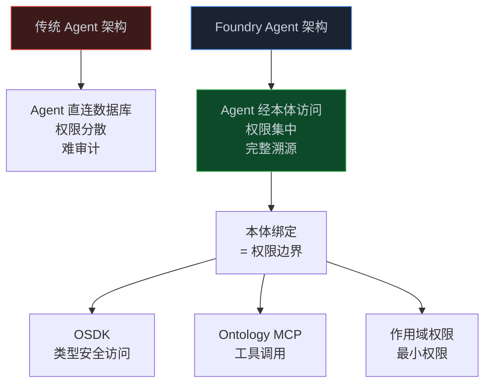
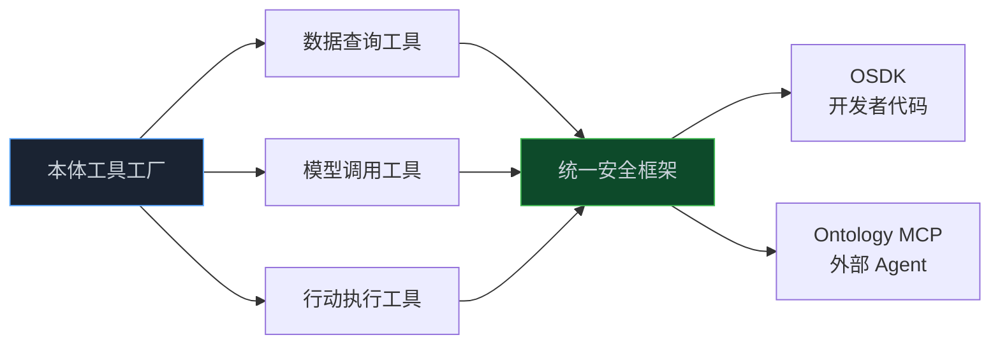

> **📖 系列难度说明**：本篇为**工具链实战**，适合要把 Agent 接到企业系统的开发者。会贴一点 TypeScript 片段，看不懂语法看注释也行。
> **🎁 核心收获**：你会明白为什么 Palantir 建 Agent 第一步是"绑本体"，OSDK 和 Ontology MCP 分别解决什么问题，以及作用域权限怎么让你不用管密钥。

上篇我们把本体从零搭出来了。但本体躺在文件里没用，得让 Agent 能读、能写、能在它上面推理。

这章讲工具链。核心就两样：Palantir 的 **OSDK**（本体 SDK）和 **Ontology MCP**（本体模型上下文协议）。一个给开发者写代码用，一个给任何支持 MCP 的 Agent（比如 Claude、GPT）用。

不过在聊工具之前，得先说一个反直觉的设计——Palantir 建 Agent，**第一步不是写逻辑，是绑本体**。

<!-- more -->

---

## 为什么第一步是"绑本体"

在 Foundry 里创建 Agent，流程是：选仓库 → 选 Agent 框架（Claude SDK / OpenAI SDK / Google ADK）→ **选本体（必填）**。

这个"选本体"不是走个过场，它叫**本体绑定（Ontology Binding）**，直接决定了 Agent 的三件事：

- 能读哪些数据、写哪些数据
- 有哪些作用域权限（Scoped Permissions）
- 能调哪些 Ontology 行动（Actions）

换句话说，本体绑定就是 Agent 的**权限边界**。你不是给 Agent 一个能访问全公司的 API Key，而是把它"关"进本体授权范围内的一小块空间。

这设计妙在哪？传统 Agent 直接连数据库，权限散在各个系统里，谁改了什么难以审计。Palantir 把权限收拢到本体层——Agent 能碰什么，本体说了算，而且每一步操作都过本体的安全框架，天然有完整溯源。



---

## 从门禁卡到工具工厂

还是老习惯，一层层往下讲，你停在哪层都行，但最底下那层，才是这套工具链真正有意思的地方。

最直觉的比喻：公司大楼有很多房间，传统做法是给 Agent 一把万能钥匙（API Key），它能开所有门，出了事你都不知道它进过哪间。Palantir 的做法是发"门禁卡"——卡里写死"只能进 3 楼研发区，只能看不能改"。这张卡就是本体绑定，Agent 想进财务室，门禁直接拦，根本进不去。记住一句话：**本体绑定 = Agent 的权限卡**。

落到工程上，核心是 OSDK 和 Ontology MCP 两件套。**OSDK（Ontology SDK）**是给开发者用的类型安全客户端，你用它访问本体，IDE 能自动补全对象、属性和链接，编译器帮你查错：

```typescript
import { getOntologySdkClient } from "@palantir/agent-templates-bundle";
import { $ontologyRid } from "@ontology/sdk";

const client = await getOntologySdkClient($ontologyRid);
// 之后 client.objects... 都有类型提示
```

关键是它基于**作用域权限**——你不用提供客户端 ID、密钥、Foundry Token，Agent 跑在什么身份下，权限就由本体绑定决定，凭证管理这块最头疼的事直接没了。**Ontology MCP（OMCP）**把本体的对象、属性、链接、行动全部暴露成标准 MCP 工具，任何支持 MCP 协议的 Agent（Claude、GPT 等）都能接进来读对象、查数据、执行预定义行动。它妙在"外部 Agent 受和原生 Agent 一样的安全控制"——你不用为外部 AI 开特殊后门，所有访问都过本体统一安全框架，企业本体因此可以安全地暴露给任何合规的 Agent 生态。



再往深想，Palantir 把本体叫做"工具工厂（Tool Factory）"，这个提法值得停下来品味。你的构建者（开发者、分析师、数据工程师）都能在本体上定义工具——查任何数据类型、调任何模型、执行任何行动，全部在统一安全框架下治理。这意味着一个深刻的架构转变：工具不再是 Agent 框架硬编码的能力，而是**从本体动态生成**的，本体里多一个对象类型，Agent 就自动多一类可操作的工具。专业知识被编码成可复用工具，从"个人脑子里的东西"变成"组织共享的基础设施"。这和 Anthropic 提的 MCP 开放标准一脉相承——MCP 让任何模型能安全接外部工具，Ontology MCP 则是把这个能力落到了企业本体的粒度上。

---

## 一个最小的 Agent 示例

把 OMCP 配置作为 MCP 服务器传给模型，Agent 就获得了访问本体的能力，同时受安全框架约束：

```typescript
export async function runAgent(args: AgentArgs) {
  const omcpConfig = await getOntologyMcpConfiguration();

  const iter = query({
    prompt: "找出受供应商 X 中断影响的所有订单，并估算损失",
    options: {
      mcpServers: {
        ["ontology_mcp"]: omcpConfig,  // 本体作为工具源注入
      },
    },
  });

  // 消费响应流...
}
```

注意那行 `mcpServers: { ontology_mcp: omcpConfig }`。Agent 不需要知道底层数据库长啥样，它只知道"我有一套叫 ontology_mcp 的工具可以用"，而这套工具的能力边界，由本体绑定框死。

发布时给仓库打标签（如 `1.0.0`），Foundry 会把它注册成异步函数。运行时推荐通过 Automate 的函数效果调用，或者 Workshop 低代码界面、OSDK 程序化调用。

有个坑得提醒：**Agent 函数不返回值**。它得把结果写回本体对象（Ontology Objects）来输出。这又回到上篇说的——Palantir 的本体是"操作型"的，Agent 的输出也是写回本体，而不是 return 个字符串。

---

## 和前面几篇怎么接

- 第05篇我们手搓了 OWL 本体，那是"模型"层面
- 这篇的 OSDK/MCP，是让 Agent "用上"模型的**接口**层面
- 第03篇 Palantir 的四要素架构，这里落到了具体工具：OSDK 负责数据/逻辑的类型安全访问，MCP 负责把行动暴露成工具

一句话串起来：**本体是语义地基（05），OSDK/MCP 是地基上的接口（06），Palantir 用四要素把接口组织成决策中枢（03）**。

---

## 📝 小结

- Palantir 建 Agent 第一步是本体绑定，它直接定义 Agent 的权限边界，替代散落的 API Key
- OSDK 给开发者类型安全访问，基于作用域权限免凭证；Ontology MCP 把本体暴露成标准 MCP 工具，外部 Agent 同受安全约束
- 本体是"工具工厂"：工具从本体动态生成，专业知识变成组织共享基础设施
- 坑：Agent 函数不返回值，得把结果写回本体对象
- 全链路：本体是地基（05）→ OSDK/MCP 是接口（06）→ 四要素组织成决策中枢（03）

---

## 🔮 下一篇预告

讲到这，本体、平台、工具链都齐了。但还有个更有意思的角度没聊——计算机屏幕本身就是一种本体。下一篇我们看 Anthropic 怎么训练 Claude 理解"UI 空间本体"，以及神经符号 AI 这个前沿方向到底怎么回事。

---

> 📚 **系列导航**
> - 第 01 篇：Ontology：被低估的 AI Agent 核心基础设施
> - 第 02 篇：时间感知 Agent 实战：用知识图谱让 AI 记住"什么时候什么是真的"
> - 第 03 篇：Palantir 模式：本体如何成为企业 AI 的决策中枢
> - 第 04 篇：Microsoft Fabric：企业语义层的工程实践
> - 第 05 篇：Ontology 动手构建：OWL/RDF/SPARQL 实战指南
> - **第 06 篇：Ontology 工具链：OSDK + MCP 实战指南** ⬅️ 你在这里
> - 第 07 篇：UI 本体与神经符号 AI：从计算机使用到前沿方向
> - 第 08 篇：从 Demo 到生产：规模化 Agent 的 Ontology 设计决策

---

> 📖 **本系列参考资料**
> - [Build an Agent in Foundry — Palantir Docs](https://www.palantir.com/docs/foundry/agents/create-agent/)
> - [Ontology SDK (OSDK) 文档](https://www.palantir.com/docs/foundry/ontology-sdk/overview/)
> - [Ontology MCP 文档](https://www.palantir.com/docs/foundry/ontology-mcp/overview/)
> - [Model Context Protocol (MCP)](https://modelcontextprotocol.io/)
