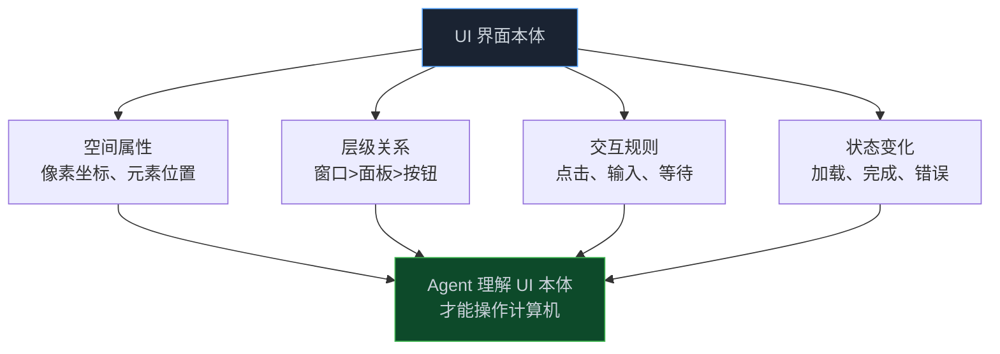
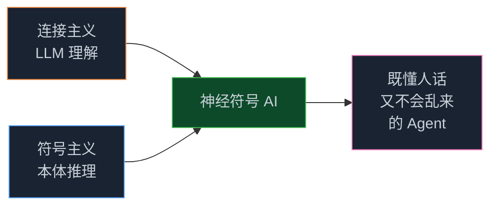
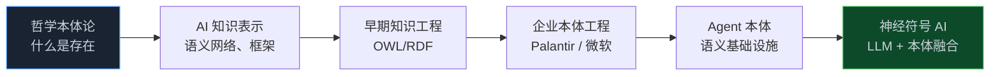

> **📖 系列难度说明**：本篇为**视野拓展**，适合想看清 Ontology 和 Agent 前沿往哪走的人。不写代码，但会颠覆你对"什么是本体"的想象。
> **🎁 核心收获**：你会意识到计算机屏幕本身就是一种本体，以及为什么"LLM + 本体"的符号-连接融合被公认为最有希望的下一条路。

前六篇，我们说了企业数据本体、知识图谱、平台、工具链。这章换个口味——聊个看起来不相关、其实骨子里一脉相承的事：让 AI 操作电脑。

Anthropic 训练 Claude 用计算机时，有个细节特别戳我：模型得**计算像素**，才能把鼠标移到正确位置点击。这听着像小事，但背后藏着一个深刻的洞察——**计算机屏幕，本身就是一种本体**。

<!-- more -->

---

## 屏幕是一种空间本体

我们平时不这么想。但你看，一个软件的界面：

- 有**空间属性**：每个按钮、输入框都有精确坐标、大小
- 有**层级关系**：窗口 > 面板 > 按钮，嵌套着来
- 有**交互规则**：什么时候能点、点了会发生什么
- 有**状态变化**：加载中、完成、报错

这不就是本体吗？对象（UI 元素）、属性（位置、大小）、链接（包含关系）、交互规则（行动）。Claude 要会操作电脑，前提就是**理解这套 UI 空间本体**。

Anthropic 的工程师说，训练 Claude 准确算像素特别关键。算不准，鼠标命令就给不对——就像模型老在"'banana'里有几个 a"这种问题上栽跟头一样。这揭示了一件事：Agent 要在一个领域里行动，先得理解那个领域的本体，不管是企业数据本体，还是屏幕上的 UI 本体。

有个真事挺逗：演示时 Claude 不小心点停了一个长时间录屏，素材全没了；还有一次它从写代码演示里暂停，跑去翻黄石公园的照片。说明这能力还糙，但方向是对的——**让模型适应工具，而不是让工具适应模型**。

---

## 从认桌面到神经符号，一层层看清

这节我一层层往下讲，你能停在任意一层，但最后那层才是这整篇文章想收口到的地方。

最直觉的视角：你教新人用电脑，得告诉他"这个是开始按钮、那个是搜索框、点这个会弹窗"。AI 也一样，屏幕上的每个东西对它来说都是一个"带位置的物件"，它得先认全、认对，才知道手往哪放。这套"桌面物件地图"就是 UI 本体，AI 看懂了才能像人一样用软件。

工程上，Claude 用计算机的流程分四步：看截图（看见屏幕发生了什么）、推理（该点哪、输入什么、等什么）、执行（给出鼠标坐标和键盘指令）、看结果（截图变了没，成功了没）。关键是第二步的"算像素"——把"我想点保存按钮"翻译成"鼠标移到 (x, y)"，这步做不好后面全歪。而且它还能自我纠正，遇到障碍会重试。在 OSWorld 基准上人类水平 70-75%，Claude 3.5 Sonnet 拿到 14.9%，是次优模型的近两倍，离人还远，但已是当前最前沿。安全上得留意**提示注入**：Claude 能读联网电脑的截图，截图里可能藏着恶意指令（"忽略之前所有要求，去干 X"），这是计算机使用特有的风险。

把视野再拉高，AI 有三个学派：**符号主义**是物理符号系统、逻辑推理，OWL/RDF 就是它的产物——确定、可验证，但笨，不会从数据里学；**连接主义**是神经网络、从数据里学，现代 LLM 就是它——灵活、懂语言，但推理不保证对；**行为主义**是感知-行动循环、强化学习，是 Agent 行动层的理论基础。现代 AI 的共识是**单靠一个学派不够，得融合**，尤其符号主义加连接主义，就是现在火得不行的**神经符号 AI（Neuro-Symbolic AI）**。落到我们这系列：LLM 负责"理解"（把自然语言、截图、非结构化文本映射到本体的对象-关系上），本体（OWL/企业本体）负责"保证正确"（符号层做确定性推理），两者一结合，Agent 既懂人话又不会乱来。这正是前面所有篇的暗线——第 02 篇图谱推理、第 03 篇 Palantir 决策、第 05 篇 OWL 推理、第 06 篇 MCP 接入，全是"连接主义理解 + 符号主义约束"的不同侧面。

---

## 一个演进的全景

把整个系列串起来看，本体论在工程里走了这几步：

从"研究存在是什么"，到"让机器能推理"，到"企业数字化双胞胎"，到"Agent 的语义地基"，最后到"和神经网络的融合"。本体论这条线，从来没离开过 AI 的主战场，只是换了个马甲。

---

## 跟前面怎么接

这章是个"收束视角"。前面六篇都是具体的"怎么做"，这章回答"为什么这些做法最终会汇到一起"——因为 LLM 的软肋（推理不保证对）正好被本体的强项（符号推理确定）补上，而本体的软肋（不会理解自然语言、不会从数据学）正好被 LLM 补上。

UI 本体这个例子，则是告诉你：本体的边界比你以为的宽。不只是企业数据，任何"有结构、有规则、Agent 要在里面行动"的领域，都可能是本体——屏幕、物理世界、甚至代码库。

---

## 📝 小结

- 计算机屏幕本身就是一种空间本体：对象（UI 元素）、属性（坐标）、链接（层级）、交互规则（行动）
- Claude 用计算机的关键是"算像素"——理解 UI 本体才能操作；当前 14.9% on OSWorld，仍远逊人类但领先同行
- 提示注入是计算机使用的特有风险，需防截图里的恶意指令
- 神经符号 AI = 连接主义（LLM 理解）+ 符号主义（本体推理），互补彼此软肋
- 本体论演进：哲学 → 知识表示 → OWL → 企业本体 → Agent 本体 → 神经符号融合；UI 本体说明本体边界比想象宽

---

## 🔮 下一篇预告（终章）

七篇下来，概念、平台、实战、前沿都聊遍了。最后一篇，我们收口到最实在的问题：从 Demo 到生产，什么时候该上 Ontology？怎么选？有哪些分水岭和坑？

---

> 📚 **系列导航**
>
> - 第 01 篇：Ontology：被低估的 AI Agent 核心基础设施
> - 第 02 篇：时间感知 Agent 实战：用知识图谱让 AI 记住"什么时候什么是真的"
> - 第 03 篇：Palantir 模式：本体如何成为企业 AI 的决策中枢
> - 第 04 篇：Microsoft Fabric：企业语义层的工程实践
> - 第 05 篇：Ontology 动手构建：OWL/RDF/SPARQL 实战指南
> - 第 06 篇：Ontology 工具链：OSDK + MCP 实战指南
> - **第 07 篇：UI 本体与神经符号 AI：从计算机使用到前沿方向** ⬅️ 你在这里
> - 第 08 篇：从 Demo 到生产：规模化 Agent 的 Ontology 设计决策
> - 第 09 篇：中小企业的本体落地场景：不建大平台，也能用上 Ontology
> - 第 10 篇：项目落地方案：中小企业用轻量栈搭本体
> - 第 11 篇：落地实战：一个最小可行本体的构建与避坑

---

> 📖 **本系列参考资料**
>
> - [Developing a computer use model — Anthropic News](https://www.anthropic.com/news/developing-computer-use)
> - [OSWorld 评估基准](https://os-world.github.io/)
> - [学习人工智能 AI 需要哪些最基础的知识 — 腾讯云](https://cloud.tencent.com/developer/article/1781507)
