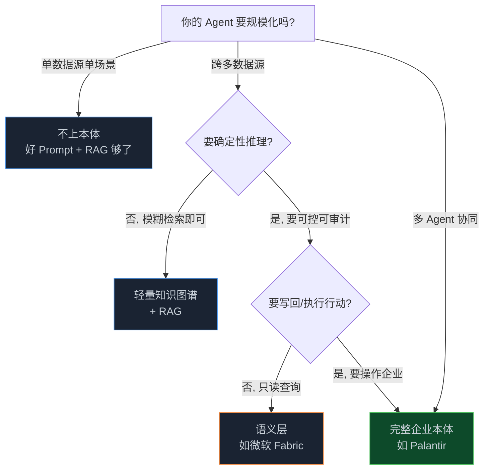
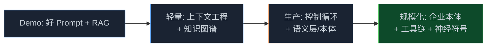

> **📖 系列难度说明**：本篇为**终章收口**，适合要做技术选型或架构决策的开发者和技术负责人。不需要前面篇的代码基础，但读过前面会更有共鸣。
> **🎁 核心收获**：你会拿到一个"什么时候该上 Ontology"的判断框架，以及从 Demo 到生产真实会踩的坑和绕法。

七篇写下来，概念、平台、工具链、前沿都过了。最后这篇，我们聊最落地的问题：你手头这个项目，到底要不要上 Ontology？

这个问题我见过太多人答错。要么一上来就建重本体，把自己累死在建模上；要么 Demo 跑得欢，一上生产就崩，才发现没有语义层根本兜不住。

<!-- more -->

---

## 一个判断标准，先记牢

LinkedIn 上有篇被转烂了的说法，我觉得是这系列最好的注脚：

> **Ontology is optional — until your AI has to scale.**
> （本体是可选的——直到你的 AI 需要规模化。）

这句话分两半理解。

前半句：单 Agent、单数据源、单业务场景？别上本体。一个好 Prompt + 精心设计的 RAG，足够你跑通 Demo。过早上本体，是过度工程，建模成本会拖死你。

后半句：一旦你的 Agent 要跨多个数据源、涉及复杂多步骤工具链、要保证企业合规、要多个 Agent 协同——本体不是"可选项"，是**唯一能让系统不崩的选择**。

---

## 从个人小工具到规模化，怎么判断

不同阶段的人，答案不一样。你可以直接跳到和自己情况对得上的那段，但我建议顺着读——有个地方很多人理解反了，放在这里说清楚。

如果你只是刚学做 Agent，想搞个帮自己整理笔记的小助手，那先别管本体，把 RAG 调好、Prompt 写清楚，能用就行。本体是给"要管全公司数据、要接几十个系统"那种大场面准备的，你现在硬上反而把自己绕晕。

稍微往前走一步，到了要上生产的开发者这一层，决策就得看这张图了——核心分水岭就一个：**你的复杂度到没到"跨系统"**：

没到跨系统，轻量方案就够；到了，本体才值得真金白银地投入。

再深一层，有个认知冲突得说清。Anthropic 在《Building Effective AI Agents》里说：早期用**精细的上下文工程**就能顶一阵，不一定非要正式本体，但从 Demo 走到工业级，必须建立**控制循环（control loop）**。而 OpenAI 在知识图谱那篇，则是直接从本体/图谱入手，把时间、推理都建模进去。两条路看着相反，其实说的是同一件事的两头：Anthropic 讲"怎么轻量起步不翻车"，OpenAI 展示"规模化之后图层长什么样"。你现在该站哪头，取决于你在决策树的哪一层——在底下就用上下文工程，往上爬就迟早上本体。

---

## 从 Demo 到生产，真实会踩的坑

这几条不是我编的，是前面几篇素材里反复出现的工程教训，汇总给你：

**坑一：图谱越跑越肥（来自第 02 篇）**
时间感知图谱每个三元组带时间戳，数据量爆炸。不治理，检索就慢死。对策：给每条边算相关性分数（时效性 × 可信度 × 查询频率），低分的自动归档或稀疏化。

**坑二：摄取管道串行瓶颈（来自第 02 篇）**
"文档 → 分块 → 提取 → 解析"线性跑，吞吐上不去。改成按阶段分队列、配独立工作池的异步架构，加背压机制才稳。

**坑三：输出验证不能省（来自第 02 篇）**
时间字段统一 ISO-8601，实体类型锁进受控词表，再加一层轻量模型做健全性检查。结构化日志带可追踪 ID，数据漂移能提前报警。

**坑四：权限边界必须前置（来自第 03、06 篇）**
别等 Agent 接完数据才想安全。Palantir 的做法是第一步就绑本体，权限边界前置到架构层。你自己的系统做不到这么重，至少把"Agent 能碰什么"显式列出来，而不是散落在代码 if 里。

**坑五：Agent 输出要落回本体（来自第 06 篇）**
Palantir 的 Agent 函数不返回值，得写回本体对象。这个思路值得借鉴——让 Agent 的产出变成"系统里可追溯的状态变更"，而不是一段飘在对话里的文本。

---

## 给不同角色的一句话建议

- **你在做个人项目 / 内部小工具**：别上本体，把 RAG 和 Prompt 调好，先跑起来。
- **你在做企业级 Agent，遇到数据歧义/权限问题**：先上语义层（微软 Fabric 思路）或轻量图谱，别一上来就 Palantir 全套。
- **你要用 Palantir/Microsoft 平台**：直接学它们的本体 SDK/MCP，底层结构本篇第 05 篇已经帮你打底了。
- **你在做技术选型/架构决策**：回到那句话——"until your AI has to scale"，看你的复杂度到没到跨系统那条线。

---

## 系列收尾：十一篇你收获了什么

回看这趟旅程：

- **第 01 篇**：Ontology 是 Agent 的语义地基，解决数据歧义、推理能力、权限安全
- **第 02 篇**：知识图谱给 Agent 记"会过期的事实"，多跳推理是它的杀手锏
- **第 03 篇**：Palantir 把本体做成企业决策中枢，四要素架构 + 场景沙盒
- **第 04 篇**：微软用语义层 + NL2Ontology 把本体做轻，让你用自然语言问数据
- **第 05 篇**：OWL/RDF/SPARQL 动手建本体，理解平台底层的"对象-属性-链接-推理"
- **第 06 篇**：OSDK + Ontology MCP 让 Agent 安全用上本体，本体绑定即权限边界
- **第 07 篇**：UI 本体说明本体边界很宽，神经符号 AI 是 LLM + 本体的融合终点
- **第 08 篇（本篇）**：规模化分水岭 + 选型决策树 + 从 Demo 到生产的真实坑
- **第 09 篇**：中小企业三个落地场景（客服/销售/库存），轻量本体解决"幻觉"和"对账"
- **第 10 篇**：选型对比 + 四阶段路线图 + 人力成本实话实说，1 工程师 4 周出 MVP
- **第 11 篇**：最小可行本体代码实战（Turtle + SPARQL），附中小企业六大踩坑清单

十一篇下来，你应该建立了一种直觉：**本体不是某个公司的私货，是 Agent 从"玩具"走向"生产系统"时，绕不开的那层语义基础设施**。它什么时候该出现，取决于你的复杂度，而不是你的热情。

---

## 📝 小结

- 判断标准：Ontology is optional until your AI has to scale——单场景别上，跨系统必须上
- 决策树核心分水岭：是否"跨多数据源 + 要确定性推理 + 要写回执行"
- Anthropic"轻量起步"与 OpenAI"图层"不矛盾，是同一件事的两头
- 生产五坑：图谱膨胀、摄取串行、验证缺失、权限后置、输出不落回
- 系列收口：本体是 Agent 从玩具到生产系统绕不开的语义基础设施

---

> 📚 **系列导航**
>
> - 第 01 篇：Ontology：被低估的 AI Agent 核心基础设施
> - 第 02 篇：时间感知 Agent 实战：用知识图谱让 AI 记住"什么时候什么是真的"
> - 第 03 篇：Palantir 模式：本体如何成为企业 AI 的决策中枢
> - 第 04 篇：Microsoft Fabric：企业语义层的工程实践
> - 第 05 篇：Ontology 动手构建：OWL/RDF/SPARQL 实战指南
> - 第 06 篇：Ontology 工具链：OSDK + MCP 实战指南
> - 第 07 篇：UI 本体与神经符号 AI：从计算机使用到前沿方向
> - **第 08 篇：从 Demo 到生产：规模化 Agent 的 Ontology 设计决策** ⬅️ 你在这里
> - 第 09 篇：中小企业的本体落地场景：不建大平台，也能用上 Ontology
> - 第 10 篇：项目落地方案：中小企业用轻量栈搭本体
> - 第 11 篇：落地实战：一个最小可行本体的构建与避坑

---

> 📖 **本系列参考资料**
>
> - [Ontology is Optional Until Your AI Has To Scale — LinkedIn](https://www.linkedin.com/pulse/ontology-optional-until-your-ai-has-scale-bojan-ciric-lutve)
> - [Building Effective AI Agents — Anthropic Engineering](https://www.anthropic.com/engineering/building-effective-agents)
> - [Temporal Agents with Knowledge Graphs — OpenAI Cookbook](https://developers.openai.com/cookbook/examples/partners/temporal_agents_with_knowledge_graphs/temporal_agents)
