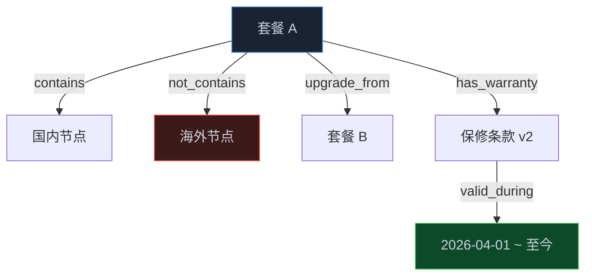
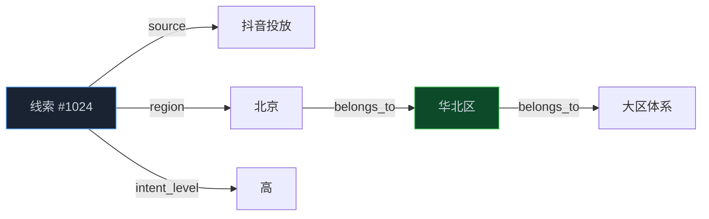
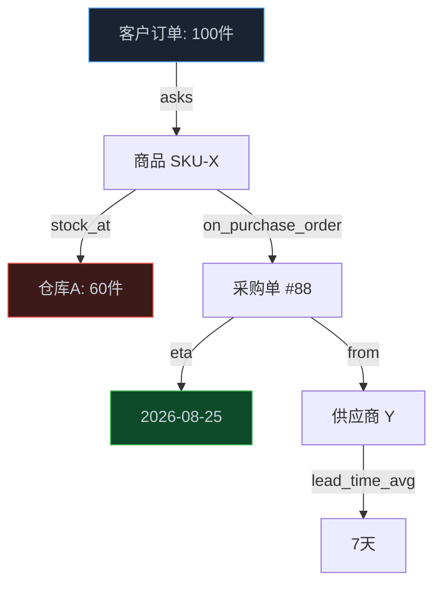

> **📖 系列难度说明**：本篇是续篇，讲"落地场景"。前面 01-08 篇把概念和平台铺开了，这篇开始往"中小企业真能用"上靠。不管你是老板、业务负责人还是写代码的，都能顺着读——前面偏直觉，往后越挖越实。
> **🎁 核心收获**：你会看到三个中小企业就能上手的实际场景，明白本体到底解决什么具体问题，以及它跟 Palantir 那种重平台的区别在哪。

前面八篇，我们从"本体是什么"一路聊到 Palantir、微软、OWL、神经符号。聊到这你心里大概有个疑问：**这些听着都是大厂玩的，我一个几十号人、系统才五六个的小公司，跟我有什么关系？**

这个疑问特别正常，而且它本身就是个误区。本体这东西，不是非得买一套几百万的平台才算用上。它本质上是一种"把业务知识说清楚"的纪律——这纪律，小公司一样缺，而且缺得更疼。

## 先破一个误区：本体 ≠ 重平台

很多人一听 Ontology，脑子里立刻浮现 Palantir 那种指挥中心大屏、成百上千个对象的复杂图谱。于是下结论：这是大厂玩具，我们玩不起。

其实不是。你回头看第 01 篇那个比喻——本体就是"AI 的业务说明书"。一个 50 人的公司，业务说明书不需要写 500 页，写 20 页可能就够了。问题是，哪怕只写 20 页，你今天有吗？

我见过太多中小企业的真实情况：客户信息散在销售的个人微信里，产品规格藏在某个 Excel 的第三个 sheet，退换货规则只有客服主管脑子里有。AI 一接进来，照样"乱说话"——而且因为公司小、没人专门治理数据，乱得更彻底。

所以中小企不是"用不起本体"，是"更需要一个轻量的本体"。下面三个场景，都是几十人规模的公司能落地的真事。

## 场景一：智能客服不再"幻觉式"答非所问

先说最直觉的。你开个网店或者做 SaaS，客服每天被问爆：这个型号支不支持某个功能？保修期怎么算？老客户续费有什么政策？

你接个 LLM 当客服助手，没本体之前它会干嘛？它根据训练数据"编"。问"你们 A 套餐包不包含海外节点"，它可能非常自信地答"包含"——其实你三个月前就改成不含了，官网上也没写清楚。这种错误，一个大客户发现一次，信任就没了。

本体在这里干的事很具体：把你的**产品目录、套餐规则、保修条款、退换政策**定义成一组带关系的对象。比如"套餐 A"这个对象，属性里写死"含国内节点：是 / 含海外节点：否 / 生效时间：2026-04-01"，它和"节点"是 `contains` 关系，和"套餐 B"是 `upgrade_from` 关系。

落到工程上，这一步不复杂。你不用上 Palantir，把产品规则整理成一份结构化文件（哪怕是 CSV 转成的图），再用 RAG 或者第 05 篇讲的轻量知识图谱接上 LLM，让它在回答前先查这张图。效果立竿见影：明确"否"的事，它不会再编成"是"。

再往深想一层，这其实就是第 02 篇"时间感知"和第 07 篇"神经符号"的微型版——你用结构化约束，把 LLM 的"统计性猜测"圈在了确定性的业务事实里。小公司不需要完整的神经符号架构，但只要开始"用显式知识约束 LLM 输出"，你就已经在用本体了。

## 场景二：销售线索不再"各说各话"

第二个场景，销售团队。一个 30 人的公司，销售线索从哪来？官网表单、抖音投放、展会名片、老客户转介绍。问题是，这些线索进了系统，字段乱七八糟：有人填"北京"，有人填"北京市"，有人填"京"。销售主管想看"华北区这个月高意向线索有多少"，系统查不出来，因为"北京"和"华北"之间没有任何关系被定义。

本体在这里的价值是**统一语义 + 建立层级**。你定义"地区"是一个实体类型，下面挂"华北区"，华北区下面挂"北京、天津、河北"。再定义"线索"有"来源渠道""意向等级""所属地区"这些属性，而且"所属地区"必须引用你定义好的地区实体，不能随便填自由文本。

这事儿听着简单，做和不做差很远。做了，销售主管问"华北区高意向线索"，系统沿着 `belongs_to` 一路往上聚合，北京、天津、河北的线索全算进来，一句自然语言就能查（呼应第 04 篇的 NL2Ontology）。没做，只能靠人工在 Excel 里筛选，还经常因为"京"和"北京"对不上而漏数。

从机制上说，这就是第 05 篇讲的"实体-关系-属性"最朴素的应用，没有 OWL 推理那么重，但基数约束（一个线索只能属于一个地区）和层级关系（地区属于大区）已经把数据治理的架子搭起来了。小公司最划算的投入，往往就是这种"先把关系说清楚"的轻量本体。

## 场景三：库存和采购终于"对得上账"

第三个场景，稍微往运营侧走。很多做电商 or 零售的中小企业，库存在一个系统（或者干脆是仓库的 Excel），采购在另一个表，销售在第三个。结果经常是：销售那边显示有货能接单，仓库说没货，采购说"我上周不是下单了吗"——三方各一本账。

本体的解法，是把"商品、库存、采购单、供应商"定义成互相关联的对象。商品有 SKU，库存按 SKU 记录数量和仓库位置，采购单关联 SKU 和供应商，还带"预计到货时间"。当一个 Agent 接到"客户要 100 件，能不能接"的问题，它不再瞎猜，而是沿图查：当前库存够不够 → 不够的话在途采购单啥时候到 → 供应商历史交期稳不稳定。

这场景其实踩中了第 03 篇 Palantir 讲的核心——"数据分散在多个系统，谁也说不清全局状态"。Palantir 用重本体+行动层解决，中小企业用轻量图谱+只读查询也能解决大半。区别不在于"用没用本体"，在于"要不要把决策直接写回各系统执行"。小公司通常还到不了那一步，能先把账对清楚，价值就已经回来了。

## 三个场景的共同点：你早就该有，只是一直没写下来

把上面三个场景放一起看，你会发现它们解决的是同一个老问题：**公司里那些"大家都知道但没人写下来"的业务知识，终于被显式地表达出来了**。

产品规则、地区层级、库存采购关系——这些知识在老板脑子里、在老员工微信里、在某个莫名其妙的 Excel 里。本体做的，就是把这些" tacit knowledge（隐性知识）"变成" explicit（显式）"。这恰恰是第 01 篇 Gruber 定义里"显式表述"四个字的小企业版。

而且你注意到了吗，这三个场景都没有用到 Palantir 那种重平台，也不需要 OWL 全套推理。它们用的是同一套思路：定义实体、关系、属性，用图把分散的数据连起来，让 LLM 在回答前先查这张图。这就是中小企业落地本体的正确姿势——**轻量起步，先解决"对账"和"不幻觉"，再考虑"决策写回"**。

下一篇我们不讲场景了，讲怎么把这些场景真的落成一个项目：用什么栈、分几步、花多少人力。你会看到，对一个几十人的公司，这件事远比想象中便宜。

---

## 📝 小结

- 误区：本体 ≠ 重平台；小公司不是用不起，是更需要轻量版本
- 场景一（客服）：把产品/套餐/保修定义为带关系的对象，LLM 回答前先查图，消灭"编答案"
- 场景二（销售）：统一地区语义、建立层级，自然语言就能聚合"华北区高意向线索"
- 场景三（库存采购）：商品-库存-采购单-供应商互相关联，Agent 能沿图判断"这单接不接"
- 共同点：把隐性业务知识显式化，用图连起分散数据，让 LLM 先查后答
- 与大厂区别：小公司重在"对账+不幻觉"，暂不需要"决策写回执行"那一层

---

> 📚 **系列导航**
> - 第 01 篇：Ontology：被低估的 AI Agent 核心基础设施
> - 第 02 篇：时间感知 Agent 实战：用知识图谱让 AI 记住"什么时候什么是真的"
> - 第 03 篇：Palantir 模式：本体如何成为企业 AI 的决策中枢
> - 第 04 篇：Microsoft Fabric：企业语义层的工程实践
> - 第 05 篇：Ontology 动手构建：OWL/RDF/SPARQL 实战指南
> - 第 06 篇：Ontology 工具链：OSDK + MCP 实战指南
> - 第 07 篇：UI 本体与神经符号 AI：从计算机使用到前沿方向
> - 第 08 篇：从 Demo 到生产：规模化 Agent 的 Ontology 设计决策
> - **第 09 篇：中小企业的本体落地场景：不建大平台，也能用上 Ontology** ⬅️ 你在这里

---

> 📖 **本系列参考资料**
> - [Ontology is Optional Until Your AI Has To Scale — LinkedIn](https://www.linkedin.com/pulse/ontology-optional-until-your-ai-has-scale-bojan-ciric-lutve)
> - [Building Effective AI Agents — Anthropic Engineering](https://www.anthropic.com/engineering/building-effective-agents)
> - [Temporal Agents with Knowledge Graphs — OpenAI Cookbook](https://developers.openai.com/cookbook/examples/partners/temporal_agents_with_knowledge_graphs/temporal_agents)
