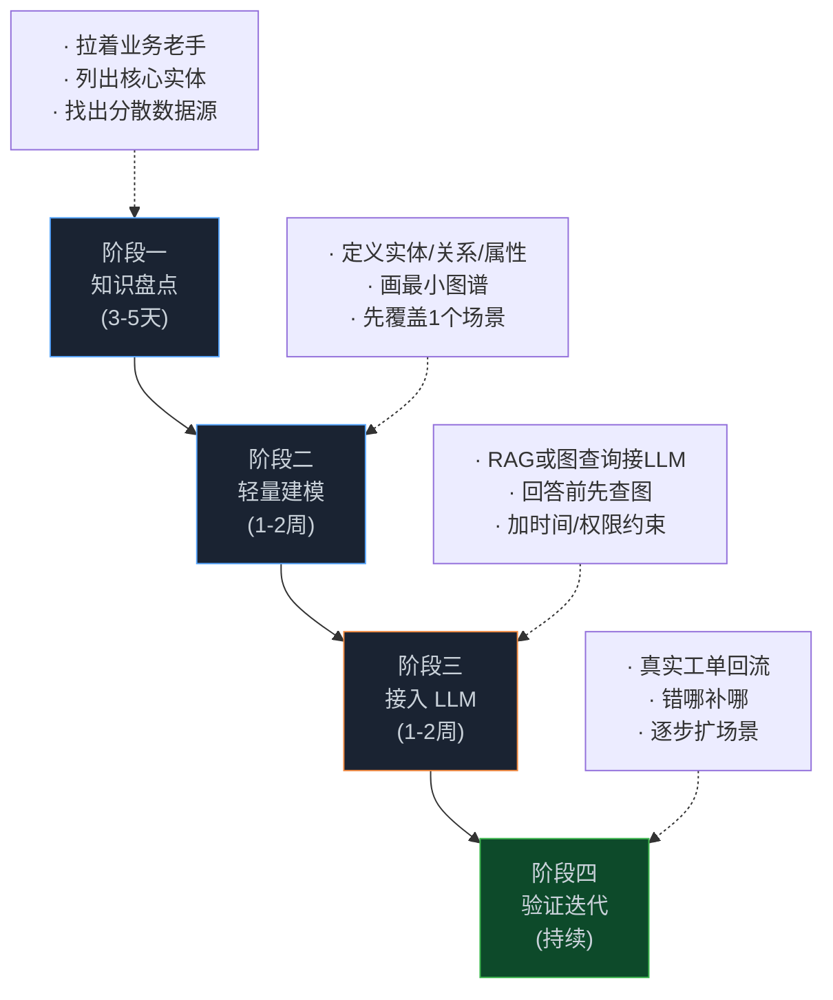

> **📖 系列难度说明**：本篇是落地方案篇，偏"怎么做项目"。业务负责人看前两段就能拿去立项，开发者往后看能直接照着搭。不需要 Palantir 预算，一台云服务器就能起步。
> **🎁 核心收获**：你会拿到一张选型对比表、一张四阶段路线图，以及一个 50 人公司大概要花多少人和多少钱的实打实估算。

上篇聊了三个场景，你可能已经有点心动：客服、销售、库存，听着都能用。但心动到立项之间，还隔着一堆很现实的问题——用什么技术？找谁做？花多少钱？做多久？

这篇就把这些"脏活"摊开讲。先说结论：**对一个几十人的公司，一个能跑起来的轻量本体项目，1 个懂点数据的工程师 + 1 个业务老手，2 到 4 周就能出第一个可用版本，云成本一个月几百块**。没那么吓人。

## 第一步：选型，别一上来就想买平台

中小企业落地本体，技术栈大体三条路，我把它们的真实差别摆出来：

| 方案 | 代表 | 上手成本 | 适合阶段 | 中小企业友好度 |
| --- | --- | --- | --- | --- |
| 重型平台 | Palantir Foundry、Microsoft Fabric | 高（商务+实施周期长、按席位/用量计费） | 跨系统、要决策写回的大企业 | ⭐ 基本不友好 |
| 图数据库自建 | Neo4j / NebulaGraph + LLM | 中（要自己建模和接 LLM） | 有专属工程师、想自主可控 | ⭐⭐⭐⭐ 很友好 |
| 轻量文件图谱 | CSV/JSON + RAG + 简单图查询 | 低（几乎零基础设施） | 验证想法、场景简单 | ⭐⭐⭐ 友好但天花板低 |

我的建议很直接：**从小往大走**。先用"轻量文件图谱"验证逻辑通不通——比如把产品规则丢进一份结构化文件，接个 RAG 看客服幻觉有没有降下来。验证有效了，再考虑上 Neo4j，把关系建模做得更扎实、支持多跳查询（呼应第 05 篇的 SPARQL 多跳）。等到你真的要"跨十几个系统、还要自动执行决策"了，那时候再谈重型平台也不迟。

这里有个坑得提前说：很多人一看"图数据库"就觉得非 Neo4j 不可。其实对大多数中小企业，前半年的数据量，PostgreSQL 加一个递归查询也能顶住，甚至 Excel 转成的图文件都够用。技术选型的铁律是——**够用到下一步就行，别为想象中的规模提前买单**。

## 第二步：四阶段路线图，照着走

不管选哪条技术路，项目推进的节奏是通用的。我画了张四阶段的图：

**阶段一，知识盘点（3-5 天）**。这步最容易被跳过，但最值钱。你拉着业务老手（客服主管、销售头、仓库负责人），问一个问题："你们每天做的判断，靠的是哪些'只有你知道'的信息？"把这些信息列出来——产品哪些能卖、地区怎么归、库存谁说了算——这就是你本体的第一批实体和关系。注意，这步不写代码，纯聊天+白板。

**阶段二，轻量建模（1-2 周）**。把盘出来的东西落成结构。先只覆盖一个场景（比如客服），定义清楚"套餐""节点""保修"这几个实体和它们的关系，画一张最小图谱。别贪多，先把一条线跑通。

**阶段三，接入 LLM（1-2 周）**。把图谱接到模型上。要么走 RAG（把图谱内容当检索源），要么走图查询（像第 05 篇那样用 SPARQL 多跳）。关键是"LLM 回答前先查图"这个机制——别忘了把第 02 篇的时间约束、第 06 篇的权限约束也带上，别等出事才补。

**阶段四，验证迭代（持续）**。把真客户问题、真实工单往里灌，看它答错在哪，错哪补哪。这步没有终点，本体是活的东西，业务变它就变。

## 第三步：人和钱，实话实说

很多老板卡在"这得招多少人"。按我上面的节奏，最小配置是这样：

- **1 个工程师**：懂 SQL、会点 Python、能折腾 LLM API 就行，不要求图数据库专家。前半段用文件图谱，他一个人能扛。
- **1 个业务老手（兼职）**：就是阶段一白板会议里那个人，不用全职，每周给半天梳理业务规则。
- **外部算力**：LLM 调用按量计费，中小企月调用量通常几百块；图数据库如果上 Neo4j，一台 4G 内存的云服务器够跑，月费几十到一百出头。

算总账：一个 4 周出 MVP 的项目，人力约等于"1 个工程师一个月 + 业务老手 1/4 个月"，云成本可忽略。这跟"买套企业平台、养个实施团队"根本不是一回事。说白了，中小企业落地本体最大的成本不是钱，是**你愿不愿意花那几天，把业务知识从老员工脑子里掏出来写下来**——这恰恰是前面所有篇反复说的"显式化"。

## 第四步：风险控制，别让项目死在这几件事上

落到工程，有几个真实会害死项目的地方，提前讲：

**别想一口气建模全公司**。一上来就定义 200 个实体，工程师懵了，业务也凑不齐数据。永远从"一个场景、十几二十个实体"开始，跑通再加。

**别让业务老手中途撤**。本体建模依赖他们对业务的判断，这人一走，项目就悬空。阶段一的结论务必留文档。

**别把图谱当万能存储**。本体管的是"关系和语义"，原始交易数据该待在数据库里待在数据库里。把订单流水全塞进图里，图谱会先膨胀后崩溃（第 08 篇讲的"图谱膨胀"坑，小公司一样踩）。

**先有查询，再有写回**。中小企业第一版只做"查"（客服问答、线索聚合），别急着做"自动执行"（自动改库存、自动发采购单）。写回一旦出错，锅比幻觉大得多。

把这四步按顺序走，你手里的就不是 PPT 上的概念，而是一个真能减少客服瞎答、让销售对齐口径、把库存对上账的本体系统。下一篇，我们直接上手——给你一个最小可行本体的真实代码，从建模到查询跑一遍。

---

## 📝 小结

- 选型三路：重型平台（大企业）/ Neo4j 自建（自主可控）/ 文件图谱（验证用），中小企业从轻往重走
- 四阶段路线图：知识盘点 → 轻量建模 → 接入 LLM → 验证迭代，前两段不写代码
- 人力真相：1 工程师 + 1 业务老手（兼职），4 周出 MVP，云成本月几百块
- 最大成本不是钱，是把隐性业务知识写下来的那几天
- 四个雷：别全量建模、别撤业务老手、别拿图当主存储、先查后写回

---

> 📚 **系列导航**
> - 第 01 篇：Ontology：被低估的 AI Agent 核心基础设施
> - 第 02 篇：时间感知 Agent 实战：用知识图谱让 AI 记住"什么时候什么是真的"
> - 第 03 篇：Palantir 模式：本体如何成为企业 AI 的决策中枢
> - 第 04 篇：Microsoft Fabric：企业语义层的工程实践
> - 第 05 篇：Ontology 动手构建：OWL/RDF/SPARQL 实战指南
> - 第 06 篇：Ontology 工具链：OSDK + MCP 实战指南
> - 第 07 篇：UI 本体与神经符号 AI：从计算机使用到前沿方向
> - 第 08 篇：从 Demo 到生产：规模化 Agent 的 Ontology 设计决策
> - 第 09 篇：中小企业的本体落地场景：不建大平台，也能用上 Ontology
> - **第 10 篇：项目落地方案：中小企业用轻量栈搭本体** ⬅️ 你在这里

---

> 📖 **本系列参考资料**
> - [Ontology is Optional Until Your AI Has To Scale — LinkedIn](https://www.linkedin.com/pulse/ontology-optional-until-your-ai-has-scale-bojan-ciric-lutve)
> - [Building Effective AI Agents — Anthropic Engineering](https://www.anthropic.com/engineering/building-effective-agents)
> - [Temporal Agents with Knowledge Graphs — OpenAI Cookbook](https://developers.openai.com/cookbook/examples/partners/temporal_agents_with_knowledge_graphs/temporal_agents)
