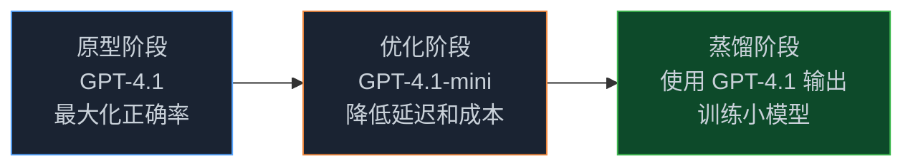
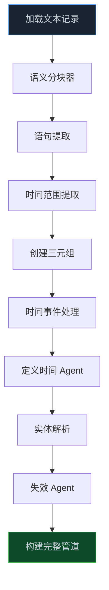
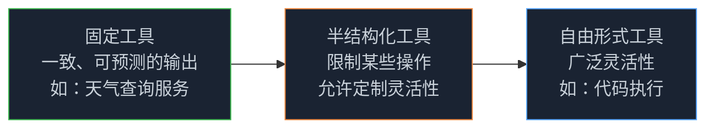

> **📖 原文来源**：[Temporal Agents with Knowledge Graphs — OpenAI Cookbook](https://developers.openai.com/cookbook/examples/partners/temporal_agents_with_knowledge_graphs/temporal_agents)
> **✍️ 原文作者**：Danny Wigg、Shikhar Kwatra（OpenAI），Alex Heald、Douglas Adams、Rishabh Sagar
> **📅 发布时间**：2025 年 7 月 22 日

这是一篇极具含金量的 OpenAI 官方实战教程，深入讲解了如何构建**时间感知知识图谱**，并在其上进行**多跳检索推理**。如果你正在构建需要处理"某个时间点上什么是真实的"这类问题的 AI 系统，这篇文章不容错过。

<!-- more -->

---

## 1. 目的与适用人群

本教程为构建时间感知知识图谱、并在其上进行多跳检索的工程师、架构师和分析师提供实操指南。无论你是在做原型验证、规模化部署，还是探索结构化数据的新用法，都能在这里找到实用的工作流、最佳实践和决策框架。

本教程包含两个可直接上手、扩展和部署的实战工作流：

### 工作流一：时间感知知识图谱构建

构建知识驱动 AI 系统的核心挑战之一，是维护一个**持续更新、保持时效性**的数据库。尽管语义相似度、重排序等检索增强技术备受关注，本教程聚焦于一个更基础却常被忽视的问题：**随着新数据到来，如何系统性地更新和验证知识库**。

无论检索算法多么先进，其效果都受限于数据库的质量和时效性。本教程演示了如何在新数据到来时，对知识图谱条目进行例行验证和更新，确保知识库始终准确、最新。

### 工作流二：基于知识图谱的多跳检索

学习如何将 OpenAI 模型（如 o3、o4-mini、GPT-4.1、GPT-4.1-mini）与结构化图查询通过工具调用结合，让模型能够跨实体和关系进行多步图遍历。

这种方法让系统能够回答需要对多个关联事实进行推理的复杂、多维度问题——远超单跳检索所能实现的范围。

---

## 2. 核心要点

### 2.1 为什么要让知识图谱具备时间感知能力？

传统知识图谱将事实视为静态的，但现实世界的信息在不断演变。上个季度还正确的信息，今天可能已经过时——如果图谱无法捕捉随时间的变化，就会带来错误或误导性的决策风险。

**时间感知知识图谱**让你能够精确回答"在某个给定日期，什么是真实的？"这类问题，或分析事实和关系如何随时间演变，确保决策始终基于最相关的上下文。

### 2.2 什么是时间 Agent（Temporal Agent）？

时间 Agent 是一个管道组件，它摄取原始数据，并为知识图谱生成**带时间戳的三元组（Triplets）**。这使得基于时间的精确查询、时间线构建、趋势分析等成为可能。

### 2.3 管道如何工作？

管道从对原始文档进行**语义分块**开始。这些分块被分解为语句，交给时间 Agent 处理，生成时间感知三元组。随后，**失效 Agent（Invalidation Agent）** 执行时间有效性检查，识别并处理被新语句所失效的旧语句。

---

## 3. 为什么需要多跳检索？

直接的单跳查询经常遗漏分布在图谱拓扑结构中的重要事实。**多跳检索**通过迭代遍历、沿关系追踪、跨多个跳聚合证据，能够发现单次查询无法揭示的复杂依赖关系和潜在连接，为复杂查询提供更全面、更细致的答案。

---

## 4. 时间感知的必要性：行业案例

不处理时间维度的数据库，在各行各业都会带来严重风险：

| 行业 | 示例问题 | 不具备时间感知的风险 |
|------|---------|-------------------|
| 金融服务 | "穆迪对 YY 银行的长期评级自 2023 年 2 月以来如何演变？" | 混淆历史评级与当前评级，导致信用风险定价错误 |
| 金融服务 | "ZZ 零售商发布 FY-22 业绩指引时，CFO 是谁？" | 治理/内幕交易分析可能归咎于错误的高管 |
| 制造/汽车 | "2022-05 至 2023-03 期间出厂的 Q3 车型搭载了哪个 ECU 固件？" | 因固件版本漂移导致现场故障误诊 |
| 制造/汽车 | "2024 年 5 月生产的车辆，转向柱螺栓的扭矩规格是多少？" | 安全召回可能遗漏受影响车辆 |

这一主题在制药、法律、消费品等众多行业同样适用。

---

## 5. 时间 Agent 的核心设计

### 5.1 三元组（Triplets）：知识图谱的基本构建块

三元组是知识图谱的基本单元，用三个部分表示一个事实：

- **主体（Subject）**：你所谈论的实体
- **谓词（Predicate）**：关系或属性的类型
- **客体（Object）**：主体所连接的值或其他实体

可以把它理解为一个结构为 `[主体] - [谓词] - [客体]` 的句子。例如：

```
"伦敦" - "是首都" - "英国"
```

本教程中的时间 Agent 从 [Zep](https://github.com/getzep/zep) 和 [Graphiti](https://github.com/getzep/graphiti) 汲取灵感，同时引入了对事实失效的更严格控制，以及对情节类型更细致的处理。

### 5.2 关键增强特性

**时间有效性提取**

在 Graphiti 提示设计的基础上，无需辅助参考语句即可识别时间跨度和情节上下文。

**事实失效逻辑**

引入双向性检查，并按情节类型约束比较范围。在保留 Zep 无损方法的同时，减少不必要的评估。

**时间与情节类型**

区分**事实（Fact）**、**观点（Opinion）**、**预测（Prediction）**，以及时间类别：**静态（Static）**、**动态（Dynamic）**、**无时间性（Atemporal）**。

**多事件提取**

在单次处理中处理复合句和嵌套日期引用。

### 5.3 三阶段处理管道

**阶段一：时间分类**

将每条语句标记为以下三类之一：

- **无时间性（Atemporal）**：永远不变的事实（如"真空中光速约为 3×10⁸ m/s"）
- **静态（Static）**：从某个时间点起有效但此后不再变化（如"YY 于 2014 年 10 月 23 日成为 XX 公司 CEO"）
- **动态（Dynamic）**：会随时间演变（如"YY 是 XX 公司的 CEO"）

**阶段二：时间事件提取**

识别相对或部分日期（如"周二"、"三个月前"），并使用文档时间戳或回退启发式方法将其解析为绝对日期（如仅知道月份时，默认为该月第一天或最后一天）。

**阶段三：时间有效性检查**

确保每条语句都包含 `t_created` 时间戳，并在适用时包含 `t_expired` 时间戳。Agent 随后将候选三元组与知识图谱中的现有条目进行比较，以：

- 检测矛盾，并用 `t_invalid` 标记过时条目
- 通过 `invalidated_by` 将新语句链接到它们所失效的旧语句

---

## 6. 模型选择策略

### 6.1 为时间 Agent 选择合适的模型

**GPT-4.1 系列**特别适合构建时间 Agent，因为其强大的指令遵循能力。在 Scale 的 MultiChallenge 基准测试中，GPT-4.1 比 GPT-4o 高出 10.5%，展示了更强的上下文维护、对话推理和指令遵循能力——这些都是提取带时间戳三元组的关键特质。

### 6.2 推荐开发工作流



| 模型 | 相对成本 | 相对延迟 | 智能程度 | 工作流中的理想角色 |
|------|---------|---------|---------|-----------------|
| GPT-4.1 | ★★★ | ★★ | ★★★（最高） | 基准原型、生成蒸馏数据 |
| GPT-4.1-mini | ★★ | ★ | ★★ | 均衡成本性能，中大规模生产系统 |
| GPT-4.1-nano | ★（最低） | ★（最快） | ★ | 成本敏感和超大规模批量处理 |

实践中的做法：用 GPT-4.1 原型 → 衡量质量 → 逐步降级，直到权衡不再满足需求。

---

## 7. 构建时间 Agent 管道

### 7.1 管道总览



### 7.2 数据集选择

教程使用了 **"财报电话会议数据集"**（jlh-ibm/earnings_call），该数据集在 Creative Commons Zero v1.0 许可下提供，包含 2016-2020 年间 NASDAQ 股市相关的 188 份财报电话会议记录。

选择这个数据集的原因：
- 从财报电话会议记录中提取信息，是全球众多金融机构面临的常见问题
- 同一公司在多次财报电话会议中的陈述和话题往往存在变化，为演示时间知识图谱概念提供了很好的载体

教程限制处理两家公司——AMD 和英伟达——但实际上这个管道可以轻松扩展到任何公司。

### 7.3 数据库设计

教程使用 SQLite 作为数据库（便于在 Notebook 格式中使用）。数据库包含以下表：

- **Transcripts**（记录）
- **Chunks**（分块）
- **Temporal Events**（时间事件）
- **Triplets**（三元组）
- **Entities**（实体，包含规范化映射）

### 7.4 核心数据模型

**Chunk 模型**：存储从记录中提取的文本片段及其元数据

```python
class Chunk(BaseModel):
    """财报电话会议的文本分块。"""
    id: uuid.UUID = Field(default_factory=uuid.uuid4)
    text: str
    metadata: dict[str, Any]
```

**Transcript 模型**：表示完整的财报电话会议记录

```python
class Transcript(BaseModel):
    """公司财报电话会议的完整记录。"""
    id: uuid.UUID = Field(default_factory=uuid.uuid4)
    text: str
    company: str
    date: datetime
    quarter: str | None = None
    chunks: list[Chunk] | None = None
```

---

## 8. 多跳检索的核心概念

### 8.1 规划器（Planners）

规划器负责编排检索过程，分为两类：

- **任务导向规划器**：将查询分解为具体的、顺序执行的子任务
- **假设导向规划器**：提出待确认、反驳或演化的主张

选择最优策略取决于问题在"确定性报告（路径明确）"到"探索性研究（开放式推理）"这一谱系上的位置。

### 8.2 工具设计范式

工具设计横跨一个连续谱：



选择合适的范式是控制性、适应性和复杂性之间的权衡。

### 8.3 评估检索系统

高保真评估依赖于专家精心策划的"黄金答案"，但这些答案成本高昂且耗时。LLM 判断或工具追踪等自动化评判可以快速生成，用于补充或预筛选，但可能缺乏人工评估的精确性。

**经过验证的工作流**：从合成测试开始 → 在人工标注的"黄金"数据集上进行基准测试 → 使用真实用户反馈和评分迭代优化。

---

## 9. 从原型到生产

### 9.1 保持图谱精简

建立归档策略，为每条边分配数值相关性分数（如：时效性 × 可信度 × 查询频率）。自动归档或稀疏化低价值节点和边，确保只有最关键、最常访问的事实保留以供快速检索。

### 9.2 并行化摄取管道

从线性的"文档 → 分块 → 提取 → 解析"管道，转变为分阶段的异步架构：

- 为每个处理阶段分配独立的队列和专用工作池
- 对失效任务应用聚类或基于网络的批处理以最大化效率
- 尽可能批量处理外部 API 请求（如 OpenAI）和数据库写入

这种设计提高了吞吐量，引入了背压机制以保证可靠性，并允许独立扩展每个管道阶段。

### 9.3 集成健壮的生产保障

- **严格的输出验证**：标准化时间字段（如 ISO-8601 日期格式），将实体类型约束到受控词汇表，对输出一致性应用轻量级模型健全性检查
- **结构化日志记录**：使用可追踪标识符，实时监控质量和性能指标，在数据漂移、回归或管道异常影响下游应用之前主动检测

---

## 10. 📝 小结

- 时间感知知识图谱解决了传统静态知识图谱无法处理"某时间点上什么是真实的"这一核心问题
- 时间 Agent 通过三阶段管道（分类 → 提取 → 有效性检查）将原始文本转化为带时间戳的三元组
- 多跳检索通过迭代图遍历，能够回答需要跨多个关联事实推理的复杂问题
- 模型选择策略：原型用 GPT-4.1，生产优化用 mini/nano，通过蒸馏保持性能
- 生产化关键：保持图谱精简、并行化摄取、集成健壮的输出验证

---

> 📖 **原文链接**
> - [Temporal Agents with Knowledge Graphs — OpenAI Cookbook](https://developers.openai.com/cookbook/examples/partners/temporal_agents_with_knowledge_graphs/temporal_agents)
> - [Zep — 时间知识图谱参考实现](https://github.com/getzep/zep)
> - [Graphiti — 知识图谱构建框架](https://github.com/getzep/graphiti)
