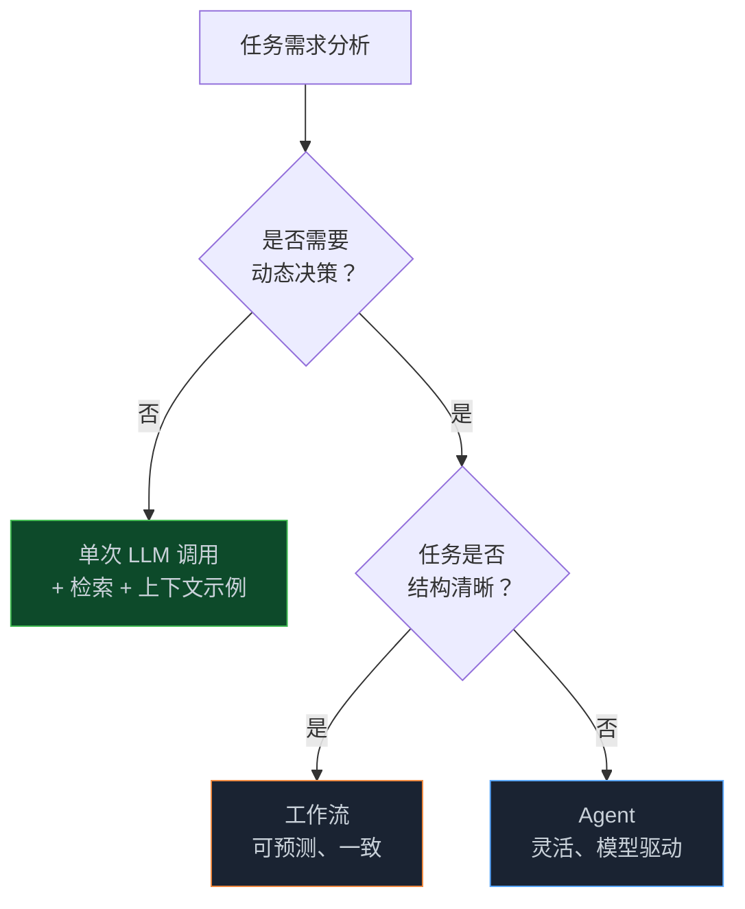
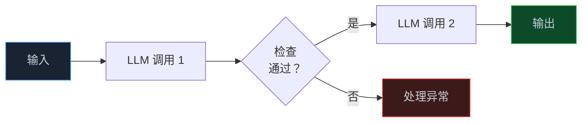
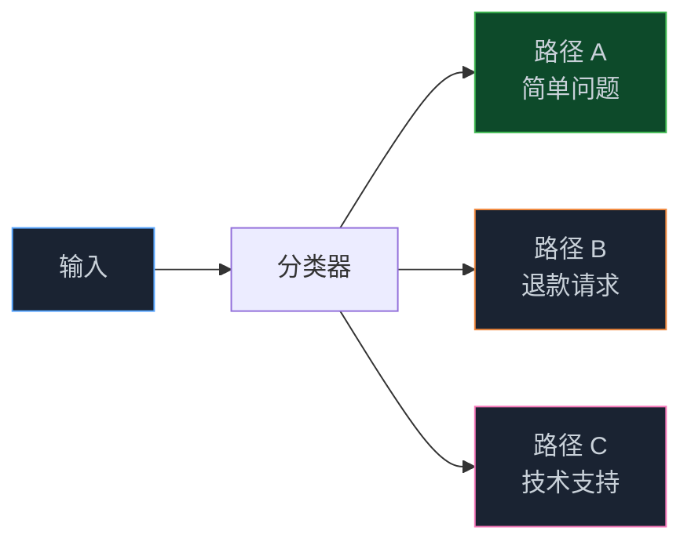
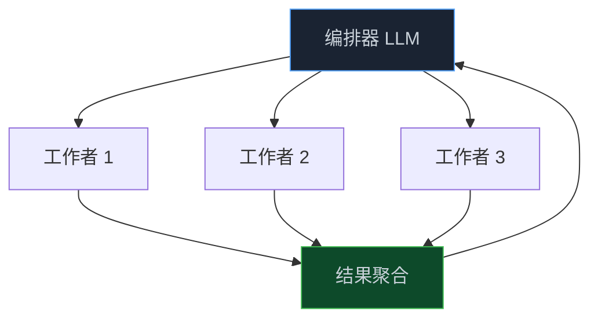
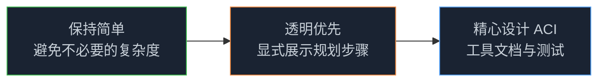

> **📖 原文来源**：[Building Effective AI Agents — Anthropic Engineering](https://www.anthropic.com/engineering/building-effective-agents)
> **✍️ 原文作者**：Erik S. 和 Barry Zhang（Anthropic）
> **📅 发布时间**：2024 年 12 月 19 日

这是 AI 圈内几乎人手必备的 Agent 架构指南。Anthropic 工程团队在与数十个跨行业团队合作后，总结出了一个核心洞察：**最成功的 Agent 实现，用的是简单、可组合的模式，而不是复杂的框架**。

<!-- more -->

---

## 1. 什么是 Agent？

"Agent"这个词有多种定义方式。有些团队将其定义为在较长时间内独立运行、使用各种工具完成复杂任务的完全自主系统；另一些则用这个词描述遵循预定义工作流的更规范化实现。

在 Anthropic，我们将所有这些变体统称为**智能体系统（Agentic Systems）**，但在架构上做了一个重要区分：

- **工作流（Workflows）**：LLM 和工具通过预定义代码路径进行编排的系统
- **Agent**：LLM 动态指导自身流程和工具使用、自主控制任务完成方式的系统

---

## 2. 何时（以及何时不）使用 Agent

在用 LLM 构建应用时，我们建议**找到尽可能简单的解决方案，只在必要时才增加复杂度**。这可能意味着根本不需要构建智能体系统。

智能体系统通常以更高的延迟和成本换取更好的任务性能，你需要考虑这种权衡是否合理：

**关于框架的建议**：市面上有很多框架（Claude Agent SDK、AWS Strands Agents SDK、Rivet、Vellum 等）可以简化智能体系统的实现。但这些框架往往会增加额外的抽象层，使底层提示和响应更难调试。

**我们的建议**：先直接使用 LLM API，很多模式只需几行代码就能实现。如果使用框架，确保你理解底层代码——对底层机制的错误假设是客户常见的错误来源。

---

## 3. 构建块、工作流与 Agent

### 3.1 基础构建块：增强型 LLM

智能体系统的基本构建块是**增强了检索、工具和记忆能力的 LLM**。当前模型可以主动使用这些能力——生成自己的搜索查询、选择合适的工具、决定保留哪些信息。

我们建议重点关注两个方面：
1. 针对你的具体用例定制这些能力
2. 确保它们为 LLM 提供简单、文档完善的接口

### 3.2 工作流一：提示链（Prompt Chaining）

提示链将任务分解为一系列步骤，每次 LLM 调用处理上一次的输出。你可以在任何中间步骤添加程序化检查（"门控"），确保流程仍在正轨上。

**适用场景**：任务可以清晰分解为固定子任务时。主要目标是以延迟换取更高准确率，让每次 LLM 调用都成为更简单的任务。

**典型示例**：
- 生成营销文案，然后翻译成不同语言
- 先写文档大纲，检查大纲是否符合标准，再基于大纲写文档

### 3.3 工作流二：路由（Routing）

路由对输入进行分类，并将其导向专门的后续任务。这种工作流实现了关注点分离，并能构建更专业化的提示。

**适用场景**：存在明显不同类别、最好分开处理的复杂任务，且分类可以准确完成时。

**典型示例**：
- 将不同类型的客服查询（一般问题、退款请求、技术支持）导向不同的下游流程
- 将简单/常见问题路由到 Claude Haiku 4.5 等小型高效模型，将困难/罕见问题路由到 Claude Sonnet 4.5 等更强大的模型

### 3.4 工作流三：并行化（Parallelization）

LLM 有时可以同时处理任务，并以编程方式聚合输出。并行化有两种主要变体：

- **分段（Sectioning）**：将任务分解为独立的并行子任务
- **投票（Voting）**：多次运行同一任务以获得多样化输出

**适用场景**：子任务可以并行处理以提高速度，或需要多个视角/尝试以获得更高置信度结果时。

**典型示例**：
- 分段：一个模型实例处理用户查询，另一个筛查不当内容（比单个 LLM 同时处理两者效果更好）
- 投票：多个不同提示审查代码漏洞，任何一个发现问题就标记

### 3.5 工作流四：编排器-工作者（Orchestrator-Workers）

在编排器-工作者工作流中，一个中央 LLM 动态分解任务，将其委派给工作者 LLM，并综合其结果。

**适用场景**：无法预测所需子任务的复杂任务（例如在编码中，需要更改的文件数量和每个文件的更改性质可能取决于具体任务）。

**与并行化的关键区别**：灵活性——子任务不是预先定义的，而是由编排器根据具体输入动态确定。

**典型示例**：
- 每次对多个文件进行复杂更改的编码产品
- 涉及从多个来源收集和分析信息的搜索任务

### 3.6 工作流五：评估器-优化器（Evaluator-Optimizer）

在评估器-优化器工作流中，一个 LLM 调用生成响应，另一个在循环中提供评估和反馈。

**适用场景**：有明确评估标准，且迭代优化能提供可衡量价值时。两个良好适配的标志：LLM 响应在人类表达反馈时可以明显改善；LLM 能够提供这样的反馈。

**典型示例**：
- 文学翻译（翻译 LLM 可能最初无法捕捉细微差别，但评估 LLM 可以提供有用的批评）
- 需要多轮搜索和分析的复杂搜索任务

---

## 4. Agent：真正的自主系统

随着 LLM 在理解复杂输入、推理规划、可靠使用工具和从错误中恢复等关键能力上的成熟，Agent 正在生产环境中涌现。

Agent 的工作流程：
1. 接收来自人类用户的命令或进行交互式讨论
2. 任务明确后，独立规划和运行
3. 在每一步从环境中获取"基础事实"（如工具调用结果或代码执行结果）
4. 在检查点或遇到阻碍时暂停，等待人类反馈
5. 任务完成后终止（通常包含停止条件，如最大迭代次数）

**适用场景**：难以或不可能预测所需步骤数量的开放性问题，以及无法硬编码固定路径的场景。

**典型示例**（来自 Anthropic 自身实现）：
- 解决 SWE-bench 任务的编码 Agent（仅基于任务描述对多个文件进行编辑）
- "计算机使用"参考实现（Claude 使用计算机完成任务）

---

## 5. 三大核心原则

在实现 Agent 时，Anthropic 遵循三个核心原则：

1. **保持 Agent 设计的简单性**
2. **通过显式展示 Agent 的规划步骤来优先保证透明度**
3. **通过全面的工具文档和测试，精心打造 Agent-计算机接口（ACI）**

框架可以帮助你快速入门，但在转向生产时，不要犹豫，减少抽象层，用基础组件构建。

---

## 6. 附录一：Agent 的实际应用

### 6.1 客户支持

客户支持将熟悉的聊天机器人界面与通过工具集成增强的能力相结合，是更开放式 Agent 的天然适配场景：

- 支持交互自然遵循对话流程，同时需要访问外部信息和执行操作
- 可以集成工具来获取客户数据、订单历史和知识库文章
- 退款或更新工单等操作可以以编程方式处理
- 成功可以通过用户定义的解决方案清晰衡量

### 6.2 编码 Agent

软件开发领域展示了 LLM 功能的巨大潜力，从代码补全演进到自主解决问题：

- 代码解决方案可以通过自动化测试验证
- Agent 可以使用测试结果作为反馈迭代解决方案
- 问题空间定义明确且结构化
- 输出质量可以客观衡量

---

## 7. 附录二：工具的提示工程

无论构建哪种智能体系统，工具都可能是重要组成部分。工具定义和规范应该与整体提示获得同等的提示工程关注。

### 7.1 工具格式选择建议

- 给模型足够的 token 在"写入死角"之前进行"思考"
- 保持格式接近模型在互联网文本中自然见过的内容
- 确保没有格式"开销"（如需要精确计算数千行代码，或对代码进行字符串转义）

### 7.2 设计良好 ACI 的实践

**换位思考**：基于描述和参数，使用这个工具是否显而易见？如果你需要仔细思考，模型可能也需要。好的工具定义通常包括使用示例、边界情况、输入格式要求，以及与其他工具的清晰边界。

**优化参数名称和描述**：把这想象成为团队中的初级开发者写一个优秀的文档字符串。在使用许多相似工具时尤其重要。

**测试模型如何使用你的工具**：在工作台中运行大量示例输入，观察模型犯了哪些错误，并迭代。

**防错设计（Poka-yoke）**：修改参数，使其更难犯错。

> **真实案例**：在为 SWE-bench 构建 Agent 时，Anthropic 实际上花在优化工具上的时间比优化整体提示更多。例如，他们发现模型在 Agent 移出根目录后，使用相对文件路径的工具时会出错。解决方案是将工具改为始终要求绝对文件路径——模型随后完美地使用了这个方法。

---

## 8. 📝 小结

- 最成功的 Agent 实现使用简单、可组合的模式，而非复杂框架
- 先从最简单的解决方案开始，只在能明显改善结果时才增加复杂度
- 五种核心工作流模式：提示链、路由、并行化、编排器-工作者、评估器-优化器
- Agent 适合开放性问题，但需要在沙盒环境中进行大量测试
- 工具设计与提示设计同等重要——精心打造 ACI

---

> 📖 **原文链接**
> - [Building Effective AI Agents — Anthropic Engineering](https://www.anthropic.com/engineering/building-effective-agents)
> - [Claude Agent SDK](https://docs.anthropic.com/en/docs/agents)
> - [Model Context Protocol (MCP)](https://modelcontextprotocol.io/)
