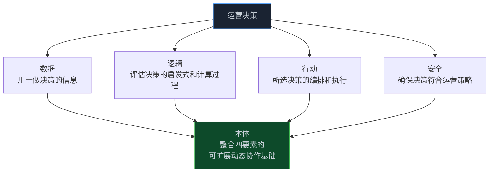
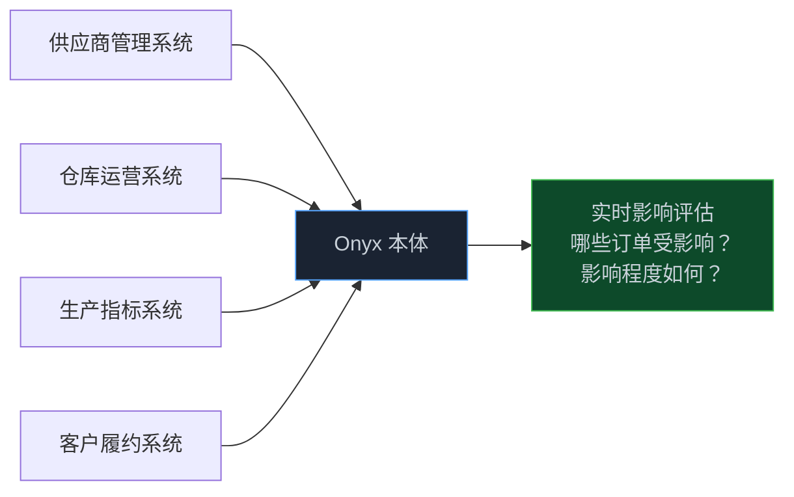
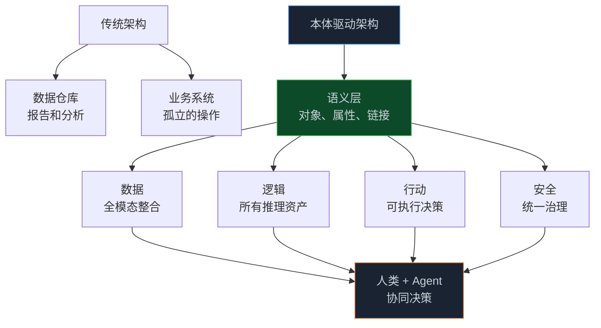

> **📖 原文来源**：[Connecting Agents to Decisions — Palantir Blog](https://blog.palantir.com/connecting-agents-to-decisions-277dee8ddb40)
> **✍️ 原文作者**：Palantir 工程团队
> **📅 发布时间**：2026 年 4 月 28 日

在所有将"本体（Ontology）"与"AI Agent"结合的公司中，Palantir 是做得最深、商业化最成功的。这篇文章揭示了他们的核心架构哲学：**本体不只是数据模型，而是企业决策的完整表示**。

<!-- more -->

---

## 1. 核心洞察：本体是决策的表示，而非数据的表示

Palantir 的软件为全球最关键的商业和政府场景提供实时的人机协同决策支持——从灾难响应到核能生产，客户依赖 Palantir AIP 在企业中安全、有效地利用 AI，推动运营转型。

在众多促成规模化运营影响的因素中，**核心差异化因素是围绕 Palantir 本体（Ontology）构建的软件架构**。

> **本体是一个旨在表示企业决策的系统，而不仅仅是数据。**

每个组织的首要任务是在不断变化的内外部条件下，实时执行最优决策。传统数据架构无法捕捉决策推理过程或其结果行动，因此限制了学习和 AI 的融入。常规分析架构无法将计算置于现实背景中，因此与运营脱节。

要在当今世界中导航并取胜，现代企业需要一种**以决策为中心的软件架构**。

---

## 2. 任何运营决策的四个组成部分

本体将这四个决策要素整合为一个可扩展、动态、协作的基础，实时反映组织不断变化的条件和目标。

---

## 3. 数据层：企业的语义表示

### 3.1 数据的核心问题：相关性

当今组织面临前所未有的数据量。数据来源的体量、多样性和速度不仅在增加，而且在加速。在 AI 时代，主要问题是**相关性**。

相关数据不仅包括全范围的企业数据源（结构化数据、流式和边缘数据源、非结构化存储库、图像数据等），还包括在决策过程中由终端用户和 Agent 生成的数据。这种"**决策数据**"包含：
- 给定决策的背景
- 评估的不同选项
- 已做出选择的下游影响

### 3.2 本体如何整合数据

本体将所有模态的数据整合为企业的**全规模、全保真语义表示**：

- ERP、MES、WMS 等各类运营数据源可以同步并与 IoT 和边缘系统的数据流、非结构化数据存储库的相关部分、地理空间数据存储等并置
- 不再处理将运营丰富性压缩为狭窄模式的"黄金表"，而是以**对象、属性和链接**的形式呈现企业全貌，实时演变，直接嵌入决策工作流
- 通过轻量级**嵌入式本体（Embedded Ontology）**，安全捕捉运营用户在日常工作中产生的决策数据

**决策溯源**：给定决策的做出时间、基于哪个版本的企业数据、通过哪个应用程序——这些信息被自动捕获，对人类开发者和 Agent 都安全可访问。这为 AI 驱动的大规模学习提供了全面基础，并持续优化各种形式的 Agent 记忆（工作记忆、情节记忆、语义记忆、程序记忆等）。

---

## 4. 逻辑层：决策推理的完整表示

### 4.1 逻辑资产的多样性

数据是基础，但它只是决策过程的一个维度；必须辅以确定何时以及如何做出给定决策的推理（逻辑）。决策背后的逻辑可以是：
- 核心业务系统中的简单业务逻辑
- 使用云数据科学工作台维护的预测模型
- 使用多个数据源生成运营计划的优化模型
- 以及无数其他可能性

### 4.2 本体如何连接逻辑

本体使全套逻辑资产——决定如何做出决策的计算和过程——能够为人类和 Agent 连接和情境化：

- **业务逻辑**：通常存在于 CRM 和 ERP 中的客户交互相关业务逻辑
- **建模逻辑**：驱动传统机器学习的逻辑，分散在数据科学环境中
- **规划和优化算法**：通常与特定领域工具交织在一起

本体灵活的"**逻辑绑定**"范式提供了一致的接口，用于构建无缝整合和组合异构逻辑资产的工作流——这些资产可能存在于非常不同的环境中（本地数据中心、企业云环境、SaaS 环境、Palantir 平台）。

---

## 5. 行动层：决策执行的闭环

### 5.1 行动是运营系统与分析系统的分水岭

在信息（数据）和推理（逻辑）都整合到共享表示中之后，下一步是对决策本身的执行和编排（行动）进行建模。**在实时决策中闭合行动循环，是运营系统区别于分析系统的关键**。

自 Palantir 成立以来，决策的执行与数据综合、分析整合同等重要。这需要设计和实现广泛的功能，包括：
- 如何安全捕捉可能同时发生且潜在冲突的决策
- 分段探索可能决策、暂存决策供审查、提交决策的协作模型
- 将决策同步到现有数据库、边缘平台和坚固资产的广泛框架

### 5.2 本体中的"名词"与"动词"

如果本体中的数据元素是企业的"**名词**"（语义的、现实世界的对象和链接），那么行动可以被视为"**动词**"（动态的、现实世界的执行）。

通过每个本体驱动的工作流，名词和动词通过人类和/或 AI 驱动的推理结合成完整的"句子"，整合各种逻辑。

本体使人类和 Agent 的行动能够：
- 安全地作为场景暂存
- 以与数据和逻辑原语相同的细粒度访问控制进行治理
- 安全地写回每个企业基底——事务系统、边缘设备、自定义应用程序等

---

## 6. 安全层：超越传统角色权限的治理

在任何运营环境中，人机交互都需要严格的安全和治理能力，远超传统的基于角色的数据桶策略。

Palantir AIP 提供的安全架构能够：
- 混合基于标记、目的和角色的策略
- 跨数据、逻辑、行动和应用程序工件的动态溯源
- 适用于人类驱动和 Agent 工作流的完整集成变更和发布管理工具

**工具使用的动态执行**：工具调用通过与治理数据访问和所有形式记忆相同的安全架构动态执行。这确保任何工具调用都依赖于对本体中底层对象、属性和链接的访问权限。

每个 Agent 或人类行动都依赖于明确授权授予，明确规定允许的操作集，防止意外调用（如跨组织边界查询数据，或连接到未指定外部系统的工具）和其他形式的权限提升。

---

## 7. 实战案例：Onyx 制造商的供应链危机

让我们通过一个假设案例来理解本体如何在实践中运作。

**背景**：Onyx 公司是一家医疗设备制造商，生产从注射器到外科口罩的各类成品。一个主要供应商突然出现问题，该供应商提供生产外科口罩所需的关键原材料。

### 7.1 第一步：态势感知（数据层）

本体将供应商管理、仓库运营、工厂生产活动、配送中心处理和客户履约等关键数据系统综合为语义对象和链接，以业务语言呈现。

运营负责人只需点击几下，就能精确定位因原材料短缺而面临风险的外科口罩生产，并通过本体中的连接，导航到所有现在也面临风险的未完成客户订单。

### 7.2 第二步：方案探索（逻辑层）

本体中连接了多样化的预测模型、分配模型、生产优化器和其他逻辑资产，供应链分析师可以快速运行一系列模拟，详细说明不同可能的材料替代方案的后果。

**关键能力**：本体的连接、实时特性至关重要——替换原材料可能对使用相同材料生产的其他产品（如注射器、手套）产生下游影响。

模拟运行时，模拟输出作为**本体场景**暂存，将提议的更改安全打包到本体的沙盒子集中——使团队能够在提交之前安全探索和分析决策的影响。

**"Disruption Bot" Agent 的作用**：Onyx 创建了一个调优的 Agent，能够使用一套本体驱动的工具扫描全范围企业数据源、类似情况下先前行动方案的事后报告，以及可能适用的材料重新分配模型。

由于本体提供的丰富、密集的上下文，Disruption Bot 能够提出一个新颖的重新分配计划，使用了供应链分析师尚未考虑的更新模型。计划的后果安全暂存在场景中后，Agent 的提议决策被移交给人类分析师进行最终审查。

### 7.3 第三步：决策执行（行动层）

确定了可行的材料短缺应对计划后，Onyx 需要快速、安全地将决策推送到运行各组成流程的运营系统。

本体对行动应用与数据和逻辑相同的严格控制和验证，实现了对谁可以调用给定行动、在什么条件下调用的细粒度控制：

- **仓库管理系统**：通过 API 驱动的更新接收
- **三个 ERP 系统**：通过原生本体驱动连接器接收更新，遵守每个系统的保障措施
- **生产计划系统**：接收合并的平面文件，异步摄取

---

## 8. 核心架构洞察

**本体的核心价值**：
1. **超越 RAG 的局限**：Agent 不再局限于数据中心的 RAG，而是通过可扩展的工具范式与本体中相互连接的数据、逻辑和行动原语交互
2. **决策溯源**：完整记录每个决策的时间、数据版本和执行路径，支持持续学习
3. **统一安全模型**：相同的安全策略同时适用于人类和 Agent，确保可控的权限边界
4. **场景沙盒**：在提交之前安全探索决策后果，降低风险

---

## 9. 📝 小结

- 本体不只是数据模型，而是企业决策的完整表示，包含数据、逻辑、行动、安全四个要素
- 传统数据架构无法捕捉决策推理过程，限制了 AI 的融入；本体提供了以决策为中心的架构
- Agent 通过本体获得丰富的企业上下文，能够做出超越简单 RAG 的复杂推理
- 场景机制允许 Agent 安全地探索决策后果，再由人类审查提交
- 统一的安全模型确保 Agent 和人类遵循相同的访问控制策略

---

> 📖 **原文链接**
> - [Connecting Agents to Decisions — Palantir Blog](https://blog.palantir.com/connecting-agents-to-decisions-277dee8ddb40)
> - [Palantir AIP 平台](https://www.palantir.com/platforms/aip/)
> - [Palantir Foundry 文档](https://palantir.com/docs/foundry/)
