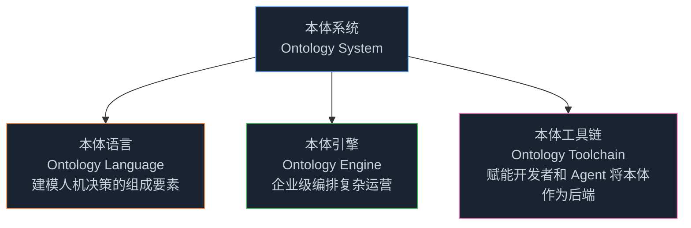
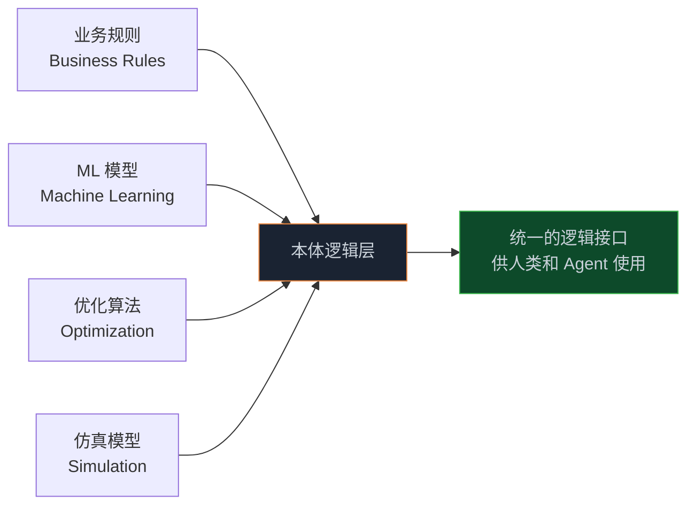
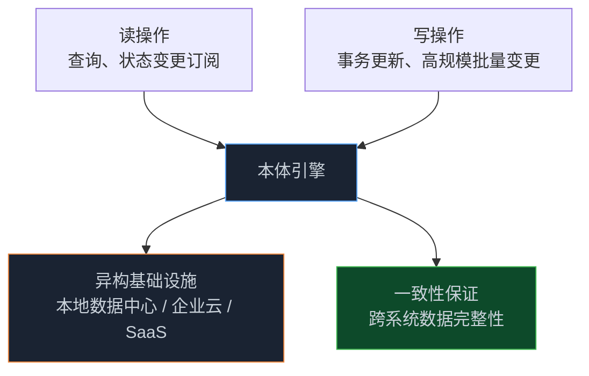
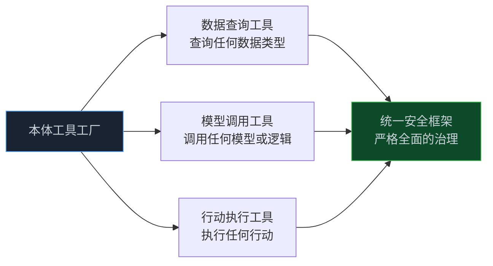
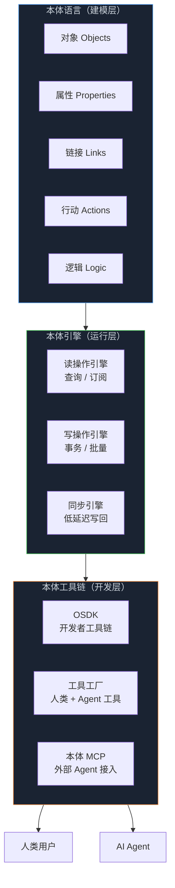

> **📖 原文来源**：[Ontology — Palantir Platform](https://www.palantir.com/platforms/ontology/)
> **✍️ 原文作者**：Palantir Technologies
> **📅 发布时间**：持续更新

Palantir 本体平台是其整个产品体系的核心基础设施。这篇文章解析了本体系统的三大技术组件：**本体语言**（建模决策要素）、**本体引擎**（企业级编排）、**本体工具链**（赋能开发者和 Agent）。

<!-- more -->

---

## 1. 本体系统：为人机协同团队编排决策的核心

> **本体系统对企业的数据、逻辑、行动和安全进行编码，以自动化跨运营的决策。**

本体系统是 Palantir 平台的核心，由三个相互配合的组件构成：

---

## 2. 本体语言：建模人机决策的组成要素

### 2.1 编码企业数据

将提供决策空间实时图景的大量碎片化数据源统一为连贯的对象、属性和链接：

- **ERP**（企业资源规划）
- **CRM**（客户关系管理）
- **记录系统**
- **地理空间存储库**
- **实时传感器**
- **文档存储**

这些数据不再以孤立的表格形式存在，而是以业务语言呈现为相互关联的**对象（Objects）**、**属性（Properties）** 和 **链接（Links）**。

### 2.2 捕捉企业逻辑

持续编码用于计算和确定行动的推理和逻辑元素——涵盖业务规则和决策框架的完整谱系，并随推理的变化而演变：

### 2.3 建模企业行动

将现实世界的行动表示为一等原语，并定义如何执行它们——从简单事务到写回运营和边缘系统的复杂多步骤工作流：

- **简单事务**：单次数据更新
- **复杂工作流**：多步骤、跨系统的协调执行
- **边缘系统写回**：将决策同步到现实世界的运营系统

### 2.4 治理人机劳动力

在日益混合的劳动力中编排安全和治理策略——无论执行者是人类还是 Agent，都同时对数据、逻辑和行动执行细粒度控制：

- 基于角色的访问控制
- 基于标记的数据分类
- 基于目的的使用限制
- 动态运行时策略计算

---

## 3. 本体引擎：企业级编排

### 3.1 百万级读写，统一现实

本体的可扩展架构处理人机协同团队的实时运营，同时强制执行一致性和完整性：

### 3.2 激活现有基础设施

本体安全协调跨异构基础设施的读操作（如查询和状态变更订阅）以及写操作（如事务更新和高规模批量变更）。

### 3.3 同步运营

与运营系统的持续同步确保在本体中做出的决策以极低延迟反映在行动实际生效的地方。

---

## 4. 本体工具链：赋能开发者和 Agent

### 4.1 构建丰富的 AI 赋能应用

**本体 SDK（OSDK）** 提供强大的开发者工具链，并配合丰富的 DevOps 能力，使开发团队能够交付运营用例——从野火响应到海军后勤，再到汽车装配，以及无数其他场景。

### 4.2 本体：工具工厂

本体是一个"**工具工厂**"，让你的构建者能够为人类和 Agent 定义工具：

工具可以被创建用于：
- **查询任何数据类型**
- **调用任何模型或逻辑**
- **执行任何行动**

所有这些都在严格全面的安全框架下治理。

### 4.3 通过本体 MCP 赋能外部 Agent

**本体 MCP（Ontology MCP）** 将本体原语作为 MCP 工具暴露给外部 Agent：

- 外部 Agent 和系统可以读取对象、查询数据、执行预定义行动
- 治理 Palantir 原生 Agent 的相同安全控制同样适用于外部 Agent
- 随着 Agent 生态系统的增长，实现与本体的可信交互

这意味着任何支持 MCP 协议的 Agent（如 Claude、GPT 等）都可以安全地接入企业本体，获得企业级的数据访问和行动执行能力。

### 4.4 将专业知识转化为共享基础设施

来自企业各处的团队——无论是运营人员、数据科学家、分析师还是数据工程师——都可以组合可复用的工具，将其领域专业知识直接编码到本体中：

- 工具驱动相互联锁的工作流和自动化
- 加速开发，同时确保跨用例的一致性
- 专业知识从个人知识转变为组织共享基础设施

---

## 5. 本体系统的技术架构全景

---

## 6. 本体 MCP：连接外部 AI 生态系统

本体 MCP 是 Palantir 本体与外部 AI 生态系统之间的桥梁，具有重要的战略意义：

### 6.1 为什么 MCP 很重要

**模型上下文协议（MCP）** 是 Anthropic 提出的开放标准，允许 AI 模型安全地访问外部工具和数据源。通过本体 MCP，Palantir 将企业本体暴露为标准 MCP 工具，使任何支持 MCP 的 AI 系统都能：

- 读取企业对象和属性
- 查询实时运营数据
- 执行预定义的企业行动

### 6.2 安全性保证

关键在于：**外部 Agent 受到与 Palantir 原生 Agent 完全相同的安全控制约束**。这意味着：

- 企业不需要为外部 AI 系统创建特殊的安全例外
- 所有访问都通过本体的统一安全框架进行验证
- 细粒度的权限控制确保 Agent 只能访问其被授权的数据和行动

---

## 7. 实际应用场景

Palantir 本体平台已在 50+ 个行业的关键场景中部署：

| 行业 | 应用场景 |
|------|---------|
| 国防 | 战场态势感知、后勤优化 |
| 医疗 | 医院运营、临床决策支持 |
| 制造 | 供应链管理、生产优化 |
| 金融 | 风险管理、合规监控 |
| 能源 | 电网管理、核能运营 |
| 政府 | 灾难响应、公共卫生 |

---

## 8. 📝 小结

- 本体系统由三个组件构成：本体语言（建模）、本体引擎（运行）、本体工具链（开发）
- 本体语言将企业的数据、逻辑、行动、安全编码为统一的语义表示
- 本体引擎处理百万级读写操作，确保跨异构基础设施的一致性
- 本体工具链是"工具工厂"，让开发者和 Agent 都能将本体作为后端
- 本体 MCP 将企业本体暴露给外部 AI 生态系统，同时保持统一的安全控制
- 专业知识通过工具机制从个人知识转变为组织共享基础设施

---

> 📖 **原文链接**
> - [Ontology — Palantir Platform](https://www.palantir.com/platforms/ontology/)
> - [Palantir Foundry 文档](https://palantir.com/docs/foundry/)
> - [本体 SDK（OSDK）文档](https://palantir.com/docs/foundry/ontology-sdk/overview/)
> - [Model Context Protocol (MCP)](https://modelcontextprotocol.io/)
