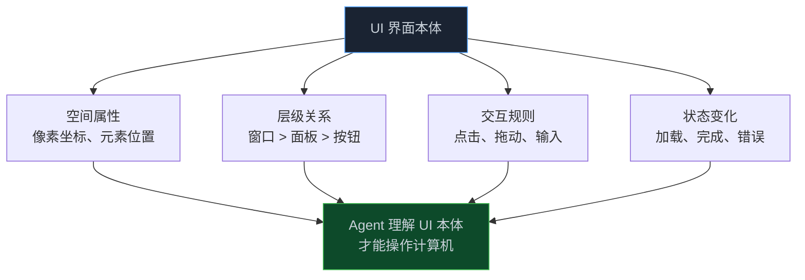

> **📖 原文来源**：[Developing a computer use model — Anthropic News](https://www.anthropic.com/news/developing-computer-use)
> **✍️ 原文作者**：Anthropic 研究团队
> **📅 发布时间**：2024 年 10 月 22 日

这篇文章揭示了一个有趣的视角：**计算机屏幕本身就是一种本体**——UI 元素有层级关系、空间属性和交互规则。训练 Claude 使用计算机，本质上是让它理解这套"UI 空间本体"。

<!-- more -->

---

## 1. 为什么计算机使用能力很重要？

现代工作的大量内容都通过计算机完成。让 AI 以人类使用计算机的方式直接与计算机软件交互，将解锁当前一代 AI 助手根本无法实现的大量应用场景。

过去几年，AI 发展达到了许多重要里程碑——例如执行复杂逻辑推理的能力，以及看见和理解图像的能力。**下一个前沿是计算机使用**：AI 模型不必通过专门设计的工具进行交互，而是被赋权使用任何软件，就像被指示的那样。

---

## 2. 研究过程：从工具使用到屏幕理解

### 2.1 技术基础

Anthropic 之前在工具使用和多模态方面的工作为这些新的计算机使用技能奠定了基础。操作计算机涉及：

- **看见和解释图像**的能力——在这里是计算机屏幕的截图
- **推理**何时以及如何执行特定操作以响应屏幕上的内容

结合这些能力，Anthropic 训练 Claude 解释屏幕上发生的事情，然后使用可用的软件工具执行任务。

### 2.2 像素计算：理解 UI 空间本体的关键

当开发者让 Claude 使用某个计算机软件并给予必要的访问权限时，Claude 会查看用户可见内容的截图，然后**计算需要垂直或水平移动多少像素**才能将光标移动到正确的位置进行点击。

**训练 Claude 准确计算像素至关重要**。没有这项技能，模型很难给出鼠标命令——类似于模型经常在"'banana'这个词里有多少个 A？"这类看似简单的问题上挣扎。

这揭示了一个深刻的洞察：**UI 界面是一种空间本体**——每个元素都有精确的坐标位置、层级关系和交互属性。理解这套本体，是 Agent 能够操作计算机的前提。

### 2.3 快速泛化的惊喜

Anthropic 对 Claude 从计算机使用训练中泛化的速度感到惊讶。他们仅在少数简单软件（如计算器和文本编辑器）上进行了训练（出于安全原因，训练期间不允许模型访问互联网）。

结合 Claude 的其他技能，这种训练赋予了它将用户的书面提示转化为一系列逻辑步骤，然后在计算机上执行操作的非凡能力。研究人员观察到，**模型甚至会在遇到障碍时自我纠正并重试任务**。

---

## 3. 当前性能水平

在 OSWorld 评估（专门测试模型以人类方式使用计算机的能力）上：

| 系统 | 得分 |
|------|------|
| 人类水平 | 70-75% |
| Claude 3.5 Sonnet | **14.9%** |
| 次优 AI 模型 | 7.7% |

虽然距离人类水平还有很大差距，但 Claude 的得分是次优 AI 模型的近两倍，代表了当前的技术最前沿。

---

## 4. 安全挑战：计算机使用的特殊风险

### 4.1 安全评估结果

每次 AI 能力的进步都带来新的安全挑战。计算机使用主要是降低 AI 系统应用其现有认知技能的门槛，而不是从根本上增加这些技能，因此主要关注当前的危害而非未来的危害。

Anthropic 评估了计算机使用是否增加了前沿威胁的风险，发现更新后的 Claude 3.5 Sonnet（包括其新的计算机使用技能）仍处于 **AI 安全级别 2**——不需要比当前更高标准的安全和安保措施。

### 4.2 提示注入攻击

信任与安全团队识别出的一个主要担忧是"**提示注入**"——一种网络攻击类型，其中恶意指令被输入给 AI 模型，导致其覆盖先前的指令或执行偏离用户原始意图的意外操作。

由于 Claude 可以解释来自连接互联网的计算机的截图，它可能会接触到包含提示注入攻击的内容。

### 4.3 选举安全措施

鉴于美国大选的临近，Anthropic 对可能被视为破坏公众对选举过程信任的滥用尝试保持高度警惕。他们实施了以下措施：

- 监控 Claude 被要求参与选举相关活动的情况
- 引导 Claude 远离在社交媒体上生成和发布内容、注册网络域名或与政府网站交互等活动

---

## 5. 计算机使用的未来

### 5.1 范式转变

计算机使用代表了 AI 开发的一种完全不同的方法：

目标是让 Claude 使用预先存在的计算机软件，就像人类使用它们一样。

### 5.2 当前局限性

即使是当前最先进的水平，Claude 的计算机使用仍然：

- **速度慢且容易出错**
- 无法执行人们日常使用计算机的许多操作（拖动、缩放等）
- 以"翻书"方式查看屏幕（截图拼接，而非连续视频流），可能错过短暂的操作或通知

**真实的趣事**：在录制演示时，Claude 意外点击停止了一个长时间运行的屏幕录制，导致所有素材丢失。在另一个演示中，Claude 突然从编码演示中暂停，开始浏览黄石国家公园的照片。

---

## 6. 从本体论视角理解计算机使用

这篇文章与本体论系列的关联在于：**计算机界面本身就是一种本体**。

训练 Claude 使用计算机，本质上是让它：
1. **理解 UI 空间本体**：每个元素的位置、大小、层级
2. **推理交互规则**：什么时候点击、输入、等待
3. **处理状态变化**：识别操作成功或失败的信号

这与 Palantir 本体的核心思想一脉相承：**只有当 Agent 理解了领域的本体（无论是企业数据本体还是 UI 界面本体），它才能真正有效地在该领域中行动**。

---

## 7. 📝 小结

- 计算机使用代表 AI 开发的范式转变：从"让工具适应模型"到"让模型适应工具"
- 像素计算是理解 UI 空间本体的关键技能，没有它模型无法准确给出鼠标命令
- Claude 从少量软件训练中快速泛化，展示了强大的迁移学习能力
- 当前性能（14.9% on OSWorld）是次优模型的近两倍，但距人类水平（70-75%）仍有差距
- 提示注入是计算机使用的主要安全风险，需要特别防范
- 从本体论视角看：UI 界面是一种空间本体，Agent 理解这套本体才能有效操作计算机

---

> 📖 **原文链接**
> - [Developing a computer use model — Anthropic News](https://www.anthropic.com/news/developing-computer-use)
> - [OSWorld 评估基准](https://os-world.github.io/)
> - [Claude 计算机使用参考实现](https://github.com/anthropics/anthropic-quickstarts/tree/main/computer-use-demo)
