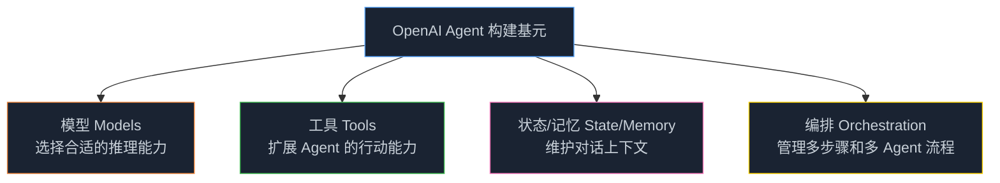
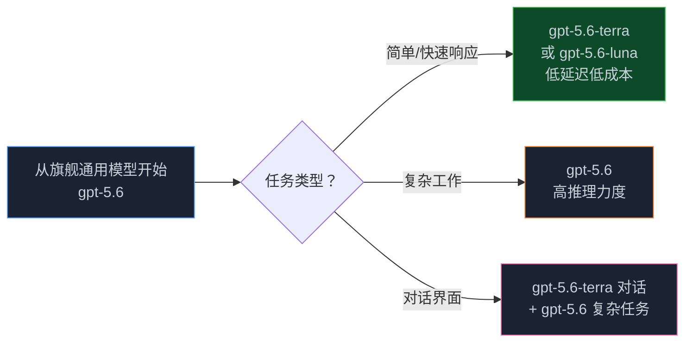
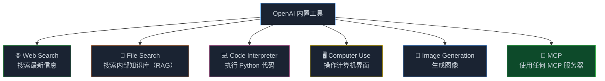
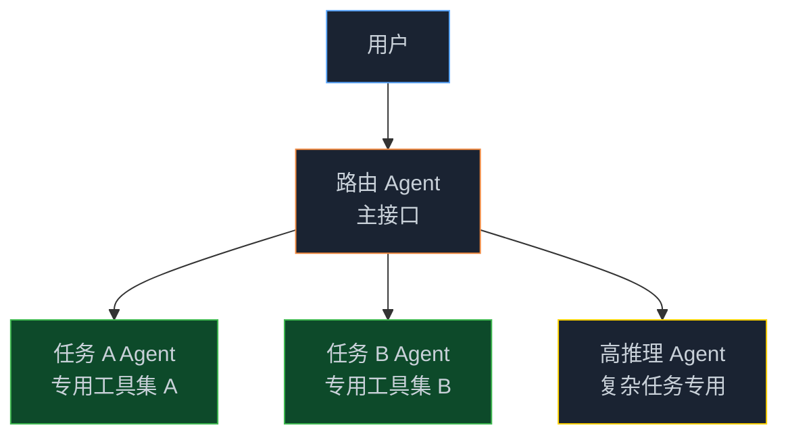

> **📖 原文来源**：[Building Agents — OpenAI Developers](https://developers.openai.com/tracks/building-agents)
> **✍️ 原文作者**：OpenAI 开发者团队
> **📅 发布时间**：持续更新（最新版本 2025 年）

这是 OpenAI 官方的 Agent 构建学习路径，覆盖从基础概念到生产实践的完整知识体系。与 Anthropic 的 Agent 指南形成互补——OpenAI 更强调**工具生态**和**SDK 抽象层**，Anthropic 更强调**简单可组合的模式**。

<!-- more -->

---

## 1. 什么是 Agent？

OpenAI 的简洁定义：

> **AI Agent = 指令（应该做什么）+ 护栏（不应该做什么）+ 工具（能够做什么）**

区分标准：
- 如果你在构建一个**问答式聊天体验**，AI 只是回答问题——这不算 Agent
- 如果系统**连接到其他系统**，并根据用户输入**采取行动**——这才算 Agent

简单 Agent 可能只使用少量工具；复杂的智能体系统可能编排多个 Agent 协同工作。

---

## 2. 核心概念：四大构建基元

OpenAI 平台提供四个可组合的基元来构建 Agent：

---

## 3. 模型选择：推理模型 vs 非推理模型

### 3.1 推理模型（Reasoning Models）

2024 年底，OpenAI 推出了第一个推理模型 o1，引入了新概念：**模型在给出最终答案之前先进行思考**。这种思考过程称为"思维链（Chain of Thought）"，让模型能够提出假设、测试和完善，再验证最终答案。

**推理模型的特点**：
- 以延迟和成本换取可靠性
- 通常有可调节的"推理力度（reasoning effort）"参数
- 适用场景：复杂任务（规划、数学、代码生成、多工具工作流）

**非推理模型的特点**：
- 速度更快、通常更便宜
- 适用场景：对话式体验（大量来回交互）、延迟敏感的简单任务

### 3.2 模型选择建议

> ⚠️ **重要提示**：推理模型和 GPT 模型的提示方式不同。换模型时不要只改模型名称，要同时尝试不同的提示策略。

---

## 4. 构建核心逻辑：Responses API vs Agents SDK

### 4.1 两种选择

| 维度 | Responses API | Agents SDK |
|------|--------------|-----------|
| 抽象层级 | 低（核心 API） | 高（框架） |
| 控制粒度 | 精细 | 较少 |
| 上手速度 | 较慢 | 快 |
| 适用场景 | 需要深度定制 | 快速构建/多 Agent 网络 |
| 状态管理 | 默认有状态 | 自动处理 |

### 4.2 Responses API

旗舰核心 API，专为最新模型能力（特别是推理模型）设计：

- **默认有状态**：无需在客户端管理对话历史，API 自动跨请求维护上下文
- **内置工具集成**：直接支持 Web Search、File Search、Code Interpreter 等
- **灵活基础**：可以在其上构建任何自定义逻辑

### 4.3 Agents SDK

轻量级框架，让构建单 Agent 或多 Agent 网络变得简单：

| 基元 | 含义 |
|------|------|
| **Agent** | 模型 + 指令 + 工具 |
| **Handoff（移交）** | 当前 Agent 可以移交给的其他 Agent |
| **Guardrail（护栏）** | 过滤不需要输入的策略 |
| **Session（会话）** | 自动跨 Agent 运行维护对话历史 |

Agents SDK 自动处理：
- **Agent 循环**：在多轮中调用工具和执行函数调用
- **移交**：根据对话状态切换指令、模型和可用工具
- **护栏**：通过过滤器运行输入，在需要时停止生成

---

## 5. 六大内置工具详解

### 5.1 工具选择原则

> **经验法则**：如果能力已作为内置工具存在，就从那里开始。只有在需要自定义逻辑时，才转向函数调用。

### 5.2 函数调用 vs 内置工具

**函数调用**的工作流程：
1. 定义函数和期望参数
2. 模型决定调用哪个函数及参数
3. **你负责在自己这边执行函数**
4. 将执行结果告知模型
5. 模型基于结果生成下一个响应

**内置工具**：无需在你这边处理执行（计算机使用工具除外），模型决定使用内置工具时，它会自动执行，结果自动添加到对话上下文。

### 5.3 六大内置工具

**Web Search**：LLM 有训练数据截止日期，无法了解截止日期后的事件。Web Search 工具只需一行代码即可让 Agent 访问最新信息。

**File Search**：让 Agent 访问内部知识库（RAG）。OpenAI 托管的向量存储处理了 RAG 管道的所有复杂性：文件预处理、分块、嵌入、存储、检索、重排序——你只需添加文件，指定向量存储，模型自动决定何时使用。

**Code Interpreter**：让模型生成 Python 代码解决问题并在专用环境中执行。特别适合涉及数字计算的场景，结合了 LLM 的语言能力和代码执行的确定性。支持文件输入（如电子表格）和文件输出（如图表、CSV）。

**Computer Use**：让模型像人类一样在计算机界面上执行操作（导航网站、点击按钮、填写表单）。与其他内置工具不同，需要你在自己的环境中执行操作并发送截图更新。适用于没有 API 的服务，或自动化通常由人类完成的流程。

**Image Generation**：在对话中生成图像，使用具有世界知识的 GPT Image 模型。适用于需要在对话中生成视觉摘要、编辑用户提供的图像或迭代生成图像的 Agent。

**MCP（Model Context Protocol）**：使用任何托管的 MCP 服务器，将 Agent 连接到外部系统和数据源。

---

## 6. 编排：管理复杂流程

### 6.1 何时使用多 Agent

多 Agent 不应该是默认方案，但在以下情况值得考虑：

- 有**不重叠的独立任务**，且每个任务有：
  - 非常复杂或冗长的指令
  - 大量工具（或跨任务的相似工具）

**典型场景**：如果每个任务都有多个工具来检索、更新或创建数据，但这些操作在不同任务中工作方式不同，不要把所有工具都给一个 Agent——它可能会混淆，在需要任务 B 的工具时使用了任务 A 的工具。

### 6.2 多 Agent 架构模式

**多 Agent 的三大优势**：
1. **关注点分离**：研究 vs 起草 vs 质量检查
2. **并行性**：更快的端到端任务执行
3. **专注评估**：根据各自的范围目标对 Agent 进行不同评分

---

## 7. 三大实战用例

### 7.1 支持 Agent（人在回路）

基于 Responses API 构建的简单支持 Agent，具有"人在回路"角度——Agent 提出建议，人类可以接受或拒绝。

### 7.2 客服 Agent（多 Agent 网络）

使用 Agents SDK 构建的多 Agent 网络，协同处理客户请求。

### 7.3 前端测试 Agent（计算机使用）

使用计算机使用 API 的 Agent，只需单个用户输入即可测试前端应用程序。

---

## 8. 生产最佳实践

### 8.1 用户输入护栏

如果 Agent 接受用户输入，考虑添加护栏防止越狱或处理无关输入：

- **简单方案**：在提示中包含限制（如"不要回答与 X、Y、Z 无关的任何问题"）
- **复杂方案**：完整的多步骤护栏系统

### 8.2 模型输出结构化

当你想将模型输出作为应用程序的一部分使用（而不仅仅是展示给用户）时，使用**结构化输出（Structured Outputs）**。这确保输出符合你定义的 JSON Schema，便于程序化处理。

### 8.3 可观测性

Agents SDK 内置追踪支持，无需额外代码即可了解发生了什么：
- 调用了哪些工具
- 使用了哪些 Agent
- 触发了哪些护栏

---

## 9. 📝 小结

- OpenAI Agent = 指令 + 护栏 + 工具，连接到其他系统并采取行动
- 推理模型适合复杂任务，非推理模型适合对话式快速响应
- Responses API 提供精细控制，Agents SDK 提供快速构建和多 Agent 编排
- 六大内置工具覆盖 Web 搜索、文件检索、代码执行、计算机使用、图像生成、MCP
- 多 Agent 适合有不重叠独立任务的场景，通过路由 Agent 协调
- 生产环境需要护栏、结构化输出和可观测性

---

> 📖 **原文链接**
> - [Building Agents — OpenAI Developers](https://developers.openai.com/tracks/building-agents)
> - [Responses API 文档](https://platform.openai.com/docs/api-reference/responses)
> - [Agents SDK — Python](https://github.com/openai/openai-agents-python)
> - [Agents SDK — TypeScript](https://github.com/openai/openai-agents-js)
