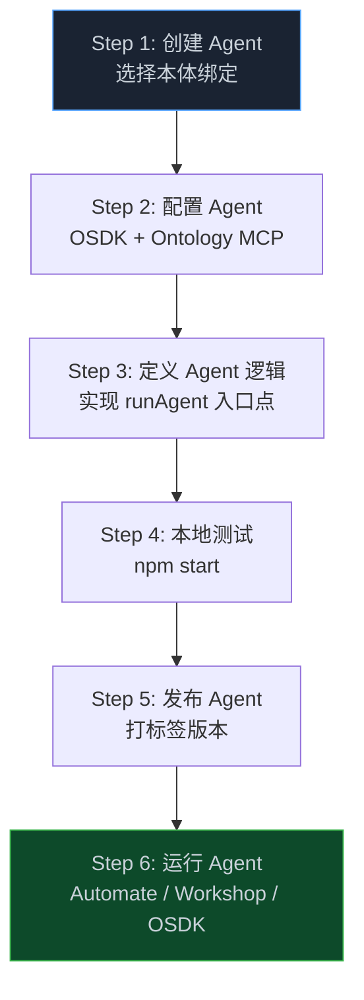
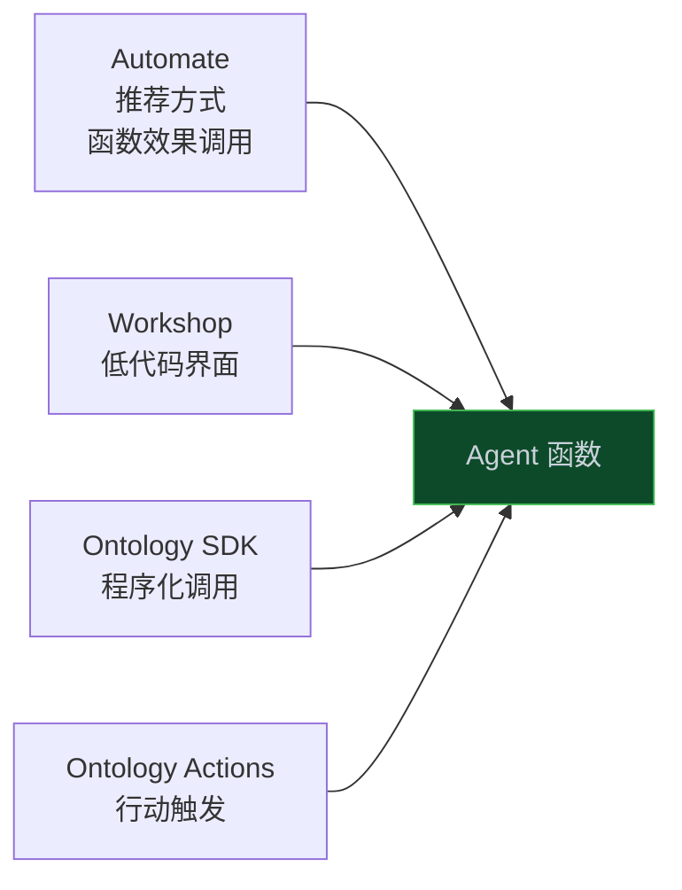
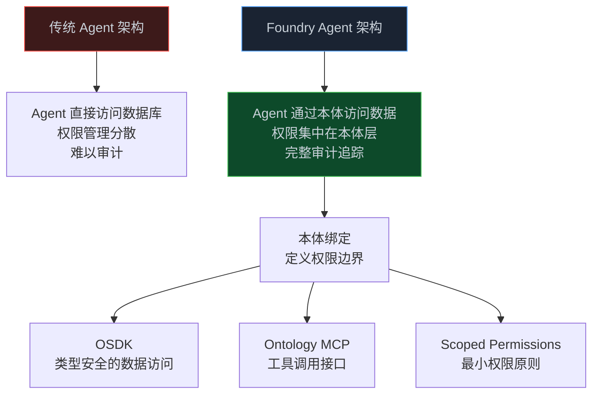

> **📖 原文来源**：[Build an Agent in Foundry — Palantir Docs](https://www.palantir.com/docs/foundry/agents/create-agent/)
> **✍️ 原文作者**：Palantir Technologies
> **📅 发布时间**：持续更新（Beta 阶段）

这是 Palantir Foundry 平台的 Agent 开发官方指南。它揭示了一个关键的架构决策：**在 Foundry 中创建 Agent 的第一步，就是选择并绑定它所依赖的本体（Ontology）**——这决定了 Agent 的作用域权限边界。

<!-- more -->

> ⚠️ **注意**：Agent 功能目前处于 Beta 阶段，可能并非所有环境都可用，功能在积极开发中可能发生变化。

---

## 1. 核心架构：本体绑定决定 Agent 权限边界

在 Foundry 中构建 Agent 的整体流程：



**关键洞察**：本体绑定（Ontology Binding）是 Agent 的核心配置，它决定了：
- Agent 可以读取和写入哪些数据
- Agent 拥有哪些作用域权限（Scoped Permissions）
- Agent 可以调用哪些 Ontology 行动（Actions）

---

## 2. 前置条件

开始之前，确保你具备：

- 访问 Agent 将读取和写入的**本体（Ontology）**的权限
- 在 Foundry 环境中**创建代码仓库**的权限

---

## 3. Step 1：创建 Agent

从仓库配置页面完成以下操作：

1. **输入名称**并选择仓库位置
2. **设置仓库类型**（Agent 框架）：
   - Claude Agent SDK ↗
   - OpenAI Agents SDK ↗
   - Google Agent Development Kit (ADK) ↗
3. **选择本体**（必填）：这个选择器决定了 Agent 的本体绑定和作用域权限
4. **审查 Agent API 名称**：从仓库名称自动生成，可编辑。这个名称标识了 Agent 从 Workshop 或 OSDK 调用时的函数

生成的仓库结构：
```
repository/
├── agent/          # Agent 核心逻辑
└── utils/          # 共享平台工具
```

---

## 4. Step 2：配置 Agent

生成的仓库预配置了 OSDK、Ontology MCP（OMCP）和 Palantir MCP。

**关键特性**：由于 Agent 使用**作用域权限（Scoped Permissions）**，你**不需要**提供客户端 ID、密钥或 Foundry Token。

构建绑定到本体的 OSDK 客户端并获取 Ontology MCP 配置：

```typescript
import { getOntologySdkClient } from "@palantir/agent-templates-bundle";
import { getOntologyMcpConfiguration } from "./mcps/default";
import { $ontologyRid } from "@ontology/sdk";

const client = await getOntologySdkClient($ontologyRid);
```

---

## 5. Step 3：定义 Agent 逻辑

在 `runAgent` 入口点实现 Agent 的行为。定义提示词，将 OMCP 配置作为 MCP 服务器传递给模型查询，并消费 Agent 的响应流：

```typescript
export async function runAgent(args: AgentArgs) {
  const omcpConfig = await getOntologyMcpConfiguration();

  const iter = query({
    prompt: "...",
    options: {
      mcpServers: {
        ["ontology_mcp"]: omcpConfig,
      },
    },
  });

  // 消费 Agent 的响应流
}
```

**架构要点**：通过将 `omcpConfig` 作为 MCP 服务器传入，Agent 获得了访问本体中所有数据、逻辑和行动的能力——同时受到本体安全框架的约束。

---

## 6. Step 4：本地测试

开发期间，在本地运行 Agent 测试其行为：

```bash
# 安装依赖
npm install

# 启动 Agent，提供 AgentArguments schema 中定义的参数
npm start -- --json-args '{ "additionalAgentContext": { "type": "string", "string": "some context" } }'

# 也可以从 JSON 文件提供参数
npm start -- --json-args-file args.json

# 发布前构建并确认无错误
npm run build
```

---

## 7. Step 5：发布 Agent

Agent 构建成功后，通过**打标签版本**来发布它。打标签会：
- 用本体绑定和 Agent API 名称注册 Agent
- 模板的持续集成将标记的构建部署为**异步 Foundry 函数**

两种打标签方式：

**方式一：仓库界面**
选择"Tag version"，设置标签名称（基于变更程度），然后选择"Tag and release"。

**方式二：Git 标签**
```bash
git tag 1.0.0
git push --tags
```

---

## 8. Step 6：运行 Agent

发布后，推荐通过以下方式运行 Agent：



**重要注意事项**：由于 Agent 函数**不返回值**，让 Agent 将其结果写入本体对象（Ontology Objects）来消费其输出。

---

## 9. 核心架构洞察：为什么本体绑定是第一步？

这个设计决策揭示了 Palantir 的核心架构哲学：



**本体绑定的三大价值**：
1. **安全边界**：Agent 只能访问本体中明确授权的数据和行动
2. **无需凭证**：作用域权限机制消除了管理客户端 ID 和密钥的需要
3. **统一审计**：所有 Agent 操作通过本体层记录，提供完整的决策溯源

---

## 10. 📝 小结

- Foundry Agent 开发的第一步是选择本体绑定，这决定了 Agent 的权限边界
- 三种 Agent 框架可选：Claude Agent SDK、OpenAI Agents SDK、Google ADK
- 作用域权限机制让 Agent 无需管理凭证，安全访问本体数据
- Ontology MCP 将本体原语暴露为 MCP 工具，Agent 通过标准 MCP 协议访问企业数据
- Agent 函数不返回值，通过写入本体对象来输出结果
- 推荐通过 Automate 的函数效果来调用 Agent

---

> 📖 **原文链接**
> - [Build an Agent in Foundry — Palantir Docs](https://www.palantir.com/docs/foundry/agents/create-agent/)
> - [Palantir Ontology SDK (OSDK)](https://www.palantir.com/docs/foundry/ontology-sdk/overview/)
> - [Ontology MCP 文档](https://www.palantir.com/docs/foundry/ontology-mcp/overview/)
> - [Agent 核心概念](https://www.palantir.com/docs/foundry/agents/core-concepts/)
