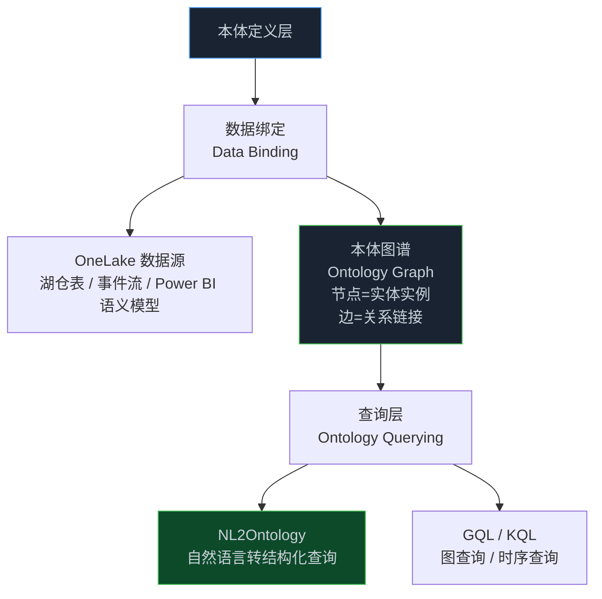
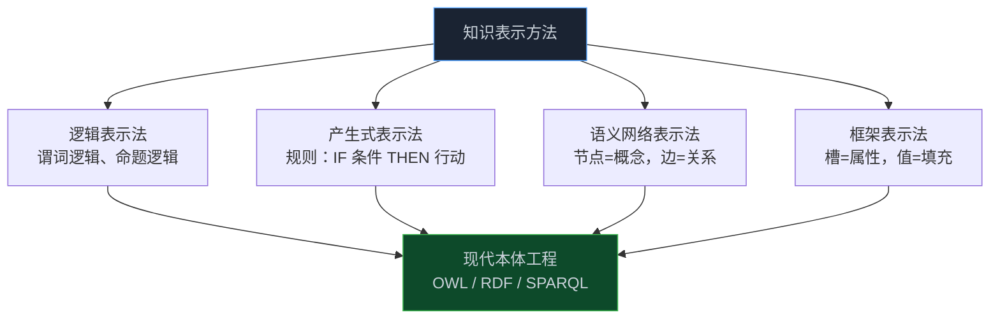

> **📖 原文来源一**：[What Is Ontology (Preview)? — Microsoft Fabric IQ](https://learn.microsoft.com/en-us/fabric/iq/ontology/overview)
> **📖 原文来源二**：[学习人工智能 AI 需要哪些最基础的知识 — 腾讯云开发者社区](https://cloud.tencent.com/developer/article/1781507)
> **📅 发布时间**：2026 年 4 月（Microsoft）/ 2021 年（腾讯云）

本文整合了两个视角：**Microsoft Fabric 的企业本体工程实践**（自上而下的产品视角）和**腾讯云对 AI 知识基础的梳理**（自下而上的学术视角）。两者共同揭示了本体论在 AI 工程中的完整图景。

<!-- more -->

---

## 第一部分：Microsoft Fabric 本体（Ontology）

### 1. 什么是 Microsoft Fabric 本体？

> **本体（Ontology）是企业词汇表和语义层的数字化表示，统一了跨领域和 OneLake 数据源的含义。**

Microsoft Fabric IQ 的本体功能将企业概念定义为：
- **实体类型（Entity Types）**：如"客户（Customer）"
- **属性（Properties）**：如客户的姓名和邮箱
- **关系（Relationships）**：如"客户下订单（Customer places Order）"

定义本体后，将实体类型定义绑定到真实数据，下游工具就能共享同一套语言。**人类和 AI Agent 都可以使用这套语言进行跨领域推理和决策行动**。

### 2. 本体的适用场景

本体在以下情况下效果最佳：
- 需要**跨领域一致性**
- 需要**治理**
- 需要 **AI Agent 基础（Grounding）**
- 需要**跨流程推理**

---

### 3. 核心概念：定义本体

#### 3.1 实体类型（Entity Type）

实体类型是现实世界概念的**可复用逻辑模型**（如 Shipment、Product、Sensor）。它标准化了该项目的名称、描述、标识符、属性和约束，使业务中的每个团队在使用"shipment"这样的术语时都表达相同的含义。

**核心价值**：通过将概念提升到任何单一表格之上，实体类型消除了跨数据源的冲突列级定义，提供了一个单一的附着点，下游工具可以用来改善跨表格和模型的语义。

#### 3.2 实体实例（Entity Instance）

实体实例是实体类型的**具体出现**，从数据绑定中填充（类似语义行）。实体实例跟踪哪个数据源创建了它们以及它们何时为真，并可以参与关系。

**核心价值**：将原始数据转化为标准化的业务对象，所有工具和 AI Agent 都能以相同方式理解。

#### 3.3 属性（Property）

属性是关于实体的**命名事实**，具有声明的数据类型。可以包含到源数据的绑定和语义注释（如标识符或元数据属性）。

**核心价值**：通过强制一致的类型、单位和命名，并在概念层面启用规则和质量检查来改善语义。

#### 3.4 关系（Relationship）

关系是实体类型或实例之间的**有类型的有向链接**。关系可以有属性（如距离、置信度、effectiveAt）和基数规则（如一个客户有多个订单）。

**核心价值**：使上下文明确且可复用，支持遍历、依赖分析、基于规则的推理，以及无需自定义连接逻辑就能回答业务问题。

---

### 4. 核心概念：数据在本体中

#### 4.1 数据绑定（Data Binding）

数据绑定将本体定义（实体类型、属性、关系）连接到 OneLake 中的具体数据，包括：
- 湖仓（Lakehouse）表
- 事件仓（Eventhouse）流
- Power BI 语义模型

数据绑定描述数据类型、标识键、列到属性的映射，以及键到跨多个数据源关系的映射。通过启用模式演化规则、数据质量检查（基于可空性、范围、唯一性）和概念层的溯源，绑定将原始行和事件转化为受治理的业务对象。

#### 4.2 本体图谱（Ontology Graph）

本体图谱是从数据绑定和关系定义构建的**可查询实例图**：
- **节点**：实体实例
- **边**：链接（断言的或派生的），带有元数据属性
- 每个节点或边保持数据源溯源，并遵循计划的数据刷新

图谱支持：
- 业务上下文的可视化探索
- 图算法执行（路径、中心性、社区）
- 规则驱动的推理

#### 4.3 本体查询（Ontology Querying）

本体查询让你通过本体术语对绑定数据源提出**业务级问题**：
- 从实体类型开始查询
- 允许按属性过滤、遍历关系、按时间聚合等
- 本体层自动将查询路由到最高效的系统（图查询用 GQL，时序查询用 KQL）

**NL2Ontology（自然语言转本体查询）**：将自然语言问题转换为结构化查询并返回相关结果。这让你可以用业务术语提问，而无需了解数据在不同系统中的存储细节。NL2Ontology 查询确保过滤器、连接、单位和有效性窗口与本体中发布的定义对齐。

---

### 5. Microsoft Fabric 本体 vs Palantir 本体：对比

| 维度 | Microsoft Fabric 本体 | Palantir Foundry 本体 |
|------|----------------------|----------------------|
| 数据源 | OneLake（湖仓、事件流、Power BI） | 多源（ERP、CRM、IoT、文档等） |
| 查询方式 | NL2Ontology + GQL/KQL | 对象查询 + 图遍历 |
| Agent 集成 | Fabric IQ Agent + 外部 Agent | OSDK + Ontology MCP |
| 行动执行 | 有限（主要是查询） | 完整（事务写回、边缘系统同步） |
| 安全模型 | Fabric 租户级权限 | 细粒度对象级权限 |
| 成熟度 | Preview（预览） | GA（正式发布） |

---

## 第二部分：AI 知识基础——本体论的学术根基

> 来源：腾讯云开发者社区《学习人工智能 AI 需要哪些最基础的知识》

理解现代 AI 本体工程，需要了解其学术根基。以下是 AI 知识表示的核心概念体系：

### 6. 知识表示：本体论的工程前身

**知识表示（Knowledge Representation）** 是人工智能的基本问题之一，推理和搜索都与表示方法密切相关。

常用的知识表示方法：

**语义网络**是现代知识图谱和本体的直接前身：用节点表示概念，用有向边表示概念之间的关系——这与现代本体中的"实体-关系"模型一脉相承。

### 7. 推理：本体的核心价值

**自动推理（Automated Reasoning）** 是本体的核心价值所在：

- **演绎推理**：从已知事实推导新事实（如：A 是 B 的父亲，B 是 C 的父亲 → A 是 C 的祖父）
- **非演绎推理**：类比推理、基于示例的推理、连接机制推理

**搜索策略**：
- **盲目搜索**：无信息导引，穷举所有可能
- **启发式搜索**：利用经验知识导引，典型算法如 A*、AO*

### 8. 机器学习：本体的数据基础

**机器学习（Machine Learning）** 是在一定知识表示意义下获取新知识的过程：

| 学习类型 | 描述 |
|---------|------|
| 归纳学习 | 从具体示例中归纳出一般规则 |
| 分析学习 | 通过分析已有知识推导新知识 |
| 连接机制学习 | 神经网络的权重调整 |
| 遗传学习 | 模拟进化过程的优化 |

### 9. AI 的三大学派与本体论的关系

| 学派 | 核心思想 | 与本体的关系 |
|------|---------|------------|
| **符号主义** | 物理符号系统假设，逻辑推理 | 本体论的直接来源，OWL/RDF 是符号主义的产物 |
| **连接主义** | 神经网络，从数据中学习 | 现代 LLM 的基础，与本体结合形成神经符号 AI |
| **行为主义** | 感知-行动循环，强化学习 | Agent 行动层的理论基础 |

**神经符号 AI（Neuro-Symbolic AI）** 是当前的研究前沿：将连接主义（LLM 的语言理解能力）与符号主义（本体的结构化推理能力）结合，克服各自的局限性。

---

## 10. 综合视角：从学术到工程的本体论演进

**关键演进节点**：
1. **哲学阶段**：本体论研究"什么是存在"，建立分类体系
2. **AI 知识表示阶段**：将本体论工程化，用于机器推理
3. **语义网络阶段**：W3C 推动 OWL/RDF 标准，构建万维网语义层
4. **企业本体阶段**：Palantir、Microsoft 将本体作为企业数字化双胞胎
5. **Agent 本体阶段**：本体成为 AI Agent 的语义基础设施，支撑跨系统决策

---

## 11. 📝 小结

**Microsoft Fabric 本体**：
- 本体是企业词汇表和语义层的数字化表示，统一跨域数据含义
- 四大核心概念：实体类型、实体实例、属性、关系
- 数据绑定将本体定义连接到 OneLake 真实数据
- NL2Ontology 让用户用自然语言查询本体，无需了解底层数据结构
- 目前处于 Preview 阶段，适合需要跨域一致性和 AI Agent 基础的场景

**AI 知识基础**：
- 知识表示（逻辑、产生式、语义网络、框架）是现代本体工程的学术根基
- 自动推理是本体的核心价值，让 AI 能从已知事实推导新知识
- 三大学派（符号主义、连接主义、行为主义）在现代 AI 中融合
- 神经符号 AI 是将 LLM 与本体结合的前沿方向

---

> 📖 **原文链接**
> - [What Is Ontology (Preview)? — Microsoft Fabric IQ](https://learn.microsoft.com/en-us/fabric/iq/ontology/overview)
> - [学习人工智能 AI 需要哪些最基础的知识 — 腾讯云](https://cloud.tencent.com/developer/article/1781507)
> - [Microsoft Fabric IQ 文档](https://learn.microsoft.com/en-us/fabric/iq/)
> - [Gene Ontology — 生物医学本体标准](https://geneontology.org/)
