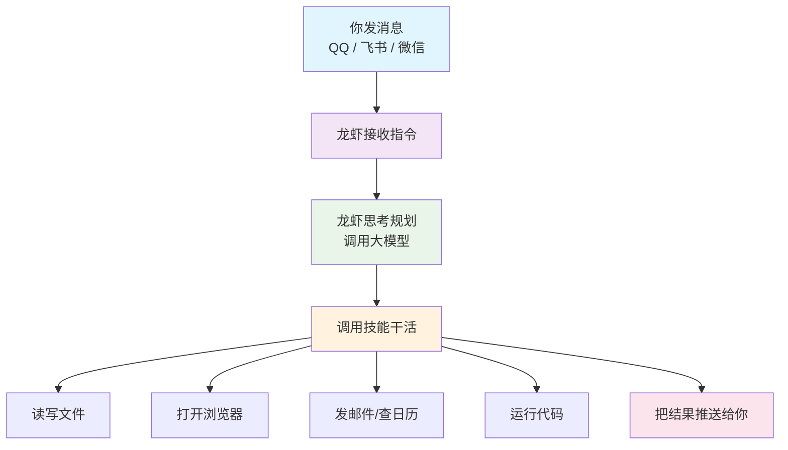
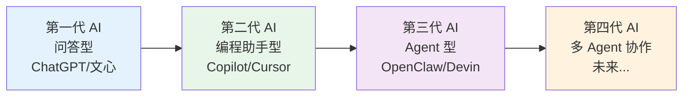

> 做一个有温度和有干货的技术分享作者 —— [Qborfy](https://qborfy.com)

今天我们来认识 **OpenClaw（龙虾 AI）**。

> **OpenClaw** 是一款**开源的个人 AI 助手**，能够通过 QQ、飞书、微信等你每天都在用的聊天工具**远程操控本地电脑**，自主完成邮件处理、文档整理、日程管理等复杂任务，是真正意义上的"**7×24 小时 AI 数字员工**"。

如果你用过 DeepSeek 或豆包，你会发现它们都是"问答型"的——你问一句，它答一句，然后你自己去执行。OpenClaw 不一样，它是"行动型"的——你说目标，它自己拆解、执行、反馈，真正帮你把事情做完。

<!-- more -->

# 是什么



## OpenClaw 到底是什么？

用一句话说：**OpenClaw 是一个会"主动干活"的 AI 助手，运行在你自己的电脑上。**

它有三个关键特点：

**1. 本地运行，数据不出门**

OpenClaw 安装在你自己的电脑（或家里的 Mac Mini、小主机）上，所有数据都在本地处理，不会上传到任何云端服务器。你的文件、邮件、日程，只有你自己能看到。

**2. 通过聊天工具操控**

你不需要打开电脑，不需要学任何新软件。只需要在 QQ、飞书或微信里发一条消息，龙虾就会在你的电脑上帮你把事情做完，然后把结果发回给你。

**3. 真正执行，而不只是建议**

这是 OpenClaw 和普通 AI 工具最本质的区别：

| 你说的话                     | 普通 AI（DeepSeek/豆包）的反应   | OpenClaw 的反应                            |
| ---------------------------- | -------------------------------- | ------------------------------------------ |
| "帮我整理桌面上的文件"       | 给你一段"如何整理文件"的建议文字 | 真的打开文件夹，按类型分好，告诉你整理完了 |
| "帮我查一下明天的天气"       | 告诉你去哪个网站查               | 直接查好，把结果发给你                     |
| "帮我写一封请假邮件并发出去" | 帮你写好邮件内容，你自己去发     | 写好邮件，直接帮你发出去                   |

## OpenClaw 的四个核心组成部分

理解 OpenClaw，只需要记住四个词：

```
龙虾 = 消息入口 + 大脑（AI 模型）+ 技能（功能插件）+ 记忆
```

### 🔌 消息入口——你和龙虾沟通的"门"

消息入口负责连接你的聊天工具和龙虾，你在哪里发消息，龙虾就从哪里接收指令。支持：

- **QQ 机器人**：加一个 QQ 好友，直接聊天下指令（国内用户最推荐）
- **飞书机器人**：企业用户首选，和飞书文档、日历无缝联动
- **微信**：通过企业微信接入
- **Telegram / Discord**：面向海外用户

### 🧠 大脑（Agent）——负责思考和规划

大脑就是大模型，负责理解你的指令、制定计划、决定调用哪些技能。

国内推荐免费大模型（第 2 篇会详细讲怎么配置）：

- **DeepSeek**：推理能力强，适合复杂任务
- **通义千问（Qwen）**：阿里出品，免费额度充足
- **豆包**：字节跳动出品，日常对话流畅
- **智谱 GLM**：每月免费额度大方，高频使用首选
- **MiniMax**：支持图片、语音等多种内容形式（不只是文字）

### 🛠️ 技能（Skills）——龙虾的"超能力"

技能就像手机上的 App，每安装一个技能，龙虾就多一种能力：

- 天气查询技能 → 龙虾能查天气
- 邮件技能 → 龙虾能收发邮件
- 浏览器技能 → 龙虾能自动打开网页、填表单
- 代码执行技能 → 龙虾能运行 Python 脚本

社区已有 **5700+ 技能**，基本上你能想到的功能都有现成的。

### 🗂️ 记忆（Memory）——让龙虾越用越懂你

龙虾有四层记忆：

| 记忆层       | 存什么                   | 举例                            |
| ------------ | ------------------------ | ------------------------------- |
| **灵魂记忆** | 龙虾的基本性格和行为规则 | "回复用中文，风格简洁"          |
| **工具记忆** | 已安装的技能列表         | 天气、邮件、日历…               |
| **用户记忆** | 你的长期偏好             | "每天 8 点发早报"、"喜欢用飞书" |
| **对话记忆** | 当前这次对话的上下文     | 你刚才说了什么、做了什么        |

随着使用时间增长，龙虾会越来越了解你的习惯，越来越"懂你"。

# 怎么做

## OpenClaw 是怎么工作的？

```mermaid
flowchart TD
A[你在 QQ/飞书发消息<br/>"帮我整理今天的邮件"] --> B[消息入口接收]
    B --> C[大脑分析任务<br/>制定执行计划]
    C --> D[调用邮件技能<br/>读取邮件列表]
    D --> E[大脑判断优先级<br/>生成摘要]
    E --> F{任务完成了吗？}
    F -->|没有| D
    F -->|完成了| G[把结果推送给你<br/>通过 QQ/飞书]

    style A fill:#e1f5fe
    style B fill:#f3e5f5
    style C fill:#e8f5e8
    style D fill:#fff3e0
    style E fill:#ffebee
    style F fill:#fff8e1
    style G fill:#e8eaf6
```

整个过程你只需要做一件事：**发一条消息**。

龙虾会自动完成：接收 → 理解 → 规划 → 执行 → 反馈，全程不需要你盯着。

## 和普通 AI 工具的本质区别

很多人第一次听说 OpenClaw 会问：它和 DeepSeek、豆包有什么不一样？

核心区别只有一个：**执行能力**。

```
普通 AI = 聪明的顾问（只出主意，不动手）
OpenClaw = 聪明的员工（出主意，还动手）
```

| 对比维度     | DeepSeek / 豆包    | OpenClaw                                |
| ------------ | ------------------ | --------------------------------------- |
| **能做什么** | 回答问题、生成文字 | 操作文件、发邮件、控制浏览器            |
| **数据在哪** | 你的内容上传到云端 | 全部在你本地，不出门                    |
| **主动性**   | 你问它才回答       | 可以定时主动执行任务                    |
| **记忆**     | 每次对话重新开始   | 下次聊天还记得你的习惯                  |
| **费用**     | 按使用量收费       | 本地运行，只需大模型 API 费用（可免费） |

# 经典案例

## 三个让普通人秒懂的场景

### 场景一：早上不用刷手机了

**你的痛点**：每天早上要刷好几个 App——天气、新闻、日历、邮件，花掉 20 分钟。

**龙虾怎么做**：

你只需要设置一次："每天早上 8 点，把今天的天气、3 条重要新闻、今日日程发给我。"

之后每天早上 8 点，你的 QQ 或飞书就会收到一条整理好的早报，格式清晰，直接看，不用再刷各种 App。

**节省时间**：每天 15-20 分钟。

---

### 场景二：出门在外也能处理文件

**你的痛点**：在外面突然需要处理电脑上的文件，但电脑不在身边。

**龙虾怎么做**：

你在手机上发消息："帮我把桌面上的'项目报告.docx'发到我邮箱。"

龙虾在你家的电脑上找到文件，发到你的邮箱，然后告诉你"已发送"。

**价值**：你的电脑变成了随时可以远程操控的"云电脑"。

---

### 场景三：会议结束后自动出纪要

**你的痛点**：每次开完会都要花时间整理会议纪要，又枯燥又费时。

**龙虾怎么做**：

会议结束后，你把录音文件发给龙虾："帮我整理这个会议录音，生成会议纪要，发到飞书文档。"

龙虾自动转录录音、提取关键信息、生成结构化纪要，直接写入飞书文档，并通知相关人员。

**节省时间**：每次会议节省 30-60 分钟。

# 动手试试！

## 现在就能体验的第一步

在正式安装之前，你可以先用一个最简单的方式感受一下"让 AI 真正干活"是什么感觉。

### 体验一：用 DeepSeek 模拟龙虾的思维方式

打开 [DeepSeek](https://chat.deepseek.com) 或 [豆包](https://www.doubao.com)，发送这条消息：

```
假设你是一个 AI 助手，可以操控我的电脑。
我现在告诉你一个目标：帮我整理桌面上的文件，按照"图片"、"文档"、"压缩包"三个文件夹分类。
请告诉我你会怎么一步步执行这个任务？
```

你会发现，普通 AI 只能给你一个"操作步骤说明"，而 OpenClaw 会真的去执行这些步骤。

这就是两者的本质区别。

### 体验二：想象你的"龙虾助手"

花 2 分钟思考一下：

> 如果你有一个 7×24 小时在线的 AI 助手，可以帮你操控电脑、发消息、整理文件，**你最想让它帮你做什么？**

把这个答案记下来。后面的系列文章，会一步步教你把这个想法变成现实。

### 下一步：准备好你的"大脑"

在安装龙虾之前，你需要先准备好一个免费的大模型 API。

推荐从**智谱 AI** 开始，因为：

- 注册免费，每月有大量免费额度
- 国内访问稳定，不需要任何特殊网络
- 接入 OpenClaw 的配置最简单

**下一篇（第 2 篇）**会手把手教你注册智谱 AI、领取免费额度、获取 API Key（相当于一把钥匙，让龙虾能调用 AI 模型），全程 10 分钟搞定。

# 进阶知识

## OpenClaw 在 AI 发展史上的位置



OpenClaw 代表的是 **第三代 AI 工具**——Agent（智能体）型。

- **第一代**（问答型）：你问，它答，你自己执行。代表：ChatGPT、文心一言、豆包。
- **第二代**（编程助手型）：在写代码这件事上帮你更多，但还是局限在代码领域。代表：GitHub Copilot、Cursor。
- **第三代**（Agent 型）：真正自主执行任务，覆盖工作和生活的全场景。代表：OpenClaw、Devin。

我们现在正处于第三代 AI 工具刚刚普及的时间节点。现在学会用 OpenClaw，就像 2010 年学会用智能手机一样——早一步，领先一大截。

## 为什么选择 OpenClaw 而不是其他 Agent 工具？

市面上有不少 Agent 工具，为什么推荐 OpenClaw？

| 工具         | 优点                                       | 缺点                         | 适合谁                       |
| ------------ | ------------------------------------------ | ---------------------------- | ---------------------------- |
| **OpenClaw** | 完全开源、本地运行、数据私有、支持国产模型 | 需要自己部署                 | 所有人，尤其是重视隐私的用户 |
| Devin        | 编程能力极强                               | 贵（每月 $500+）、数据在云端 | 有预算的企业开发团队         |
| AutoGPT      | 开源、功能丰富                             | 配置复杂、不稳定             | 技术爱好者                   |
| Coze（扣子） | 国内平台、无需部署                         | 数据在云端、定制能力有限     | 想快速体验的用户             |

OpenClaw 的核心优势是：**免费 + 开源 + 数据本地 + 支持国产大模型**。这四点加在一起，是目前市面上其他工具都做不到的组合。

# 总结

认识龙虾，只需要记住三件事：

1. **OpenClaw 是什么**：一个运行在你本地电脑上的 AI 智能体，通过 QQ/飞书等聊天工具操控，真正帮你"干活"而不只是"出主意"。

2. **它和普通 AI 的区别**：普通 AI 是"顾问"，只给建议；OpenClaw 是"员工"，给建议还动手执行。

3. **它的四个组成部分**：消息入口（沟通渠道）+ 大脑（AI 模型）+ 技能（功能插件）+ 记忆（越用越懂你）。

**下一篇，我们解决最关键的问题：怎么免费获取大模型 API？智谱、MiniMax、通义千问的免费额度怎么领？**

---

## 系列文章目录

- [第 0 篇：系列介绍](https://qborfy.com/ailearn/openclaw/00.html)
- **第 1 篇：认识龙虾（本文）**
- [第 2 篇：白嫖大模型——智谱、MiniMax、通义千问免费额度全攻略](https://qborfy.com/ailearn/openclaw/02.html)
- 第 3 篇：安装龙虾——QQ 机器人、飞书机器人、官方客户端三种方式（即将发布）
- 第 4 篇：学会下指令——怎么给 OpenClaw 下指令，附常用指令模板（即将发布）
- 第 5 篇：装上技能包——Skills 安装与必备推荐（即将发布）
- 第 6 篇：安全使用指南——权限管理、数据安全与避坑指南（即将发布）

# 参考资料

- [OpenClaw GitHub 仓库](https://github.com/OpenClaw-AI/OpenClaw)
- [OpenClaw 官方文档](https://docs.openclaw.ai)
- [什么是 AI Agent？一文读懂智能体 - 知乎](https://zhuanlan.zhihu.com/p/626135282)
- [AI Agent 发展现状与趋势 - 腾讯云](https://cloud.tencent.com/developer/article/2627190)
- [AI 智能体是什么？和普通 AI 有什么区别 - 36 氪](https://36kr.com/p/2264567808)
