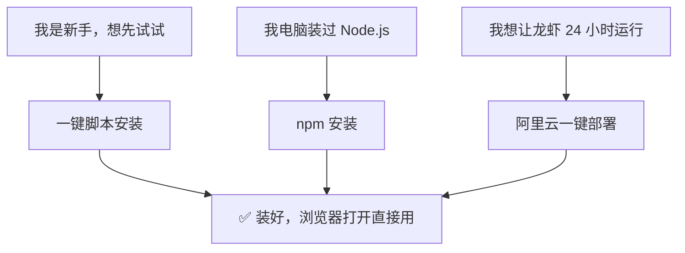
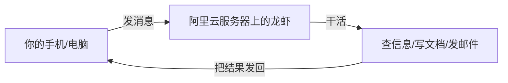
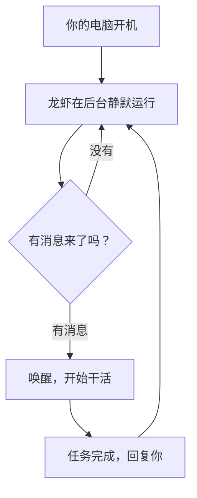

> 做一个有温度和有干货的技术分享作者 —— [Qborfy](https://qborfy.com)

上一篇我们搞定了"大脑"——免费的大模型 API 已经准备好了。

这一篇，我们来装龙虾本体。

> **本篇目标**：选一种最适合你的安装方式，10 分钟内让龙虾跑起来，在浏览器里发一条消息测试成功。

<!-- more -->

# 是什么

## 三种安装方式，选一种就够了

OpenClaw 支持三种安装方式，你只需要选一种：

| 方式               | 适合谁                                        | 难度 | 时间    |
| ------------------ | --------------------------------------------- | ---- | ------- |
| **一键脚本安装**   | 所有人，尤其是完全不懂技术的新手              | ⭐   | 5 分钟  |
| **npm 安装**       | 有一点技术基础，或者愿意先装一下 Node.js 环境 | ⭐⭐ | 15 分钟 |
| **阿里云一键部署** | 不想在自己电脑上装，或者需要 24 小时运行      | ⭐⭐ | 15 分钟 |

**强烈建议新手从"一键脚本安装"开始**，一条命令搞定，装好能用了，再考虑其他方式。



## 安装好之后，怎么用？

很多人以为龙虾装好后会弹出一个聊天窗口，其实不是这样的。

**龙虾装好后，你需要打开浏览器，访问 `http://localhost:18789`**，就会看到龙虾的操作界面——一个网页版的聊天窗口，在这里给龙虾下指令。

> 💡 **`localhost:18789` 是什么意思？** `localhost` 就是"你自己的电脑"，`18789` 是龙虾监听的端口号（可以理解为"门牌号"）。这个地址只有你自己的电脑能访问，别人访问不到，不用担心安全问题。

## 安装前，先确认这两件事

**第一件事：你的电脑系统**

OpenClaw 支持：

- **Windows 10/11**（推荐）
- **macOS 12 及以上**（苹果电脑）
- **Linux**（比较少见，普通用户基本不用考虑）

**第二件事：你已经有 API Key 了吗？**

如果还没有，先去看[第 2 篇：白嫖大模型](https://qborfy.com/ailearn/openclaw/02.html)，10 分钟搞定智谱 AI 的免费 API Key，再回来装龙虾。

# 怎么做

## 方式一：一键脚本安装（最简单，推荐新手）

一键脚本的原理：你复制一行命令，粘贴到命令行窗口里回车，脚本会自动帮你下载、安装、配置好一切。

### 第一步：打开命令行窗口

**Windows 用户**：

1. 按 `Win + R`，输入 `powershell`，回车
2. 会弹出一个蓝色（或黑色）的窗口，这就是命令行

**Mac 用户**：

1. 按 `Command + 空格`，搜索"终端"，打开
2. 会弹出一个黑色窗口

### 第二步：运行安装命令

**Windows 用户**，在蓝色窗口里粘贴以下内容，回车：

```powershell
iwr -useb https://openclaw.ai/install.ps1 | iex
```

> 💡 **这行命令是什么意思？** 就是"去 openclaw.ai 这个网站下载安装脚本，然后自动运行它"。你不需要理解每个字母，直接复制粘贴就行。

> ⚠️ **如果提示"权限不足"**，右键点击 PowerShell 图标，选择"以管理员身份运行"，再重新粘贴这行命令。

**Mac / Linux 用户**，在终端里粘贴以下内容，回车：

```bash
curl -fsSL https://openclaw.ai/install.sh | bash
```

等待安装完成（会看到一堆滚动的文字，最后出现"OpenClaw installed successfully"就好了）。

### 第三步：启动龙虾

安装完成后，在同一个命令行窗口里运行：

```bash
openclaw gateway --port 18789
```

看到以下提示说明启动成功：

```
✅ OpenClaw Gateway started
✅ Listening on http://localhost:18789
```

### 第四步：配置 API Key

打开浏览器，访问 `http://localhost:18789`，会看到龙虾的初始化向导：

1. 在"模型服务商"里选择 **智谱 AI**（或你注册的平台）
2. 在"API Key"输入框里粘贴你的 API Key
3. 在"模型"里选择 **glm-4-flash**（免费额度最多）
4. 点击"保存并继续"

### 第五步：发一条消息测试

在网页的对话框里输入：

```
你好，请帮我在桌面上新建一个叫"测试"的文件夹。
```

如果龙虾回复了你，并且桌面上真的出现了"测试"文件夹，说明安装成功！🎉

---

## 方式二：npm 安装（有技术基础的用户）

npm 是一个软件包管理工具，如果你的电脑装过 Node.js，用这种方式安装最方便。

> 💡 **不知道自己有没有装 Node.js？** 打开命令行，输入 `node -v`，如果显示版本号（比如 `v22.0.0`），说明装了；如果提示"命令未找到"，说明没装，需要先按下面的步骤安装。

### 第零步：安装 Node.js（没装过的先看这里）

**Node.js 是什么？** 可以把它理解成"npm 的运行环境"，就像手机 App 需要安卓/iOS 系统才能跑，npm 需要 Node.js 才能工作。

**Windows 用户**：

1. 打开 [Node.js 官网](https://nodejs.org/zh-cn/download)
2. 点击 **"Windows 安装包 (.msi)"** 下载（选 LTS 长期支持版，版本号 22 以上）
3. 双击下载好的安装包，一路点"下一步"，全部默认选项即可
4. 安装完成后，重新打开命令行，输入 `node -v`，看到版本号说明安装成功

**Mac 用户**：

1. 打开 [Node.js 官网](https://nodejs.org/zh-cn/download)
2. 点击 **"macOS 安装包 (.pkg)"** 下载（选 LTS 长期支持版，版本号 22 以上）
3. 双击安装包，按提示完成安装
4. 安装完成后，重新打开终端，输入 `node -v`，看到版本号说明安装成功

> ⚠️ **安装完看不到版本号怎么办？** 关掉命令行窗口，重新打开一个新的窗口，再输入 `node -v`。因为环境变量需要重启命令行才能生效。

### 第一步：确认 Node.js 版本

OpenClaw 要求 Node.js **22 及以上版本**。在命令行里运行：

```bash
node -v
```

如果显示的版本号低于 22（比如 `v18.0.0`），需要先升级。重新去 [Node.js 官网](https://nodejs.org/zh-cn/download) 下载最新的 LTS 版本安装包，覆盖安装即可。

### 第二步：安装 OpenClaw

```bash
npm install -g openclaw@latest
```

> 💡 **国内下载很慢怎么办？** 切换到国内镜像再安装：
>
> ```bash
> npm install -g openclaw@latest --registry=https://registry.npmmirror.com
> ```

### 第三步：启动并配置

和方式一的第三、四步完全一样：

```bash
openclaw gateway --port 18789
```

然后打开浏览器访问 `http://localhost:18789`，填入 API Key，发消息测试。

---

## 方式三：阿里云一键部署（让龙虾 24 小时运行）

前两种方式，龙虾只在你的电脑开着的时候才能用。如果你想让龙虾随时都能响应（比如你出门了，手机也能操控），可以把龙虾部署到云服务器上。

阿里云提供了 OpenClaw 的预装镜像，买好服务器，几步就能跑起来，不需要任何技术基础。



### 第一步：购买阿里云轻量应用服务器

1. 打开 [阿里云轻量应用服务器](https://www.aliyun.com/product/swas) 页面
2. 点击"立即购买"
3. 在"镜像"选项里，选择 **应用镜像 → OpenClaw**
4. 配置选 **2 核 4GiB**（最低配置，够用了，大约每月几十块钱）
5. 地域选离你近的（比如华东-上海）
6. 付款购买

### 第二步：配置 API Key

服务器购买成功后：

1. 进入阿里云控制台，找到你的轻量服务器
2. 点击"应用详情"，会看到 OpenClaw 的配置页面
3. 填入你的 API Key 和模型名称（glm-4-flash）
4. 点击"保存"

### 第三步：访问龙虾

阿里云会给你一个公网 IP 地址（比如 `123.456.789.0`）。

打开浏览器，访问 `http://123.456.789.0:18789`（把 IP 换成你自己的），就能看到龙虾的操作界面了。

> ⚠️ **安全提醒**：公网 IP 任何人都能访问，记得在龙虾的设置里开启"访问密码"，防止别人乱用你的龙虾。

### 第四步：绑定消息平台（可选）

部署在云服务器上的龙虾，还可以绑定飞书、Telegram 等消息平台，这样你不用打开浏览器，直接在飞书或 Telegram 里发消息就能操控龙虾。

绑定方法在龙虾的"设置 → 消息渠道"里，填入对应平台的 Token（可以理解为"通行证"，在飞书或 Telegram 的开发者设置里可以生成）即可。具体步骤会在后续文章里详细介绍。

# 经典案例

## 三个"装好就能用"的场景

### 场景一：让龙虾帮你整理桌面

**情况**：桌面上乱七八糟，各种文件堆在一起，懒得整理。

**操作**：在浏览器的对话框里发消息：

```
帮我整理一下桌面，把 Word 文档放到"文档"文件夹，把图片放到"图片"文件夹，把压缩包放到"下载"文件夹，没有这些文件夹的话先新建。
```

龙虾会自动扫描桌面，按类型把文件分好，整个过程你只需要等着就行。

---

### 场景二：让龙虾帮你写飞书日报

**情况**：每天下班前要写日报，总是忘或者懒得写。

**操作**：在对话框里发消息：

```
帮我写今天的工作日报，今天主要做了：
1. 参加了产品需求评审会议
2. 修复了登录页面的 bug
3. 整理了下周的工作计划
请按照标准日报格式写，发到飞书文档"日报记录"里。
```

龙虾会自动生成格式规范的日报，写入飞书文档，你只需要确认一下就行。

---

### 场景三：定时早报推送

**情况**：想每天早上收到一份整理好的早报（需要阿里云部署，才能 24 小时运行）。

**操作**：在龙虾的"定时任务"设置里，添加一条任务：

- **执行时间**：每天早上 8:00
- **任务内容**：查询今天北京天气、今日头条前 3 条新闻、我今天的飞书日历，整理成早报发给我

> 💡 **时间怎么填？** 直接在设置界面选择"每天"和"08:00"就行，不需要记任何代码。如果你想改成早上 7 点，就选"07:00"。

之后每天早上 8 点，你的飞书或 Telegram 就会自动收到早报，不需要你做任何操作。

# 动手试试！

## 现在就行动

按照以下步骤，10 分钟内让龙虾跑起来：

**第一步**：确认你已经有 API Key（没有的话先看[第 2 篇](https://qborfy.com/ailearn/openclaw/02.html)）

**第二步**：选择一种安装方式：

- 新手 → 一键脚本安装
- 电脑装过 Node.js → npm 安装
- 想 24 小时运行 → 阿里云一键部署

**第三步**：按照上面的步骤一步步来，遇到问题先看下面的"常见问题"

**第四步**：打开浏览器访问 `http://localhost:18789`，发一条测试消息，确认龙虾能正常回复

## 常见问题

**Q：运行安装命令时提示"权限不足"怎么办？**

A：Windows 用户右键点击 PowerShell，选择"以管理员身份运行"，再重新运行安装命令。Mac 用户在命令前加 `sudo`，比如 `sudo curl -fsSL https://openclaw.ai/install.sh | bash`，然后输入你的电脑开机密码（输入时屏幕不会显示任何字符，这是正常的，输完直接回车）。

---

**Q：浏览器打开 `http://localhost:18789` 显示"无法访问此网站"怎么办？**

A：说明龙虾还没有启动。打开命令行窗口，运行 `openclaw gateway --port 18789`，看到"Listening on http://localhost:18789"后，再刷新浏览器。

---

**Q：填入 API Key 后提示"认证失败"怎么办？**

A：检查以下几点：

1. API Key 有没有复制完整（前后不能有多余的空格）
2. 智谱 AI 账号有没有完成实名认证
3. 免费额度有没有过期（登录智谱 AI 控制台查看）

---

**Q：每次用龙虾都要先运行 `openclaw gateway` 命令，能不能开机自动启动？**

A：可以。在命令行里运行：

```bash
openclaw service install
```

这会把龙虾注册为系统服务，之后每次开机会自动启动，不需要手动运行命令了。

# 进阶知识

## 龙虾是怎么"住"在你电脑上的？

很多人会好奇：龙虾装在电脑上，它一直在运行吗？会不会很耗电？

**龙虾的运行方式**：



龙虾大部分时间处于"待机"状态，只有收到你的消息才会"醒来"干活。待机时几乎不占用 CPU（电脑的运算核心），内存占用大约 100-200MB（相当于同时打开 2-3 个网页标签页的消耗，基本感觉不到）。

**如果你不想让龙虾一直运行**，可以：

- 需要用的时候手动启动：运行 `openclaw gateway --port 18789`
- 用完后手动关闭：在命令行窗口里按 `Ctrl + C`，或者直接关掉这个窗口

## 龙虾能看到我电脑上的所有东西吗？

这是很多人关心的隐私问题。

**默认情况下**，龙虾只能访问你明确授权的范围：

| 权限       | 默认状态  | 说明                                |
| ---------- | --------- | ----------------------------------- |
| 读取文件   | ✅ 开启   | 可以读取你指定的文件夹              |
| 写入文件   | ✅ 开启   | 可以在你指定的文件夹里创建/修改文件 |
| 访问网络   | ✅ 开启   | 可以查询天气、新闻等公开信息        |
| 发送邮件   | ❌ 关闭   | 需要你手动开启，并填入邮箱授权信息  |
| 访问摄像头 | ❌ 关闭   | 默认关闭，需要手动开启              |
| 删除文件   | ⚠️ 需确认 | 执行删除操作前会先问你确认          |

**第 6 篇（安全使用指南）**会详细讲怎么设置权限，让龙虾只能做你允许的事情。

# 总结

安装龙虾，只需要记住三件事：

1. **三种方式选一种**：新手用一键脚本，有技术基础用 npm，想 24 小时运行用阿里云部署。

2. **装好后用浏览器访问**：打开 `http://localhost:18789`，这是龙虾的操作界面，在这里给它下指令。

3. **测试成功的标志**：发一条消息，龙虾真的帮你做了一件事（比如新建了一个文件夹），而不只是回复了一段文字。

**下一篇，我们来学最关键的技能：怎么给龙虾下指令，让它真正"听懂"你想要什么。**

---

## 系列文章目录

- [第 0 篇：系列介绍](https://qborfy.com/ailearn/openclaw/00.html)
- [第 1 篇：认识龙虾——OpenClaw 是什么，能做什么，和普通 AI 有什么本质区别](https://qborfy.com/ailearn/openclaw/01.html)
- [第 2 篇：白嫖大模型——智谱、MiniMax、通义千问免费额度全攻略](https://qborfy.com/ailearn/openclaw/02.html)
- **第 3 篇：安装龙虾——一键脚本、npm、阿里云三种方式（本文）**
- [第 4 篇：学会下指令——怎么给 OpenClaw 下指令，附常用指令模板](https://qborfy.com/ailearn/openclaw/04.html)
- 第 5 篇：装上技能包——Skills 安装与必备推荐（即将发布）
- 第 6 篇：安全使用指南——权限管理、数据安全与避坑指南（即将发布）

# 参考资料

- [OpenClaw 官方安装文档](https://docs.openclaw.ai/installation)
- [阿里云 OpenClaw 一键部署](https://www.aliyun.com/activity/ecs/clawdbot)
- [Node.js 官方下载页面](https://nodejs.org/zh-cn/download)
