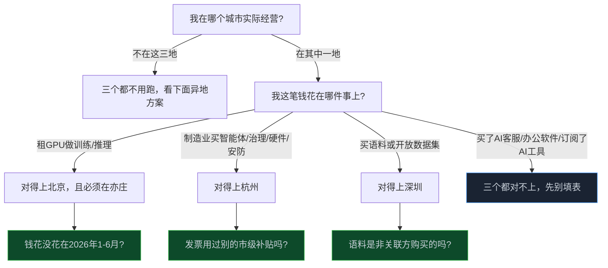

> **📖 这篇写给谁**：手上有中小生意、听说"AI有补贴"、正在犹豫要不要去申请的人。不需要懂政策术语，我把三份官方原文啃完了，把门槛翻译成人话。
> **🎁 读完你会知道**：这三个补贴你到底够不够格，比"最高能领多少钱"更重要的是"你的钱到底花没花对方向"。

上周有个开小吃店的朋友在群里问我："政府发的AI补贴，我能领吗？"

我说等我查查。查完三份官方文件，我的第一反应是——大概率不能。

不是补贴是假的，是这轮补贴压根不是冲着"用了AI就发钱"设计的。它盯的是几个很具体的动作：租了多少张GPU、买了什么类型的解决方案、买没买语料数据。你要是开奶茶店、做贸易、跑零售，这三个动作你可能一个都没做过。

<!-- more -->

---

## 先别急着填表，这轮补贴不是"发钱"这么简单

我一开始也以为，这就是北京、杭州、深圳三个城市各自发了一笔钱。查着查着发现不对——这三份文件背后，是全国至少十几个城市在同一时间抢跑一场比赛，官方给它起了个名字，叫"词元经济"。

丽水6月发了人工智能创新券；福州8月中开始收专项资金申报；山东刚在8月28日——就是今天——发了终端财政奖补通知；昌吉、佛山桂城、深圳龙岗，一个比一个热闹。北京亦庄干脆搞了个"词元十条"，算力券、数据券、模型券配套发。杭州高新区（滨江）那边，Token券额度最高给到1000万。

这不是三个城市限量发钱，是全国性的政策提速。窗口一个接一个地开，这个月挤了不止四五份文件出来。

但我查完之后，最想跟你说的不是"抓紧领钱"，而是南京邮电大学王春晖教授说的一句话：**智能产业的核心竞争力，不取决于词元消耗总量，而在于能不能用更少的投入换出更高的价值。**

翻译一下就是：补贴发得再快，也不代表你该冲。先看自己够不够格，再看这钱花出去到底解决什么问题——这两件事，比"抓紧填表"重要得多。

---

## 三地官方原文核完，门槛比你以为的窄

我把北京经开区官网通知、杭州经信局解读、深圳市政府门户公告三份原文全部核了一遍，字段全部按原文来，没有一个是我猜的。

| 字段 | 北京·算力券（经开区/亦庄） | 杭州·数改券 | 深圳·语料券 |
|---|---|---|---|
| **申报窗口** | 2026-08-31 至 09-20，**21天** | 已启动 至 09-30，**先到先得，额度用尽即止** | 2026-09-01 至 11-10，约**71天** |
| **地域门槛** | 只限亦庄新城225平方公里内实际经营 | 杭州市依法登记注册 | 深圳市内实际生产经营 |
| **硬门槛（最容易卡人的一条）** | 租**非关联方**GPU算力做模型训练/推理，且用于2026年1-6月 | 必须是**有生产制造环节的制造业独立法人** | 只针对"**购买或开放语料数据**"这一个动作 |
| **资助比例** | 30% | 20% | 采购30%，开放另算 |
| **资助上限** | 每年最高2000万 | 每年最高**20万** | 采购最高200万，开放最高100万 |
| **易踩的坑** | 非智能算力（存储/网络）不算；兑现金额低于1万不予兑现 | 同一细分方向一年**只能选一个**；**按年付费服务只补第一年** | 需通过数据交易所交易，语料要合规 |

看出问题了吗？三个补贴对应的是三种完全不同的具体支出——租GPU、买特定四类方案、买语料。不是"用了AI就有钱"，是"你刚好做了这件事，才有钱"。

普通做餐饮、零售、贸易的中小企业，大概率三个都对不上号。这才是全网单城快讯没写清楚的地方——大家都在标"最高2000万""最高200万"，很少有人告诉你，这个"最高"背后卡着什么条件。

---

## 三步自查，比这张表更重要

表格看完别急着关页面，按这个顺序问自己三个问题：

大部分人卡在第二步——你买了个AI客服、上了个OA、订阅了个AI写作软件，这些都不在这三份文件的补贴范围里。不是你不够努力，是这轮补贴压根没瞄准你这类支出。

这一步想清楚了，能省下你跑一趟政务大厅的时间。

---

## 一件容易被忽略的事：不少补贴其实在推你去当"一人公司"

查资料的时候我发现一个细节，很多城市的AI补贴，写着写着就变成了专门给"OPC"（一人公司）发的。

北京有个OPC全栈资源包，最高10万免费用3个月；杭州OPC创业者算力券上限一年能到1000万；深圳龙岗对OPC企业调用大模型给30%补贴，最高100万；佛山桂城单个OPC企业最高20万补贴，还配500万股权投资加1亿融资风险补偿基金。

听起来很诱人，对吧？但我上个月查另一个选题时核过一组数字，这里必须提一遍：

**全国一人公司存量突破1600万家，90%活不过三年，30.8%从未产生过营收，月收入中位数不足7000元。**

这不是我一家之言，虎嗅、21经济网、新浪财经三个独立信源都核过同一批数据。而且有个说法我觉得特别扎心——现有的扶持政策大多投向算力、工位这类"供给端"，没解决创业者最缺的"获客"这个需求端问题；补贴降低了入场门槛，结果反而加剧了同质化竞争，把淘汰率越推越高。

我不是说别去申请这些补贴，是想提个醒：如果你本来是想开个正常的小生意，看到"补贴力度这么大"就动了心思要注册个OPC去蹭，先想清楚——补贴解决的是你租算力、买工具的成本，解决不了你的产品有没有人买单。这两件事，完全是两条线。

---

## 三个最容易踩的坑

1. **"最高2000万/200万"是上限，不是普遍到手金额** —— 实际能拿到的钱取决于你的真实支出规模，普通中小企业按比例算下来，往往是几千到几万，别用最高金额做心理预期。
2. **"AI补贴"不等于"用了AI就能领"** —— 前面说了，三份文件分别对应三种具体支出行为，不是普惠性质的"用AI就发钱"。
3. **地域范围要看清层级** —— 北京这条不是"北京市"，是"经开区/亦庄新城"这一小片区域，比很多人以为的窄得多；杭州和深圳是市级范围。
4. **窗口长度差很大** —— 北京21天最紧，杭州"先到先得"随时可能提前用完额度，深圳71天最宽松，这决定了你该按什么节奏动手，而不是所有窗口都可以慢慢来。

---

## 不在这三个城市，怎么办

先别觉得跟自己没关系。前面提到的丽水、福州、山东、昌吉这几份文件都是最近两个月内发的，说明这不是三个城市的特例，是全国性的动作。

去你所在城市的政府门户或"XX市政务服务网"，搜"算力券""数据券""模型券""语料券""数改券"加上"2026"这几个词，大概率能搜到本地同类政策。多数政策文件会写清楚责任部门，直接打电话确认这轮是不是已经开放。

---

## 我的建议：填表之前，先打一个电话

这篇文章不打算用"赶紧去申请，别错过窗口"收尾。

真正该做的，是拿着上面那个三步自查，先确认自己够不够格，再打一个电话给对应的责任部门，把材料清单、审核周期问清楚。填错一次表，浪费的时间比你多等两天核实清楚要多得多。

政策细则可能会调整，联系电话尤其是各区县层面的，建议按你实际所在的区单独核实一次，别直接照抄这篇文章里的号码。

---

## 📝 小结

- 这轮AI补贴不是三个城市的特例，是全国至少十几个城市在同期竞速的"词元经济"政策潮
- 北京算力券（21天窗口）、杭州数改券（到9月底）、深圳语料券（到11月10日），分别卡的是租算力、买制造类方案、买语料这三种完全不同的具体支出，不是普惠补贴
- 三步自查顺序：先看城市，再看支出属于哪一类，最后看钱花没花在窗口期内
- 不少补贴其实在瞄准"一人公司"（OPC）群体，但OPC存量1600万家里90%活不过三年，别为了蹭补贴硬凹身份
- 填表前先打电话核实材料清单和审核周期，比赶时间填错表更省事

---

> **免责声明**：文中三地政策细节均按官方原文核实（北京经济技术开发区官网通知、杭州经信局政策解读、深圳市人民政府门户网站公告），但政策细则可能随时调整，具体以官方最新发布和当地责任部门口径为准。文中联系方式截至发布当日有效，OPC相关行业数据引自虎嗅、21经济网、新浪财经等公开报道，仅供参考，不构成任何投资、创业或工商注册建议。
